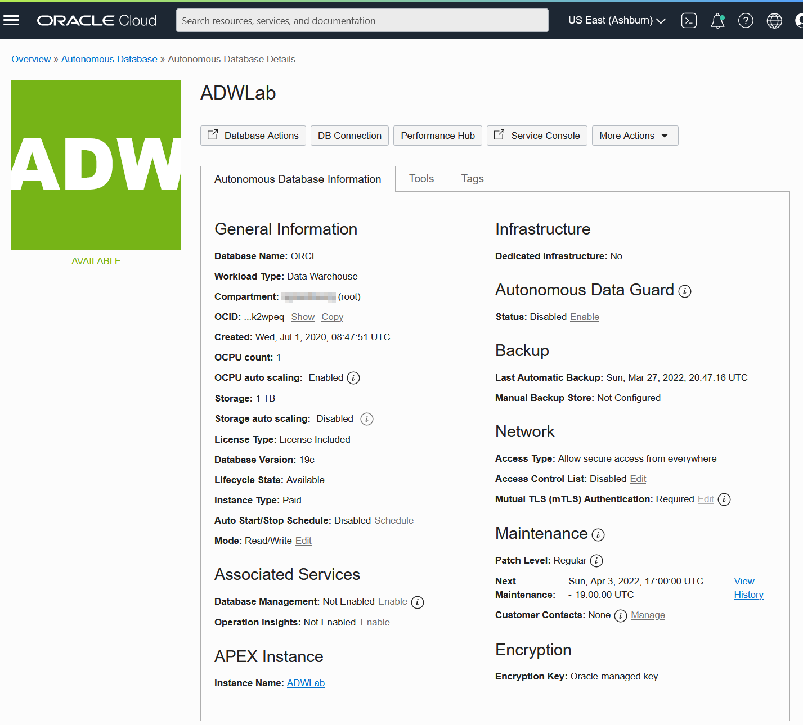
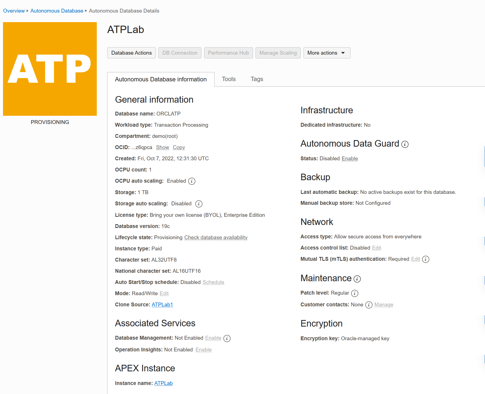
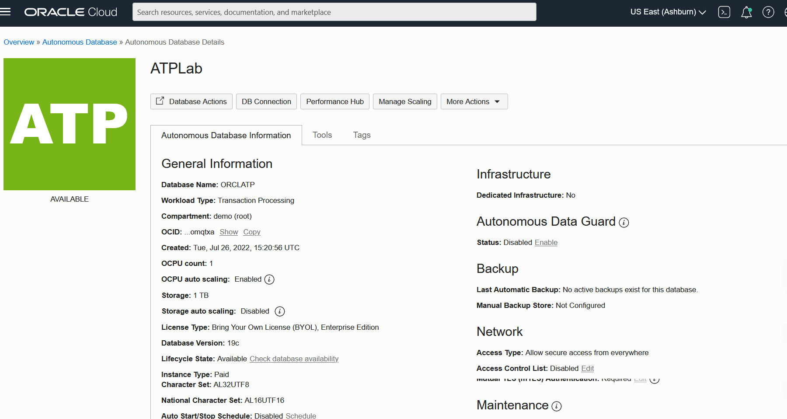
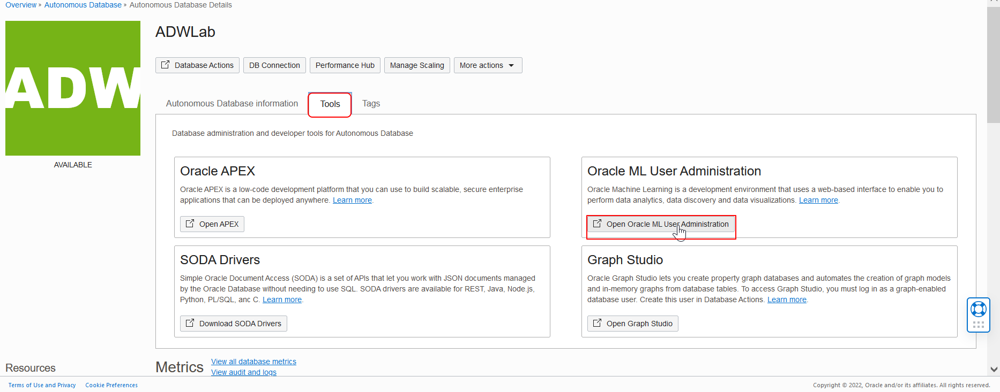
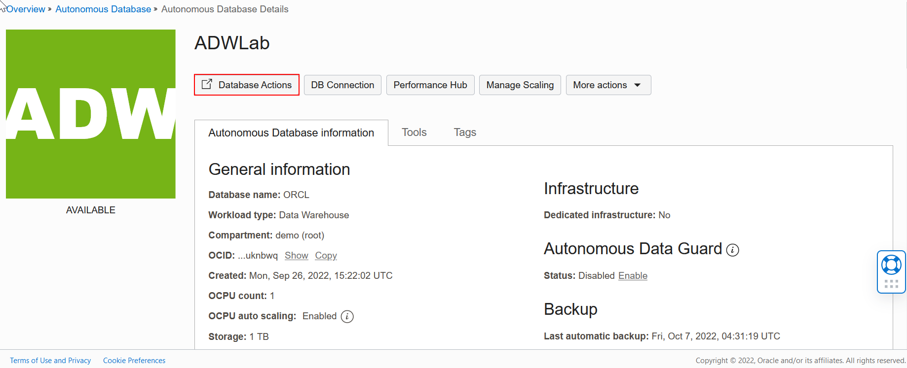
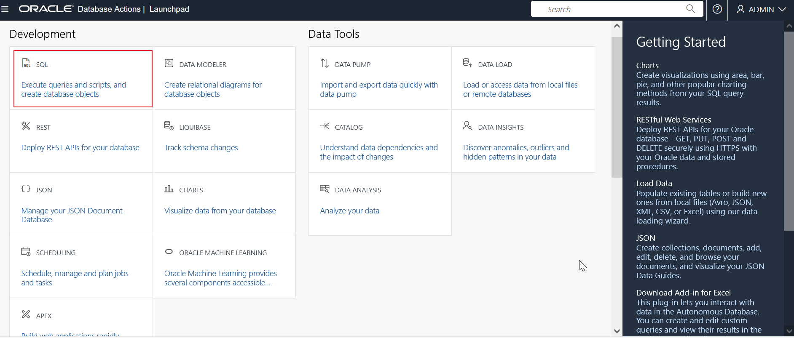
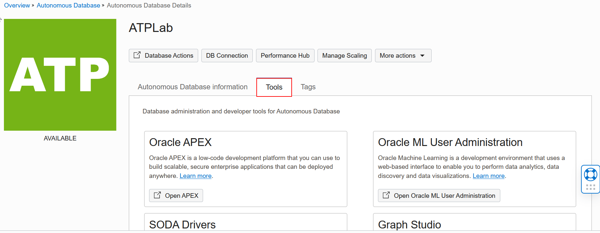
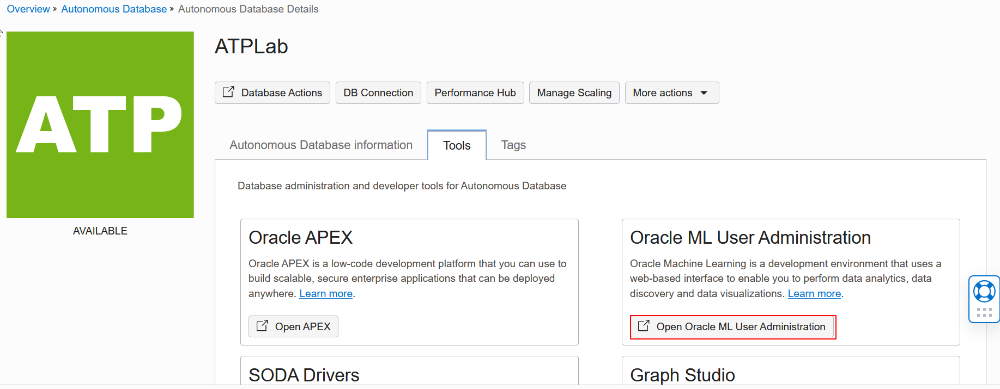

# Provision and Setup #

## Introduction ##

This lab is all about getting your environment set up correctly. Here we will show you how to provision two different autonomous database instances, create a user, enable the schema for the user and load data into a table.

Estimated time: 20 - 30 minutes

Watch this short video to preview how to provision and setup your environment.

[](youtube:NP-svu6dXwI)

### About Oracle Machine Learning

Simplifying greatly, you can separate the machine learning process into three parts: data preparation, model building, and putting that model to work in production systems, like applications, dashboards, and business processes. In general, training a machine learning model on large volume data – depending on the algorithm selected – can take significant computing resources. You should not run that kind of work in an existing data warehouse, data mart, or transactional systems without consulting your administrator to avoid impacting SLAs.

For this Alpha Office scenario, we focus on the modeling and deployment process and provision two different autonomous databases. The autonomous data warehouse is used to build your model. Think of it as a stand-in for your own data warehouse or data mart. Alternatively, given how easy it is to provision a data mart, think of this ADW as the best way for you to do machine learning without impacting production systems. Setting up a dedicated data mart for machine learning may be the right thing for you to do outside of this lab.

But it’s not just about building the model - you also need to deploy it, and there are some options. You could deploy a model into a data warehouse where it’s available for analytics. Or maybe you want to deploy it into a production transaction processing system so that you can score each new transaction. Either way, you will need to know how to export and import a model. So, we show you that in this lab using two different databases.

What Alpha Office wants is to deploy this machine learning model in a production database that supports their Client Service application. When an existing customer comes into the branch, we can pull up their name and check their credit in real-time. The marketing department can also load batch data into this system and run a process to score a new set of customers in bulk. So, this setup of just two different services allows you to build, train, and deploy a machine learning model into an application so that customer-facing and marketing employees can work with it.

### Objectives

-   Learn how to provision an ADW instance
-   Learn how to provision an ATP instance
-   Create a user in ADW and ATP and grant privileges and user access to the SQL Developer Web, and to storage.
-   Load data into a table

### Prerequisites

This lab assumes you have completed the following labs:
* Login to Oracle Cloud/Sign Up for Free Tier

*Note: You may see differences in account details (eg: Compartment Name is different in different places) as you work through the labs. This is because the workshop was developed using different accounts over time.*

In this section, you will be provisioning an ADW database and an ATP database using the cloud console.

## Task 1: Create an ADW Instance

First, we are going to create an ADW Instance.

1.  Click the **Navigation Menu** in the upper left, navigate to **Oracle Database**, and select **Autonomous Data Warehouse**.

	

2.  From the Oracle Cloud Infrastructure console, on the Oracle Autonomous Database page choose your region and select a compartment by clicking on the drop-down list. Click **Create Autonomous Database**. This opens the Create Autonomous Database page.

    

3.  Select **Compartment** by clicking on the drop-down list. (Note that yours will be different - do not select **ManagedCompartmentforPaaS**) and then enter **Display name**, **Database name**. Here, we're using the display name _ADWLab_ and database name _ORCL_.

    

4.  Under **Choose a workload type** and **Choose a deployment type**, select **Data Warehouse**, and **Shared Infrastructure** respectively.

    

5.  Under **Configure the database**, accept the default values for **Choose database version** and **Storage (TB)** and **OCPU Count**.

    

6.  Add a password. Copy the password down in a notepad, you will need it later in labs.

    

7.  In **Choose network access**, keep the default access type **Allow secure access from everywhere**. Under **Choose a license type**, select **License Included** and click **Create Autonomous Database**. Leave the **Provide contacts for operational notifications and announcements** field blank.

    

8.  Now, Autonomous Data Warehouse starts provisioning. Once it finishes provisioning, you can view the instance details.

    

    

You now have created your first ADW instance. Now, we are going to work on very similar steps to create an ATP Database.

## Task 2: Create an ATP Instance

1.  Click the **Navigation Menu** in the upper left, navigate to **Oracle Database**, and select **Autonomous Transaction Processing**.

	

2.  Choose your **Compartment** by clicking on the drop-down list and then click **Create Autonomous Database**.

    

4.  Select **Compartment**. If you are using a LiveLabs environment, be sure to select the compartment provided by the environment. (Note that yours will be different - do not select **ManagedCompartmentforPaaS**) and then enter **Display Name**, **Database Name**.
    

5.  Under Choose a workload type and Choose a deployment type, select **Transaction Processing**, and **Shared Infrastructure** respectively.
    

6.  Under **Configure the database**, accept the default values for **Choose database version** , **Storage (TB)**, and **OCPU Count**.
    

7.  Add a password. Copy the password in a notepad, you will need it later in labs.
    

8. In **Choose network access**, keep the default access type **Secure access from everywhere**. Under **Choose License and Oracle Database Edition**, select **Bring Your Own License (BYOL)**. The **Oracle Database Enterprise Edition** option gets selected automatically. Click **Create Autonomous Database**. Leave the **Provide contacts for operational notifications and announcements** field blank.

    

9. Now, Autonomous Transaction Processing starts provisioning. Once it finishes provisioning, you can view the instance details.
    

    
You now have created your first ATP instance.

## Task 3: Create Machine Learning User in ADW

1.  Click the **Navigation Menu** in the upper left, navigate to **Oracle Database**, select **Autonomous Data Warehouse**.

	

2.  Navigate to your ADW instance.
    

3.  Select **Tools** on the Autonomous Database Details page.
    

4. To allow us to create OML users, **Open Oracle ML User Administration** under the tools.
    

5. Sign in as **Username - ADMIN** and with the password, you used when you created your Autonomous instance.
    

6. Click **Create** to create a new machine learning user.
    

7. On the Create User form, enter **Username - machine learning\_USER**, an e-mail address (you can use admin@oracle.com), un-check **Generate password**, and enter a password you will remember. You can use the same password you used for the ADMIN account. Then click **Create**.

    

8. Notice that the **ML\_USER** is created.

    

## Task 4: Grant Privileges to ADW ML_USER to Access Database Actions

1.  Click the **Navigation Menu** in the upper left, navigate to **Oracle Database**, select **Autonomous Data Warehouse**.

	

2. Navigate to your ADW instance.
  

3. Click **Database Actions**.

    

	A **Launch DB Actions** screen appears.

	

4. On the Database Actions login page, if prompted, log in with your ADW credentials, provide the **Username - ADMIN** and click **Next**. Then, provide the <if type="freetier">**Password** you created for the Autonomous instance.</if><if type="livelabs">password **WELcome__1234**</if> and click **Sign in**.

    

    

5. From the Database Actions Development menu, select **SQL**.

    

6. Dismiss the Help by clicking on the **X** in the popup.

    

7.  By default, only the ADMIN user can use the SQL Developer Web. To enable ML\_USER to use it, enter the following and click the **Run Statement** button to grant SQL developer web access to ML\_USER.

    ````
    <copy>
    BEGIN
      ORDS_ADMIN.ENABLE_SCHEMA(
        p_enabled => TRUE,
        p_schema => 'ML_USER',
        p_url_mapping_type => 'BASE_PATH',
        p_url_mapping_pattern => 'ml_user',
        p_auto_rest_auth => TRUE
      );
      COMMIT;
    END;

    </copy>
    ````

    
    

8.  To grant storage privileges to ML\_USER, enter the following code and click **Run Statement**

    ````
    <copy>
    alter user ml_user quota 100m on data;
    </copy>
    ````

    

9. Now, on the right, click the ADMIN profile dropdown and click **Sign Out** of the ADMIN account.

## Task 5: Create Machine Learning User in ATP

1.  Click the **Navigation Menu** in the upper left, navigate to **Oracle Database**, select **Autonomous Transaction Processing**.

    

2. Navigate to your ATP instance.
    

3.  Select **Tools** on the Autonomous Database Details page.

    

4.  Select **Open Oracle ML User Administration** under the tools.

    

5. Sign in as **Username - ADMIN** and with the **Password - WELcome__1234** created for your ATP instance.

    

6.  Click **Create** to create a new ML user.
    

7. On the Create User form, enter **Username - ML\_USER**, an e-mail address (you can use admin@oracle.com), un-check **Generate password**, and enter a password you will remember. You can use the same password you used for the ADMIN account. Then click **Create**.
    

8. Notice that the **ML\_USER** is created.

    

## Task 6: Grant Privileges to ATP ML_USER to Access Database Actions

1.  Click the **Navigation Menu** in the upper left, navigate to **Oracle Database**, select **Autonomous Transaction Processing**.

    

2. Navigate to your ATP instance.
     

3.  Click **Database Actions**.The Launch DB Actions initialization screen appears.

    

4. The Database Actions login page appears. If prompted, log in with your ATP credentials. Provide the **Username - ADMIN** and click **Next**. Then provide the **Password - WELcome__1234** created for the ATP instance and click **Sign in**.

    

    

5. From the Database Actions menu, select **SQL**.

    

6. Dismiss the Help by clicking on the **X** in the popup.

    

7.  By default, only the ADMIN user can use the SQL Developer Web. To enable ML\_USER to use it, you need to enter the following and run the procedure to grant SQL developer web access to ML\_USER.

    ````
    <copy>
    BEGIN
      ORDS_ADMIN.ENABLE_SCHEMA(
        p_enabled => TRUE,
        p_schema => 'ML_USER',
        p_url_mapping_type => 'BASE_PATH',
        p_url_mapping_pattern => 'ml_user',
        p_auto_rest_auth => TRUE
      );
      COMMIT;
    END;

    </copy>
    ````

    

    

8.  Grant storage privileges to ML\_USER.

    ````
    <copy>
    alter user ml_user quota 100m on data;
    </copy>
    ````

    

## Task 7: Download Custom Lab Files
Download the compressed install file that contains data files and custom OML Notebooks that are used further in this workshop.

1.  Click the link below to download the install file.

    [install.zip](https://objectstorage.us-ashburn-1.oraclecloud.com/n/idrudhdwamji/b/adbml/o/install.zip)

2.  Save the install.zip to a download directory and then unzip the file.

    

## Task 8: Upload the Data Files to ADW ML_USER

1. On the tab with your ADW instance, click **Database Actions**.

    

2. This time sign in as **ML\_USER**. Provide the **Username - ML\_USER** and click **Next**. Then provide the password for your ML\_USER and click **Sign in**.

    

    

3. Select **Data Load** from Database Actions menu.

    

4. Leave the default selections - **LOAD DATA** and **LOCAL FILE** and click **Next**.

    

5. Drag and drop the **credit\_scoring\_100k.csv** from the directory where you downloaded and unzipped the install file onto the Data Load Drag and drop target or click on **Select Files** to browse the _credit\_scoring\_100k.csv_ file and upload it.

    

6. When the upload is complete, click **Start** and click **Run** in the Run Data Load Job confirmation dialog box.

    

    

7. Notice the *Status: Running(0/1)* while loading the data. The status will be updated to *Status: Completed(1/1)* once the data loading job is completed.

    

    

8. Click the cloud menu and select **SQL** under  **Development**.

  

9. Click on the **X** in the popup to dismiss the Help.

    

10. The Database Actions screen shows the table has been successfully created (and associated with ML\_USER).

    

[Please proceed to the next lab](#next).

## Acknowledgements

- **Author** - Derrick Cameron, Leah Bracken (v2)
- **Contributors** - Mark Hornick, Sr. Director, Data Science and Oracle Machine Learning Product Management; Sherry LaMonica, Consulting Member of Technical Staff, Machine Learning; Marcos Arancibia, Senior Principal Product Manager, Machine Learning
- **Last Updated By/Date** - Sarika Surampudi, Principal User Assistance Developer, Oracle Database User Assistance Development, October 2022
