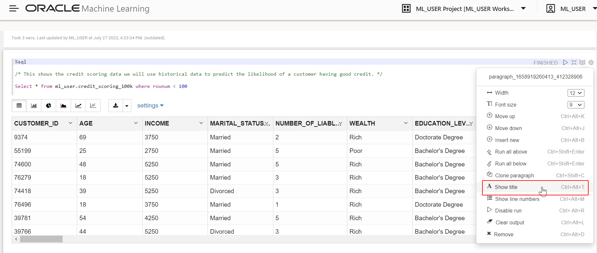
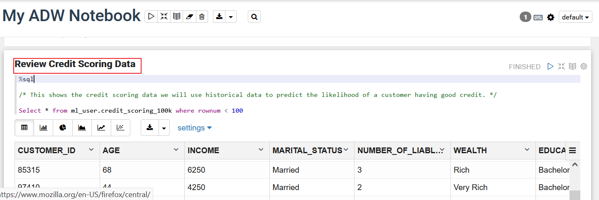
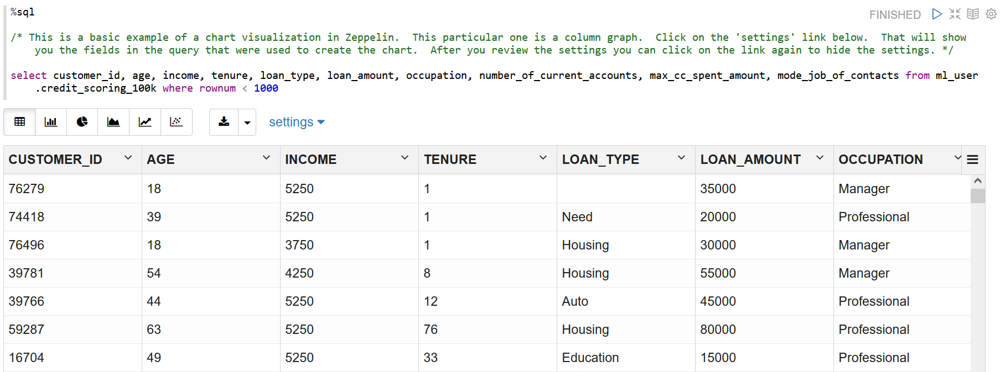
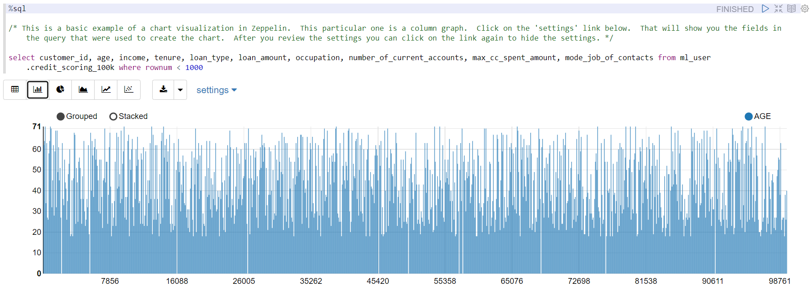
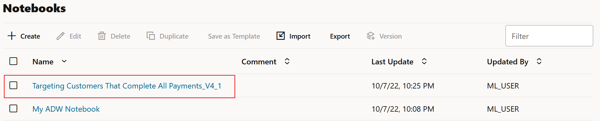
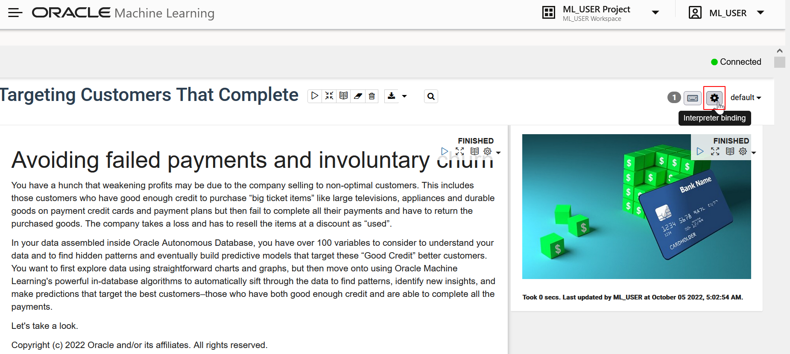
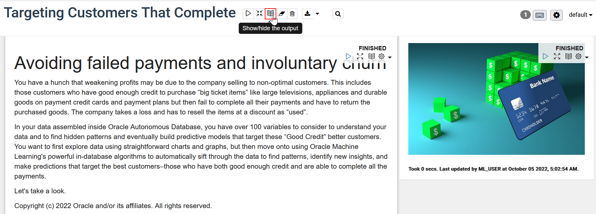
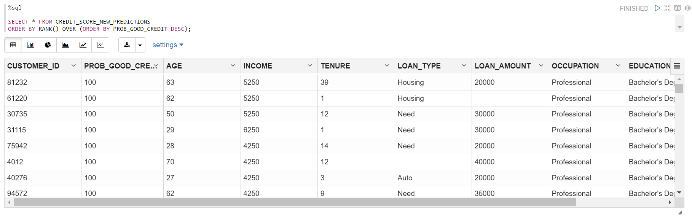
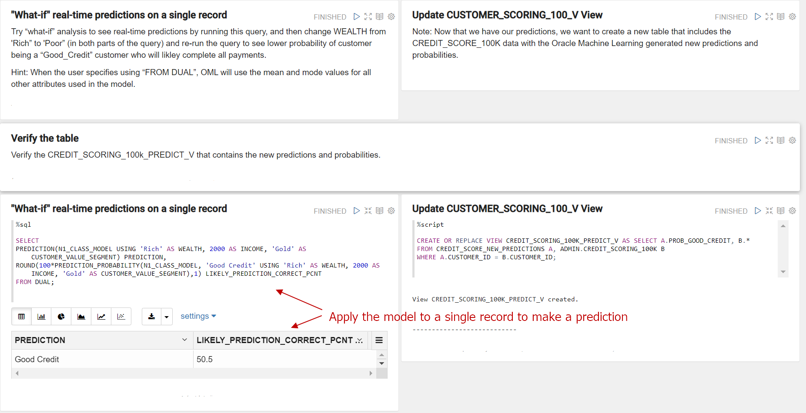

# Build a Machine Learning Model

## Introduction

This is the lab where you’re going to do the work of building and training a machine learning model that will help Alpha Office.

Estimated lab time: 20 - 30 minutes

Watch this short video to preview how to build a machine learning model.

[](youtube:_i7fT1YYybM)

### About Oracle Machine Learning

Simplifying greatly, you can split machine learning into two parts: the process of building and training a model so it is ready to work; putting that model to work in production systems, applications, and processes. In general, training a machine learning model takes significant computing resources. You should not run that kind of work in an existing data warehouse or data mart, without clearing it ahead of time because it’s possible that model training could use too many resources and impact SLAs. You definitely don’t want to build and train a model in any kind of critical transactional system for the same reason.

For this Alpha Office scenario, we provision two different autonomous databases. The autonomous data warehouse is used to build and train your model. Think of it as a stand-in for your own data warehouse or data mart. Alternatively, given how easy it is to provision a data mart, think of this ADW as the best way for you to do machine learning without impacting anybody else in the organization. Setting up a dedicated data mart for machine learning may be the right thing for you to do outside of this lab.

But it’s not just about training the model - you also have to deploy it, and there are some options. You could deploy a model into a data warehouse where it’s available for analytics. Or maybe you want to deploy it into a production transaction processing system so that you can score each new transaction. Either way, you are going to need to know how to export and import a model. So we show you that in this workshop using two different databases.

What Alpha Office wants is to deploy this machine learning model in a production database that supports their Client Service application. When an existing customer comes into the branch, we can pull up their name and check their credit in real-time. The marketing department can also load batch data into this system and run a process to score a new set of customers in bulk. So, this setup of just two different services allows you to build, train, and deploy a machine learning model into an application so that customer-facing and marketing employees can work with it.

We are trying to help Alpha Office predict the credit and payment suitability of their customers. We can use machine learning to help us here because we already have a set of customers with known credit and payment status. This is what we are going to use to train a model that will predict for new customers if their credit is suitable.

This lab uses a decision tree algorithm which is a classification technique. If these are new to you, here’s a [presentation](https://objectstorage.us-ashburn-1.oraclecloud.com/n/natdcshjumpstartprod/b/adbml/o/Machine_Learning_Introduction.pdf) and a short video below that explains machine learning, classification, and decision trees at a high level.

[](youtube:IkOz2rrB7hU)

In this lab, you will use Apache Zeppelin notebooks to do this work. The lab will help you create a new notebook, and also import an existing one with all the code, descriptions, and examples that you need. You will then step through that notebook, examining the code, data, and visualizations and, most importantly, executing each step to populate the database.

### Objectives

- Import an Apache Zeppelin notebook.
- Become familiar with Oracle Machine Learning Algorithms.
- Create a machine learning model to determine factors that predict good credit.

### Prerequisites

This lab assumes you have completed the following labs:
- Login to Oracle Cloud/Sign Up for Free Tier Account
- Connect and Provision ADB

## Task 1: Create ML User in ADW

1.  Click the **Navigation Menu** in the upper left, navigate to **Oracle Database**, select **Autonomous Data Warehouse** and navigate to your ADW instance.

	

    

2.  Select **Tools** on the Autonomous Database Details page.

    

3.  Select **Open Oracle ML User Administration** under the tools.

    

4. Sign in as ADMIN user. Provide the **Username - ADMIN** and **Password - WELcome__1234** assigned to you when the ADW instance was created.

    

6.  Click **Create** to create a new ML user.

    

7. On the Create User form, enter **Username - ML\_USER**, an e-mail address (you can use admin@oracle.com), un-check **Generate password**, and enter a password you will remember. You can use the same password you used for the ADMIN account. Then click **Create**.

    

8. Notice that the **ML\_USER** is created.

    

## Task 2: Grant Privileges to ADW ML_USER to access Database Actions

Click the **Navigation Menu** in the upper left, navigate to **Oracle Database**, select **Autonomous Data Warehouse**.

	

2. Navigate to your ADW instance.
  

3. Click **Database Actions**.

    

	A **Launch DB Actions** screen appears.

	

4. On the Database Actions login page, if prompted, log in with your ADW credentials, provide the **Username - ADMIN** and click **Next**. Then provide the **Password - WELcome__1234** created for the Autonomous instance and click **Sign in**.

    

    

5. From the Database Actions Development menu, select **SQL**.

    

6. Dismiss the Help by clicking on the **X** in the popup.

    

7.  By default, only the ADMIN user can use the SQL Developer Web. To enable ML\_USER to use it, enter the following and click the **Run Statement** button to grant SQL developer web access to ML\_USER.

    ````
    <copy>
    BEGIN
      ORDS_ADMIN.ENABLE_SCHEMA(
        p_enabled => TRUE,
        p_schema => 'ML_USER',
        p_url_mapping_type => 'BASE_PATH',
        p_url_mapping_pattern => 'ml_user',
        p_auto_rest_auth => TRUE
      );
      COMMIT;
    END;

    </copy>
    ````

    
    

8.  To grant storage privileges to ML\_USER, enter the following code and click **Run Statement**

    ````
    <copy>
    alter user ml_user quota 100m on data;
    </copy>
    ````

    

9. Now, on the right, click the ADMIN profile dropdown and click **Sign Out** of the ADMIN account.


## Task 3: Create ML Notebook

1.  Click the **Navigation Menu** in the upper left, navigate to **Oracle Database**, and select **Autonomous Data Warehouse** and navigate to your instance.

    

    

2. On the **Tools** tab of your ADW instance, and click on **Open Oracle ML User Administration**.

    

    

3. Sign in as **Username - ADMIN** with the **Password - WELcome__1234** created for your Autonomous instance.

    

4.  In the Machine Learning User Administration, click on the **home icon** on the upper right.

    

5.  Log in as **ML\_USER** and provide the password you created  for the ML\_USER. Before you log in, you may wish to bookmark this page.

    

6.  Navigate to get familiar with the machine learning pages. Click **Examples**.

    

7.  Note the various machine learning notebook examples. Feel free to review some of these. Let's create a new machine learning notebook in this lab. Click on the upper-left cloud menu.

    

8.  Select **Notebooks**.

    

9.  Let's create a notebook from scratch. Click **Create**.

    

19.  Enter **My ADW Notebook** as the name, then click **OK**.

    

11. The **My ADW Notebook** opens for you to edit.

    

## Task 4: Add Content to Your ADW Notebook

You can add text and code to your notebook to customize it.  Follow these steps to edit your OML Notebook.

1.  Click the **gear** icon in the upper right. We must set the interpreter binding to connect to the ADW database instance and run queries. Select the medium and markdown interpreters. You can deselect items by clicking them, changing them from blue to white and click **Save**.

    

  Zeppelin notebooks are composed of paragraphs that can contain formatted text using markdown, SQL, PL/SQL, Python, and R. We'll just be using markdown, SQL, and PL/SQL . We create different paragraphs with different interpreters based on what we want to put in the paragraphs. The interpreter is set at the top of the paragraph:
      - %md - markdown language which is used for formatted text.
      - %sql - used to run sql statements.  Note you can only run one statement per paragraph, otherwise use a script.
      - %script - used to run multiple sql statements and pl/sql blocks.
	- %python - used to run Python code.
	- %r- used to runR code.

2.  Paste the following into the first paragraph and click the **Play** icon to run the code (formatted text in this case). Note that it displays the formatted text, and adds a new paragraph. Notebooks save automatically.

    ````
    <copy>
    %md
    ### Targeting Likely Good Credit Customers using Oracle Machine Learning's (OML) Classification Models

    Heather has spent most of her time over the past couple of years extracting and preparing data for analysis.  The large volumes of data that need extracting and processing mean she spends most of her time waiting for jobs to finish and very little of her time analyzing the data. Demands from marketing are forcing a new approach whereby the data remains in the data warehouse and is processed there. The alternative cloud solution is more complex and has no direct out of the box processes to analyze the data in place. She started taking a look at Oracle and found the simple SQL commands in ADW are familiar, and run extremely fast, leveraging all the performance features of the platform. Further once she is done can apply the learning models to incoming data on the fly and allow end user analysts to immediately see mining results. This drastically reduces the cycle of data preparation, analysis, and deployment. It also means there is no change to analysis/reporting data visualization toolset that users are familiar with.
    </copy>
    ````

    

    

3.  Sometimes we just want the result (formatted text in this case), and not the code. Click on the **Show editor** icon to hide the code.

    

    

4.  In the next paragraph overwrite the %md with the following code. Click the play icon to run this paragraph.

    ````
    <copy>
    %sql

    /* This shows the credit scoring data we will use historical data to predict the likelihood of a customer having good credit. */

    Select * from admin.credit_scoring_100k where rownum &lt; 100
    </copy>
    ````

    

    

5.  To add a title, click on the **gear** icon and select **Show title**.

    

6.  Click the **Untitled** field and enter the following into the title.

    ````
    <copy>
    Review Credit Scoring Data
    </copy>
    ````

    
    

7.  Enter the following in the next paragraph.

    ````
    <copy>
    %sql

    /* This is a basic example of a chart visualization in Zeppelin.  This particular one is a column graph.  Click on the 'settings' link below.  That will show you the fields in the query that were used to create the chart.  After you review the settings you can click on the link again to hide the settings. */

    select customer_id, age, income, tenure, loan_type, loan_amount, occupation, number_of_current_accounts, max_cc_spent_amount, mode_job_of_contacts from admin.credit_scoring_100k where rownum &lt; 1000
    </copy>
    ````
8. Click the play icon to run the script and review the data by mode of job contacts and income.
		

	 

9. To view a bar chart presentation of the data, click the **bar chart**.

    

10. Click **settings** and remove `CUSTOMER_ID` from the keys field and `AGE SUM` from the values field.
    

    

11. Drag and drop `OCCUPATION` into **keys** and `CUSTOMER_ID` into the **values** fields. Review the results. Hide the settings by clicking on the **settings** label again.

    

12. To hide the settings click settings again.

    

	So how does all this help us build machine learning models, collaborate with others, and review and share the results/findings?


    OML Notebooks provide:
    - A collaborative shared workspace for model development.
    - A direct connection to all the data in your Autonomous Database that can scale to petabytes.
    - A platform for preparing data for model ingestion.
    - A visual pallet to display data and ml results.
    - A shared platform where discussion, documentation, execution, and results are presented together.

13. Finally, let's review some examples. Click the cloud menu and click **Examples**. You can also navigate to the **Home** dashboard and click **Examples** from the Quick Actions frame.
    

14. Select the notebook with an algorithm of interest. In this example, open the **OML4SQL Anomaly Detection** example and go through it. In the search box, type “anomaly” to see the notebooks illustrating this technique.

    

    

## Task 5: Import ML Notebook

Arom the previous tasks, we learned how simple it is to add content to your notebook and run the code. In this task, let's import custom machine learning notebooks and review them. The install file that you downloaded in Lab 1 has custom notebook _Targeting Customers That Complete All Payments\_v6.json_. The notebook contains steps that are followed during data exploration and machine learning model building. You must run all the steps in these notebooks if you wish to continue with Lab 3 and Lab 4. Running the steps takes only a few minutes.

1. Download the notebook [targeting customers that complete all payments_v6.json](/files/targeting_customers_that_complete_all_payments_v6_ll.json?download=1).

2.   Click the main menu, expand **Project** and click **Notebooks** to navigate to the Notebooks page.

    

3.  Click **Import**. Let's import a pre-built notebook and use it for the rest of the lab.

    

4.  Go to the directory where you downloaded the install file in Lab 1 and import both the **targeting customers that complete all payments\_v6.json** notebook. You'll see a success message. Dismiss the message by clicking **X**.

    

## Task 6: View Notebook options
Before you start working on the imported notebooks. Let's explore some options in OML Notebooks.

1.  Click the **Targeting Customers That Complete All Payments\_V4\_1** notebook to open it.
		    

2.  Before you use the **Targeting Customers That Complete All Payments** notebook, you need to set the interpreter binging. Click on the gear icon.
    

3.  Select the **orcl\_high** interpreter, drag and drop it to reorder and then click **Save**.
    

4.  Click the **play** icon to run all paragraphs in the notebook.
    

5. A confirmation window appears. Click **OK** to run all paragraphs. The paragraphs run one by one displaying the status next to the title.
		     

6.  Click on the **Show/hide the code** icon to show the output and to view the code and the formatted text.

    

7. Click the **Show/hide the output** icon. Ensure that all the paragraphs show **FINISHED** status and then click **Show/hide the output** icon.
    


## Task 7: About this Notebook

The rest of this lab will be done interactively in the notebook. This step discusses the result of each section of the notebook.

1. This graph illustrates viewing customers with “Good Credit” who complete all their payments are hard to find.

    

2. This section illustrates how we can explore the data. The pie charts here show MARITAL and OCCUPATION, respectively, from a few selected attributes.

    

4. Optionally, we can create Histograms.
    

5. Here, we are building a model to identify key variables that most influence the target attribute by running the Attribute Importance machine learning technique. 

    

6. View the attributes that independently influence the target MAX\_CC\_SPENT\_AMOUNT.
    

7. Now, split the data into Train and Test data sets. This example has an automatic data preparation parameter in the model building step. We’ll first drop any model with the same name and then build and evaluate a classification model to predict the column CREDIT\_SCORE\_BIN.

    

8. Drop and then build and evaluate multiple OML Classification models to compare the accuracy of the model. 

    

9. Join the model outputs in a table. Here, the table ALL\_LIFT\_DATA contains cumulative gains output from all the models. Plot a cumulative gains chart to view and assess the model quality.

    

10. Now, apply the model to make predictions on customers who are likely to be “GOOD CREDIT” and complete their payments.

    

11. Let's create a new table CREDIT\_SCORE\_NEW\_PREDICTIONS to view other data visualization tools. Drop the table if it already exists. 
    

12. The next step scores and ranks the customers who are married, occupation is "Professional", indicating the loan type, and education level among other attributes. You can substitute the filters. 
    

13. Let's apply the model in real-time and make a prediction with a single record. Also, create a new view to include the CUSTOMER\_SCORING\_100K\_PREDICT\_V data with the generated predictions.

    

14. Optionally, you can update and verify the CUSTOMER\_SCORING\_100k\_PREDICT\_V view.

    

 This way, the Alpha office can approach customers who can complete payments for their purchases.

[Please proceed to the next lab](#next).

## Acknowledgements

- **Author** - Derrick Cameron
- **Contributors** - Anoosha Pilli, Peter Jeffcock, Arabella Yao, Ayden Smith, Jeffrey Malcolm Jr, June 2020
- **Last Updated By/Date** - Anoosha Pilli, Product Manager, DB Product Management, March 2021
