# Create a Machine Learning Model

## Introduction

In this lab, you will build a machine learning model that will help Alpha Office.

Estimated lab time: 20 - 30 minutes

Watch this short video to preview how to build a machine learning model.

[](youtube:XO9WI2bJN5s)

### Before You Begin

Remember that we are helping Alpha Office predict the credit and payment suitability of their customers. We can use machine learning to help us here because we already have a set of customers with known credit and payment status. This is what we are going to use to train a model that will predict for new customers if their credit is suitable.

This lab uses a decision tree algorithm which is a classification technique. If these are new to you, here’s a [presentation](https://objectstorage.us-ashburn-1.oraclecloud.com/n/natdcshjumpstartprod/b/adbml/o/Machine_Learning_Introduction.pdf) and a short video below that explains machine learning, classification, and decision trees at a high level.

[](youtube:IkOz2rrB7hU)

In this lab, you will use Apache Zeppelin notebooks to do this work. The lab will help you create a new notebook, and also import an existing one with all the code, descriptions, and examples that you need. You will then step through that notebook, examining the code, data, and visualizations and, most importantly, executing each step to populate the database.

### Objectives

- Import an Apache Zeppelin notebook.
- Become familiar with Oracle Machine Learning algorithms.
- Create a machine learning model to determine factors that predict good credit.

### Prerequisites

This lab assumes you have completed the following labs:
- Login to Oracle Cloud/Sign Up for Free Tier Account
- Connect and Provision ADB

## Task 1: Create Machine Learning Notebook

1.  Click the **Navigation Menu** in the upper left, navigate to **Oracle Database**, and select **Autonomous Data Warehouse**.

    

2.  Navigate to your instance.

    

3. On the **Tools** tab of your ADW instance, and click **Open Oracle ML User Administration**.

    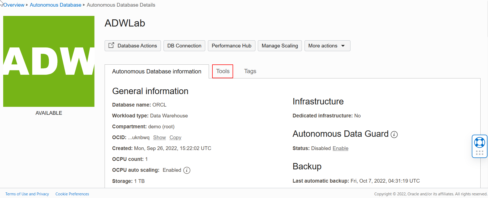

    

4. Sign in as **Username - ADMIN** with the password you used when you created your ADW instance.

    

5.  In the Machine Learning User Administration, click on the **home icon** on the upper right.

    

6.  Log in as **ML\_USER** and provide the password you created in Lab 1 for the ML\_USER. Before you log in, you may wish to bookmark this page.

    

7.  Navigate around to get familiar with the machine learning pages. Click on **Examples**.

    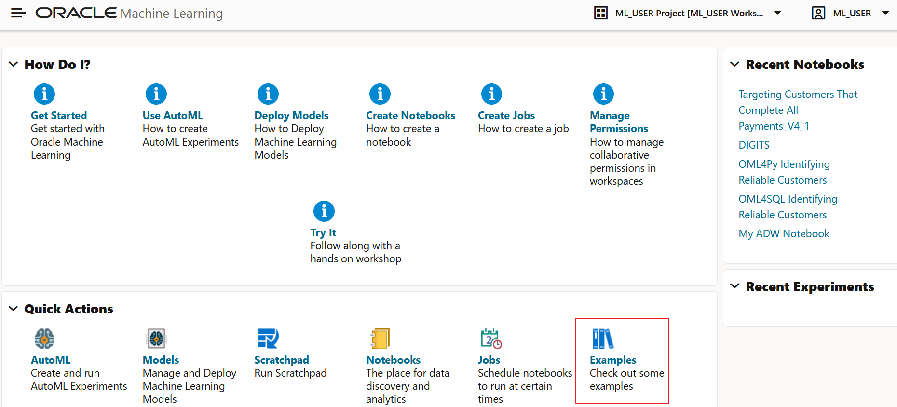

8.  Note the various machine learning notebook examples. Feel free to review some of these. Let's create a new machine learning notebook in this lab. Click on the upper-left cloud menu.

    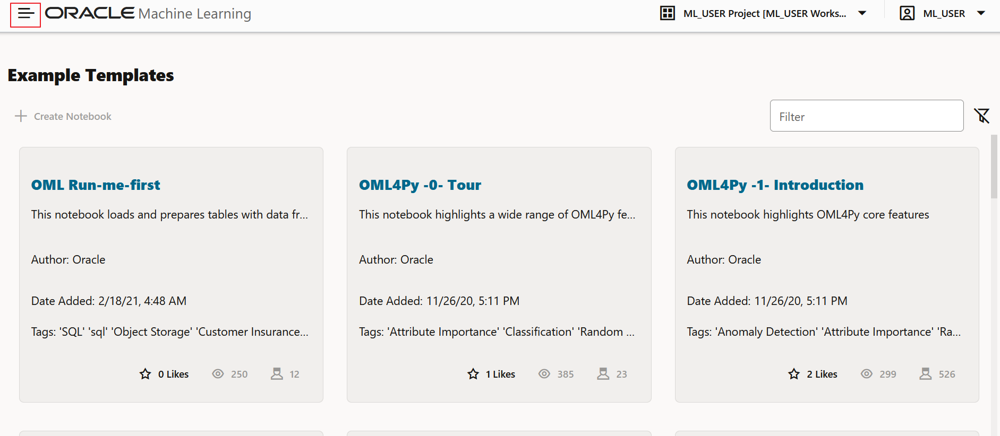

9.  Select **Notebooks**.

    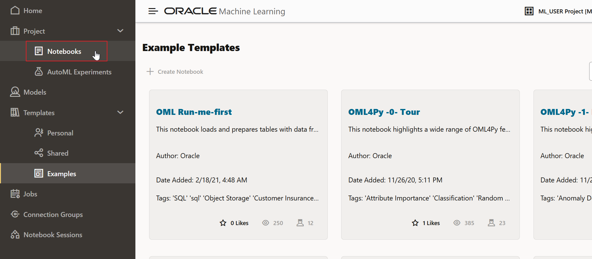

10.  Let's create a notebook from scratch. Click **Create**.

    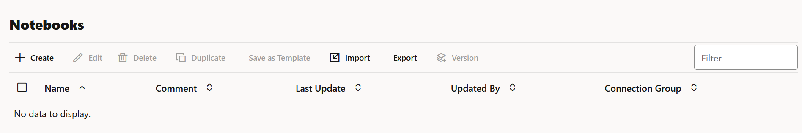

11.  Enter **My ADW Notebook** as the name, then click **OK**.

    

12. The **My ADW Notebook** open for you to edit.

    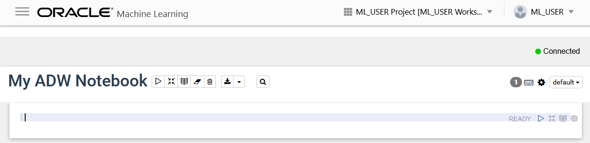

## Task 2: Add Content to Your ADW Notebook

You can add text and code to your notebook to customize it.  Follow these steps to edit your OML Notebook.

1. Click on the **gear** icon in the upper right. We must set the interpreter binding if we're going to connect to the ADW database and run queries. Select the medium and markdown interpreters. You can deselect items by clicking them, changing them from blue to white  and click **Save**.

    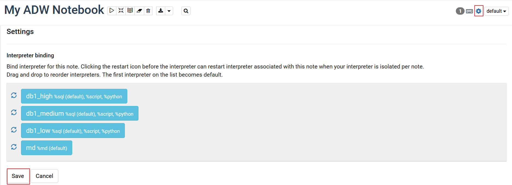

  Zeppelin notebooks are composed of paragraphs that can contain formatted text using markdown, SQL, PL/SQL, Python, and R. We'll just be using markdown, SQL, PL/SQL, and Python. We create different paragraphs with different interpreters based on what we want to put in the paragraphs. The interpreter is set at the top of the paragraph:
    - %md - markdown language which is used for formatted text.
    - %sql - used to run sql statements.  Note you can only run one statement per paragraph, otherwise use a script.
    - %script - used to run multiple sql statements and pl/sql blocks.
    - %python - used to run Python code.
    - %r - used to run the R code.

2.  Paste the following into the first paragraph. Then click on the **Play** icon to run the code (format the text in this case.). Note that it displays the formatted text, and adds a new paragraph. Notebooks save automatically.

    ````
    <copy>
    %md
    ### Targeting Likely Good Credit Customers using Oracle Machine Learning's (OML) Classification Models

    Heather has spent most of her time over the past couple of years extracting and preparing data for analysis.  The large volumes of data that need extracting and processing mean she spends most of her time waiting for jobs to finish and very little of her time analyzing the data. Demands from marketing are forcing a new approach whereby the data remains in the data warehouse and is processed there. The alternative cloud solution is more complex and has no direct out of the box processes to analyze the data in place. She started taking a look at Oracle and found the simple SQL commands in ADW are familiar, and run extremely fast, leveraging all the performance features of the platform. Further once she is done can apply the learning models to incoming data on the fly and allow end user analysts to immediately see mining results. This drastically reduces the cycle of data preparation, analysis, and deployment. It also means there is no change to analysis/reporting data visualization toolset that users are familiar with.
    </copy>
    ````

    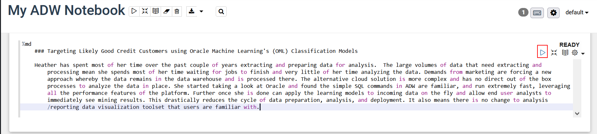

    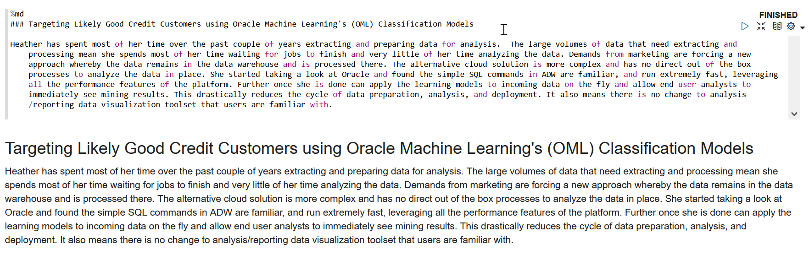

3.  Sometimes we just want the result (formatted text in this case), and not the code. Click on the **show editor** icon to hide the code.

    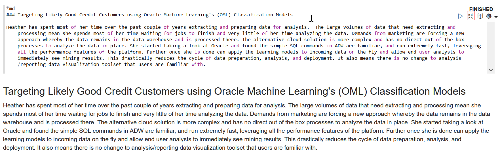

    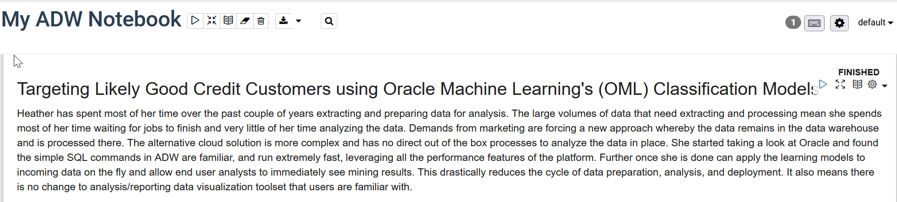

4.  In the next paragraph overwrite the %md with the following code. Click the play icon to run this paragraph.

    ````
    <copy>
    %sql

    /* This shows the credit scoring data we will use historical data to predict the likelihood of a customer having good credit. */

    Select * from ml_user.credit_scoring_100k where rownum &lt; 100
    </copy>
    ````

    

    

5.  To add a title, click the **gear** icon and select **Show title**.

    

6.  Click the **Untitled** field and enter the following into the title.

    ````
    <copy>
    Review Credit Scoring Data
    </copy>
    ````

    
    

7.  Enter the following in the next paragraph.
      ````
      <copy>
      %sql

      /* This is a basic example of a chart visualization in OML Notebooks. This one is a column graph.  Click on the 'settings' link below.  That will show you the fields in the query that were used to create the chart. After you review the settings, you can click on the link again to hide the settings. */

      select customer_id, age, income, tenure, loan_type, loan_amount, occupation, number_of_current_accounts, max_cc_spent_amount, mode_job_of_contacts from ml_user.credit_scoring_100k where rownum &lt; 1000
      </copy>
      ````

    


8. Click the play icon to run the script and review the data by mode of job contacts and income.

    

9. To view a bar chart presentation of the data, click the **bar chart** icon.

    

10. Click **settings** and remove `CUSTOMER_ID` from the keys field and `AGE SUM` from the values field.

    


11. Drag and drop `OCCUPATION` into **keys** and `CUSTOMER_ID` into the **values** fields. Review the results.
    


12. To hide the settings click settings again.
    

    So how does all this help us build machine learning models, collaborate with others, and review and share the results/findings?

    OML Notebooks provide:
    - A collaborative shared workspace for model development.
    - A direct connection to all the data in your Autonomous Database that can scale to petabytes.
    - A platform for preparing data for model ingestion.
    - A visual pallet to display data and ml results.
    - A shared platform where discussion, documentation, execution, and results are presented together.

13. Finally, let's review some examples. Click the cloud menu and click **Examples**. You can also navigate to the **Home** dashboard and click **Examples** from the Quick Actions frame.
    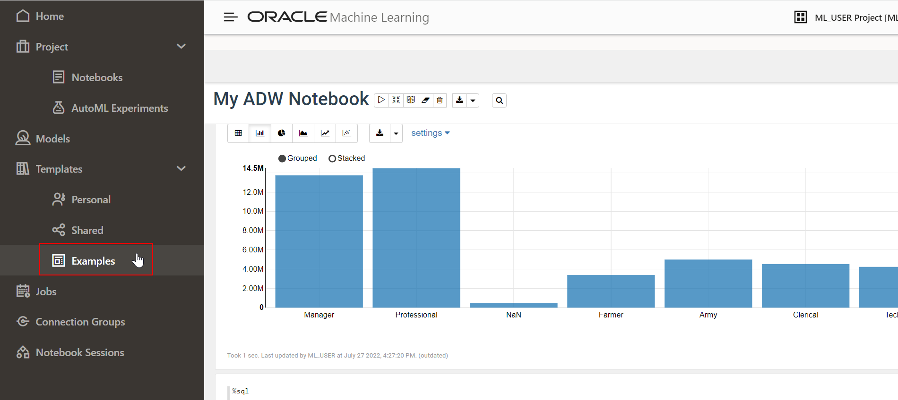

14. Select the notebook with an algorithm of interest. In this example, open the **OML4SQL Anomaly Detection** example and go through it. In the search box, type “anomaly” to see the notebooks illustrating this technique.

    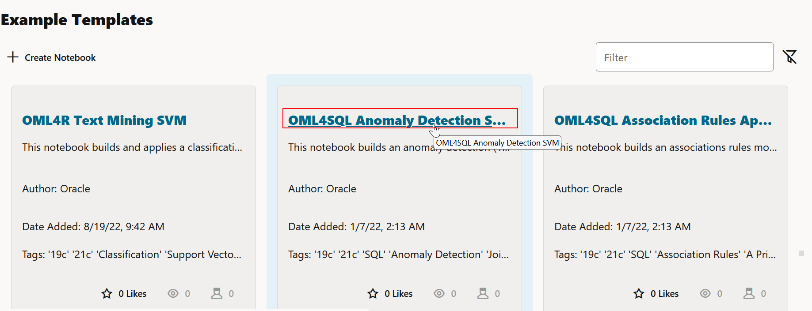

    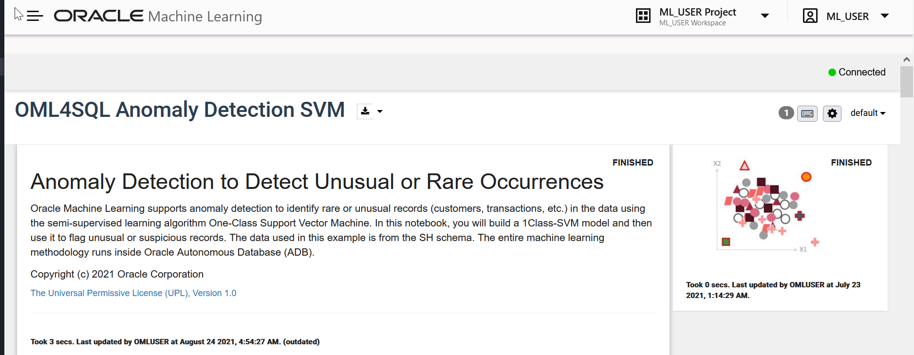

## Task 3: Import the Workshop Notebook

From the previous tasks, we learned how simple it is to add content to your notebook and run the code. In this task, let's import custom machine learning notebook and review the notebook. The install file that you downloaded in Lab 1 has custom notebook _Targeting Customers That Complete All Payments\_v6.json_. The notebook contains steps that are followed during data exploration and machine learning model building. You must run all the steps in these notebooks if you wish to continue with Lab 3 and Lab 4. Running the steps takes only a few minutes.

1. Download the notebook [targeting customers that complete all payments](/files/targeting_customers_that_complete_all_payments_v6.json?download=1).

2.  Click the main menu, expand **Project** and click **Notebooks** to navigate to the Notebooks page.

    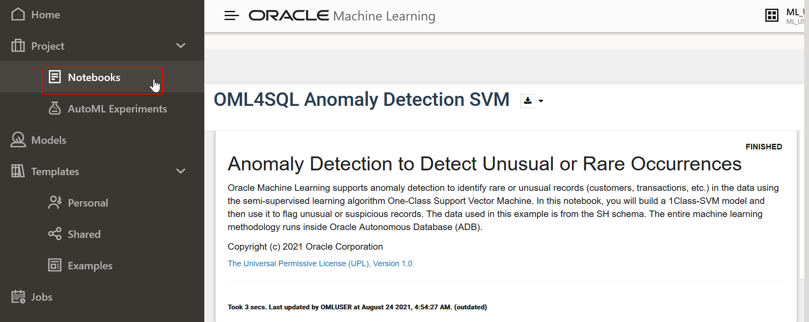

3.  Click **Import**. Let's import a pre-built notebook and use it for the rest of the lab.

    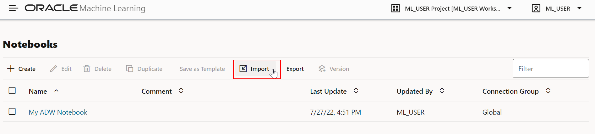

4.  Go to the directory where you downloaded the notebook and import the **targeting customers that complete all payments\_v6.json** notebook. You'll see a success message. Dismiss the message by clicking **X**.

    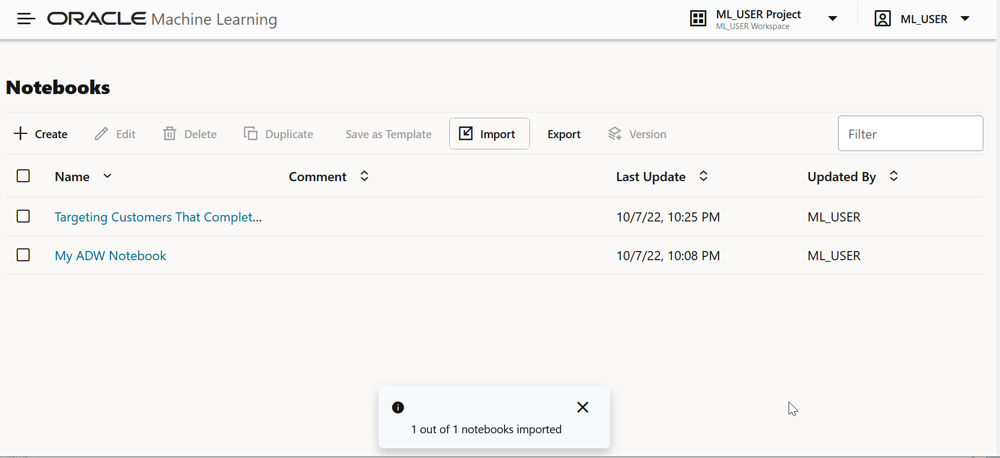


## Task 4: View Notebook Options
Before you start working on the imported notebooks. Let's explore some options in OML Notebooks.

1.  Click the **Targeting Customers That Complete All Payments\_V4\_1** notebook to open it.
    

2.  Before you use the **Targeting Customers That Complete All Payments** notebook, you need to set the interpreter binging. Click on the gear icon.

    

3.  Select the **orcl\_high** interpreter, drag and drop it to reorder and then click **Save**.

    

4.  Click the **play** icon to run all paragraphs in the notebook.

    

5. A confirmation window appears. Click **OK** to run all paragraphs. The paragraphs run one by one displaying the status next to the title.
     

6.  Click on the **Show/hide the code** icon to show the output and to view the code and the formatted text.

    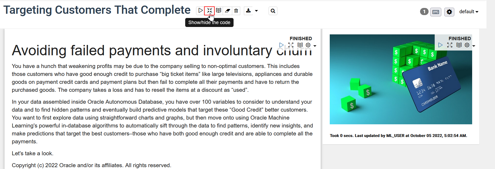

7. Click the **Show/hide the output** icon. Ensure that all the paragraphs show **FINISHED** status and then click **Show/hide the output** icon.
     

     

## Task 5: About this Notebook

The rest of this lab will be done interactively in the notebook. This step discusses the result of each section of the notebook.

1. This graph illustrates viewing customers with “Good Credit” who complete all their payments are hard to find.

    

2. This section illustrates how we can explore the data. The pie charts here show MARITAL and OCCUPATION, respectively, from a few selected attributes.

    

3. Next, we explore the bar chart with the following settings: MAX\_CC\_SPENT\_AMOUNT as **keys**, CREDIT\_SCORE\_BIN as **groups**, and CUSTOMER\_ID as **values**. For the scatter plot, the following are the settings: **xAxis**: AGE, **yAxis**: MAX\_CC\_SPENT\_AMOUNT, **group**: CREDIT\_SCORE\_BIN, **size**: NUMBER\_OF\_OPEN\_ACCOUNTS.

    

4. Optionally, we can create Histograms.
    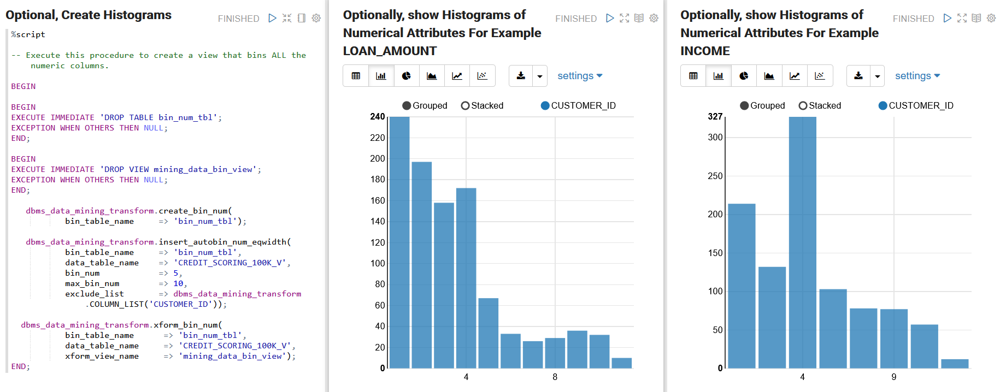

5. Here, we are building a model to identify key variables that most influence the target attribute by running the Attribute Importance machine learning technique. 

    

6. View the attributes that independently influence the target MAX\_CC\_SPENT\_AMOUNT.
    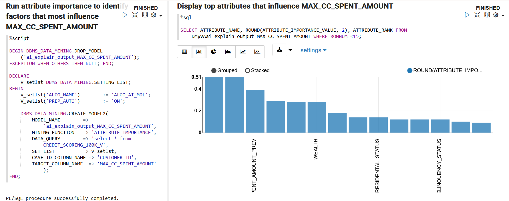

7. Now, split the data into Train and Test data sets. This example has an automatic data preparation parameter in the model building step. We’ll first drop any model with the same name and then build and evaluate a classification model to predict the column CREDIT\_SCORE\_BIN.

    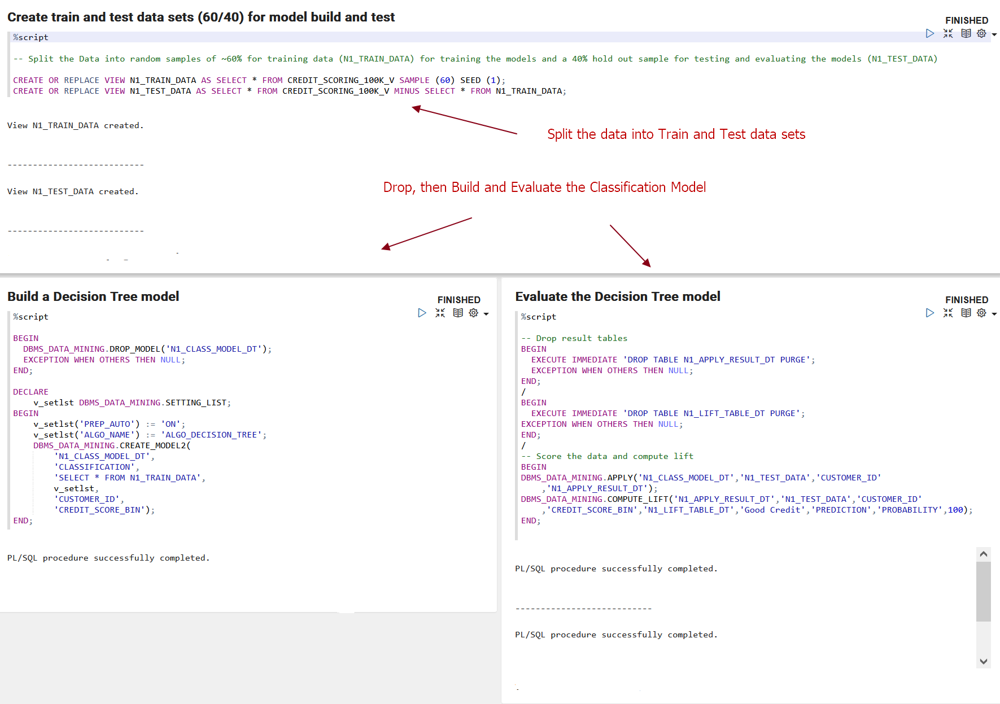

8. Drop and then build and evaluate multiple OML Classification models to compare the accuracy of the model. 

    

9. Join the model outputs in a table. Here, the table ALL\_LIFT\_DATA contains cumulative gains output from all the models. Plot a cumulative gains chart to view and assess the model quality.

    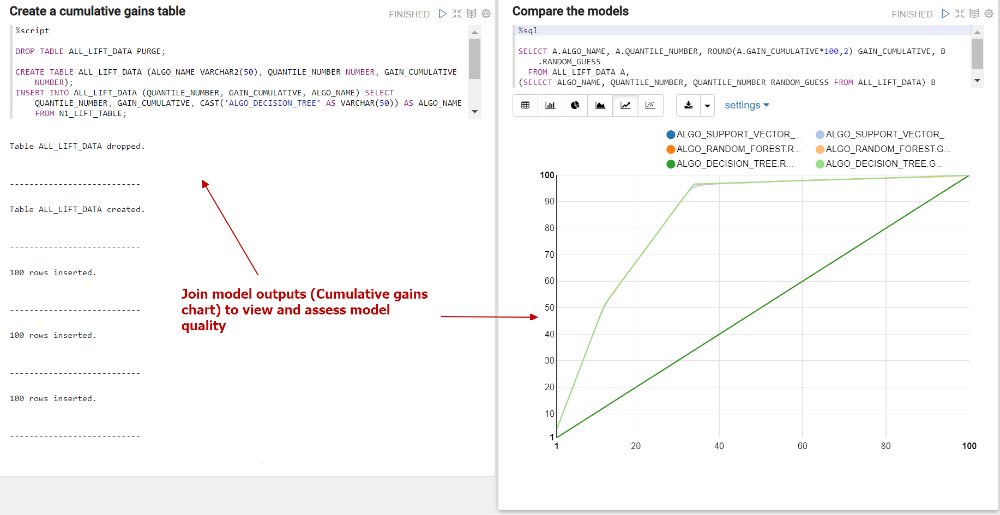

10. Now, apply the model to make predictions on customers who are likely to be “GOOD CREDIT” and complete their payments.

    

11. Let's create a new table CREDIT\_SCORE\_NEW\_PREDICTIONS to view other data visualization tools. Drop the table if it already exists. 
    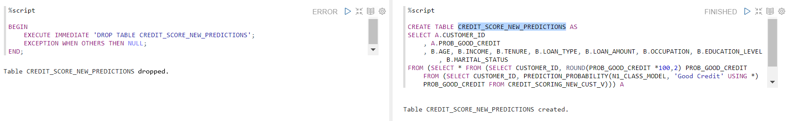

12. The next step scores and ranks the customers who are married, occupation is "Professional", indicating the loan type, and education level among other attributes. You can substitute the filters. 
    

13. Let's apply the model in real-time and make a prediction with a single record. Also, create a new view to include the CUSTOMER\_SCORING\_100K\_PREDICT\_V data with the generated predictions.

    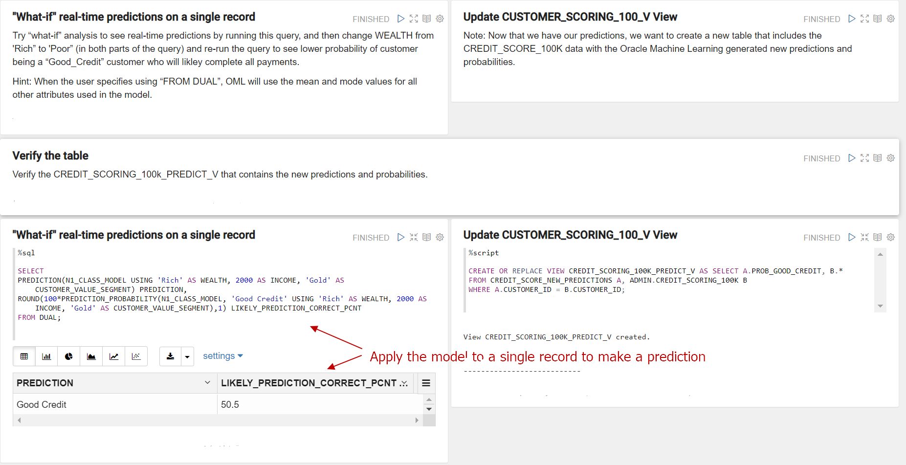

14. Optionally, you can update and verify the CUSTOMER\_SCORING\_100k\_PREDICT\_V view.

    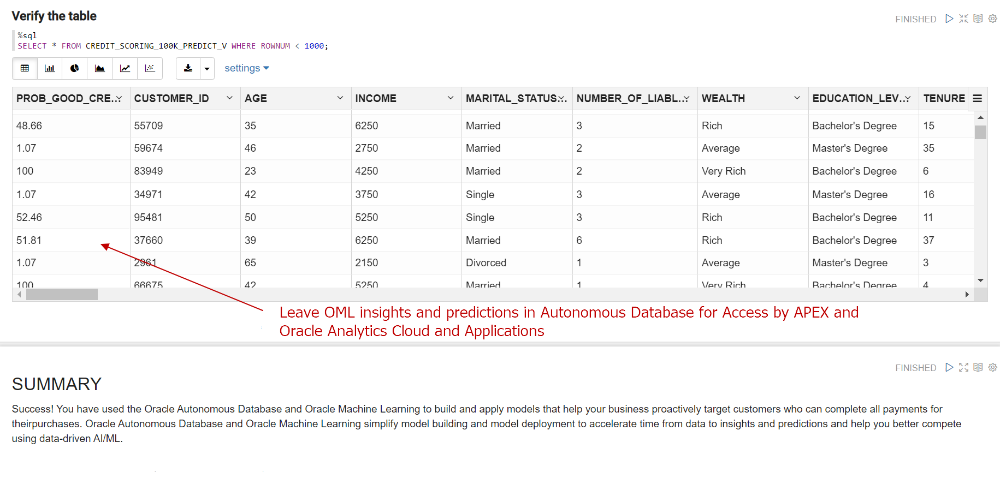

 This way, the Alpha office can approach customers who can complete payments for their purchases.

[Please proceed to the next lab](#next).

## Acknowledgements

- **Author** - Derrick Cameron
- **Contributors** - Anoosha Pilli, Peter Jeffcock, Arabella Yao, Ayden Smith, Jeffrey Malcolm Jr; Mark Hornick, Sr. Director, Data Science and Oracle Machine Learning Product Management; Sherry LaMonica, Consulting Member of Technical Staff, Machine Learning; Marcos Arancibia, Senior Principal Product Manager, Machine Learning
- **Last Updated By/Date** - Sarika Surampudi, Principal User Assistance Developer, Oracle Database User Assistance Development, October 2022
