# Using Prediction in an Application

## Introduction

In Lab 2, you created a model, which you then imported into a new database to represent a production system in Lab 3. Now we just need to integrate that model with existing applications and processes. It’s worth repeating that this is a critical step. Machine learning models won't be useful to the business until they are actively used in existing applications and processes.

Estimated lab time: 20 - 30 minutes

Watch this short video to preview how to use prediction in an application.

[](youtube:e0TILs7IDgU)

### Before You Begin

We will start this lab with some more setup, loading both data and an APEX application, the Alpha Office Customer Service application. Once those are ready, we will show you three ways that you could deploy this model.

We will first incorporate it into the application for customer service. Employees who deal with customers directly would do this when speaking with them. When a consumer enters the office and inquires about purchasing something, the representative can respond right away. This model can be integrated with that application workflow to speed up the application process for a given new service and enhance the user experience. This is a typical scenario where a model can assist in directing a reaction to an event in real time. Any client interaction, making product recommendations on a website, handling a financial transaction, or reacting to a new sensor reading on a piece of equipment would fall under this category.

n the second case, we'll deal with a lot of consumers in a batch. After completing an acquisition, Alpha Office now has several new customers. The marketing division would like to handle every customer at once, possibly by developing a campaign to focus on the right people. In this lab, we use the Customer Service application to accomplish that. A similar use case might also be addressed by importing large amounts of data into the database, processing them with scripts, and making the results accessible through an appropriate analytics tool like Oracle Analytics Cloud.

Finally, even though APEX applications are compatible with Oracle Database, many businesses employ a distributed development methodology. If so, the best course of action is to make a model accessible via a REST API endpoint. We'll also demonstrate how to do that for you.

Furthermore, you are done once you have finished this lab. You've created, trained, and deployed a machine learning model after establishing two autonomous databases. We hope you'll be able to apply your newly acquired skills at your company. Are there any business issues that you might be able to assist with? Do your coworkers currently analyze any data sets where machine learning could be useful? If you create a free trial account to do this lab, you can utilize the free tier or your $300 in cloud credits to do more experiments. Additionally, more details are available at Oracle.com/machine-learning.

### Objectives

In this lab, you will:
- Import data to set up the lab.
- Import an APEX application.
- Review the application to see how you can make predictions on the fly.
- Expose your ml model as a REST endpoint so any application can use it.

### Prerequisites

This lab assumes you have completed the following labs:
- Login to Oracle Cloud/Sign Up for Free Tier Account
- Connect and Provision ADB
- Create a Machine Learning Model
- Migrate machine learning model to ATP

## Task 1: Download the Custom Files

1.  Click the link below to download the install file.

    [install.zip](https://objectstorage.us-ashburn-1.oraclecloud.com/n/natdcshjumpstartprod/b/adbml/o/install.zip)

2.  Save the install.zip to a download directory and then unzip the file.

    

## Task 2: Prepare data for the lab in ATP

1.  Click the **Navigation Menu** in the upper left, navigate to **Oracle Database**, select **Autonomous Transaction Processing**.

    

2. Choose your compartment and click your ATP instance.
   

3. Click **Database Actions**. The Launch DB Actions initialization screen appears. 

    

    

4.  The Database Actions login page appears. If prompted, log in with your ATP credentials. **Username - ML\_USER** and click **Next**. Then provide the password for your M\L_USER and click **Sign in**.

    

    

5. From the Database Actions menu, select **SQL**.

    

6.  Dismiss the Help by clicking on the **X** in the popup. The worksheet area is displayed. 
     

7. To show how an application would use machine learning predictions, we will add some customer names to the original credit\_scoring\_100k data set. Click on the elipses **...** for more options. Select **Data Loading** and then click **Upload Data Into New Table**.

    

8.  Click on **Select files**, upload **customer\_names.csv** file from the install.zip custom folder that you downloaded in Lab 1 and click **Next**.

    

9.  The screen displays the progress of the upload and then displays the customer_names.csv table. Click **Next**.
     

10. Change the lengths of **CUSTOMER\_ID**  to **6**, **FIRST\_NAME** to **100**, and **LAST\_NAME** to **100** and click **Next** .

    

11.  Once the DDL Code is generated, click **Finish**.

    

12. Uploading the data may take time, click **OK** to close the popup.

    

13. After the upload, the Data Loading tab at the bottom displays the table information. 
14. Create a view that combines the names with the credit\_scoring\_100k data set and click **Run Script**.

    ````
    <copy>
    create or replace view ml_user.credit_scoring_100k_v as select a.first_name,
    a.last_name, b.*
    from ml_user.customer_names a, credit_scoring_100k b
    where a.customer_id(+)= b.customer_id;
    </copy>
    ````

    

15.  Create a new *upload_customers* table. This will be used in the application to show how newly loaded records can be scored on the fly.

    ````
    <copy>
    create table upload_customers (
    customer_id number
    , first_name varchar2(100)
    , last_name varchar2(100)
    , wealth varchar2(4000)
    , income number
    , customer_dmg_segment varchar2(26)
    , customer_value_segment varchar2(26)
    , occupation varchar2(26)
    , highest_credit_card_limit number
    , delinquency_status varchar2(26)
    , max_cc_spent_amount number
    , max_cc_spent_amount_prev number
    , residental_status varchar2(26)
    , likely_good_credit_pcnt AS (round((100*(prediction_probability(n1_class_model, 'Good Credit' USING
        wealth
    , customer_dmg_segment
    , income
    , highest_credit_card_limit
    , residental_status
    , max_cc_spent_amount_prev
    , max_cc_spent_amount
    , occupation
    , delinquency_status
    , customer_value_segment
    , residental_status))),1))
    , credit_prediction AS (prediction(n1_class_model USING   
    wealth
    , customer_dmg_segment
    , income
    , highest_credit_card_limit
    , residental_status
    , max_cc_spent_amount_prev
    , max_cc_spent_amount
    , occupation
    , delinquency_status
    , customer_value_segment
    , residental_status))
    );
    </copy>
    ````

    

## Task 3: Import the APEX Application

1.  Click the **Navigation Menu** in the upper left, navigate to **Oracle Database**, select **Autonomous Transaction Processing** and choose your compartment.

    

2. Navigate to your ATP instance.
    

3. Click **Tools** and click **Open APEX**.

    

    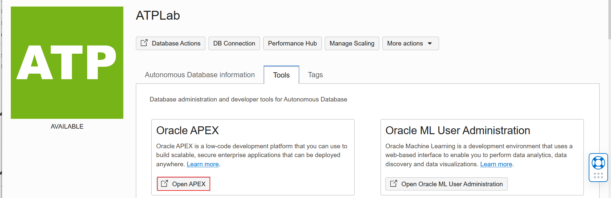

3.  Enter your ADMIN **Password** and click **Sign In to Administration**.

    

4.  You will be prompted to create a workspace. Click **Create Workspace**.

    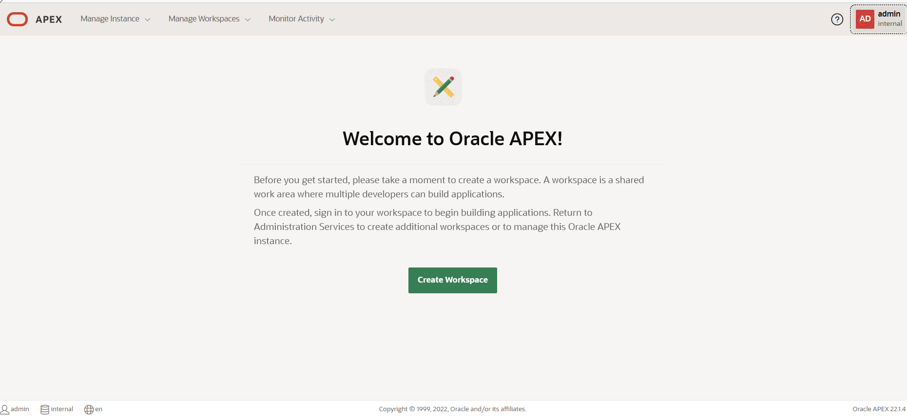

5.  Click **Existing Schema** on the Create Workshop screen.

6.  In the next screen, click the field provided for **Database User**. Enter **ML\_USER** in the field and click on the search icon. 

7. Select **ML\_USER** from the from the search results. The next screen displays the **Create Workspace** screen with **Database Username** and auto-populated **Workspace Name**. 

    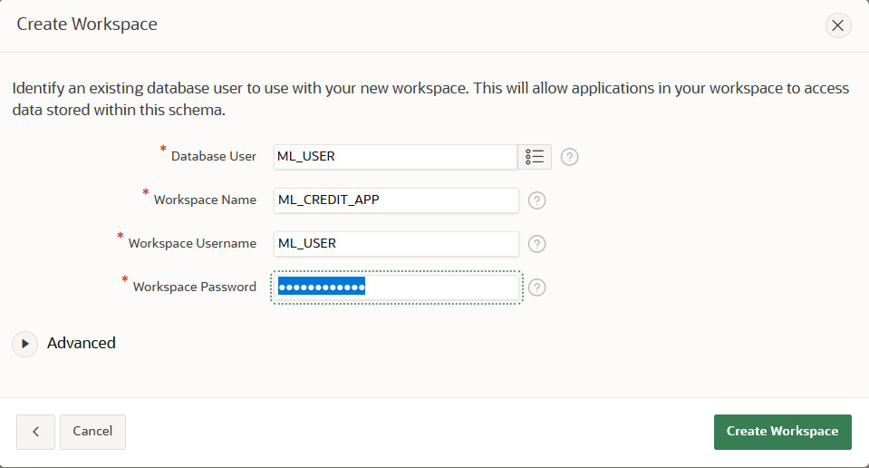

    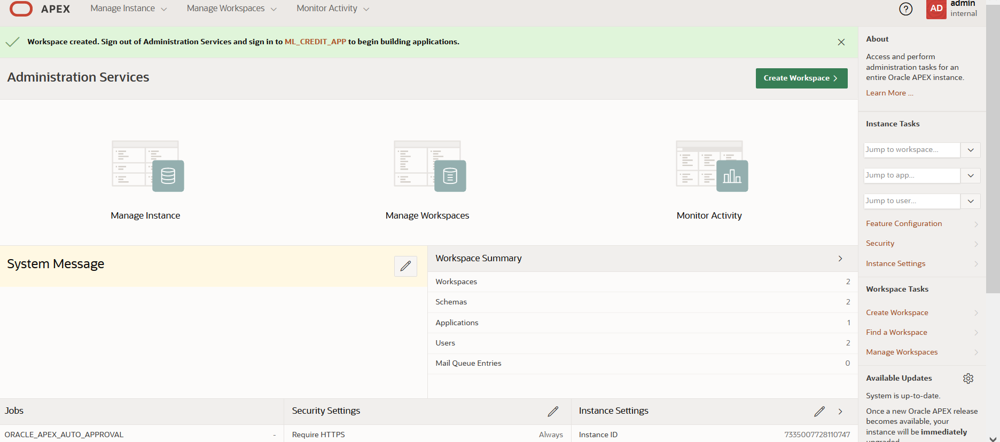

8. When the popup appears, click **Return to Sign In Page** and log in to the ML\_CREDIT\_APP as a ML\_USER. Enter **Workspace - ML\_CREDIT\_APP**, **Username - ML\_USER** and **Password** you created for ATP instance and then click on **Sign In**.

    

    

9. Enter **Workspace Name** as **ML\_CREDIT\_APP**, **Workspace Username** as **ML\_USER**, and provide a **Workspace Password**. For convenience, enter the ATP instance ADMIN password. Click **Create Workspace**.

10. Your APEX workspace is ready to build an application! 

11. Click **admin** in the top right corner and then click **Sign out** to sign out of ADMIN user.

        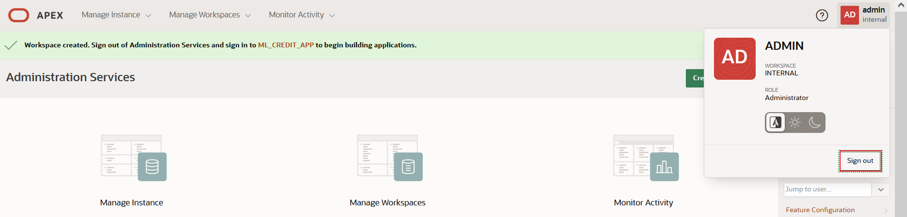
12. When the popup appears, click **Return to Sign In Page**.

13. Log in to the **ML\_CREDIT\_APP** as an **ML\_USER**. Enter **Workspace - ML\_CREDIT\_APP**, **Username - ML\_USER**, and **Password** you created for the ATP instance, and then click **Sign In**.

14. Your ML\_USER workspace opens. 
15. Select **App Builder**.

    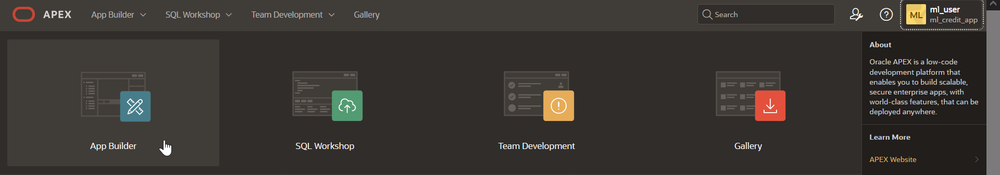

16.  Select **Import**

    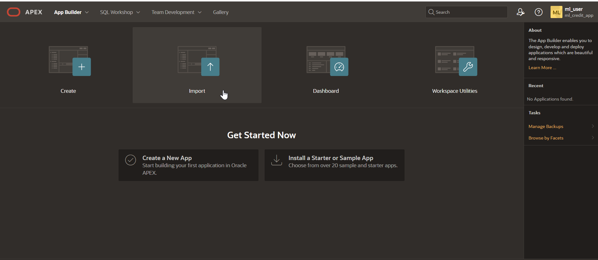

17.  To import file, click the plus icon next to Drag and Drop and select **f100.sql** file from your install zip folder that you downloaded in Lab 1. Leave all other fields with their default values. 

    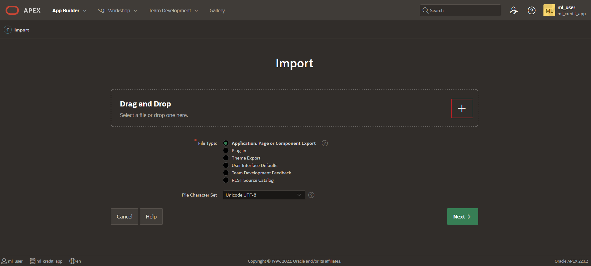

    

    

18. Once the file is uploaded, the file name appears under the Drag and Drop field. Click **Next**.
     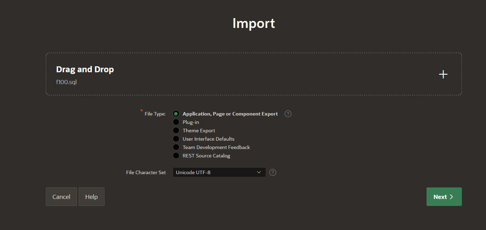

19. Click **Next** to confirm file import.

20. To install database application, accept the defaults and click **Install Application**.

    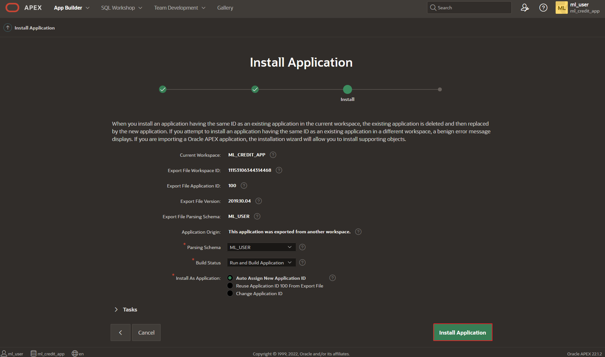

21. Click **Next** to installation the application.

    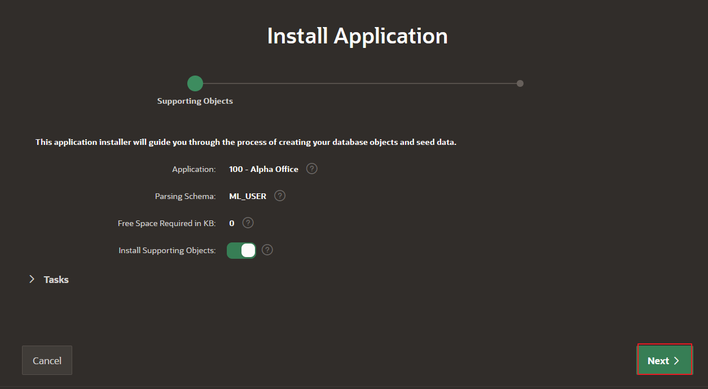

22. Click **Install** to confirm the installation.
     

23. Once the installation is complete, click **Run Application** to run the application.

    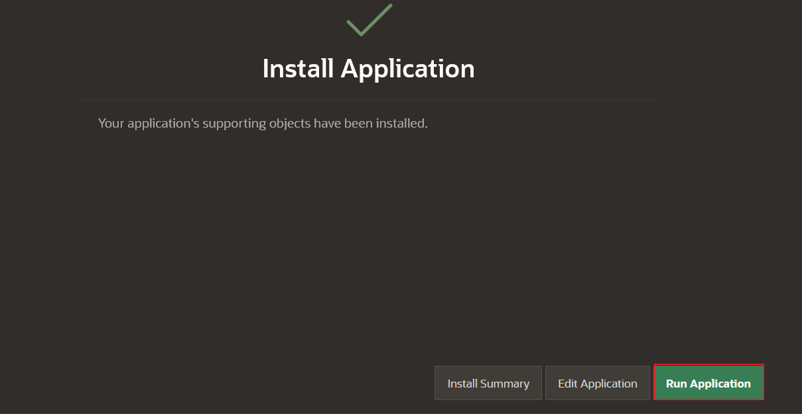

24. Log in as ML\_USER, enter **Username - ML\_USER** and **Password** you created for the ATP instance and then click **Sign In**.

    

25. The Alpha Office application opens. 
     

## Task 4: Run the application and review on-the-fly prediction/scoring

1.  On the Alpha Office home pgae, select **Customer Walk-in** from the menu.

    

2. Select **Lastname**, and then **Customer Id**. Note that the credit score prediction and the probability of that estimate calculations are done as data is queried.

    

    

3.  Next, we will upload new customers and score those as a batch. Select **Home** item from the menu at the bottom of the page. (Note: If you do not see the menu bar at the bottom of the page, switch to Oracle APEX tab which was opened earlier in the browser.)

    

4.  Select **SQL Workshop**.

    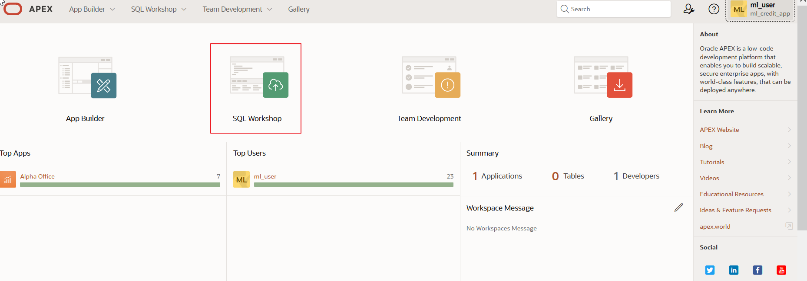

5.  Select **Utilities**.

    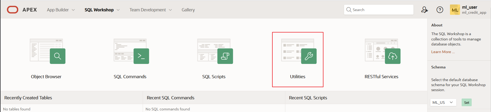

6.  Select **Data Workshop**.

    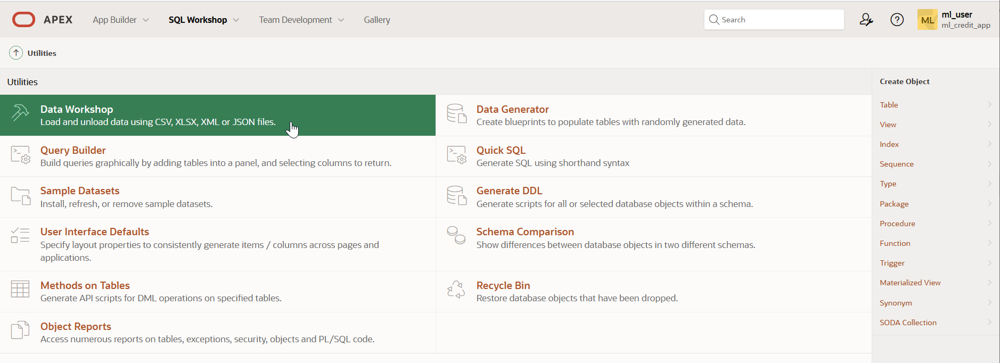

7.  Select **Load Data** and then select **Choose File**. Select the **upload\_customers.xlsx** file from your install zip file in downloads folder.

    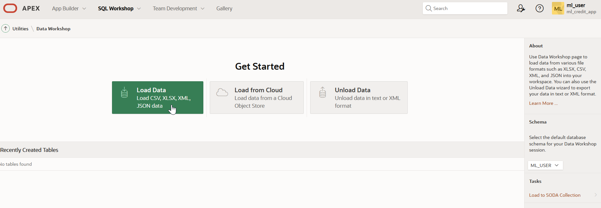

    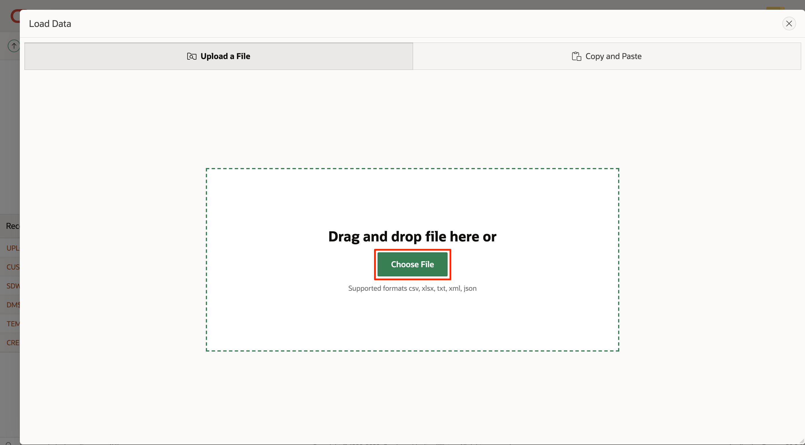

    

8.  Select **Load To - Existing Table** and choose **Table - UPLOAD\_CUSTOMERS** from the drop down menu and select **Load Data**. Once the data is appended to the table, close the popup.

    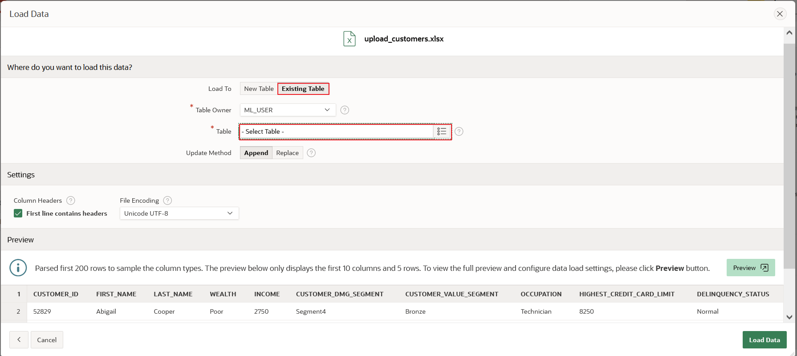

    

    

    

9.  In Oracle APEX, select **App Builder** and then select **Alpha Office**.

    

    

10. Click **Run Application** to run the application.

    

11. In Alpha Office, click on **Review Uploaded Customers** from the menu to review the uploaded customers and note the predictions.

    

    

12. Select **Customer Upload Summary** from the menu. This provides a summary measure of the uploaded customer number of new good credit versus other credit customers. *This shows there were 40 customers with 100 percent probability of good credit, 83 customers with a 50.7 percent probability of good credit, and 277 customers with a 1.2 percent probability of good credit.* (Note: your values may differ slightly.)

    

13. Select **Overall Credit Profile**. This provides an overall measure of the credit across the entire 100k credit database. This scoring of 100k customers with 10 variables takes less than a second. *This shows Alpha Office has 12k customers with a 100 percent probability of good credit, 22k customers with a 50.7 probability of good credit, and 66k customers with a 1.2 percent probability of good credit*. (Note: your values may differ slightly.)

    

## Task 5: Expose the Machine Learning Model as a REST End Point so any Application can Call it

1.  Select the **Home** button from the menu at the bottom of the screen. (Note: If you do not see the menu bar at the bottom of the page, switch to Oracle APEX tab which was opened earlier in the browser.)

    

2.  Select **SQL Workshop**.

    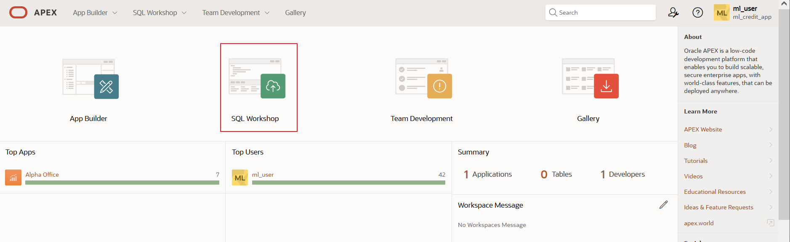

3.  Select **RESTful Services**.

    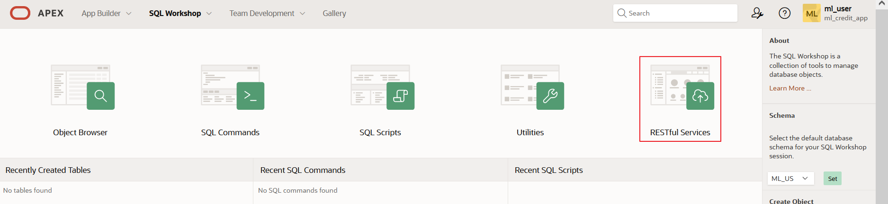

    

4.  Select **Modules** on the left, and then click on **Create Module**.

    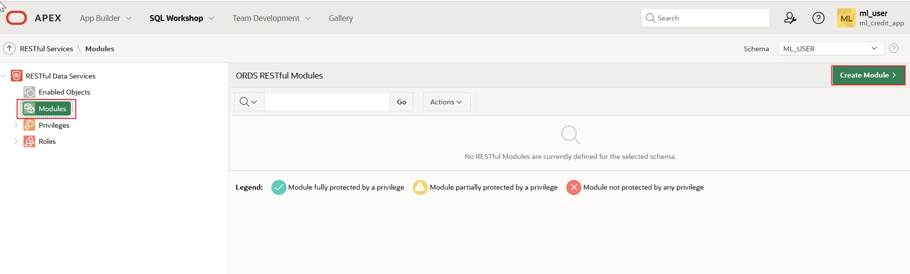

5.  Enter the following and select **Create Module**.
    - Module Name - *Predict Credit*
    - Base Path - */credit/*

    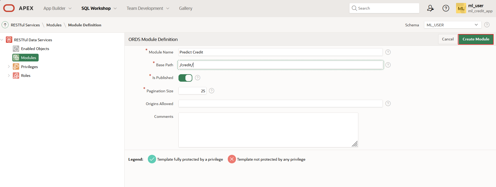

6.  Select **Create Template** to create a template.

    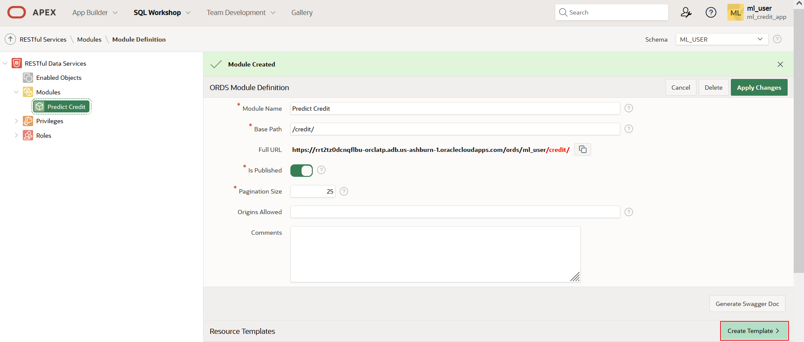

7.  Enter the following and select **Create Template**.
    - URI Template: *credit_scoring_100k\_v/:wealth/:income*

    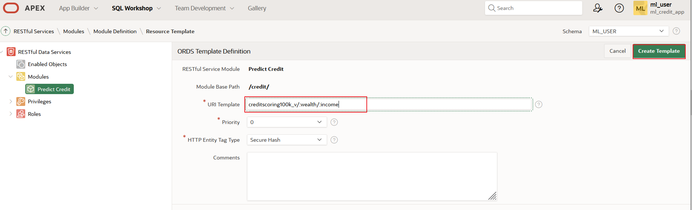
8. Next, click on **Create Handler**.

    

9.  Be sure to select **Method - GET** and **Source Type - Query One Row** and enter the following SQL query in the worksheet and select **Create Handler**.

    ````
    <copy>
    select prediction(n1_class_model using :wealth as wealth, :income as income) credit_prediction from dual
    </copy>
    ````

    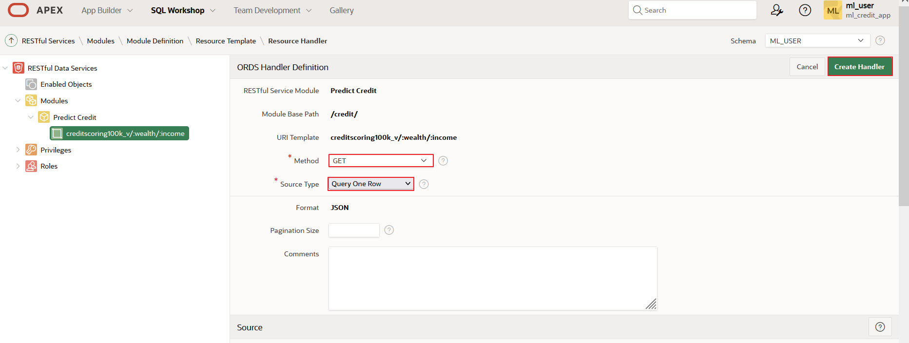

10.  Copy **Full URL** and paste it in your browser. Replace the parameters **:wealth - Rich** and **:income - 20000** respectively and hit enter. We are passing the wealth and income variables to the prediction model. Note these are just two of the many variables we could pass to the model (just add additional ones).

    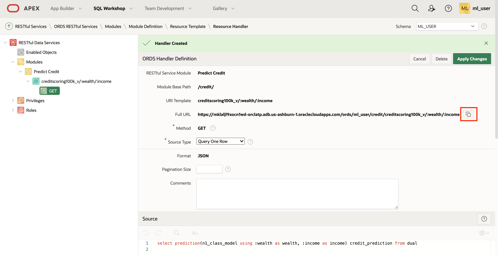

    

This concludes this lab and this workshop.

## Acknowledgements

- **Author** - Derrick Cameron
- **Contributors** - Anoosha Pilli, Peter Jeffcock, Arabella Yao, Ayden Smith, Jeffrey Malcolm Jr; Mark Hornick, Sr. Director, Data Science and Oracle Machine Learning Product Management; Sherry LaMonica, Consulting Member of Technical Staff, Machine Learning; Marcos Arancibia, Senior Principal Product Manager, Machine Learning
- **Last Updated By/Date** - Sarika Surampudi, Principal User Assistance Developer, Oracle Database User Assistance Development, October 2022
