# Migrate Machine Learning Model to ATP

## Introduction

In the previous lab, you created a machine learning model that can predict customer credit. Congratulations! But you’re not done yet. It's a good model, but models must be deployed into production systems and have a positive impact on the business, and far too many machine learning projects fail at this stage. We'll spend the next lab making sure you deploy this model so that Alpha Office employees can use it on a daily basis.

The first step is to move the model from where it was developed into a production transaction processing database where the Client Service application can access it. This lab will walk you through the steps.

Estimated time: 20 - 30 minutes

Watch this short video to preview how to deploy the machine learning model into ATP.

[](youtube:_BTSjFzUV_g)

### Objectives

In this lab, you will:

- In ADW:
    - Log in with ML\_USER and export the model to a temporary table.
    - Download the credential wallet and upload it to object storage

- In ATP:
    - Create a database link that will be used to copy (pull) export of the machine learning model from ADW to ATP.
    - Copy the model from ADW to ATP.
    - Log in with ML\_USER and import the machine learning model.
    - Create a virtual column on the table that applies the model to rows in the table.

### Prerequisites

This lab assumes you have completed the following labs:
- Login to Oracle Cloud/Sign Up for Free Tier Account
- Connect and Provision ADB
- Create a Machine Learning Model

## Task 1: Export the Machine Learning Model

1.  Click the **Navigation Menu** in the upper left, navigate to **Oracle Database**, and select **Autonomous Data Warehouse** and

    

2. Navigate to your instance.
    

3. Click **Database Actions**.

    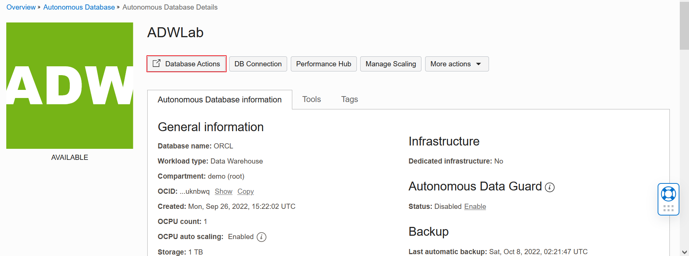

4.  The initialization screen appears. If prompted, log in with **Username - ML\_USER** and click **Next**. Then provide the password for your ML\_USER and click **Sign in**. If you are signed in with a different user, click the profile icon on the top right, and click **Sign Out**.

    

    

5. From the Database Actions menu, choose **SQL**. The worksheet opens for you to edit.

    

    

6.  Create a temporary table to hold the data mining model.

    ````
    <copy>
    create table temp(my_model blob);
    </copy>
    ````

    

7.  Confirm the machine learning model that was built. This has been done in Lab 1 and Lab 2 by running the steps in the Credit Scoring notebook and Targeting Customers That Complete All Payments Notebook respectively.

    ````
    <copy>
    select * from user_mining_models;
    </copy>
    ````

    

8.  Export the machine learning model to this temporary table. The model will be stored in a binary large object.

    ````
    <copy>
    DECLARE
    v_blob blob;
    BEGIN
    dbms_lob.createtemporary(v_blob, FALSE);
    dbms_data_mining.export_sermodel(v_blob, 'N1_CLASS_MODEL');
    insert into temp values(v_blob);
    commit;
    dbms_lob.freetemporary(v_blob);
    END;
    /
    </copy>
    ````

    

9.  Confirm the model was exported by looking at the length of the blob (you can't see the binary data). Note your length may differ slightly.

    ````
    <copy>
    select length(my_model) from temp;
    </copy>
    ````

    


## Task 2: Download ADW Credentials Wallet

1.  Click the **Navigation Menu** in the upper left, navigate to **Oracle Database**, and select **Autonomous Data Warehouse** and

    

2.  Navigate to your instance.
    

3.  Click **DB Connection**.

    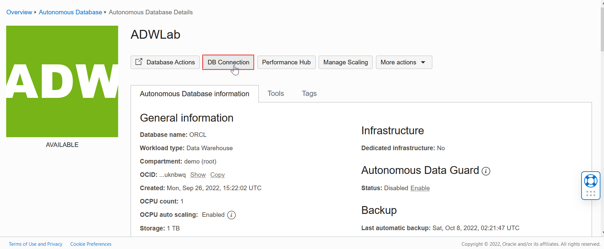

4.  Leave the default option (Instant Wallet) and click **Download wallet** on the Database Connection screen.

    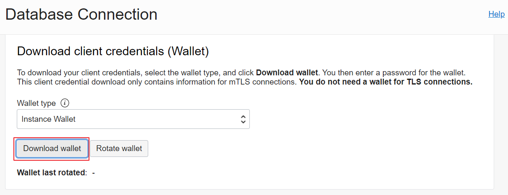

5.  Specify a password of your choice for the wallet. You will need this password when connecting to the database later. Click **Download** to download the wallet file to your machine.

    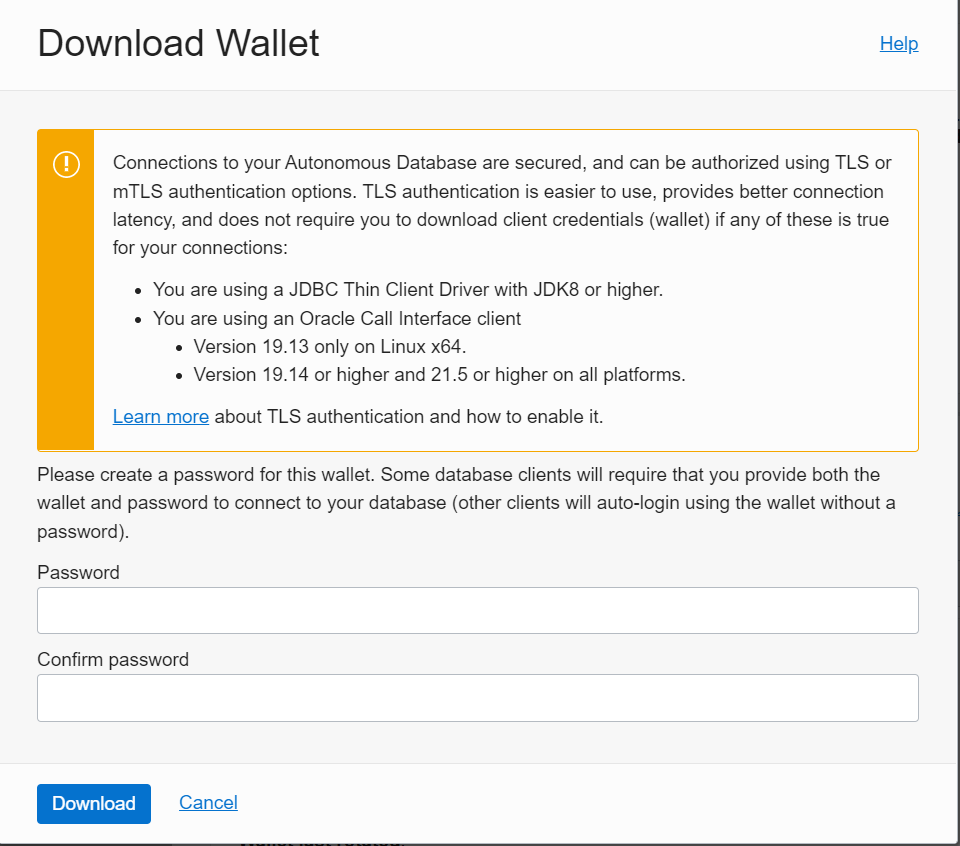

6.  Unzip the downloaded wallet file, and note the `cwallet.sso` file, you will need it later in this lab.

    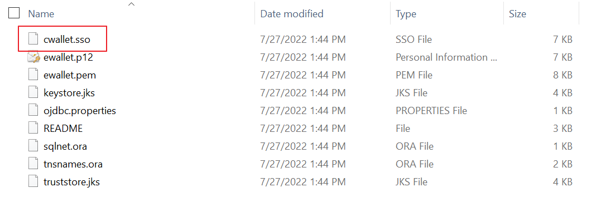

7. Click **Close** on the Database Connection screen.

## Task 3: Create a Bucket and Upload Your Data

1.  Click the **Navigation Menu** in the upper left, navigate to **Storage**, and select **Buckets**.

	

2.  Choose the compartment and click **Create Bucket**.

    

3. Name the bucket - **adwc** in your compartment (not ManagedCompartmentForPaas) and click **Create**.

    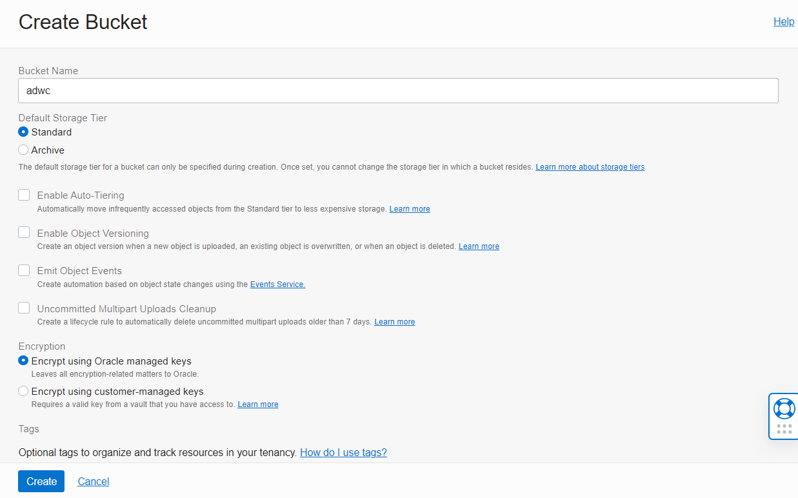

4.  Select the **adwc** bucket.

    

5. Click on **Upload**, drag and drop or click on **select files** to upload the **cwallet.sso** file from the wallet zip file we downloaded from the ADW instance earlier and click **Upload**.

    

    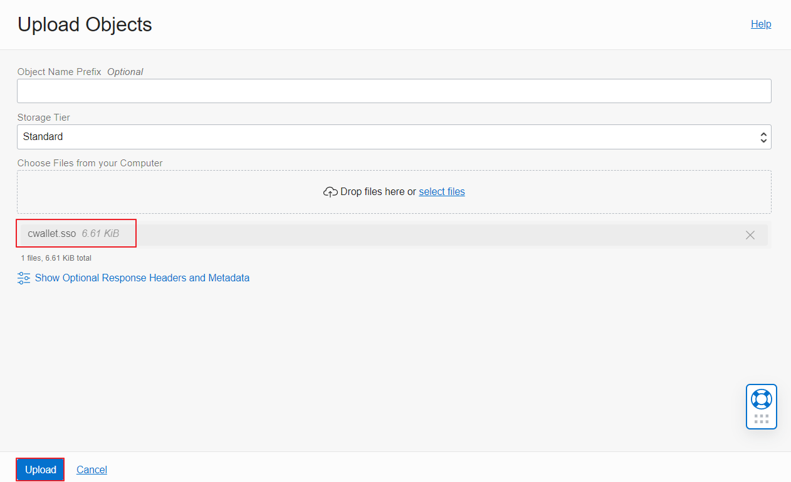

6. On the menu of the **cwallet.sso** object, click on **View Object Details** and copy the URL Path to a text editor, we will need it later in this lab.

    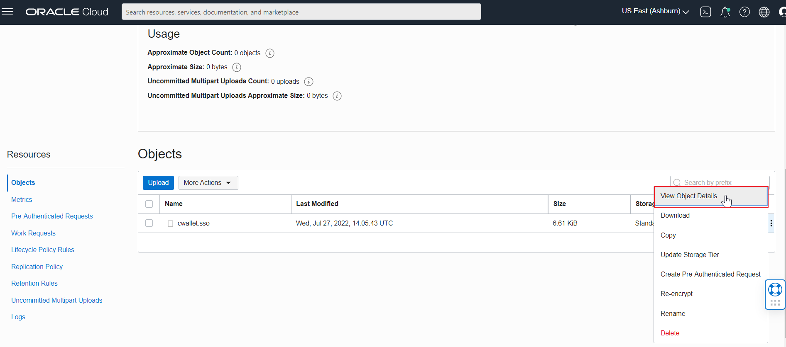

    

7. Click **Cancel** to dismiss the screen.

## Task 4: Generate the Auth Token

To load data from the Oracle Cloud Infrastructure(OCI) Object Storage you will need an OCI user with the appropriate privileges to read data (or upload) data to the Object Store. The communication between the database and the object store relies on the Swift protocol and the OCI user Auth Token.

1.   Go to Profile menu, click **User Settings** to view user details.

    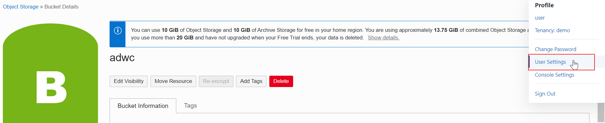

2.  Remember the username as you will need it in the next step.

    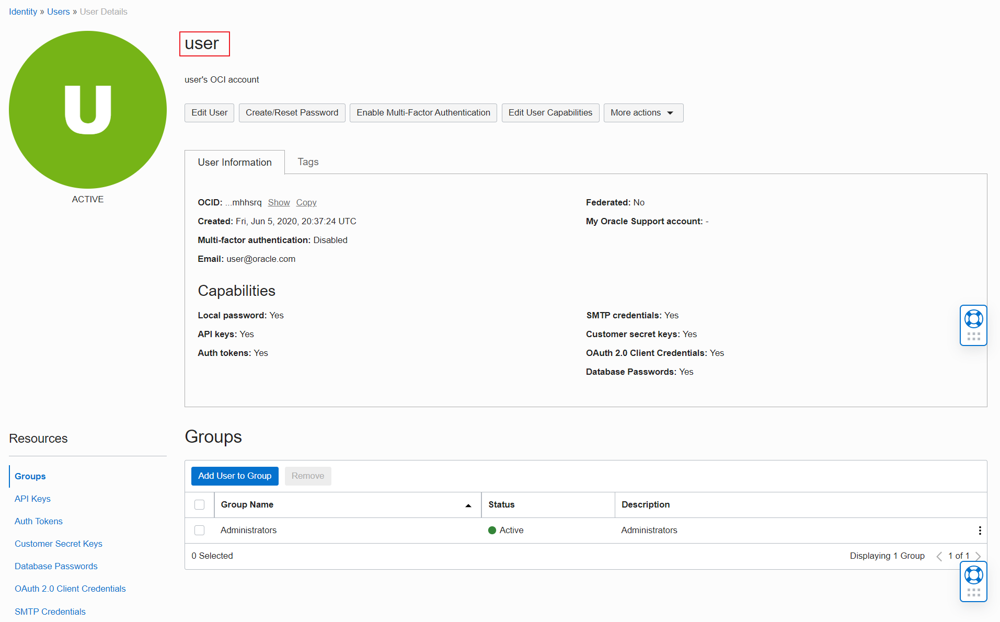

3.  On the left side of the page, under Resources, click **Auth Tokens**, and then **Generate Token**. Call it **adwc_token**. *Note: Be sure to copy it to notepad as you won't be able to see it again.*

    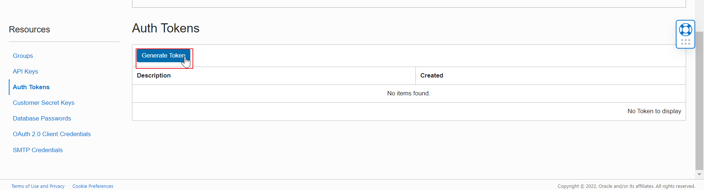

4. Call it **adwc_token** and click on **Generate Token**. *Note: Be sure to copy it to notepad as you won't be able to see it again.*

    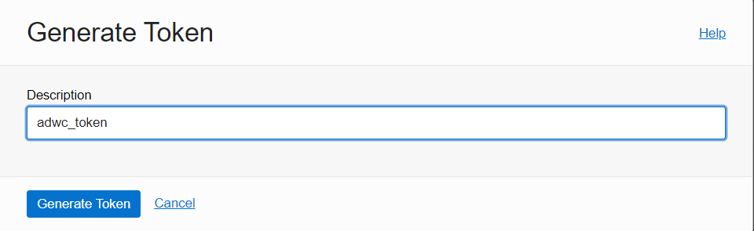

5. Click **Copy** and save it in a text editor as you won't be able to see it again. Click **Close** to dismiss the screen.
    

## Task 5: Copy Machine Learning Models between ADW and ATP

1.  Click the **Navigation Menu** in the upper left, navigate to **Oracle Database**, select **Autonomous Transaction Processing**, choose your compartment and navigate to your ATP instance.

    

    

2.  Select **Database Actions**.

    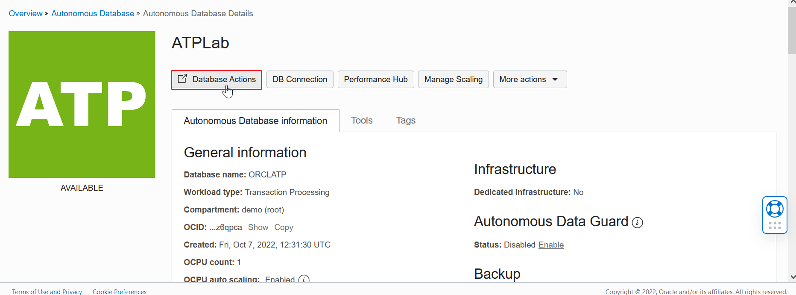

3.  If prompted, provide the **Username - ADMIN** and click **Next**. Then provide the password for your ADMIN user and click **Sign in**.

    

    

4. From the Database Actions menu, click **SQL**. The SQL worksheet opens.

    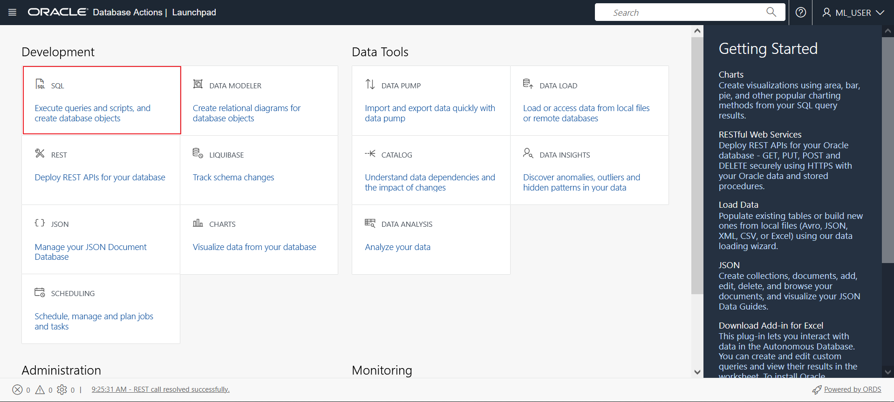

    

5. With the ADMIN userid in ATP Database Actions, create a credential to copy your ADW wallet from Object Storage to the DATA\_PUMP\_DIR which we will use later. Specify the credentials:

    - Username: The username will be the OCI Username you noted earlier (which is not the same as your database username).
    - Password: The password will be the OCI Object Store Auth Token you just generated.

    ````
    <copy>
    BEGIN
      DBMS_CLOUD.CREATE_CREDENTIAL(
        credential_name => 'adwc_token',
        username => '&lt your cloud username &gt',
        password => '&lt generated auth token &gt'
      );
    END;
    /
    </copy>
    ````

    

6.  Create another credential for the ADW database. For the **Username - ADMIN**, create a **Password**. This is your database ADMIN userid and password. This will be used in the following steps.

    ````
    <copy>
    BEGIN
      DBMS_CLOUD.CREATE_CREDENTIAL(
        credential_name => 'adw_db',
        username => 'ADMIN',
        password => '&lt;password&gt;'
      );
    END;
    /
    </copy>
    ````

    

7.  Run this code snippet by replacing the **object\_uri** with the **URL Path** you copied earlier. This copies the wallet path to the ATP's DATA\_PUMP\_DIR. When we create the database link in the next steps, this wallet is required.

    ````
    <copy>
    BEGIN
        DBMS_CLOUD.GET_OBJECT(
            credential_name => 'adwc_token',
            object_uri => '&lt;your object file URI&gt;',
            directory_name => 'DATA_PUMP_DIR');
    END;
    /
    </copy>
    ````

    

8.  From the downloaded ADW zip wallet file, make note of the following values from the `tnsnames.ora` file to a notepad which will be needed in this step. (It is recommended to use notepad if there is no application supported to open the file.)
    - hostname
    - service\_name
    - ssl\_server\_cert\_dn

    

9.  Specify the **hostname**, **service_name** and **ssl\_server\_cert\_dn** values you noted earlier, to create a database link. This allows you to copy data from ADW to ATP (in fact, bi-directional).

    ````
    <copy>
    BEGIN
        DBMS_CLOUD_ADMIN.CREATE_DATABASE_LINK(
              db_link_name => 'adwlink',
              hostname => '&lt;your ADW host&gt;',
              port => '1522',
              service_name => '&lt;your service name&gt;',
              ssl_server_cert_dn => '&lt;your cert&gt;',
              credential_name => 'adw_db',
              directory_name => 'DATA_PUMP_DIR');
    END;
    /
    </copy>
    ````

    

10. Test the database link by retrieving the date from the remote ADW instance.

    ````
    <copy>
    select sysdate from dual@adwlink;
    </copy>
    ````

    

## Task 6: Copy Tables from ADW to ATP

1.  First, copy the credit\_scoring\_100k table into ML\_USER in ATP. Normally, this table would already exist in the production system. We could have loaded this table to ATP in Lab 1 when we loaded the table into ADW. But, since we were going to create this database link, we can just copy it from ADW. Run the following statement to copy credit\_scoring\_100k table into ML\_USER in ATP.

    ````
    <copy>
    create table ml_user.credit_scoring_100k as select * from ml_user.credit_scoring_100k@adwlink;
    </copy>
    ````

    

2.  We also need to copy the machine learning model, which is in the temp table (blob). To copy the temp table run the following statement.

    ````
    <copy>
    create table ml_user.temp as select * from ml_user.temp@adwlink;
    </copy>
    ````

    

## Task 7: Import the Machine Learning Model

1.  Copy the Database Actions SQL worksheet URL from the browser and paste it in another tab. Change the user in the Database Actions URL from ADMIN to **ml\_user** and press enter to log in as ML\_USER. Copy the URL to a notepad - you will need it later.

    

    

2.  Log in as ML\_USER, enter **Username - ML\_USER** and **Password** you created for the ATP instance.

    

3. Dismiss the Help by clicking on the X in the popup.

    

4.  Import your model and ignore the error message.

    ````
    <copy>
    DECLARE
    v_blob blob;
    BEGIN
    dbms_lob.createtemporary(v_blob, FALSE);
      select my_model into v_blob from temp;
    dbms_data_mining.import_sermodel(v_blob, 'N1_CLASS_MODEL');
    dbms_lob.freetemporary(v_blob);
    END;
    /
    </copy>
    ````

    

5.  Confirm the machine learning model was imported by running the following code.

    ````
    <copy>
    select * from user_mining_models;
    </copy>
    ````

    

6.  Test the model by running a prediction query.

    ````
    <copy>
    select prediction(N1_CLASS_MODEL USING 'Rich' as WEALTH, 2000 as income, 'Silver' as customer_value_segment) credit_prediction
    from dual;
    </copy>
    ````

    

7.  To make the model prediction available to all applications we will use the Oracle Database's virtual column feature. We will add two new virtual columns - the prediction itself, and the probability that the prediction is correct. *TIP: You can also create a function index in the machine learning columns (not included here)*. If you wish to use a function index the table must be analyzed to be used in queries. For more information, see ["When to Use Function-Based Indexes"](https://docs.oracle.com/en/database/oracle/oracle-database/21/adfns/indexes.html#GUID-44AD4D28-A056-4977-B2F7-AC1BC50EDC87).

    ````
    <copy>
    alter table credit_scoring_100k add(
    likely_good_credit_pcnt AS (round((100*(prediction_probability(n1_class_model, 'Good Credit' USING
        wealth
      , customer_dmg_segment
      , income
      , highest_credit_card_limit
      , residental_status
      , max_cc_spent_amount_prev
      , max_cc_spent_amount
      , occupation
      , delinquency_status
      , customer_value_segment
      , residental_status))),1))
    , credit_prediction AS (prediction(n1_class_model USING   
      wealth
      , customer_dmg_segment
      , income
      , highest_credit_card_limit
      , residental_status
      , max_cc_spent_amount_prev
      , max_cc_spent_amount
      , occupation
      , delinquency_status
      , customer_value_segment
      , residental_status))
    );
    </copy>
    ````

    

8.  Select some data to view predictions.

    ````
    <copy>
    select customer_id, wealth, income, credit_prediction, likely_good_credit_pcnt from credit_scoring_100k;
    </copy>
    ````

    

[Please proceed to the next lab](#next).

## Acknowledgements

- **Author** - Derrick Cameron
- **Contributors** - Anoosha Pilli, Peter Jeffcock, Arabella Yao, Ayden Smith, Jeffrey Malcolm Jr; Mark Hornick, Sr. Director, Data Science and Oracle Machine Learning Product Management; Sherry LaMonica, Consulting Member of Technical Staff, Machine Learning; Marcos Arancibia, Senior Principal Product Manager, Machine Learning
- **Last Updated By/Date** - Sarika Surampudi, Principal User Assistance Developer, Oracle Database User Assistance Development, October 2022
