# Introduction to Oracle Machine Learning for R

## Introduction

In this lab, you will use OML4R to create a proxy object, explore and prepare data, build and evaluate models, and use those models to score data. You will use a notebook containing a classification example, available in OML Notebooks. For illustrative purposes, Step 1 and Step 2 of this lab use the iris data set to create a database table. The rest of the steps take you through the example that uses the SH schema and is available in OML Notebooks. In Oracle Autonomous Database (ADB), the SH schema and associated data sets are easily accessible.

Estimated Lab Time: 30 minutes

### About Oracle Machine Learning for R (OML4R)

Oracle Machine Learning for R (OML4R) is a component of Oracle Autonomous Database (ADB), which includes Oracle Autonomous Data Warehouse (ADW), Oracle Autonomous Transaction Processing (ATP), and Oracle Autonomous JSON Database (AJD). OML4R is also included with on-premises Oracle Database licenses and Database Cloud Service with separate installations. Oracle Machine Learning empowers data scientists with open-source R by leveraging the database as a high-performance computing environment. Database tables and views are accessed through data.frame proxy objects with overloaded functionality that produces SQL, transparently behind the scenes. The in-database machine learning algorithms are exposed through a native R API and produce the same first-class, in-database machine learning models as the OML4SQL API.
You can also create user-defined R functions and manage them in the database, and store and manage R objects, like R machine learning models, directly in the database, avoiding the need to manage flat files. Further, with embedded R execution, you can call user-defined R functions from SQL, and on Autonomous Database, from REST endpoints for production deployment on R engines spawned and managed by the database environment. Embedded R execution also has system-provided data-parallel and task-parallel invocation of these user-defined functions. For example, an open-source model can be scaled to large volumes of data for making predictions by requesting that multiple engines be spawned to process chunks of data in parallel. OML provides the supporting infrastructure to simplify and automate this process.

### Objectives

In this lab, you will learn how to:

* Create a temporary table using the `ore.push` function
* Create a persistent table using the `ore.create` function
* Create a proxy object from a table
* Explore the data
* Prepare the data
* Build your model
* Evaluate your model using standard classification metrics
* Score data for deployment
* Save and load R objects in a datastore instance

### Prerequisites

This lab assumes you have:

* An Oracle Machine Learning account
* Completed Lab 1: Introduction to Oracle Machine Learning Notebooks

## Task 1: Create a Database Table

With OML4R, you use proxy objects to access and manipulate data that resides in the database, e.g., an R data.frame proxy object (`ore.frame`) maps to a database table or view.  OML4R uses these proxy objects and transparently translates many standard R functions into SQL.

In this step, the `iris` data set is used for illustrative purposes to create a temporary database table. Such temporary tables are automatically deleted when the connection to a database ends, unless you have created a persistent database table from it (which we will discuss on Task 2), or have saved its proxy object to a datastore (which we will discuss in Task 10), before disconnecting the session (or closing the Notebook).

1. To use OML4R, you must first import the `ORE` package. To use the overloaded `dplyr` functions (`OREdplyr`) they also must be explicitly loaded. Run the following scripts to import the `ORE`, `OREdplyr` packages, and set the display options:

	```r
	<copy>
	%r

	library(ORE)
	library(OREdplyr)
	options(ore.warn.order=FALSE)
	options(width = 200)

	</copy>
	```

2. Use the `ore.push()` function to load an R data.frame object to the database, which creates a temporary table  and returns a proxy object, assigned to the variable `IRIS_TMP`.

	```r
	<copy>
	%r

	IRIS_TMP <- ore.push(iris)
	z.show(head(IRIS_TMP,7))
	</copy>
	```

	You use the zeppelin-context `z.show` function to display R objects and proxy object content. By using `z.show`, users can also work with the native Zeppelin visualization options. Here, you display the first few rows of `IRIS_TMP` using `z.show()`.

	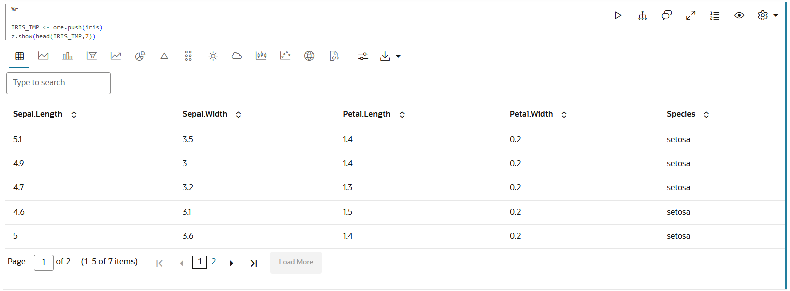

## Task 2: Create a Persistent Database Table

You can also create a persistent table using the `ore.create` function and specify a table name, `IRIS`. The `ore.create()` function creates a table in the database schema. This table is then accessible both within OML4R and directly from SQL. Use the `z.show` function to display the desired data in the notebook to take advantage of native Zeppelin visualization options, or simply access IRIS for a native R view of the tabular data.

1. To create the persistent table IRIS, run the following script.

	```r
	<copy>
	%r

	ore.create(iris, table = "IRIS")
	cat("\nColumns: ", colnames(IRIS))

	cat("\nShape: ", dim(IRIS))
	z.show(IRIS)
	</copy>
	```

	The output is:

	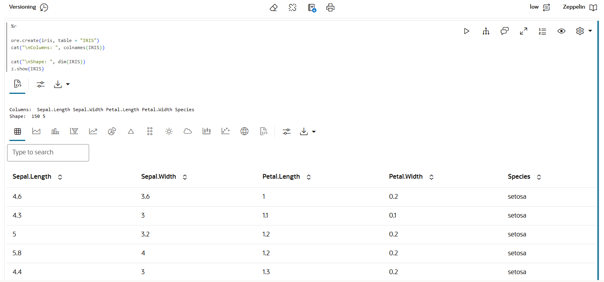

## Task 3: Create a Proxy Object for a Database Object

Use the `ore.sync()` function to create an `ore.frame` object named `DEMO` as a proxy for a database table or view.

1. The argument query uses an optional named character vector specifying queries to use for `ore.frame` object creation.

	```r
	<copy>
	%r

	ore.sync(query = c("DEMO" = "select * from SH.SUPPLEMENTARY_DEMOGRAPHICS"))
	ore.attach()

	z.show(head(DEMO))
	</copy>
	```

	In this step, you are viewing a few rows from the `SUPPLEMENTARY_DEMOGRAPHICS` table using the overloaded `head()` function.

	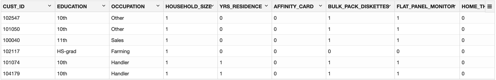

## Task 4: Explore the Data

In this example, use `dim()`, `summary()` and `crosstab()` functions to explore and view the data.

1. Use the `dim()` function to view the rows and columns of an `ore.frame`.

	```
	<copy>
	%r

	cat("\nShape: ", dim(DEMO))
	</copy>
	```
The output:

	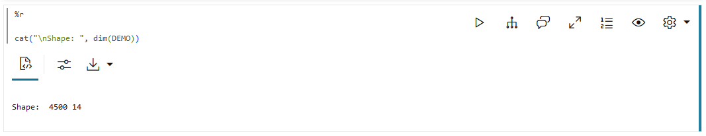

	

2. Use the `summary()` function to calculate descriptive statistics that summarize the central tendency, and dispersion of the DEMO table in each numeric column and the length, class, and mode for the character column.

	```r
	<copy>
	%r

	summary(DEMO)
	</copy>
	```

	The output is:

	```r

		CUST_ID        EDUCATION              OCCUPATION          
	Min.   :100001   Length:4500            Length:4500          
	1st Qu.:101126   Class :ore.character   Class :ore.character
	Median :102250   Mode  :character       Mode  :character     
	Mean   :102250                                               
	3rd Qu.:103375                                               
	Max.   :104500                                               
	HOUSEHOLD_SIZE         YRS_RESIDENCE    AFFINITY_CARD    BULK_PACK_DISKETTES
	Length:4500            Min.   : 0.000   Min.   :0.0000   Min.   :0.0000    
	Class :ore.character   1st Qu.: 3.000   1st Qu.:0.0000   1st Qu.:0.0000    
	Mode  :character       Median : 4.000   Median :0.0000   Median :1.0000    
												Mean   : 4.022   Mean   :0.2382   Mean   :0.6373    
												3rd Qu.: 5.000   3rd Qu.:0.0000   3rd Qu.:1.0000    
												Max.   :14.000   Max.   :1.0000   Max.   :1.0000    
	FLAT_PANEL_MONITOR HOME_THEATER_PACKAGE BOOKKEEPING_APPLICATION
	Min.   :0.0000     Min.   :0.0000       Min.   :0.0000        
	1st Qu.:0.0000     1st Qu.:0.0000       1st Qu.:1.0000        
	Median :1.0000     Median :1.0000       Median :1.0000        
	Mean   :0.5771     Mean   :0.5642       Mean   :0.8851        
	3rd Qu.:1.0000     3rd Qu.:1.0000       3rd Qu.:1.0000        
	Max.   :1.0000     Max.   :1.0000       Max.   :1.0000        
	PRINTER_SUPPLIES  Y_BOX_GAMES     OS_DOC_SET_KANJI     COMMENTS           
	Min.   :1        Min.   :0.0000   Min.   :0.000000   Length:4500          
	1st Qu.:1        1st Qu.:0.0000   1st Qu.:0.000000   Class :ore.character
	Median :1        Median :0.0000   Median :0.000000   Mode  :character     
	Mean   :1        Mean   :0.3124   Mean   :0.002444                        
	3rd Qu.:1        3rd Qu.:1.0000   3rd Qu.:0.000000                        
	Max.   :1        Max.   :1.0000   Max.   :1.000000

	```
	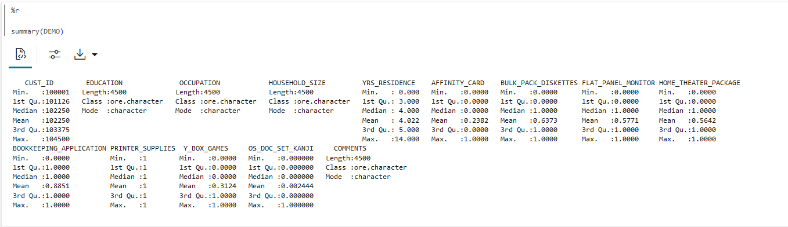


3. Use the `crosstab()` function to perform a cross-column analysis of an `ore.frame` object in the database. The `crosstab()` function computes a cross-tabulation of two or more columns. By default, it computes a frequency table for the columns unless a column and an aggregation function have been passed to it.

	In this example, the `crosstab()` function displays the distribution of `AFFINITY_CARD` responders. 


	```r
	<copy>
	%r

	z.show(ore.crosstab(~AFFINITY_CARD,DEMO))
	</copy>
	```

	Click on the Bar chart. Then click on the settings icon . In the **Series to Show** field, click to select `ORE.FREQ`. In the Group By field, click to select  `AFFINITY_CARDS`.

	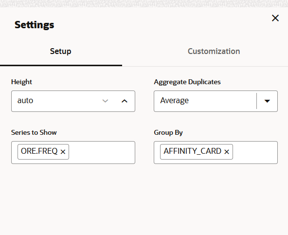

	The output is similar to the following using the bar chart visualization in the Zeppelin notebook:

	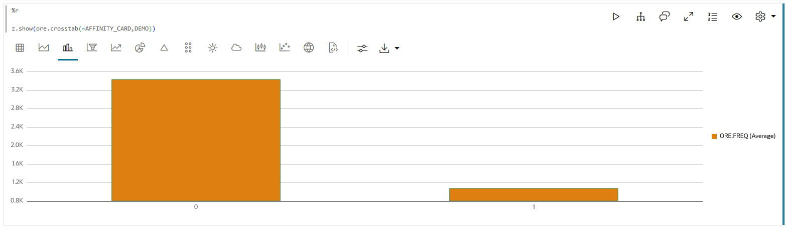

4. Run the following script to view the distribution of `HOUSEHOLD_SIZE` according to `AFFINITY_CARD` responders. Click on the Bar chart, then click on settings. Drag the fields to titles as `HOUSEHOLD_SIZE` to keys, `AFFINITY_CARDS`  to groups, and `ORE.FREQ` to values. The fields will automatically change to `ORE.FREQ` SUM. Click on Stacked to get the required view.

	```r
	<copy>
	%r

	z.show(ore.crosstab(AFFINITY_CARD~HOUSEHOLD_SIZE,DEMO))
	</copy>
	```

	The output is:

	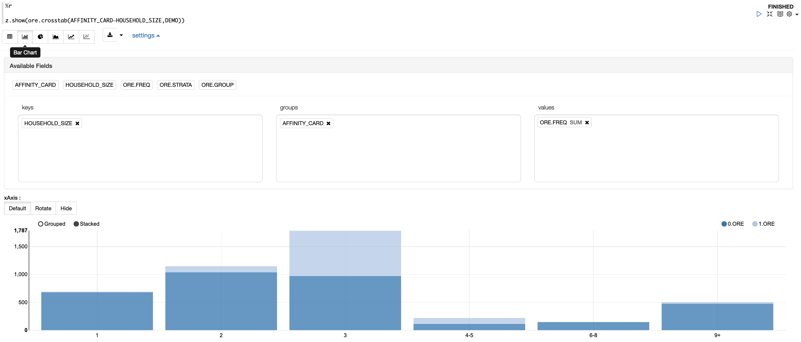

## Task 5: Prepare the Data

In this step, you will create a proxy object DEMO2 by selecting columns from the DEMO proxy object.  After selecting columns of interest, display a few rows of the DEMO2 `ore.frame` and split your data into TRAIN and TEST sets.

1. Use the DEMO proxy object to create a new proxy object DEMO2 by selecting the necessary columns. Run the following script:

	```r
	<copy>
	%r

	DEMO2 <- DEMO[,c("CUST_ID", 'AFFINITY_CARD',
					 "BOOKKEEPING_APPLICATION", "BULK_PACK_DISKETTES",
					 "EDUCATION","FLAT_PANEL_MONITOR", "HOME_THEATER_PACKAGE",
					 "HOUSEHOLD_SIZE", "OCCUPATION", "OS_DOC_SET_KANJI",
					 "PRINTER_SUPPLIES", "YRS_RESIDENCE", "Y_BOX_GAMES")]
	</copy>
	```

2. Run the following script to display the first few records of DEMO2:

	```r
	<copy>
	%r

	z.show(DEMO2)
	</copy>
	```

	The output is:

	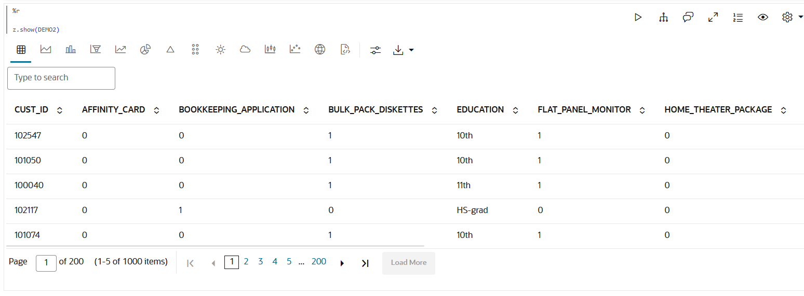

3. In this example, you are splitting the DEMO2 data with 60 percent of the records for the TRAIN data set and 40 percent for the TEST data set. The `sample()` function gives a simple random sample of elements. Here, the `sample()` function produces the sampled set of indices to identify the records for the training data set within the variable index.  Use the `setdiff` function to create the test data set as the complement of the training data set.

	> **_NOTE:_**  In OML4R, instead of pulling the data from the database and then sampling, you can sample directly in the database and then pull only those records that are part of the sample. By sampling in the database, you minimize data `movement` and you can work with larger data sets. Note that the ordering framework integer row indexing in the transparency layer is what enables this capability.

	```r
	<copy>
	%r

	# Set seed to ensure that this split is replicable
	set.seed(1)
	rownames(DEMO2) <- DEMO2$CUST_ID

	# The R Sample function produces a vector of random set of indices of size trainingDataSize elements
	trainingDataSize <- .6 * nrow(DEMO2)
	index <- sample(1:nrow(DEMO2),trainingDataSize)

	# Create training data set
	TRAIN <- DEMO2[index,]

	# Create test data set
	# setdiff is a set that contains the elements of first element such that they are not present in the second element.
	TEST <- DEMO2[setdiff(1:nrow(DEMO2),index),]

	class(TRAIN)
	cat("\nTraining data: ")
	dim(TRAIN)

	class(TEST)
	cat("\nTest data: ")
	dim(TEST)
	</copy>
	```

	The output is:

	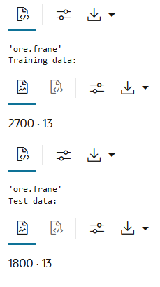


	```r
	'ore.frame' Training data:
	2700.  13
	'ore.frame' Test data:
	1800.  13
	```

Since we’ll be using automatic data preparation provided by the in-database algorithms, no further data preparation is required.

## Task 6: Build Your Model

Use the `ore.odmDT` function to build a Decision Tree model. You can build a model with default settings or specify custom model settings.

1. Run the following script to build a Decision Tree model with the default settings and the `TRAIN` dataset as input data, with `AFFINITY_CARD` as target, and a persistent model name of `"DT_CLASS_MODEL"`..

	```r
	<copy>
	%r

	dt_mod <- ore.odmDT(AFFINITY_CARD~.,
	                    TRAIN,
						odm.settings= list(model_name="DT_CLAS_MODEL"))
	</copy>
	```

	The `ore.odmDT()` function uses the in-database Decision Tree algorithm for classification and the model proxy object `dt_mod` is created. The first parameter of the `ore.odmDT()` function is an object of class formula with a symbolic description of the model to be fitted. The tilde operator (~) is used to specify the relationship between dependent variables present on the left side of the operator and independent variables present on the right side of the operator.

2. Run the following script for model details available through the decision tree model object, like the number of nodes, row count, split, settings, etc.

	```r
	<copy>
	%r

	dt_mod
	</copy>
	```

	The output is:

	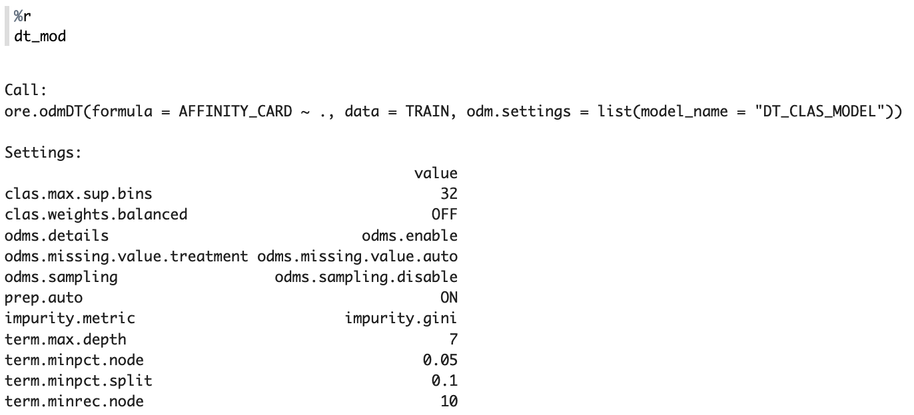

3. Run the following script to specify model settings and build a Decision Tree model:

	```r
	<copy>
	%r

	settings = list(model_name="DT_CLAS_MODEL")

	dt_mod <- ore.odmDT(AFFINITY_CARD~.,
						TRAIN,
						auto.data.prep = TRUE,
						cost.matrix = NULL,
						impurity.metric = "gini",
						max.depth = 7,
						min.pct.node = 0.05,
						min.pct.split = 0.1,
						min.rec.node = 10,
						min.rec.split = 20,
						na.action = na.pass,
						odm.settings= settings)
	</copy>
	```

	The following is the list of model settings that are applied in the example:

	* `auto.data.prep`: A logical value that specifies whether to use automatic data preparation for model building.
	* `impurity.metric`: Specifies tree impurity metric for a Decision Tree model. Tree algorithms seek the best column/attribute and values for splitting data at each node. The best splitter and split value are those that result in the largest increase in target value homogeneity (purity) for the entities in the node. Purity in the decision trees algorithm can use either gini or entropy  as the purity metric. By default, the algorithm uses gini.
	* `max.depth`: Specifies the criteria for splits: maximum tree depth (the maximum number of nodes between the root and any leaf node, including the leaf node). The default is 7.
	* `min.pct.node`: Specifies the minimum number of training rows in a node expressed as a percentage of the rows in the training data. The default value is 0.05, indicating 0.05%.
	* `min.pct.split`: Specifies the minimum number of rows required to consider splitting a node expressed as a percentage of the training rows. The default value is 0.1, indicating 0.1%.
	* `min.rec.node`: Specifies the minimum number of rows in a node. The default value is 10.
	* `min.rec.split`: Specifies the criteria for splits: minimum number of records in a parent node expressed as a value. No split is attempted if the number of records is below this value. The default value is 20.
	* `odm.settings` : See step 7 where it has been discussed in detail.

To get a complete list of information on the parameters available for the R interface to the in-database Decision Tree algorithm run the script below. Refer to [shared settings](https://docs.oracle.com/en/database/oracle/machine-learning/oml4r/2.0.0/oreug/oml4r-classes-that-provide-access-database-ml-algorithm1.html#GUID-42BDAC50-3951-48A0-A26D-693D5407DD44) for a full list of settings available to the other in-database algorithms.


```r
<copy>
%r

help(ore.odmDT)
</copy>
```

## Task 7: Evaluate Your Model

Evaluate the in-database model proxy object using various approaches. Make predictions on the test case using the model and then evaluate the model by using Confusion Matrix, Lift Chart, Gains Chart, and ROC curve chart.

1. Run the following script to make predictions on the test data set using the `dt_mod` model. If the parameter type is "class", the result includes the most likely target class and its probability. If the parameter type is "raw", the result includes one column for each target class and the column values reflect the probability for that class. Both can be specified together, for example, type=c("class","raw").

	```r
	<copy>
	%r

	# Gather the Predictions
	RES_DF <- predict(dt_mod, TEST, type=c("class"))
	RES_PROB <- predict(dt_mod, TEST, type=c("raw"))

	#Column bind the ore.frame objects
	RES_DF <- cbind(RES_DF,RES_PROB,TEST)
	z.show(RES_DF)
	</copy>
	```

	The output is:
	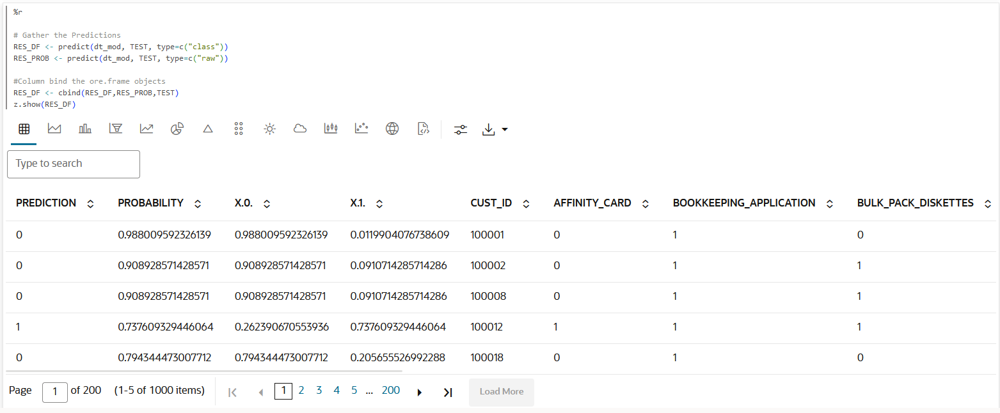

	The column "X.0." and "X.1." represent the probability of the case lying in the respective classes of AFFINITY\_CARD. Run the following script to change the column name of "X.0" to Prob\_0 and "X.1" to Prob\_1.

	```r
	<copy>
	%r

	names(RES_DF)[names(RES_DF) == "'0'"] <- "PROB_0"
	names(RES_DF)[names(RES_DF) == "'1'"] <- "PROB_1"

	z.show(head(RES_DF))
	</copy>
	```

	The output is:
	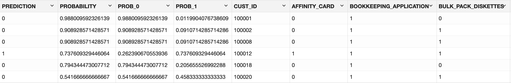

2. The Confusion Matrix displays the number and type of correct and incorrect predictions made with respect to the actual classification in the test data. It is an n-by-n matrix where n is the number of classes. Run the following script to compute the confusion matrix in the database using the proxy object:

	```r
	<copy>
	%r

	C_MATRIX <- with(RES_DF, table(AFFINITY_CARD, PREDICTION))
	C_MATRIX
	</copy>
	```

	The output is:
	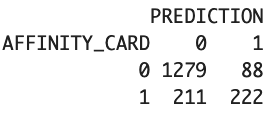

3. Evaluate your model using the ROC curve chart, Lift chart, and Distribution chart. The ROC curve also applies to binary classification and requires the designation of the positive class. These are metrics for comparing predicted and actual target values in a classification model. A lift chart also applies to binary classifications requiring the designation of the positive class. It measures the degree to which the predictions of a classification model are better than randomly generated predictions. The distribution chart here is a density plot of the predicted responders vs. the predicted non-responders. A density plot is a distribution of a numeric variable and gives an idea of the shape, number of peaks, skewness, etc. Here is a custom script to generate the metrics and charts as described above. Run the script below:

	```r
	<copy>
	%r

	# BAR PLOT
	res <- ore.pull(RES_DF)
	sensitivity <- res[order(res$"PROB_1",decreasing = TRUE), ]
	sens <- sum(sensitivity$"PROB_0")/sum(sensitivity$"PROB_0") - cumsum(sensitivity$"PROB_0")/sum(sensitivity$"PROB_0")
	spec <- cumsum(sensitivity$"PROB_1")/sum(sensitivity$"PROB_1")

	# LIFT CHART
	decile2 <- quantile(sensitivity$"PROB_1", probs = seq(.1, .9, by = .1))
	df_sens <- as.data.frame(sensitivity$"PROB_1", col.names = c("sens"))
	df_sens$decile = as.numeric(cut(1-cumsum(df_sens$sens), breaks=10))

	# DISTRIBUTION CHART
	dx <- density(res$"PROB_0")
	dx2 <- density(res$"PROB_1")

	# PLOTS 3 in 1 , with specific width and height
	par(mfrow=c(1,3))
	options(repr.plot.width=8, repr.plot.height=3)

	plot(1 - spec, sens, type = "l",
	     col = "darkred", ylab = "Sensitivity",
		 xlab = "1 - Specificity", main = 'ROC Curve')
    abline(c(0,0),c(1,1))
	text(0.6, 0.2,
	     paste(" AUC = ",
		 	   round(sum(spec*diff(c(0, 1 - sens))),3)))

	barplot(table(df_sens$decile),
	        xlab = 'Decile', ylab = 'Actual Targets',
			main = 'Lift Chart', col = "darkred")

	par(mar = c(6, 4, 4, 2))
	plot(dx, lwd = 2, col = "darkgreen",
         main = "Probability Densities")
	lines(dx2, lwd = 2, col = "darkred")
	legend(x = "bottom", legend = c("Negative","Positive"),
           col = c("darkred","darkgreen"),
           lwd = 1,bty = "n",
           xpd = TRUE,inset = c(0, -0.36),
           horiz = TRUE)  
	</copy>
	```

	The output is:

	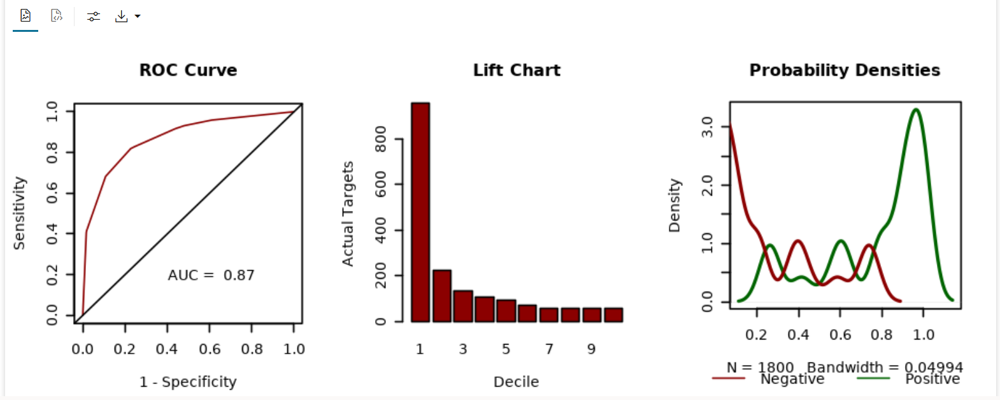

## Task 8: Score Data for Deployment Using Your Model

Having built and evaluated the model, you will now filter the `ore.frame` using R syntax. Such results can be computed in batch and materialized as a table for static lookup by applications and dashboards or results can be computed dynamically using in-database models using OML4R functions or SQL queries.

1. Run the following script to display the results of customers responding to the affinity card campaign with a probability greater than 0.5.

	```r
	<copy>
	%r

	z.show(RES_DF[RES_DF$PROB_1 > 0.5, ])
	</copy>
	```

	The output is:
	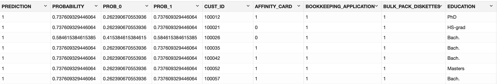

2. Use the confusion matrix to get the model accuracy computed on the TEST data provided.

	```r
	<copy>
	%r

	ACCURACY <- C_MATRIX/sum(C_MATRIX)
	round(sum(diag(ACCURACY)),3)
	</copy>
	```
	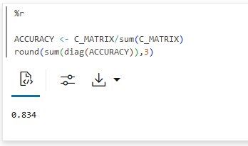

	You obtain an accuracy of 0.834 or approximately 83.4% of the result are correctly predicted.

## Task 9: Using the SQL Interface to Score Data and Display Prediction Details

You can score data and make similar predictions using the SQL interface. The test data is materialized into `DT_TEST_TABLE` so that you can query it using SQL. The `ore.create()` function also materializes the contents of an Oracle Machine Learning proxy object (a view, a table, and so on) to a database table in the user’s schema.

1. Run the following command to create a table `DT_TEST_TABLE` for use in SQL query:

	```r
	<copy>
	%r

	tryCatch({ore.drop(table="DT_TEST_TABLE")})
	ore.create(DEMO2, table ="DT_TEST_TABLE")

	</copy>
	```

2. Run the following SQL command to score and display the prediction details. The `prediction` and `prediction_details` functions apply the decision tree classification model that we created above named `DT_CLAS_MODEL` to the data from the table `DT_TEST_TABLE`.

   The function `prediction_details()` returns prediction details for each row in the selection. The return value is an XML string that ranks the predictors according to their impact on the individual record prediction, providing the attribute name, value, and weight. The XMLTable maps the result of an XQuery evaluation into relational rows and columns. The XMLTYPE column of the OUT.PD table is passed as an input to the XMLTABLE function with the appropriate path as `/Details/Attribute[1]`, `/Details/Attribute[2]` and `/Details/Attribute[3]`.

   The query includes information about the predictors that have the greatest influence on the prediction. For more information on XMLTable see [XMLTable](https://docs.oracle.com/en/database/oracle/oracle-database/19/sqlrf/XMLTABLE.html#GUID-C4A32C58-33E5-4CF1-A1FE-039550D3ECFA).

	```sql
	<copy>
	%sql

	SELECT CUST_ID,
			round(PREDICTION_AFFINITY_CARD,3) PRED_AFFINITY_CARD,
			RTRIM(TRIM(SUBSTR(OUTPRED."Attribute1",17,100)),
			      'rank="1"/>') FIRST_ATTRIBUTE,
			RTRIM(TRIM(SUBSTR(OUTPRED."Attribute2",17,100)),
			      'rank="2"/>') SECOND_ATTRIBUTE,
			RTRIM(TRIM(SUBSTR(OUTPRED."Attribute3",17,100)),
			      'rank="3"/>') THIRD_ATTRIBUTE
	FROM (SELECT CUST_ID,
				 PREDICTION(DT_CLAS_MODEL USING *) PREDICTION_AFFINITY_CARD,
				 PREDICTION_DETAILS(DT_CLAS_MODEL USING *) PD
		  FROM DT_TEST_TABLE
		  ORDER BY CUST_ID) OUT,
		  XMLTABLE('/Details'
					PASSING OUT.PD
					COLUMNS
					"Attribute1" XMLType PATH 'Attribute[1]',
					"Attribute2" XMLType PATH 'Attribute[2]',
					"Attribute3" XMLType PATH 'Attribute[3]') OUTPRED
	</copy>
	```

	The output is:

	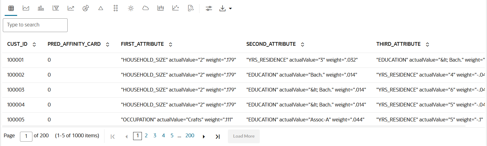

## Task 10: Saving and Loading R Objects in a Datastore Instance

You can save the R objects you create in one R session and load them in another session using the OML4R datastore. R objects and OML4R proxy objects exist only during the current R session unless they are saved to a datastore. OML4R creates the datastore in the current user’s database schema. Until you delete the datastore or the individual objects in a datastore, they remain in the database.

OML4R provides functions for managing the objects in the datastore, such as `ore.save()`, `ore.load()`, `ore.datastore()`, and others.

1. To save one or more R objects to a datastore, use the `ore.save()` function. Here the `ore.frame()` object is stored to `ds_rdata` and the R model object is stored to `ds_rmodel`.

  - To save `IRIS` and the `RES_DF` ore.frame proxy object to the `ds_rdata` datastore, run the script below. Use the `ore.sync()` function to create an R object as a proxy for the `IRIS` table (created in Task 2).

  You can give it some descriptive text using the description argumentto the function `ore.save()`, which will appear when you get information on the datastore.

	```r
	<copy>
	%r

	IRIS_TMP <- ore.sync(table='IRIS')

	ore.save(IRIS_TMP, RES_DF,
	         name="ds_rdata",
	         overwrite=TRUE,
			 description="r datasets")
	</copy>
	```

  - Run the script below to save the `dt_mod` model proxy object created above to the `ds_rmodel` datastore. When the grantable boolean argument is set to TRUE (grantable=TRUE), other users can be granted the read privilege on the object. Argument grantable is ignored when used with argument overwrite or append.

	> **_NOTE:_**  Multiple objects can be stored in the same named datastore simply by providing them as leading arguments to `ore.save()` function.

	```r
	<copy>
	%r

	ore.save(dt_mod,
	         name = 'ds_rmodel',
			 description = 'r model',  
			 grantable= TRUE)
	</copy>
	```

  - The `ore.datastore()` function returns a list of existing datastores that are available to you. Run the script below to get the list.

	```r
	<copy>
	%r

	z.show(ore.datastore())
	</copy>
	```

	The output is:

	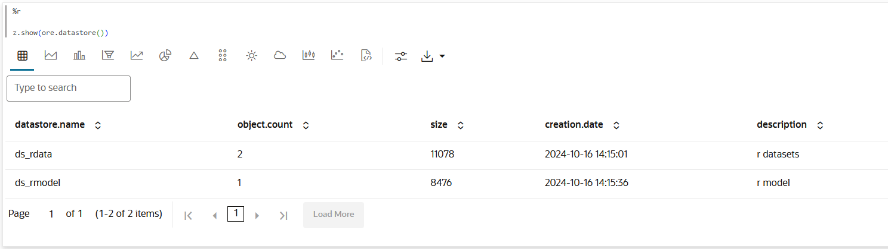

	The output also includes the size in bytes consumed, the date, and the descriptive text provided by the user when loading the R objects into the datastore.

  - The `ore.datastoreSummary()` function returns information about the R objects saved within a datastore in the user schema in the connected database. The function returns a data.frame with columns that correspond to object name, object class, object size, and either the length of the object, if it is a vector, or the number of rows and columns, if it is a data.frame object. It takes one required argument, the name of a datastore, and has an optional argument, the owner of the datastore.

	```r
	<copy>
	%r

	z.show(ore.datastoreSummary("ds_rdata"))
	</copy>
	```

	The output is:
	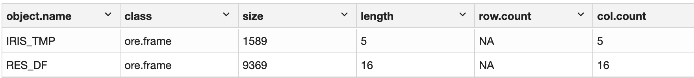

2. In this step, you will use the `ore.load` function for loading one or more R objects from the datastore to the current workspace.

  - Run the following script to load all the R objects of our datastore into the global environment :

	```r
	<copy>
	%r

	z.show(ore.load(name="ds_rdata"))
	</copy>
	```

	The output is:
	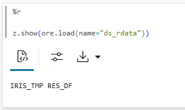

  - Run the following script to load a specific named R object, `IRIS_TMP` from the datastore to the current workspace. Also, confirm if the R object IRIS_TMP is loaded or not in the current workspace.

	```r
	<copy>
	%r

	ore.load(name="ds_rdata", list=c("IRIS_TMP"))
	'IRIS_TMP' %in% ls()
	</copy>
	```

	The output is:

	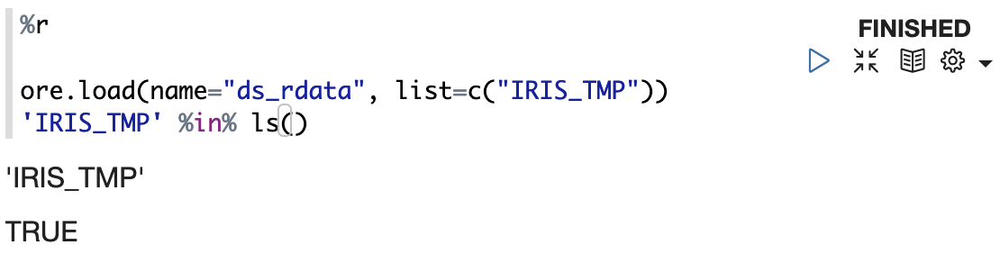

  - Run the following script to load the named R object from the datastore to the current workspace.

	```r
	<copy>
	%r

	ore.load(name="ds_rmodel")
	</copy>
	```

	The output is:
	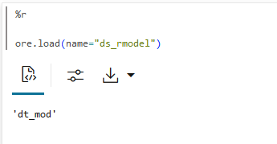

To learn more about how to use datastores to store R objects click this [link](https://docs.oracle.com/en/database/oracle/machine-learning/oml4r/2.0.0/oreug/get-started-oracle-machine-learning-r1.html#GUID-A3773AC1-2C23-445C-91C1-6FBC745CCE94).

## Task 11: Run the R UDF using embedded R execution

In this step, you will create a user-defined function (UDF) `buildLM.1` using the IRIS dataset that builds and returns a regression model using the R open source linear regression function `lm`.

You will save the model in a variable `regr` to a datastore named `dsname`. The UDF `buildLM.1` is run using the `ore.tableApply()` function, which dynamically spawns an R engine, loads the UDF, loads the data into the first argument (dat), runs the UDF, and terminates the R engine.

For more information on managing scripts see [manage script](https://docs.oracle.com/en/database/oracle/machine-learning/oml4r/2.0.0/oreug/use-oracle-r-enterprise-embedded-r-execution.html#GUID-168AECD0-B961-4913-AEC6-2BEC28039334).  On the SQL API for ERE see [SQL API for Embedded R Execution](https://docs.oracle.com/en/database/oracle/machine-learning/oml4r/2.0.0/oreug/use-oracle-r-enterprise-embedded-r-execution.html#GUID-E4A808B3-7844-4B6E-BBC0-FBFD170831EF) with Autonomous Database, and for the REST API see [REST API for Embedded R Execution](https://docs.oracle.com/en/database/oracle/machine-learning/oml4r/2.0.0/mlere/index.html).

```r
<copy>
%r

buildLM.1 <- function(dat,dsname){
  library(lattice)

  regr <- lm(Petal.Length~Petal.Width, dat)

  x <- dat[['Petal.Width']]
  y <- dat[['Petal.Length']]

  xyplot(y~x,
         xlab = "Petal Width",
         ylab = "Petal Length",
         panel = function(x,y) {
                 panel.dotplot(x,y)
                 panel.abline(lm(y ~ x))},
         xlim=c(0,2.7),
         ylim=c(0,7.5),
         main="Prediction of Petal Length")

  ore.save(regr,
           name=dsname,
		   overwrite=TRUE)

  return(as.data.frame(regr$coef))
}

res <- ore.tableApply(IRIS,
                      buildLM.1,
                      dsname = 'ds-regr-1')

cat("Type :",class(res))
cat("\n")
cat("Coefficient :",(res$coefficient))

ore.datastore("ds-regr-1")
ore.datastoreSummary("ds-regr-1")
</copy>
```

The output is:

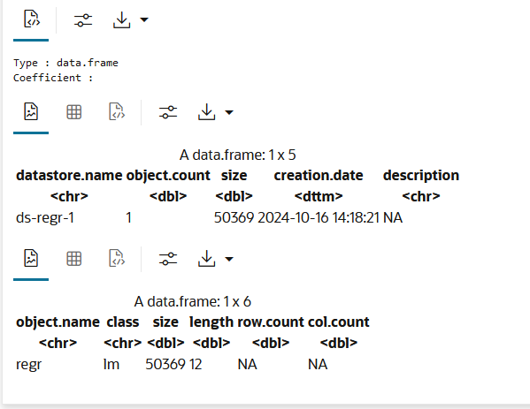


## Task 12: Building a partitioned Support Vector Machine regression model

As we have seen before in **Task 6**, the argument `odm.settings` specifies a list for the parameter setting in an algorithm build. Each list element's name and value refer to the parameters setting name and value, respectively. The setting value must be numeric or string.

Below we will show an example of building a Support Vector Machine regression model, with a function called `ore.odmSVM()`.  By default the model object will receive a system-generated random name, and the model object will be a temporary model object that would disappear once the session is disconnected or the Notebook is closed.

The usage of the parameter `model_name` can explicitly name the model and persist it in the database for later use, allowing future scoring via OML4SQL and OML4Py too.  

The parameter `odms_partitions_columns` specifies the names of the partition columns, then a partition model with a sub-model in each partition is created from the input data.

The `ore.odmSVM` function uses the in-database Support Vector Machine (SVM) algorithm.  Refer to [Specify Model Settings](https://docs.oracle.com/en/database/oracle/machine-learning/oml4r/2.0.0/oreug/oml4r-classes-that-provide-access-database-ml-algorithm1.html) in the OML4R User's Guide for detail.

```r
<copy>

INPUT <- ore.get( schema="SH", "SUPPLEMENTARY_DEMOGRAPHICS")

settings <- list(odms_partition_columns = 'HOUSEHOLD_SIZE',
                 model_name = 'SVM_PARTITIONED_REGRESSION_MODEL')

mod.svm   <- ore.odmSVM(AFFINITY_CARD~.,
                         data=INPUT,
                         type="classification",
						 kernel.function="linear",
                         odm.settings=settings)

# Print model results
mod.svm

</copy>
```
The output is: 

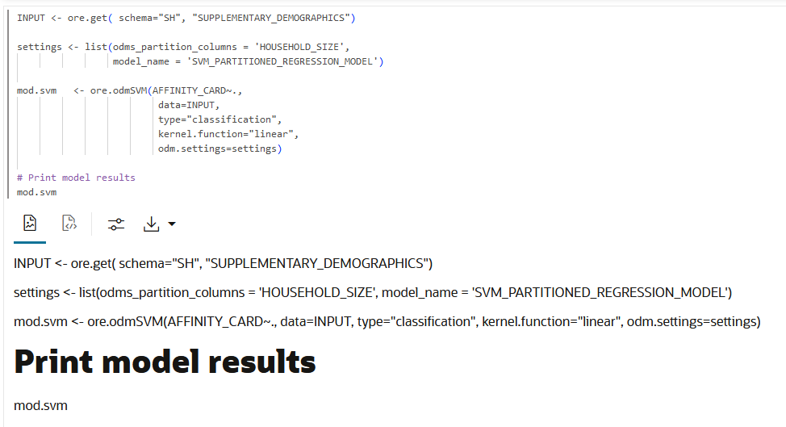


You may now **proceed to the next lab**.

## Learn More

OML4R also enables data scientists to hand off their user-defined R functions to application developers for calling from REST or SQL interfaces, where the database environment spawns and controls the R engines, loads the user-defined function, and if required, loads the specified data. This facilitates making native R machine learning models and predictions readily available for enterprise solutions as well, with the option to leverage data parallelism for greater performance and scalability. Given below are some of the functionalities that OML4R offers:

1. [Embedded R Execution](https://docs.oracle.com/en/database/oracle/machine-learning/oml4r/2.0.0/oreug/use-oracle-r-enterprise-embedded-r-execution.html#GUID-A5771EE5-AAC0-4D59-89C8-D0AE04DC0140)
OML4R Embedded R Execution provides users the ability to call user-defined R functions in one or more R engines spawned and managed by the Oracle database environment. Store and manage user-defined R functions for use in embedded execution in the R script repository in the database. These functions can then be invoked from SQL or REST APIs. For more information on SQL API for ERE see [SQL API for Embedded R Execution](https://docs.oracle.com/en/database/oracle/machine-learning/oml4r/2.0.0/oreug/use-oracle-r-enterprise-embedded-r-execution.html#GUID-E4A808B3-7844-4B6E-BBC0-FBFD170831EF) with Autonomous Database and for REST APIs see [REST API for Embedded R Execution](https://docs.oracle.com/en/database/oracle/machine-learning/oml4r/2.0.0/mlere/index.html).

2. [Data Manipulation Using OREdplyr](https://docs.oracle.com/en/database/oracle/machine-learning/oml4r/2.0.0/oreug/prepare-and-explore-data-database.html#GUID-3072812B-B1D2-4EEE-98FB-5F139D1B046D)
OREdplyr package functions implement the `dplyr` interface for use with `ore.frame` and `ore.numeric` objects.

## Acknowledgements
* **Author** - Dhanish Kumar, Member of Technical Staff, User Assistance Developer.
* **Contributors** -  Mark Hornick, Senior Director, Data Science and Machine Learning; Suresh Rajan, Senior Manager, Oracle Database User Assistance Development; Sherry LaMonica, Consulting Member of Tech Staff, Machine Learning.
* **Last Updated By/Date** - Sadhana Ashokkumar, October 2024
