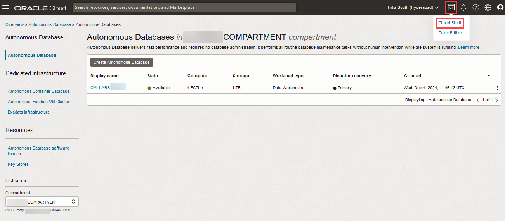
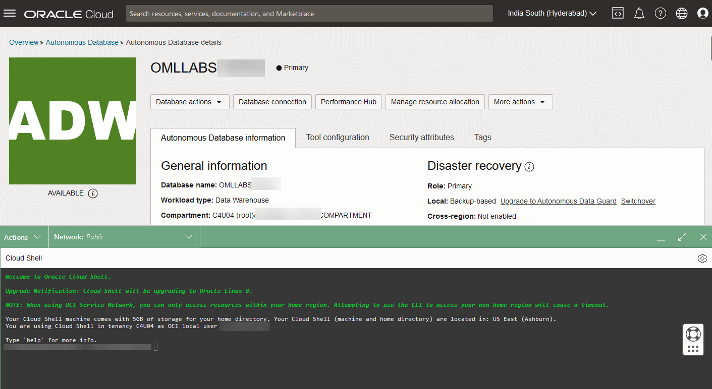
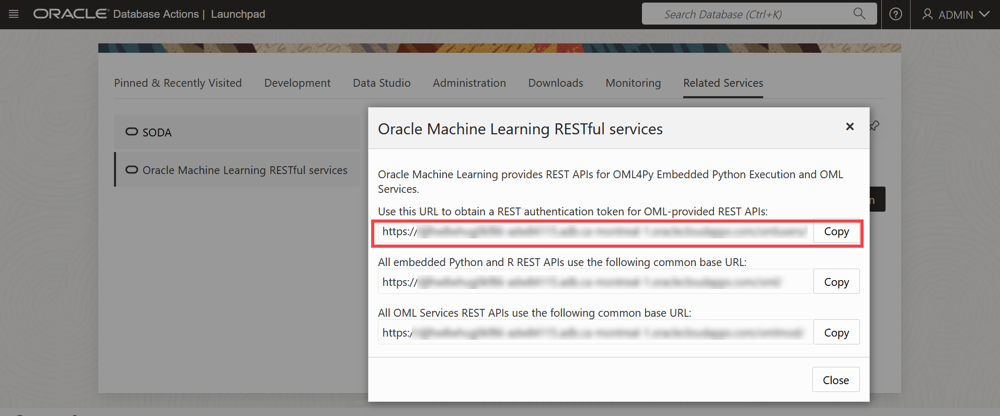

# Authenticate your OML Account with your Autonomous Database instance to use OML Services

## Introduction

In this lab, you will get a quick tour of basic OML Services features. You will learn how to obtain an authentication token for your user account to get started with OML Services.

Estimated Time: 40 minutes

### About Oracle Machine Learning Services

OML Services extends OML functionality to support model deployment and model lifecycle management for both in-database OML models and third-party Open Neural Networks Exchange (ONNX) machine learning models via REST APIs. These third-party classification, regression or clustering models can be built using tools that support the ONNX format, which includes packages like Scikit-learn and TensorFlow, among several others.

Oracle Machine Learning Services provides REST endpoints through the Oracle Autonomous Database environment. These endpoints enable the storage of machine learning models along with their metadata, the creation of scoring endpoints for the model, and producing scores using these endpoints.

### Objectives

In this lab, you will:
* Authenticate your user account with your Autonomous Database instance to use OML Services.
    * Obtain authentication token.
    * Refresh authentication token.
    * Revoke authentication token.


### Prerequisites

This lab assumes you have:
* OCI Cloud Shell, which has cURL installed by default. If you are using the Workshops tenancy, you get OCI Cloud Shell as part of the reservation. However, if you are in your own OCI tenancy or using a free trial account, ensure you have OCI Cloud Shell or install cURL for your operating system to run the OML Services commands.
* An Autonomous Database instance created in your account/tenancy if you are using your own tenancy or a free trial account. You should have handy the following information for your instance:
    * Your OML user name and password
    * `oml-cloud-service-location-url`
* Completed all previous labs successfully.

## Task 1: Authenticate Your User Account with Your Autonomous Database Instance to Use OML Services

1.  This lab uses OCI Cloud Shell. To access the OCI Cloud Shell, select your compartment and click on the Cloud Shell icon.

	 

   On clicking the Cloud Shell icon, the OCI Cloud Shell command prompt is displayed in the lower half of the console as illustrated in the image below.

  

2. To access Oracle Machine Learning Services using the REST API, you must acquire an access token. To authenticate and obtain an access token, use cURL with the ``-d`` option to pass the user name and password for your Oracle Machine Learning Services account against the Oracle Machine Learning User Management Cloud Service token service. Use the following details to get an authentication token.
    * Your OML user name
    * Your OML password
    * `oml-cloud-service-location-url`

   Here is the syntax:

     ```
     <copy>
     curl -X POST --header 'Content-Type: application/json' --header 'Accept: application/json'\
     -d '{"grant_type":"password", "username":"'${oml_username}'", "password":"'${oml_password}'"}'\
     "<oml-cloud-service-location-url>/omlusers/api/oauth2/v1/token"
     </copy>
     ```

   In the syntax above, `oml-cloud-service-location-url` is the Autonomous Database URL and points to the region where the Autonomous Database instance resides. The URL also contains the database name and tenancy ID.  

   This completes the task of authenticating your OML user account with your Autonomous Database instance to use OML Services.
   
## Task 2: Get the `oml-cloud-service-location-url` to Obtain Your REST Authentication Token

You can obtain this URL information from **Oracle Machine Learning RESTful services** on the Database Actions page. To access **Database actions** and obtain the url:

1. On your Oracle ADB instance details page, click **Database actions**  and then click **View all database actions.**

   
      
2. The Database Actions Launchpad opens in a different tab. Here, go to **Related Services** tab and then click **Oracle Machine Learning RESTful services**. The Oracle Machine Learning RESTful Services dialog opens.  

   

3. On the Oracle Machine Learning RESTful Services dialog, copy the URL for your ADB instance. Paste the URL to a text editor, such as Notepad. From the URL, remove the ``/omlusers/`` segment.

   

4. Now, go back to the Cloud Shell interface and run a command to obtain a token. First set variables for the parameters for ease of use in subsequent requests.

    ```
    <copy>export oml_username=OMLUSER
    export oml_password=AAbbcc123456
    export omlservice=<oml-cloud-service-location-url></copy>
    ```

    In the command above,

    * OMLUSER is your OML user name.
    * AAbbcc123456 is your OML password.
    * `oml-cloud-service-location-url` is the URL that you copied from the ADB console, without the /omlusers/ segment in it.

  An example of `oml-cloud-service-location-url` is https://aabbcc123456xyz-omllabs.adb.us-ashburn-1.oraclecloudapps.com. In this URL:
    * `aabbcc123456xyz` is the tenancy ID (not to be confused with the very long tenancy OCID)
    * `omllabs` is the database name, and
    * `adb.us-ashburn-1.oraclecloudapps.com` is the region name.

5. Run the following command to obtain an authentication token using the variables set above and save the token string to the variable `token`.

    ```
    <copy>export token=$(curl -X POST -H 'Content-Type: application/json'  -d '{"grant_type":"password", "username":"'${oml_username}'",  "password":"'${oml_password}'"}' "${omlservice}/omlusers/api/oauth2/v1/token" | grep -o -P '(?<="accessToken":").*(?=","expiresIn)' )
    </copy>
    ```

    This completes the task of obtaining the `oml-cloud-service-location-url`. 

## Task 3: View the Token

Successfully running the command in Task 3 results in a token string that is saved to the variable ``token``. YOu can also visually inspect the token.

1. To visually inspect the token, run the command below:

    ```
    <copy>echo $token</copy>
    ```

    Running the command above should display the token string. Note that the token string displayed below is truncated for security reasons.

    ```
    eyJhbGci... KLbI1wQ==
    ```
    This completes the task of visually inspecting the authentication token. 

## Task 4: Refresh the Authentication Token

An authentication token is valid for an hour. You can refresh a token for up to 8 hours after generating it. Each refresh will extend its validity by an hour. : 

1. To refresh your token, run the following command: 
   

    ```
    <copy>export token=$(curl -i -X POST --header 'Content-Type: application/json' --header 'Accept: application/json' --header "Authorization: Bearer ${token}" -d '{"grant_type":"refresh_token", "refresh_token":"'${token}'"}' "${omlservice}/omlusers/api/oauth2/v1/token" | grep -o -P '(?<="accessToken":").*(?=","expiresIn)' )</copy>
    ```

    This completes the task of refreshing the authentication token. 

## Task 5: Revoke a Token
You can also revoke a token. You cannot use or refresh a token you have revoked.

    > **Note:** For this Workshop, do not perform this step. The syntax is provided for your reference.

1. Run the following command to revoke a token:

    ```
    <copy>curl -i -X POST --header 'Content-Type: application/json' --header 'Accept: application/json' --header "Authorization: Bearer ${token}" "${omlservice}/omlusers/api/oauth2/v1/token/revoke"</copy>
    ```

  Running the command above produces a result similar to this:

    ```
    HTTP/1.1 200 OK
    Date: Mon, 10 Feb 2025 07:12:49 GMT
    Content-Type: application/json
    Content-Length: 15
    Connection: keep-alive
    Cache-Control: no-cache, no-store, must-revalidate
    Pragma: no-cache
    X-Frame-Options: SAMEORIGIN
    X-XSS-Protection: 1;mode=block
    Strict-Transport-Security: max-age=31536000; includeSubDomains
    X-Content-Type-Options: nosniff
    Content-Security-Policy: frame-ancestors 'none'

    {"status":"ok"}
    ```
    This completes the task of revoking the authentication token. 

    You may now **proceed to the next lab.**

## Learn More

* [REST API for Oracle Machine Learning Services](https://docs.oracle.com/en/database/oracle/machine-learning/omlss/omlss/index.html)


## Acknowledgements

* **Author** - Suresh Rajan, Senior Manager, Oracle Database User Assistance Development; Moitreyee Hazarika, Principal UAD, Database User Assistance Development
* **Contributors** -  Mark Hornick, Senior Director, Data Science and Oracle Machine Learning Product Management; Sherry LaMonica, Consulting Member of Technical Staff, Oracle Machine Learning; Marcos Arancibia Coddou, Senior Principal Product Manager, Machine Learning
* **Last Updated By/Date** - Moitreyee Hazarika, February 2025
