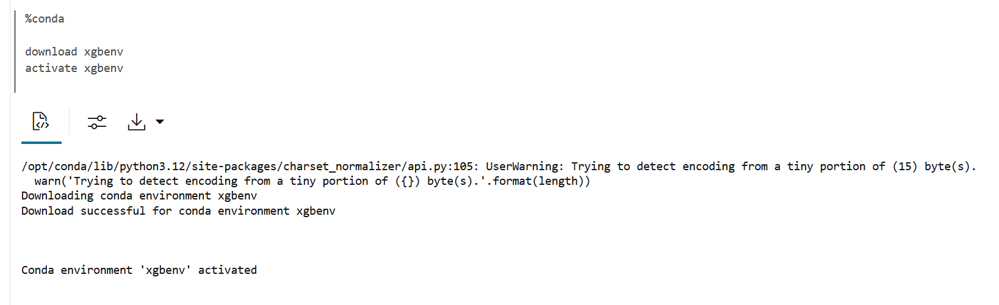
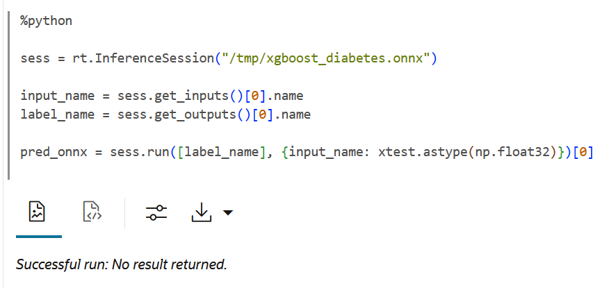

# Create and Deploy an ONNX Format model Using Oracle Machine Learning Services

## Introduction

 In this lab, you will learn how to use Oracle Machine Learning Services REST API to deploy your ONNX format models and then perform scoring.

Estimated Time: 40 minutes

### About ONNX Format Model Deployment and Scoring in Oracle Machine Learning Services

The Oracle Machine Learning Services REST API supports ONNX format model deployment through REST endpoints for:
* Classification models (both non-image models and image models)
* Clustering models
* Features Extraction models (image models)
* Regression models

Open Neural Network Exchange or ONNX is an open standard format of machine learning models. By using the Oracle Machine Learning Services REST API, you can deploy and score with your ONNX format models.

### Objectives

In this lab, you will learn how to:
* Train an open source xgboost model
* Convert the open source xgboost model to ONNX format
* Deploy the model to OML Services on Autonomous AI Database


### Prerequisites 

This lab assumes you have:
* OCI Cloud Shell, which has cURL installed by default. If you are using the Workshops tenancy, you get OCI Cloud Shell as part of the reservation. However, if you are in your own OCI tenancy or using a free trial account, ensure you have OCI Cloud Shell or install cURL for your operating system to run the OML Services commands.
* An Autonomous AI Database instance created in your account/tenancy if you are using your own tenancy or a free trial account. You should have handy the following information for your instance:
    * Your OML user name and password
    * `oml-cloud-service-location-url`
* A valid authentication token
* A Conda environment with xgboost, onnxruntime, and onnxmltools installed


## Task 1: Create and set up a Conda Environment

In this task, you will create a Conda environment by the name xgbenv and install the libraries xgboost, onnxruntime and onnxmltools.

1. Sign into your Oracle Machine Learning UI as `ADMIN` and run the following commands:

    ```
    <copy>

    %conda
    create -n xgbenv -c conda-forge --strict-channel-priority python=3.12.6 xgboost onnxruntime onnxmltools
    upload xgbenv --overwrite -t application "OML4PY" 

    </copy>
    ```

  

  This command created the conda environment `xgbenv` as ADMIN with the libraries xgboost, onnxruntime, and onnxmltools for use with Python 3.12.6. This is Python version currently used in OML Notebooks. The command also uploads the environment to Object Storage for non-ADMIN users to download, activate, and use in OML Notebooks.


2. Now, sign in as `OMLUSER` and download and activate the Conda environment `xgbenv`.

    ```
    <copy>
    %conda 

    download xgbenv
    activate xgbenv
    </copy>
    ```

  

3. In a Python paragraph, import the following Python packages:

    ```
    <copy>
    import xgboost as xgb
    import onnxruntime
    import onnxmltools
    </copy>
    ```

  
  

    * xgboost - A python package.
    * onnxruntime - A runtime engine to allows you to run ONNX format models.
    * onnxmltools - A Python package that allows you to convert the traditional machine learning models, for example, xgboost into the ONNX format.

This sets up the environment to create and train a xgboost model, and convert it to ONNX format.

## Task 2: Load and prepare the data


To create and train the model:

1. Import the Diabetes dataset and store it in a variable called `diabetes`. 

  Run the following command to import the dataset:

    ```
    <copy>

    %python
    from sklearn.datasets import load_diabetes

    diabetes = load_diabetes()
    X = diabetes.data  # Features
    y = diabetes.target  # Target variable (progression)
    </copy>
    ```

  

2. Run the following command to view the description of the dataset. can be viewed by printing the contents of the .DESCR attribute.

    ```
    <copy>
    %python
    print(diabetes.DESCR)
    </copy>
    ```

  

## Task 3: Train, Score and Evaluate the model 

In this task, you will perform the following tasks:

* Separate the data into target and predictor variables 
* Split the data into train and test set
* Score with the model
* Evaluate the model

1. Run the following command to separate the data into target and predictor variables, and then split the data into train and test sets:


    ```
    <copy>
    %python
    from sklearn.model_selection import train_test_split

    x, y = diabetes.data, diabetes.target
    xtrain, xtest, ytrain, ytest=train_test_split(x, y, test_size=0.30, random_state=99)
    </copy>
    ```
  

  In this example, we are using the `train_test_split` function from sklearn's `model_selection` module. The test size equal to 30% of the data. A `random_state` is assigned for reproducibility.

2. Run the following command to: 
    * Build the regression model. Use the `XGBRegressor` class of the `xgboost` package with the hyper-parameter values passed as arguments. 
    * Initialize the regressor object
    * Fit the regressor to the training set 
    * Print all of the model parameters

    ```
    <copy>

        %python
        model = xgb.XGBRegressor(objective ='reg:squarederror', 
                         colsample_bytree = 0.3, 
                         learning_rate = 0.1,
                         max_depth = 5, 
                         alpha = 10, 
                         n_estimators = 10)
        print(model)

    </copy>
    ```

  

3. Run the following command to train the model using the _fit_ method and score data using the _predict_ method on the model:

    ```
    <copy>
    model.fit(xtrain, ytrain)

    pred = model.predict(xtest)
    </copy>
    ```

  

4. Next, the model is ready to be evaluated. For this, run the following to compute the Root Mean Square error (RMSE) by using the `mean_squared_error` function. This function is available in the _metrics_ module of sklearn. 

    ```
    <copy>
    import numpy as np
    from sklearn.metrics import mean_squared_error 

    rmse = np.sqrt(mean_squared_error(ytest, pred))

    print("RMSE: %f" % (rmse))

    </copy>
    ```

  
  
  The RMSE for the price prediction is approximately 62.972 per $1000.

  This completes the task of creating and training an open source xgboost model. 


## Task 4: Convert the open source xgboost model to ONNX format

To convert the xgboost model to ONNX, we need the model in .onnx format, zipped together with a metadata.json file. 

Before deploying an ONNX format model, you must create the ONNX model zip file. The zip file contains the following files: 

* `modelName.onnx` file 
* `metadata.json` file and 
* `label.txt` (optional) file. 

1. Run the following command to import the required libraries - ZipFile, json, and FloatTensorType:

    ```
    <copy>
    %python
    import json
    from zipfile import ZipFile
    from skl2onnx.common.data_types import FloatTensorType
    </copy>
    ```

    

2. Now, you must prepare the folder structure to set up the directories on the file system where the ONNX model will be created and stored. Run the following command:
    ```
    <copy>
    %python

    import os
    target_folder = os.path.expanduser('/tmp')
    try:
      os.makedirs(target_folder)
    except:
      pass
    os.chdir(target_folder)
    </copy>
    ```

    


3. Now define the model inputs to the ONNX conversion function `convert_xgboost`. scikit-learn does not store information about the training data, so it is not always possible to retrieve the number of features or their types. For this reason, `convert_xgboost` contains an argument called `initial_types` to define the model input types.

  For each numpy array (inpout tensor) passed to the model, choose a name and declare its data type and shape. Here, `float_input` is the name chosen for the input tensor.

    ```
    <copy>
    initial_types = [('float_input', FloatTensorType([None, xtrain.shape[1]]))]
    </copy>
    ```

  

    In this example:

    * `initial_types` - This is an argument present in the `convert_xgboost` function. Since, `scikit-learn` does not store information about the training data, so it is not possible to retrieve the number of features or their types.
    * `float_input` - This is the name or identifier of the input tensor. Numpy array is called a tensor in ONNX. This is passed on to the model.
    * `FloatTensorType([None, xtrain.shape[1]` - Defines the type and shape of the input tensor.
      * `[None, xtrain.shape[1]]` - This is a list that defines the shape of the tensor - the number of rows and number of features (or input dimensions) for each data point.
      * `None` - This is the first dimension. It represents the number of rows. The number of rows is undefined as the the number of requested predictions is unknown at the time the model is converted.
      * `xtrain.shape[1]` - This is the second dimension. It represents the number of features (or input dimensions) for each data point.

4. Now that we have defined the model inputs, run the following command to convert the xgboost model to ONNX format: 
    ```
    <copy>
    %python
    onnx_model = onnxmltools.convert_xgboost(model, initial_types=initial_types)

    onnxmltools.utils.save_model(onnx_model, 'xgboost_diabetes.onnx') 
    </copy>
    ```

  

  In this example, we are using the `convert_xgboost` function from onnxmltools. The model is saved to the file `xgboost_diabetes.onnx`. This completes the task of converting the xgboost model to ONNX format.

## Task 4.1: Create metadata.json file, zip file and validate 

1. Now, run the following command to create the `metadata.json` file and compress and create the zip file by the name `onnx_xgboost.model.zip`:

    ```
    <copy>
    %python
    metadata = {
    "function": "regression",
    }

    with open('metadata.json', mode='w') as f:
      json.dump(metadata, f)

    with ZipFile('onnx_diabetes.model.zip', mode='w') as zf:
      zf.write('metadata.json')
      zf.write('xgboost_diabetes.onnx')
    </copy>
    ```

  

> **Note:** Ensure that the `metadata.json` file contains the following information:


  * `function` (mandatory for all models)
  * `regressionOutput` 
  * `classificationLabelOutput`
  * `classificationProbOutput` 
  * `inputTensorDimNames` 
  * `height` 
  * `width` 
  * `channel` 
  * `mean`
  * `scale` 
  * `inputChannel` 
  * `clusteringDistanceOutput` 
  * `clusteringProbOutput`

To know more about the the `metadata.json` file, see:  [Specifications for ONNX Format Models](https://docs.oracle.com/en/database/oracle/machine-learning/omlss/omlss/onnx_spec.html)

Steps 2 - 4 are optional steps. They are for validation only. 

2. Run the following command to view the zip file in the /tmp folder:

     ```
    <copy>
    %python  
    import os
    os.listdir('/tmp')
    </copy>
    ```

    

3. Run the following command to read and view the metadata.json file:
    ```
    <copy>
    %python  
    with open('metadata.json', mode='r') as f:
        print(f.read())  
    </copy>
    ```

   


4. Run the following commands to view the contents of the zip file: 

    ```
    <copy>
    %python  
    import zipfile 
    with zipfile.ZipFile("onnx_diabetes.model.zip", "r") as zip_ref:
        zip_ref.printdir()  # Print file list to confirm the structure
    </copy>
    ```

   

This completes the task of creating the metadata.json file, the zip file (containing the metadata.json file and xgboost model in onnx format), and validating the contents of these files.

## Task 4.2: Compare predictions made by the original XGboost model and the ONNX model (Optional)

In this task, you will compare the original XGBoost prediction with the predictions made by the ONNX model. 

1. Run the following command to import the ONNX runtime environment:
    ```
    <copy>
    import onnxruntime as rt
    </copy>
    ```

  


2. Run the following command to set up the runtime:

    ```
    <copy>
    sess = rt.InferenceSession("/tmp/xgboost_diabetes.onnx")

    input_name = sess.get_inputs()[0].name
    label_name = sess.get_outputs()[0].name

    pred_onnx = sess.run([label_name], {input_name: xtest.astype(np.float32)})[0]
    </copy>
    ```

  

3. Run the following command to compare the original XGBoost prediction with the predictions made by the ONNX model:

    ```
    <copy>
    %python
    print("First 5 XGBoost predictions:")
    print(pred[:5])

    print("\nFirst 5 ONNX predictions:")
    print(pred_onnx[:5])

    # Calculate and display difference
    diff = np.abs(pred - pred_onnx.flatten())
    print("\nMaximum difference:", np.max(diff))
    print("Validation successful: Model converted correctly")
    </copy>
    ```
    

As you can see, the predictions made by the original XGBoost model and the ONNX model are almost similar. We can conclude that the XGBoost model has been converted to the ONNX format correctly. 

This completes the task of validating the predictions made by the ONNX model with the prediction made by the XGboost model. 

## Task 5: Obtain authentication token for use with OML Services REST API 

Before deploying the ONNX model to OML Services, you must obtain an authentication token to access OML Services REST API, and store the ONNX model in the model repository in the database. 

1. Obtain an authentication token by using your Oracle Machine Learning (OML) account credentials to send requests to OML Services. 

  ```
  <copy>
  %python
  import requests

  # Define variables. Replace the below URL with your URL. 
  oml-cloud-service-location-url = "https://wp206m0hg0kgxod-omllabs138190.adb.ca-toronto-1.oraclecloudapps.com"
  USERNAME = "OMLUSER"
  PASSWORD = "AAbbcc123456"

  def get_token():
      url = f"{oml-cloud-service-location-url}/omlusers/api/oauth2/v1/token"
      payload = {
          "grant_type": "password",
          "username": USERNAME,
          "password": PASSWORD
      }
      headers = {
          "Content-Type": "application/json",
          "Accept": "application/json"
      }

      response = requests.post(url, json=payload, headers=headers)

      # Print token
      print("Token:", response.text)
      return response.json().get("accessToken")
  # Get token
  try:
      TOKEN = get_token()
  except Exception as e:
      print("Error:", e)
    </copy>
    ```
  
  
  The command returns the access token. 

  See **Lab 1 - Authenticate your OML Account with your Autonomous AI Database instance to use OML Services** in this workshop for details. 


## Task 5.1: Store the model in the OML Services Model Repository

1. To store the ONNX model, run the following command: 


    ```
    <copy>
    %python

    import requests

    # OML Services models endpoint
    url = f"{oml-cloud-service-location-url}/omlmod/v1/models"

    headers = {
        "Authorization": f"Bearer {TOKEN}"
    }

    # Open the model zip file
    with open("onnx_diabetes.model.zip", "rb") as model_file:
        files = {
            "modelData": ("onnx_diabetes.model.zip", model_file, "application/zip")
        }

        data = {
            "modelName": "onnxRegressionModel2",
            "modelType": "ONNX",
            "version": "1.0",
            "description": "onnx xgb regression model version 1.",
            "shared": "true"
        }

        # Send the model upload request
        response = requests.post(url, headers=headers, files=files, data=data)

  # Print the response status and message
  print(response.status_code)
  print(response.text)
  </copy>
      ```

  

    > **Note:** When you store the model in the repository, a unique ID is generated. This is the `modelId` that you use when creating the model endpoint.
  
## Task 5.2:  Deploy the ONNX Format Model
To deploy and score an ONNX format regression model: 

1. Send a `POST` request to the `/omlmod/v1/deployment` endpoint to deploy the ONNX model. The inputs for this request are the `modelId` and `URI`.

    > **Note:** Only the model owner can deploy the model. The model owner is the user who stores the model. A new endpoint is created for the deployed model. 

    Example of POST request to deploy an ONNX model: 

    ```
    <copy>
    %python

    import requests

    url = f"{oml-cloud-service-location-url}/omlmod/v1/deployment"
    headers = {
        "Authorization": f"Bearer {TOKEN}",
        "Content-Type": "application/json"
    }
    data = {
        "modelId": "700d4458-4ee3-4a92-876a-a8103eca5cc7",
        "uri": "onnxrg"
    }

    response = requests.post(url, headers=headers, json=data)

    print(response.status_code)
    print(response.json())  

    </copy>
    ```
  
     
      

## Task 5.3:  Score using the ONNX Model

1. Score the model by sending a POST request to the `deployment/{uri}/score` endpoint. The `GET` response to `{uri}/api` provides detailed information about the model.

    >**Note:** Prediction details are not supported for ONNX model scoring. 

    ```
    <copy>
    %python

    # Scoring endpoint URL
    url = f"{oml-cloud-service-location-url}/omlmod/v1/deployment/onnxrg/score"

    # Headers
    headers = {
        "Authorization": f"Bearer {TOKEN}",
        "Content-Type": "application/json"
    }

    data = {
        "inputRecords": [
            {
                "float_input": [  
                    [
                        0.03807591, 0.05068012, 0.06169621, 0.02187235, -0.0442235,
                        -0.03482076, -0.04340085, -0.00259226, 0.01990749, -0.01764613
                    ]
                ]
            },
            {
                "float_input": [  # Second record
                    [
                        -0.00188202, -0.04464164, -0.05147406, -0.02632795, -0.00844872,
                        -0.01916334, 0.07441156, -0.03949338, -0.06833155, -0.09220405
                    ]
                ]
            }
        ]
    }

    # Send request
    response = requests.post(url, headers=headers, json=data)

    # Print response
    print(response.status_code)
    print(response.json())  
    </copy>
    ```
    
    
    
    This is a deployed ONNX regression model with URI `onnxrg`. In this example: 
    * `$token` - Represents an environmental variable that is assigned to the token obtained through the Authorization API.
    * `POST` request is sent to `/deployment/onnxrg/score`.  

  This completes the task of deploying and scoring an ONNX regression model.


## Learn More

* [REST API for Oracle Machine Learning Services](https://docs.oracle.com/en/database/oracle/machine-learning/omlss/omlss/index.html)
* [Work with Oracle Machine Learning ONNX Format Models](https://docs.oracle.com/en/database/oracle/machine-learning/omlss/omlss/omls-example-onnx-ml.html)
* [Work with Oracle Machine Learning ONNX Image Models](https://docs.oracle.com/en/database/oracle/machine-learning/omlss/omlss/omls-example-onnx-image.html)
* [Create the proper ONNX files that work with OML Services](https://github.com/oracle/oracle-db-examples/blob/main/machine-learning/oml-services/SKLearn%20kMeans%20and%20GMM%20export%20to%20ONNX.ipynb)


## Acknowledgements

* **Author** : Moitreyee Hazarika, Consulting User Assistance Developer, Database User Assistance Development
* **Contributors**: Mark Hornick, Senior Director, Data Science and Machine Learning; Marcos Arancibia Coddou, Product Manager, Oracle Data Science; Sherry LaMonica, Consulting Member of Tech Staff, Machine Learning
* **Last Updated By/Date**: Moitreyee Hazarika, October 2025
