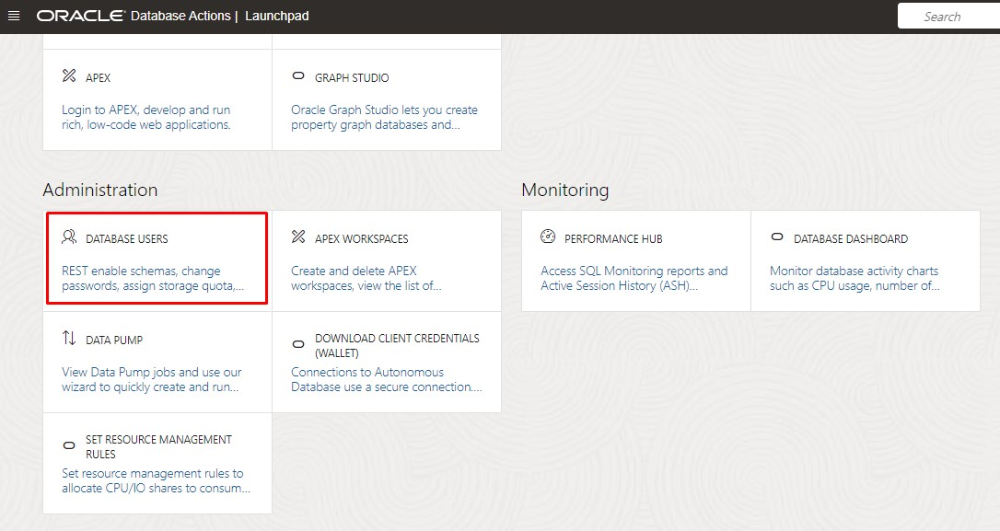
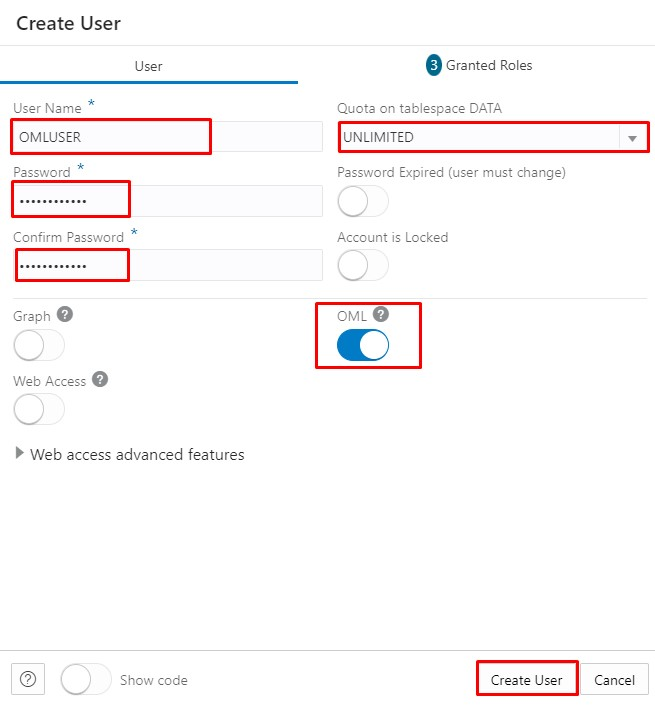
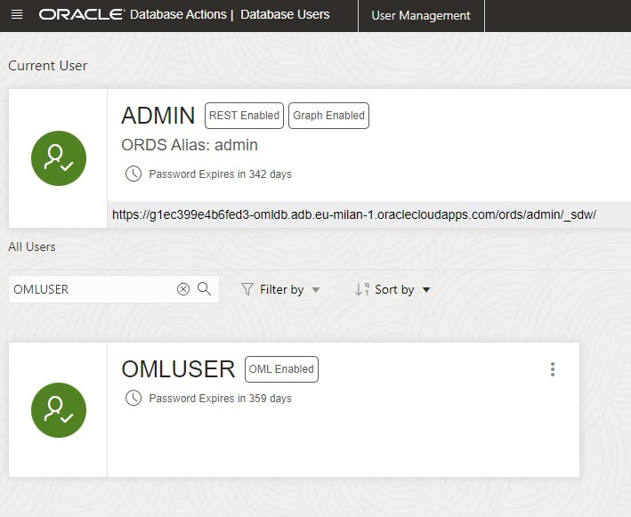

# Load and Prepare Data

## Introduction

In this lab, we will start from a newly created Oracle Autonomous Database instance and prepare it for the workshop.

 You will collect the connection details and create the users and passwords. Using them, you will load the data into Autonomous Database and prepare to use it in Oracle Machine Learning Notebooks.

Estimated Lab Time: 15 minutes

### Objectives
*	Create the OMLUSER user
* Load data into ADB

### Prerequisites
* Oracle Cloud Infrastructure (OCI) account
* Autonomous Database deployed in Oracle Cloud
* ADMIN user password for Autonomous database

## Task 1:  Create the OMLUSER user

* Connect to the Oracle Cloud Infrastructure (OCI) Console and go to the Autonomous Database home page.
* Click on the target Autonomous Database instance

* In the Autonomous Database instance detail page, click on the **Database Actions** button.

* The Database Actions launchpad page is now open and connected by default with the ADMIN user. Here we have multiple tools available to easily manage and use the database, develop new applications or REST modules, or manage data inside the database.
In the Database Actions launchpad scroll to the Administration section and click **DATABASE USERS**.

* In the User Management page, we see ADMIN as the current user and other predefined users.
Click on the **+ Create User** button on the right side to create another user.

* The Create User page appears, please enter the following:

    - Username: **OMLUSER**;
    - Password: Chose a password. Throughout the workshop we are using **Welcome12345** as a password for OMLUSER;
    - Confirm Password: **Retype the password**;
    - Quota on tablespace DATA: **UNLIMITED**
    - Check: **OML**

* Click Create User.

* We now have a new user named OMLUSER available.

 The next step is to load our data in the OMLUSER schema.

## Task 2: Loading the data

* In the Autonomous Database instance detail page, click on the **Database Actions** button.

* We will choose **SQL** option in the Development category.

* The web SQL Developer launches and if pop up windows appear you can close them. Select the **Data Loading** tab in the top right part of the screen.

* A new window appears and click **Add File** button.

* Select **cust_insur_ltv.csv** from the files listed on the window and click **Open**. In case you don't have the file, you can download [cust\_insur\_ltv.csv](https://objectstorage.eu-frankfurt-1.oraclecloud.com/p/NIPrIgDVBKsOBi_xnF5_ZHWAnlilwwnUbrgQbUA24iupm6ryoNkvp_KZ9qywzpQE/n/oraclepartnersas/b/ADB_Stage/o/cust_insur_ltv.csv) and load it.

* The file is displayed in the Data Loading process with the status Pending. Click on the hamburger menu on the right and click **Settings**.

* The file is parsed and a preview is displayed on the screen. Check the preview and click **Next**.

* The Table Definition screen.

Here, you should update the following:
 - Change the target Schema to **OMLUSER**
 - Change the target Table Name to **CUSTOMER_INSURANCE**

You can keep the default Create New Table option and mapping options.

Click **All Files**.

* Notice the details on the file loading changed. Click the green run button on the Data Loading process.

* The status changes to Running.

* The data loading process takes less than a minute. When completed and the status is Uploaded click the Close button.

* On the navigator, pick OMLUSER as the schema and wait for the tables to be displayed. Notice the CUSTOMER_INSURANCE table and the error log table. The error log table should not have any errors recorded.

The next step is to use this data and create an AutoML model.

You may now [proceed to the next lab](#next).

## Acknowledgements
* **Authors** -  Andrei Manoliu, Milton Wan
* **Contiributors** - Rajeev Rumale, Mark Hornick, Sherry LaMonica
* **Last Updated By/Date** -  Andrei Manoliu, December 2022
