# Advanced Options in Oracle Machine Learning Notebooks 

## Introduction

This lab walks you through the steps to explore the advanced options available in Oracle Machine Learning notebooks.

Estimated Time: 20 minutes

### About the Advanced options in Oracle Machine Learning Notebooks

Oracle Machine Learning Notebooks offer a wide range of advanced options such as:   

* Notebook Service levels - Allows you to change the notebook type. Notebook type corresponds to the ADB service levels — low, medium, high and gpu. 
* Notebook versioning - Allows archiving your work in a notebook, viewing of version history, and version comparison.
* Comments in notebook paragraphs - Allows you to write comments in notebook paragraphs thereby supporting collaborative work. 
* Notebook Templates - Allows you to create notebooks based on example templates.
* Jobs - Allows you to create jobs to schedule the running of notebooks.
* Paragraph dependencies - Allows you to add runtime sequence dependencies between paragraphs. The child paragraph automatically run after the parent paragraph is run.


### Objectives

In this lab, you will learn how to:
* Change notebook service levels
* Create notebook versions, view version history and compare notebook versions
* Create a notebook using the Example template
* Create jobs to schedule notebook run
* Create paragraph dependencies, and run the paragraphs based on paragraph dependency order


### Prerequisites

This lab assumes you have:
* An Oracle Machine Learning account
* Access to Oracle Machine Learning USER account.

## Task 1: Change Notebook Service Level

Notebook type corresponds to the ADB service levels — low, medium, high and gpu. These service levels affect parallelism in the database. The notebook type that is set for a notebook applies to all the paragraphs in that notebook. For the notebooks in Oracle Machine Learning Notebooks, you can use the following interpreters:

* SQL interpreter for SQL statements
* PL/SQL  interpreter for PL/SQL scripts/statements
* Python interpreter to process Python scripts
* R interpreter to run R commands and scripts
* md (MarkDown) interpreter for plain text formatting syntax so that it can be converted to HTML.


	> **Note:** The service level that is set for a notebook applies to all the paragraphs in that notebook. 

In this step, you learn how to change the notebook service levels:
1. Go to the Notebooks page by clicking the Cloud menu icon on  the top left corner of the page. On the left navigation menu, click **Notebooks**.
	

	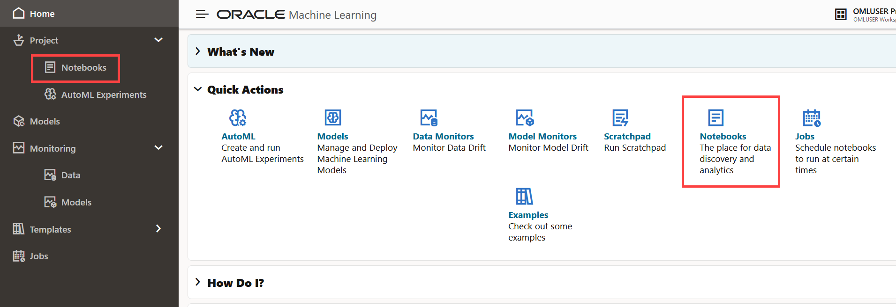

2. On the Notebooks page, click on the **OML4PY Classification_DT** notebook to open it in the Notebook editor.

	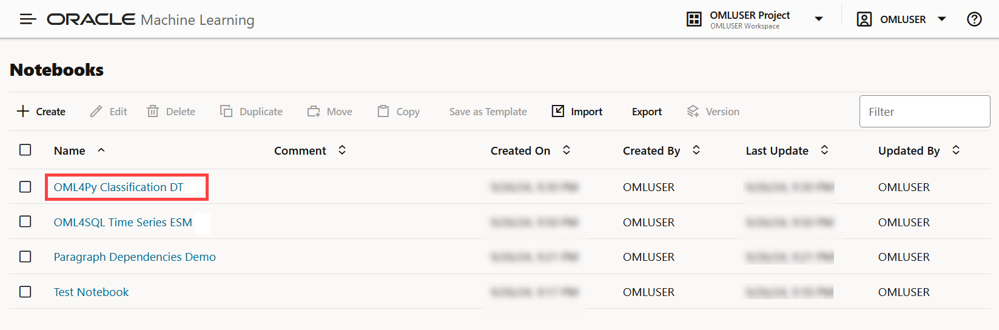
	

3. Click on the **Update Notebook Type** icon on the top right corner. The available notebook types are displayed. The current notebook type is indicated by a tick mark, and is also displayed next to the **Update Notebook Type** icon. 

	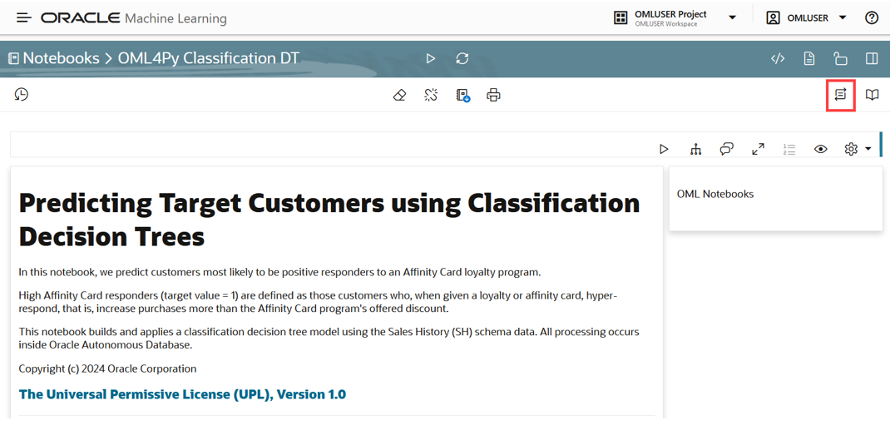

	The Notebook Types (ADB service levels) are: 

	* **low** — Provides the least level of resources for in-database operations, typically serial (non-parallel) execution. It supports the maximum number of concurrent in-database operations by multiple users. The interpreter with low priority is listed at the top of the interpreter list, and hence, is the default.
	* **medium** — Provides a fixed number of CPUs to run in-database operations in parallel, where possible. It supports a limited number of concurrent users, typically 1.25 times the number of CPUs allocated to the pluggable database.
	* **high** — Provides the highest level of CPUs to run in-database operations in parallel, up to the number of CPUs allocated to the pluggable database. It offers the highest performance, but supports the minimum number of concurrent in-database operations, typically 3.
	* **gpu** — Provides GPU compute capabilities in a notebook through the Python interpreter with the database service level set to high. The notebook memory setting is 32 GB (DDR4), by default. It is extensible up to 200 GB.

	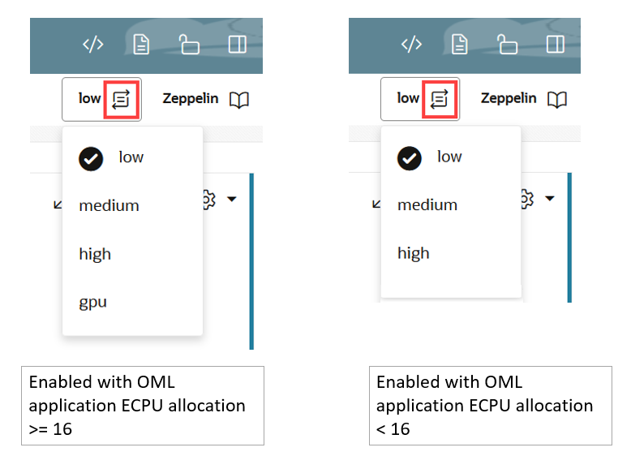

4. To change the notebook type, click on the type that you want to select. In this example, let's click high. A confirmation message is displayed stating: `Notebook Type is updated to "high".`

	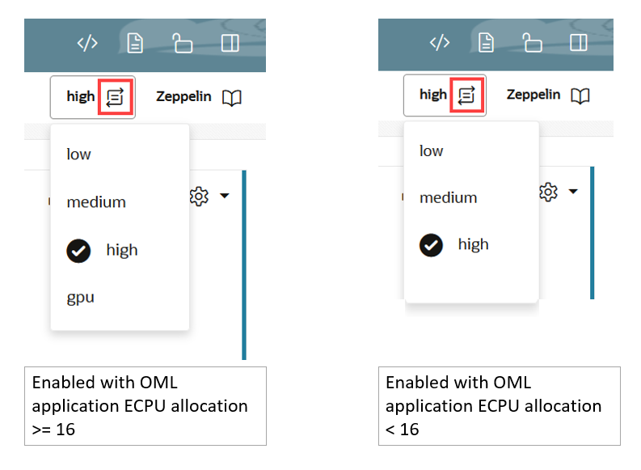

	> **Note:** The updated notebook type is applicable to all the paragraphs in the notebook. You cannot change the notebook type at the paragraph level.

This completes the task of changing notebook service level.


## Task 2: Create Notebook Versions

By creating versions of your notebook, you can archive your work in a notebook.
You can create versions of notebooks on the notebooks page, as well as in the notebook editor. In this example, the _Paragraph Dependencies Demo_ notebook is used to create versions of it.

>**Note:** A versioned notebook is non-editable. If you want to make any changes to a particular version of a notebook, you must restore that version to edit it.

**Prerequisites:** The _Paragraph Dependencies Demo_ notebook. This notebook is created as part of Task 1 of this lab.

### Task 2.1: Create Versions on the Notebooks page
In this task, you will create Version 1 of the _Paragraph Dependencies Demo_ notebook.
1. On the Notebooks page, select the _Paragraph Dependencies Demo_ notebook to enable all the edit options.
	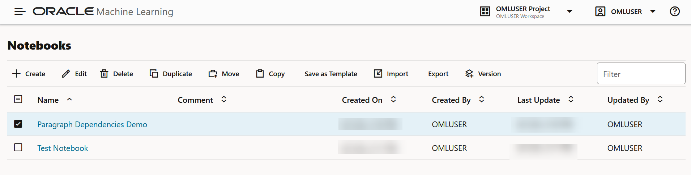
2. Click **Version** to go to the versions page for this notebook.
	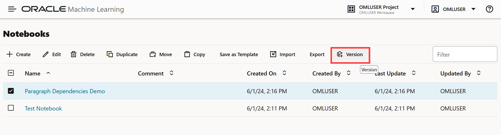
3. On the Versions page for this notebook, click **Versions** to open the Create Versions dialog.
	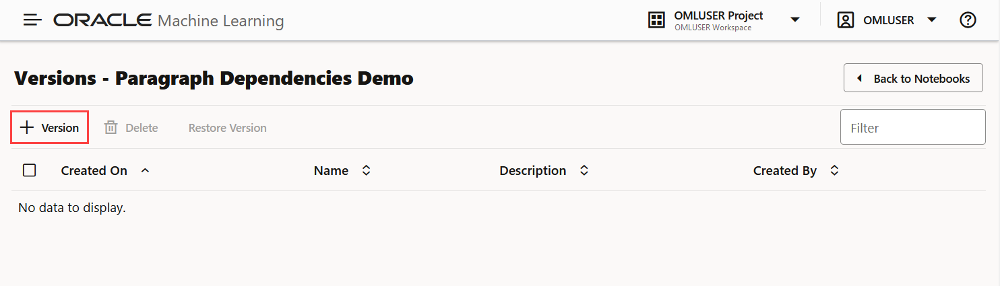

3. In the Create Versions dialog:
	* **Name:** Enter _Version 1_ for the new version of this notebook
	* **Descriptions:** Enter comments, if any.
	* Click **OK.** Once the notebook version is created, it is listed on the Versions - Notebook Versioning Demo page.

	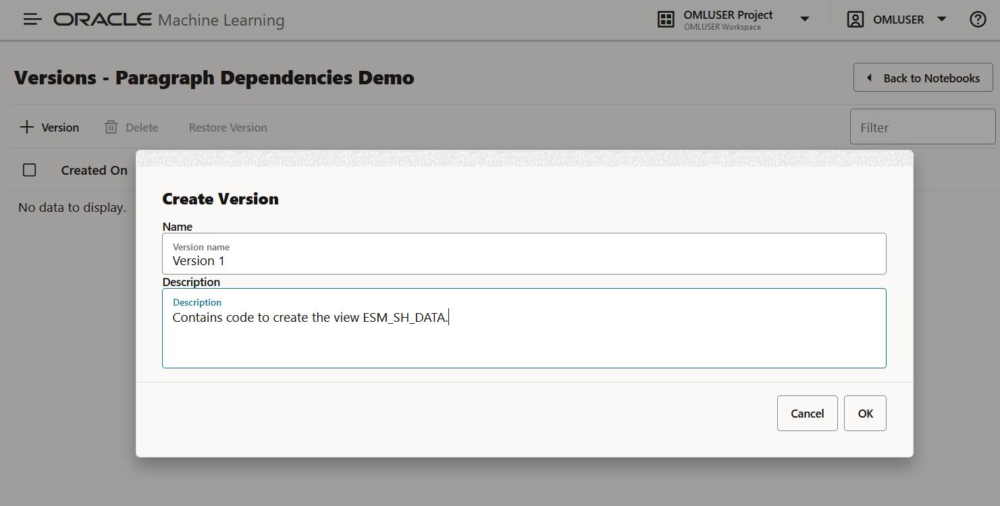
4. On the _Paragraph Dependencies Demo_ page, select **Version 1** of the notebook version that you just created to enable all the available options.
	* Click **Delete** to delete the selected version of the notebook.
	* Click **Restore Version** to restore the selected version of the notebook.
5. Click **Back to Notebooks** to go back to the Notebooks page.
	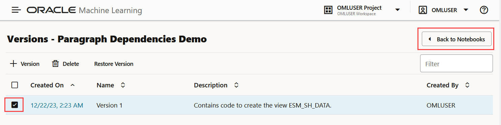

This completes the task of creating a notebook version on the Notebooks page.

### Task 2.2: Create Versions in the Notebooks Editor
By creating versions of your notebook, you can archive your work in a notebook. You can create versions of an open notebook, as well as on the notebooks listing page. In this example:

* The original notebook _Paragraph Dependencies Demo_ is edited to add a script to build a machine learning model.
* The notebook _Paragraph Dependencies Demo_ is then versioned as **Version 2** to archive the code to build the machine learning model.
* The **Version 2** and **Version 1** of the _Paragraph Dependencies Demo_ notebook are compared using the **Compare Versions** feature.


>**Note:** A versioned notebook is non-editable. If you want to make any changes to a particular version of a notebook, you must restore that version to edit it.

To create a new notebook version and view version history:
1. On the Notebooks page, click on the _Paragraph Dependencies Demo_ notebook to open it in the notebook editor.
	> **Note:**  **Version 1** of this notebook is already created as part Task 6.1 in this lab. It contains the archived code to create the view `ESM_SH_DATA`, count the number of records, and view the data. Clicking on the notebook opens the original editable version.

	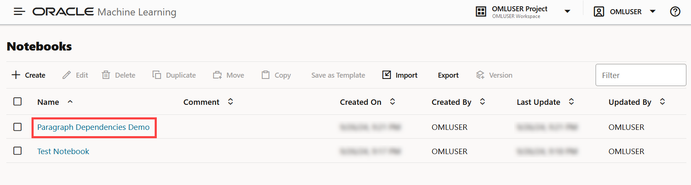

2. Now, edit the notebook to add a script to build a machine learning model. On the notebook, hover your cursor over the lower border of the third paragraph, and click the **Add SQL Script Paragraph**  to call the PL/SQL Interpreter.

	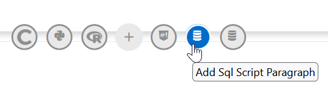

3. Copy and paste the following script to the new paragraph. This script builds a machine learning model using the ESM algorithm.

	```
	<copy>
		BEGIN DBMS_DATA_MINING.DROP_MODEL('ESM_SALES_FORECAST_1');
	EXCEPTION WHEN OTHERS THEN NULL; END;
	/
	DECLARE
	    v_setlst DBMS_DATA_MINING.SETTING_LIST;
	BEGIN

	    v_setlst('ALGO_NAME')            := 'ALGO_EXPONENTIAL_SMOOTHING';
	    v_setlst('EXSM_INTERVAL')        := 'EXSM_INTERVAL_QTR'; -- accumulation int'l = quarter
	    v_setlst('EXSM_PREDICTION_STEP') := '4';                 -- prediction step = 4 quarters
	    v_setlst('EXSM_MODEL')           := 'EXSM_WINTERS';      -- ESM model = Holt-Winters
	    v_setlst('EXSM_SEASONALITY')     := '4';                 -- seasonal cycle = 4 quarters    

	    DBMS_DATA_MINING.CREATE_MODEL2(
	        MODEL_NAME          => 'ESM_SALES_FORECAST_1',
	        MINING_FUNCTION     => 'TIME_SERIES',
	        DATA_QUERY          => 'select * from ESM_SH_DATA',
	        SET_LIST            => v_setlst,
	        CASE_ID_COLUMN_NAME => 'TIME_ID',
	        TARGET_COLUMN_NAME  =>'AMOUNT_SOLD');
	END;
	</copy>
	```
4. Now, archive this notebook along with the code to build the machine learning model by versioning it. On the top left corner of the notebook editor, click the Versioning icon.

	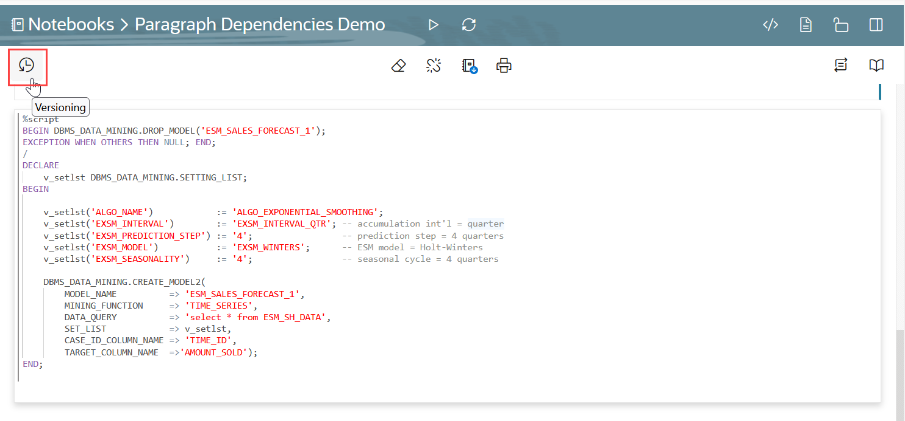

5. The options to **Create Version** and **View Version History** opens. Click **Create Version**.

	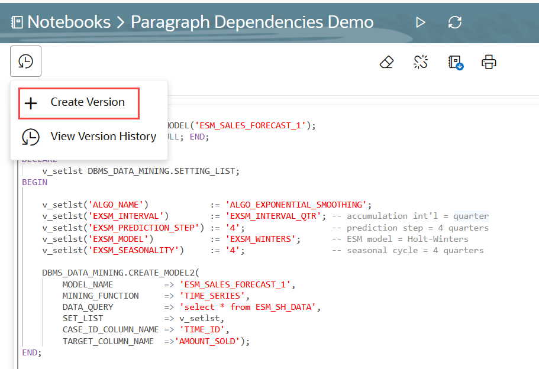

6. In the New Version dialog:

	* **Name:** Here, the name Version 2 is taken by default. Let's retain this name.
	* **Description:** Enter notes, if any.
	* Click **Create.**
	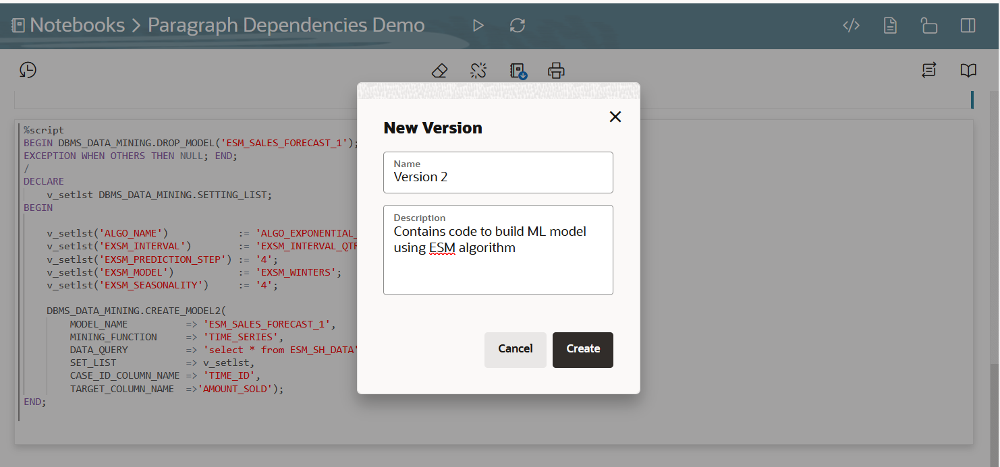
	* A message is displayed confirming the creation of the new version.
	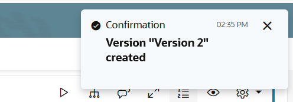

This completes the task of creating a notebook version in the Notebooks editor.

### Task 2.3: View Version History and Compare Notebooks Versions
To view the version that you created in Task 6.2:

1. Click the versioning icon, and then click **View Version History**.
	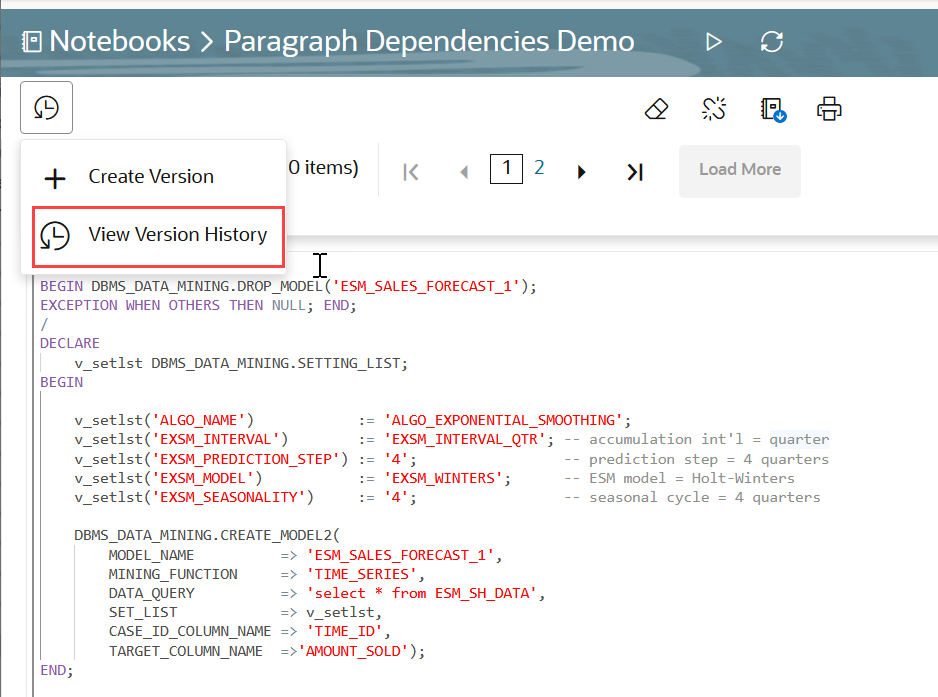

2. On the right pane of the notebook editor, the Version History panel opens.
	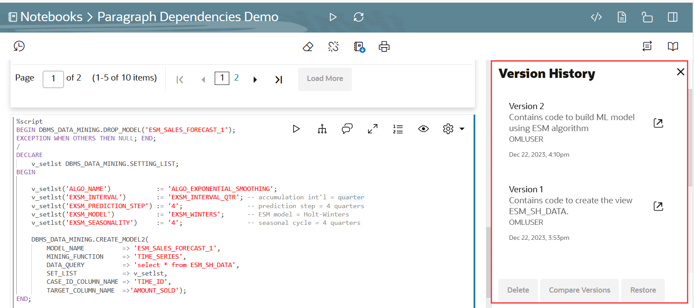
3. Hover your cursor over any notebook version and click on it to enable the available options. You can perform the following tasks in the Version History panel. On the Version History pane on the right:
	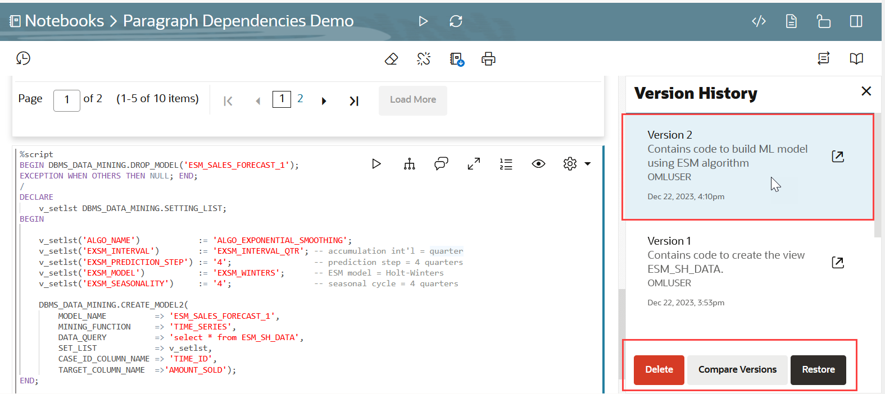
	* Click the open version icon to open the selected version. Clicking on any versioned notebook opens the notebook in read-only mode, as versioned notebooks are non-editable.
	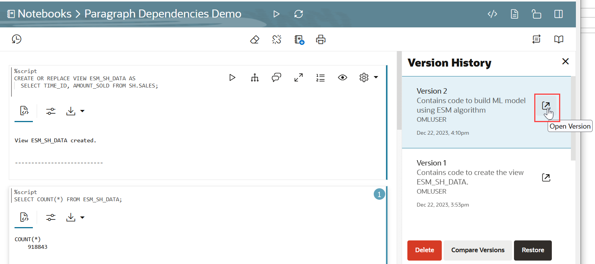
	To view the current editable version, click View current version of the notebook.
	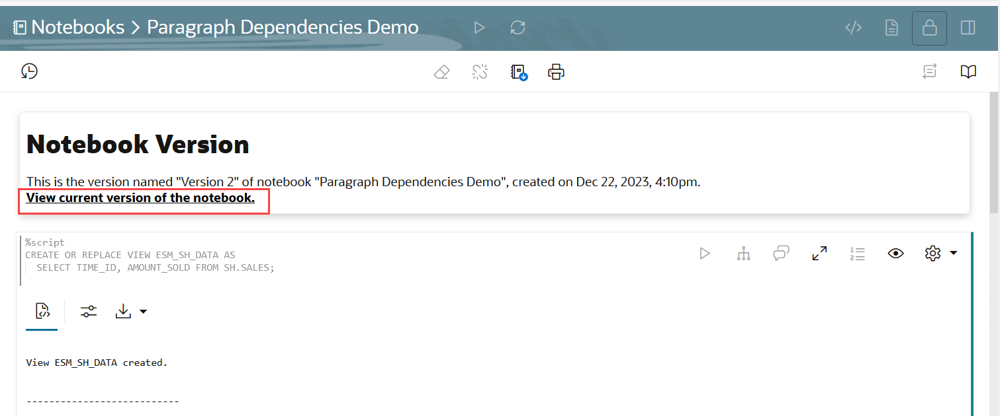
	* Click **Delete** to delete the selected version.
	* Click **Compare Versions** to compare the current version of the notebook with another version.
	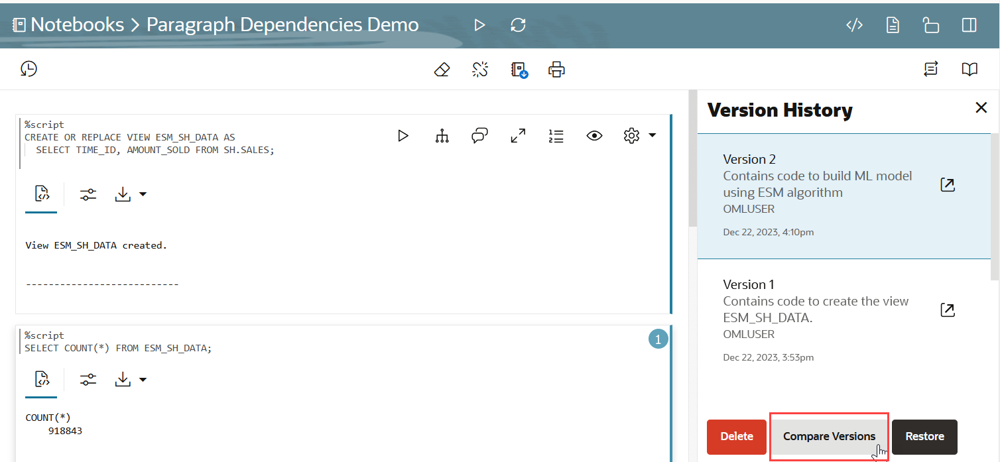
	You can select other available versions from the drop-down list. In this example, **Version 2** of the notebook, which is under Current State is compared with **Version 1**. The new additions are highlighted in green, as shown in the screenshot here.
	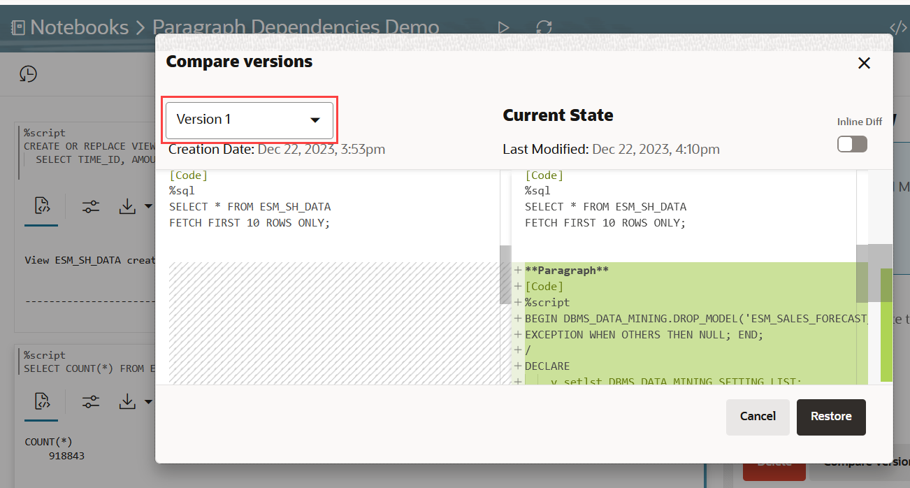
	* Click **Cancel** to exit the dialog.
	* Click **Restore** to restore the selected version.
	>**Note:** Restoring a selected version of the notebook will discard all the unversioned changes, if any.
This completes the task of viewing version history, and comparing notebook versions. 

## Task 3: Create a Notebook using a Template Example

This task demonstrates how to create notebooks based on Example templates. You will learn how to:
* Create the OML4Py Classification notebook based on the OML4Py Classification DT example template. The template builds and applies the classification Decision Tree algorithm to build a classification model based on the relationships between the predictor values and the target values. The template uses the Sales History (`SH`) schema.
* Create the Time Series notebook based on the OML4SQL Time Series ESM example template. This template forecasts sales by using the Exponential Smoothing Algorithm for Time Series Data. It also used the `Sales` table in the SH schema.

### Task 3.1: Create an OML4Py Notebook using the Classification DT Template Example

This step demonstrates how to create the OML4Py Classification notebook based on the OML4Py Classification DT (Decision Tree) Example template:

1. Go to the Examples page by clicking the Cloud menu icon   on the top left corner of the page to open the left navigation menu. On the left navigation menu, click **Templates** and then click **Examples**.

	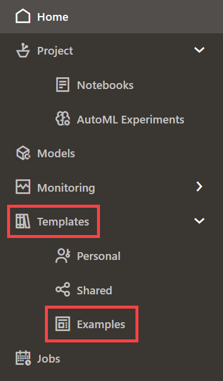

  Alternatively, on the Oracle Machine Learning home page, click **Examples** in the Quick Actions section to go Examples.

	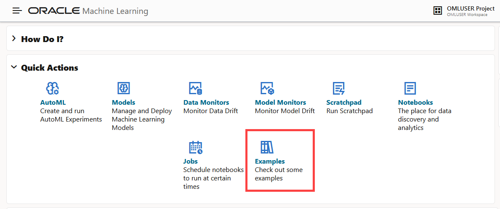


2. Navigate to the **OML4Py Classification DT** example template notebook. You can search for the notebook by typing in the name in the search box on the upper right corner of the page. Click on the grey box around the notebook. This highlights the notebook and enables the **Create Notebook** button. Click **Create Notebook**.

	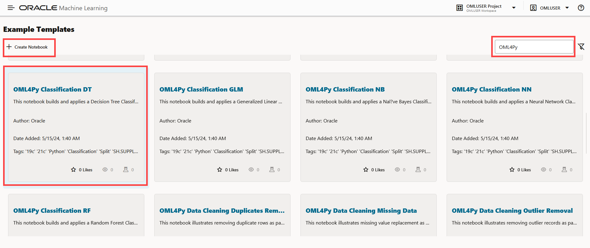

3. The Create Notebook dialog opens. The Name field displays the same name as the template with the suffix `(1)`. You can edit this name. In this example, we will retain the original name `OML4PY Classification DT`. Delete the suffix (1) and click **OK**.

	> **Note:** In the Project field, the current user, project, and workspace is selected by default. You have the option to choose a different project or a workspace by clicking the edit icon here.  

	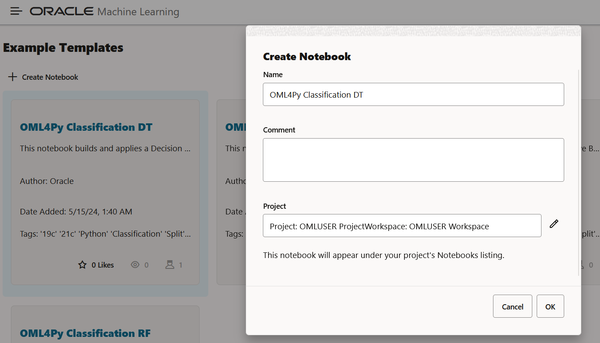

4. Once the notebook is created, the message _This Notebook was created in project "OMLUSER Project" and will appear under the Notebooks Listing "_ is displayed, as shown in the screenshot. The notebook is now available on the Notebooks page. You may also click **Open Notebook** in the message dialog to open the notebook directly from here.

	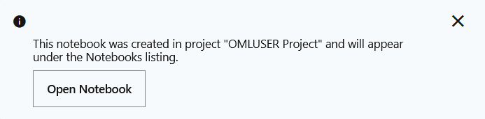

5. To view the notebook that you just created, click the Cloud menu icon  on the top left corner of the page to open the left navigation menu. Click **Notebooks** to go to the Notebooks page.

	

6. The OML4PY Classification DT notebook is now listed on the Notebooks page, as shown in the screenshot. Click it to open the notebook in the Notebooks editor. Note that you will run this notebook in the subsequent steps.

	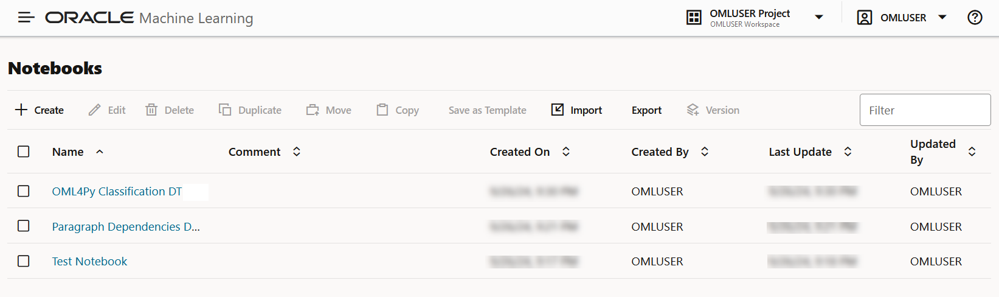
	

This completes the task of creating a notebook from an Example template.

### Task 3.2: Create a Time Series Notebook using the OML4SQL Time Series Template Example

These steps demonstrate how to create the Time Series notebook based on the Example template:

1. Click the Cloud menu icon  on the top left corner of the page to open the left navigation menu. Click **Examples** under Templates to open the Examples page. 

	

If you choose to go to the home page, then click **Home** on the left navigation pane, and then click **Examples**.	

2. Navigate to the **OML4SQL Time Series ESM** example template notebook. You may type ESM in the search box on the upper right corner of the page to get a list of the ESM-related notebooks. Click the grey box around the notebook. This highlights the notebook and enables the **Create Notebook** button. Click **Create Notebook**.

	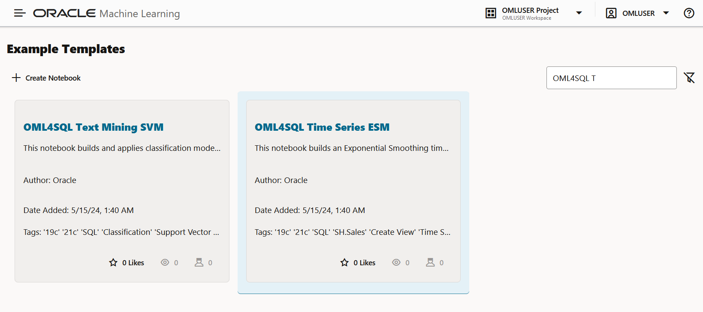

3. The Create Notebook dialog opens. By default, the **Name** field displays the same name as the template with the suffix `(1)`. You can edit this field. In this example, let's remove the suffix and retain the original name **OML4SQL Time Series ESM** and click **OK**.

	> **Note:** In the Project field, the current user, project and workspace is selected by default. You have the option to choose a different project or a workspace by clicking the edit icon here.  

	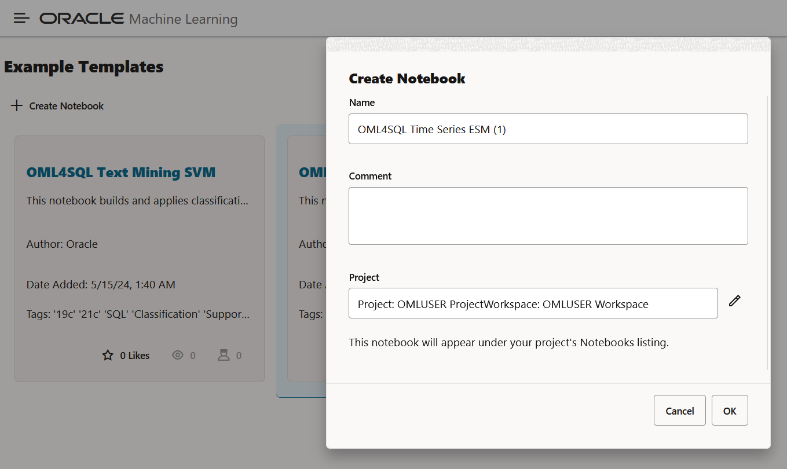

4. Once the notebook is created, the message _This Notebook was created in project "OMLUSER Project" and will appear under the Notebooks Listing "_ is displayed. The notebook is now available on the Notebooks page. You may also click **Open Notebook** in the message dialog to open the notebook directly from here.

	

5. To view the notebook, click the Cloud menu icon  on the top left corner of the page to open the left navigation menu. Click **Notebooks** to go to the Notebooks page.

	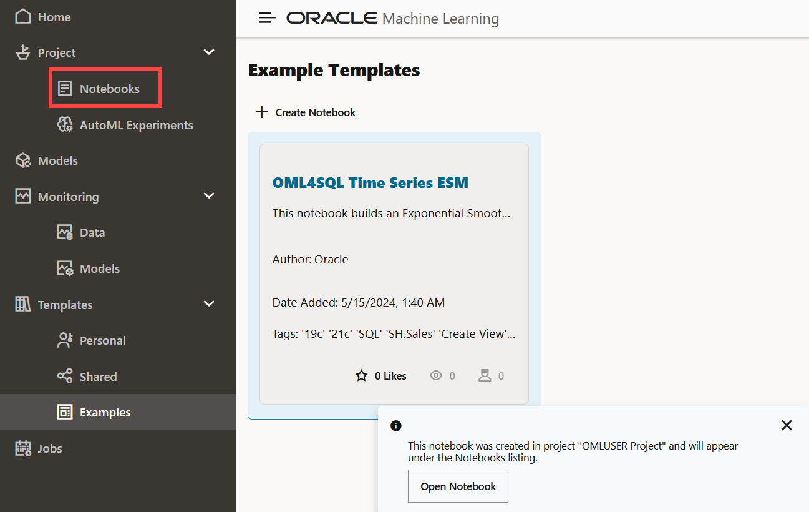


6. The notebook **Notebook "OML4SQL Time Series ESM (1)** is now listed on the Notebooks page, as shown in the screenshot. Click on the notebook to open it in the Notebooks editor and work on it.

	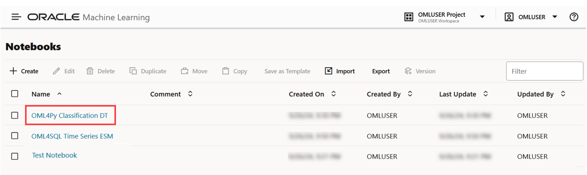


This completes the task of creating the Time Series notebook from the OML4SQL Time Series ESM Example template.


## Task 4: Create Jobs to Schedule Notebook Run

Jobs allow you to schedule the running of notebooks. On the Jobs page, you can create jobs, duplicate jobs, start and stop jobs, delete jobs, and monitor job status by viewing job logs, which are read-only notebooks. In this lab, you will learn how to create a job to schedule the running of the notebook Classification_DT.

To create a job:

1. Click the Cloud menu icon  on the top left corner of the page to open the left navigation menu, and click **Jobs** to go to the Jobs page. 

	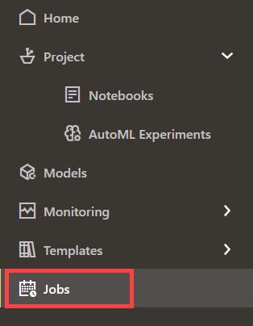

You can also go to Jobs from the Oracle Machine Learning home page by clicking **Jobs**.

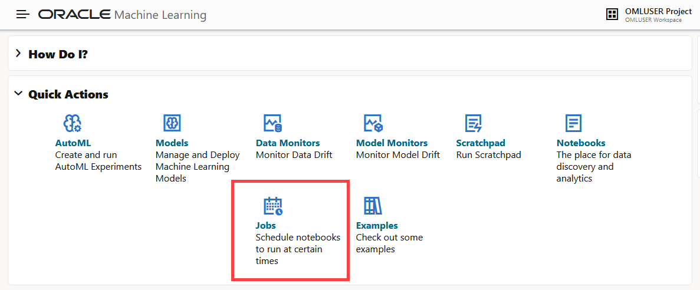

2. On the Jobs page, click **Create**. The Create Job dialog opens.

	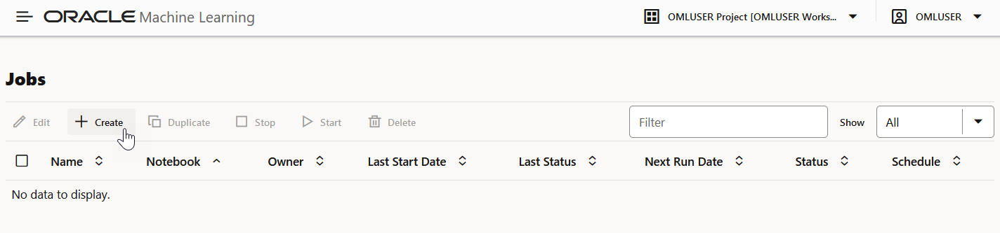

3. In the **Name** field, enter `Job1`. The number of characters in the job name must not exceed 128 bytes.

	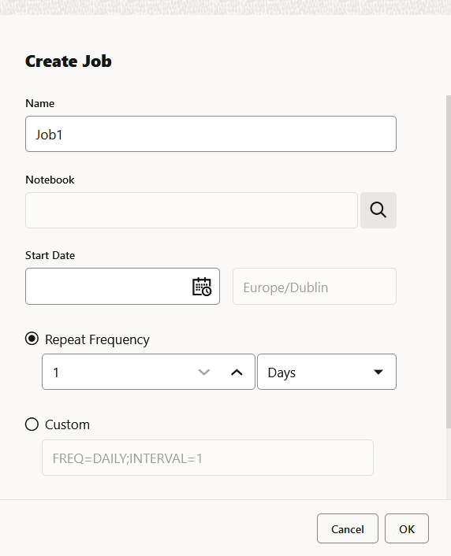

4. In the **Notebook** field, click the search icon. This opens the Search Notebook dialog. In the Search Notebook dialog, navigate through the OMLUSER workspace and OMLUSER project, select `OML4PY Classification_DT (1)`, and click **OK**.

	> **Note:** Only notebooks that are owned by the user or shared are available for selection.

	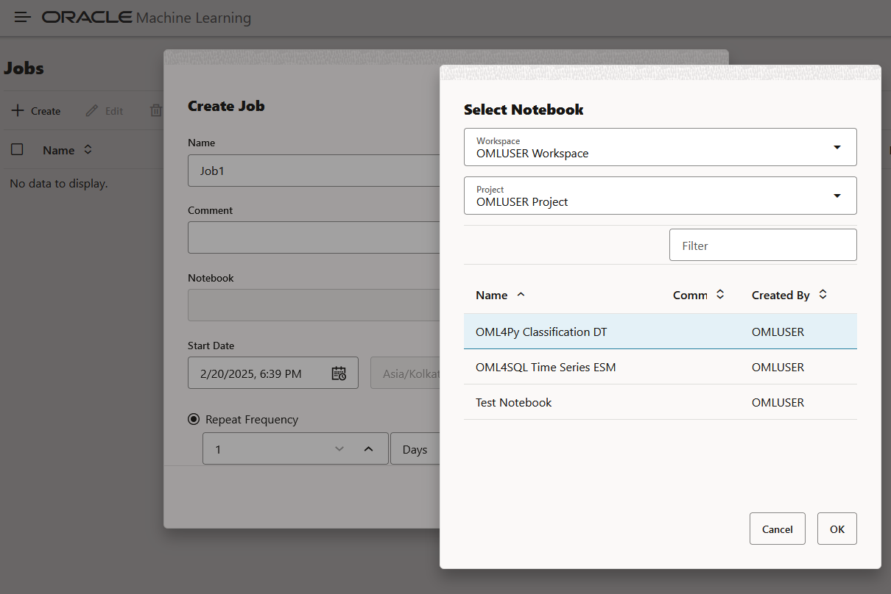
	

5. In the **Start Date** field, click the date-time editor to set the date and time for your job to commence. You can select the current date or any future date and time. Based on the selected date and time, the next run date is computed.

6. Select **Repeat Frequency** and enter **3**, and select **Days** to set the repeat frequency and settings. You can set the frequency in minutes, hours, days, weeks, and months.

7. Expand **Advanced Settings**, and specify the following settings:

	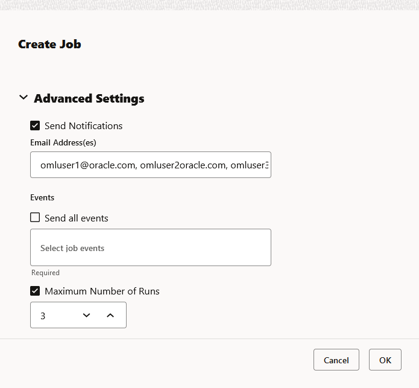

	* **Send Notifications:** Click this option and in the **Email Address(es)** field, enter the email addresses to which you want to send notifications about the selected events for the job. By default, you can enter up to three email IDs, separated by comma.

	* **Events:** Click to select the events for which you want to send the notification. The supported job events are `JOB_START, JOB_SUCCEEDED, JOB_FAILED, JOB_BROKEN, JOB_COMPLETED` and `JOB_STOPPED`. 
	
	* **Maximum Number of Runs:** Select **3**. This specifies the maximum number of times the job must run before it is stopped. When the job reaches the maximum run limit, it will stop.  

	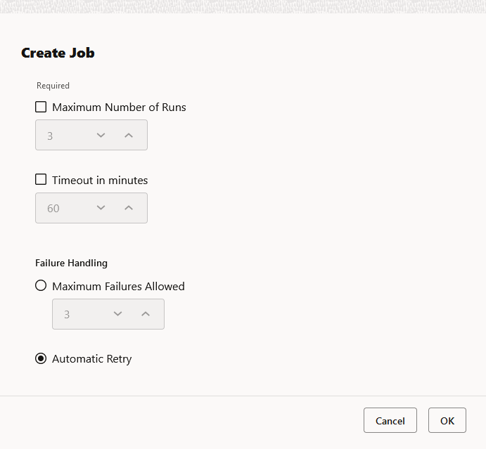

	* **Timeout in Minutes:** Select **60**. This specifies the maximum amount of time a job should be allowed to run.

	* **Maximum Failures Allowed:** Select **3**. This specifies the maximum number of times a job can fail on consecutive scheduled runs. When the maximum number of failures is reached, the next run date column in the Jobs UI will show an empty value to indicate the job is no longer scheduled to run. The Status column may show the status as `Failed`.

		> **Note:** Select **Automatic Retry** if you do not wish to specify the maximum failures allowed manually.  

8. Click **OK**. The job is now listed on the Jobs page with the status SCHEDULED.

	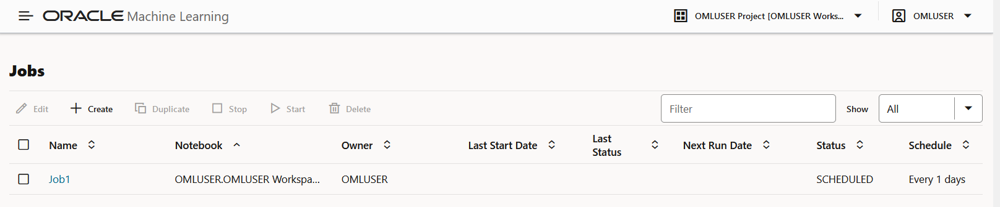

9. Click on the job row to enable the options to either **Edit**, **Duplicate**, **Start**, or **Delete** the selected job.

	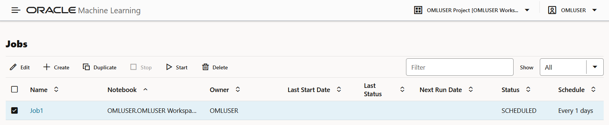

This completes the task of creating a job to schedule running of notebooks. 


## Task 5: Create Paragraph Dependencies and Run Paragraphs as per Dependency Order

Paragraph Dependencies allow you to add dependencies between paragraphs. The dependent paragraphs automatically run after the original paragraph is run, according to the order of dependency.
To create paragraph dependencies:
1. On the Notebooks page, click **Create**.
2. In the Create Notebooks dialog, enter the name _Paragraph Dependencies Demo_ in the **Name** field and click **OK.** The notebook is created, and it opens in the notebook editor.
3. On the notebook, hover your cursor over the lower border of the paragraph and click the + icon to add a paragraph. Or, click on the **Add SQL Paragraph** icon to call the PL/SQL interpreter.
	
4. In the first paragraph, copy and paste the following PL/SQL script. This script creates the view `ESM_SH_DATA` from the SALES table present in the SH schema.
	```
	<copy>
	CREATE OR REPLACE VIEW ESM_SH_DATA AS
	  SELECT TIME_ID, AMOUNT_SOLD FROM SH.SALES;
	</copy>
	```

5. In the second paragraph, copy and paste the following SQL script. This script gives a count of the record present in the view  `ESM_SH_DATA` .

	```
	<copy>
	SELECT COUNT(*) FROM ESM_SH_DATA;

	</copy>
	```

6. In the third paragraph, copy and paste the following SQL script to review the data in a tabular format.

	```
	<copy>
	SELECT * FROM ESM_SH_DATA
	FETCH FIRST 10 ROWS ONLY;

	</copy>
	```

7. Go to the first paragraph and click on the **Enter Dependency Mode** icon.
	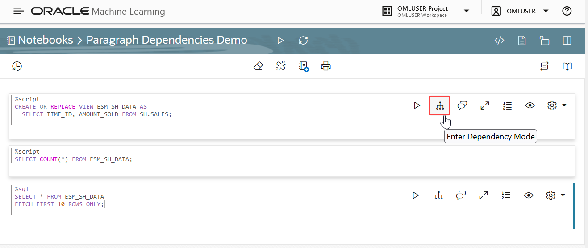

	The message appears: _You are selecting dependents for this paragraph._

8. Click on the second and third paragraph to add them as dependents of paragraph one.

	>**Note:** The order of paragraph dependency is based on the order of your click.

	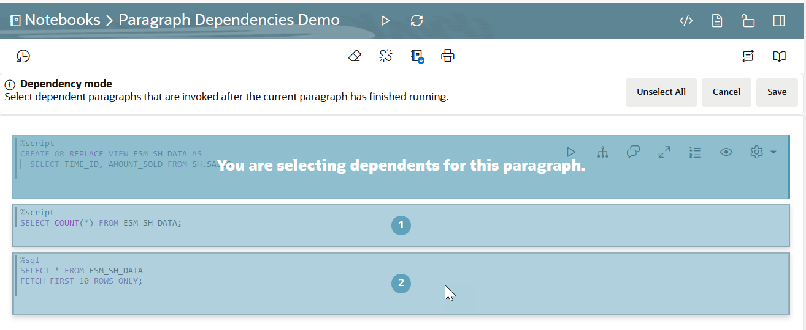

9. Click **Save.**
	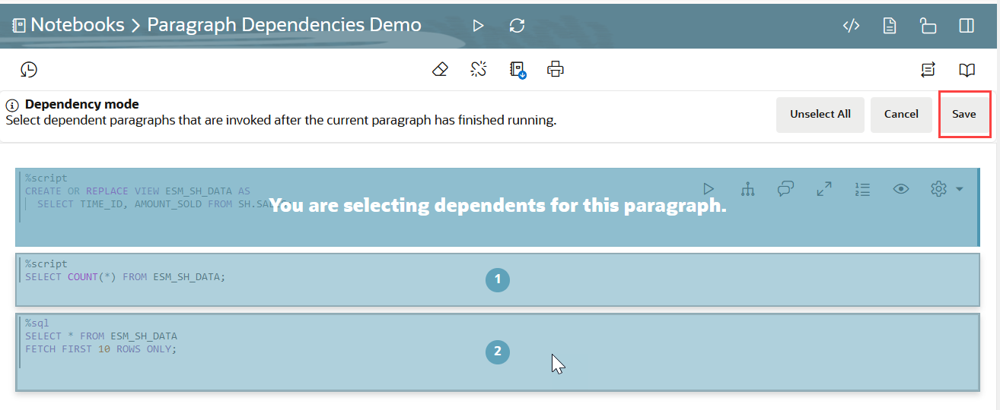

	Once the dependent paragraphs are defined and saved, it is indicated by the numbers as shown in the screenshot here:
	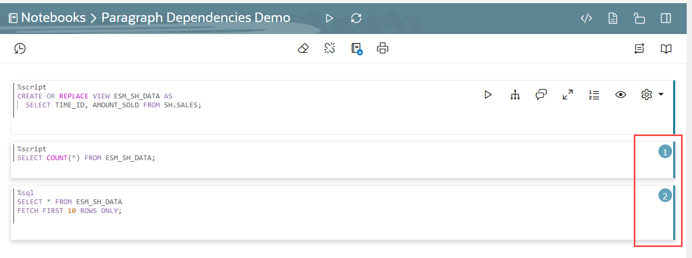
10. Now, go to the first paragraph and click the run icon. After the first paragraph starts successfully, the subsequent dependent paragraphs start to run according to the order of dependency.
	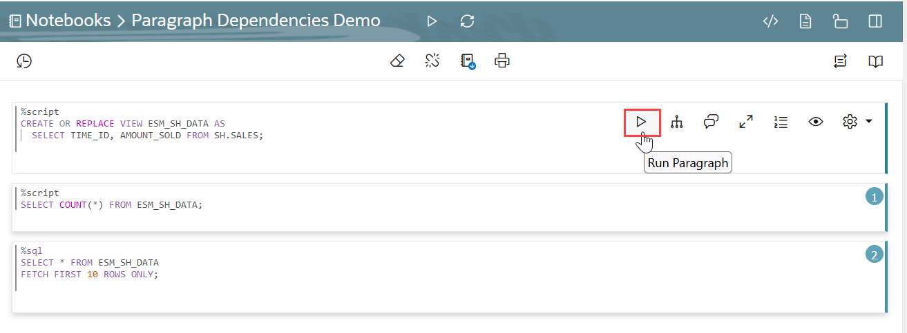
	This screenshot shows the successful run of paragraph 1 and 2 (dependent paragraph 1):
	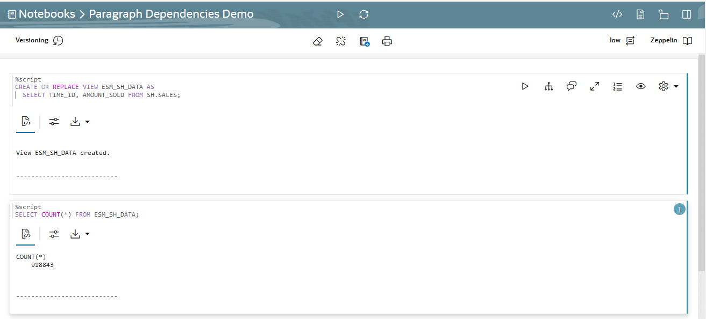

	This screenshot shows the successful run of paragraph 3 (dependent paragraph 2):
	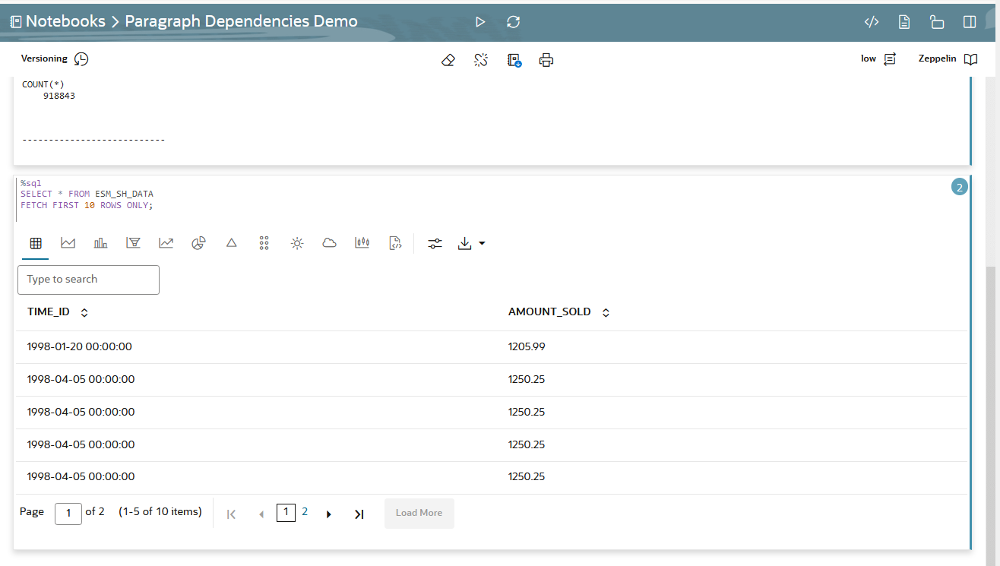

This completes the task of creating paragraph dependencies in a notebook, and run the paragraphs according to the dependency order.  


## Learn More

* [Oracle Machine Learning UI](https://docs.oracle.com/en/database/oracle/machine-learning/oml-notebooks/)


## Acknowledgements

* **Author** -  Moitreyee Hazarika, Principal User Assistance Developer, Database User Assistance Development
* **Contributors** -   Mark Hornick, Senior Director, Data Science and Machine Learning; Marcos Arancibia Coddou, Product Manager, Oracle Data Science; Sherry LaMonica, Consulting Member of Tech Staff, Machine Learning
* **Last Updated By/Date** - Moitreyee Hazarika, February 2025
