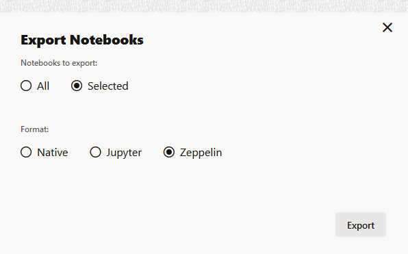

# Collaborate in Oracle Machine Learning Notebooks
## Introduction

This lab shows you how to two or more users can collaborate and share SQL notebooks with other Oracle Machine Learning Notebooks users.

A notebook is a web-based interface for data visualization, machine learning, and collaboration.

### Estimated Time
This lab takes approximately 15 minutes to complete.

### Prerequisites

* Access to your account in Oracle Autonomous Database
* Provide workspace permission to users with whom you want to collaborate
* Two users - `OMLUSER` and `OMLUSER2` are created.
* A notebook created in your OML account


## Task 1: Collaborate by Granting Access to Projects of Another User

You can collaborate with other users in Oracle Machine Learning Notebooks by granting permissions to access your workspace. Your workspace contains your projects, and the projects contain notebooks. Oracle Machine Learning Notebooks allows three types of permissions. By granting different types of permissions such as Manager, Developer, and Viewer, you can allow other user to view your workspace and perform different tasks in your projects and notebooks such as edit, create, update, delete, run, view notebooks and so on.

>**Note**: If you grant the permission type **Manager** or **Developer** , then the user can also drop tables, create tables, and run any scripts at any time on your account. The user with Viewer permission type can only view your notebooks, and is not authorized to run or make any changes to your notebooks.

This use case demonstrates how two Oracle Machine Learning Notebooks users - `OMLUSER` and `OMLUSER2` collaborate to share notebooks by granting permission to access notebooks in **OMLUSER Project** under **OMLUSER Workspace**. For each user, a workspace along with a project are created by default, at the time of user creation. In this tutorial the notebook that `OMLUSER2` accesses and edits, is in **OMLUSER Project**, which is the default project owned by `OMLUSER`.

This use case demonstrates how:

* `OMLUSER` grants `OMLUSER2` the `DEVELOPER` permission type to access the **OMLUSER Workspace**, the default workspace owned by `OMLUSER`. As a result, `OMLUSER2` is able to access all the notebooks that are present in `OMLUSER Project` under `OMLUSER Workspace`.
* `OMLUSER2` accesses **OMLUSER Project** under **OMLUSER Workspace** while signing in as `OMLUSER2`. Since, `OMLUSER2` is granted the DEVELOPER permission type, therefore `OMLUSER2` can edit and run notebooks in **OMLUSER Project**. `OMLUSER2` can also create new notebooks in **OMLUSER Project**.
* `OMLUSER2` edits a notebook that is created by `OMLUSER` in **OMLUSER Project**
* `OMLUSER` views the changes in the notebook made by `OMLUSER2`.


> **Note:** `OMLUSER Workspace` and `OMLUSER2 Workspace` are default workspaces created for `OMLUSER` and `OMLUSER2` respectively.

> `OMLUSER Project` and `OMLUSER2 Project` are default projects under `OMLUSER Workspace` and `OMLUSER2 Workspace` respectively.

## Task 1.1: OMLUSER Grants DEVELOPER Permission to OMLUSER2

1. Sign into Oracle Machine Learning user interface with `OMLUSER` credentials.
2. Go to the Notebooks page of `OMLUSER` and view the list of notebooks that are available in **OMLUSER Project** under **USER Workspace**.

    

3. On the top right corner of the Oracle Machine Learning home page, click **OMLUSER Project** [OMLUSER Workspace... drop-down list, and select **Manage Workspaces**. The Workspaces page opens.  

    

4. Now, you will provide permission to `OMLUSER2` to the `OMLUSER Workspace`. On the Workspaces page, select **OMLUSER Workspace** and then click **Permissions**. The Workspace Permissions dialog opens.  

    

5.  In the Workspace Permissions dialog, select **OMLUSER2** from the Username drop-down list, and select **Developer** from the Permission Type field to grant DEVELOPER permission to `OMLUSER2`. Then click **+** to add permission to this user.
    

6. Once you have added the permission, the user along with the permission type is listed on the dialog. Click **OK.**
The message _Permissions have been updated successfully_ is displayed.
    

  The available permission types are:

  * Manager: A user with the permission type Manager may perform the following tasks:
    * Project - Create, update, delete your projects
    * Workspace - View only
    * Notebooks - Create, update, run, delete, and schedule jobs to run your notebooks
  * Developer: A user with the permission type Developer may perform the following tasks:
    * Project: View only
    * Workspace: View only
    * Notebooks: Create, update, run, and delete jobs to run your notebooks
  * Viewer: A user with the permission type Viewer can only view your workspace, projects, and notebooks.

   >**Note:** To change the permissions of an existing user, simply re-add the same user with the new permissions.

 7. This completes the task of granting the `DEVELOPER` permission to `OMLUSER2`. To delete a user along with the associated permission, select the workspace and click **Permissions**. In the Workspace Permissions dialog that opens, select the user and then click **Delete.** Then click **OK.**

    

## Task 1.2: OMLUSER2 Accesses Project Shared by OMLUSER

1. Sign in to the Oracle Machine Learning user interface using the `OMLUSER2` credentials.
2. On the top right corner, click **OMLUSER2 Project** [OMLUSER2 Project... drop-down list. USER2 Project is the default project under OMLUSER2 Workspace. Click **Select Project**.

    

3. In the Select Projects dialog, click the Workspace drop-down. Here, you can see two workspaces - **OMLUSER Workspace** and **USER2 Workspace** (default workspace for `OMLUSER2`). Select **OMLUSER Workspace**. 


The projects under OMLUSER Workspace are listed. To access the notebooks under OMLUSER Workspace, select **OMLUSER Project** , and click **OK**.
    

4. After clicking **OK**, note the change in the name of the project-workspace drop-down list at the top. The project-workspace drop-down list name changes to **OMLUSER Project [OMLUSER Workspace...** , while you are logged in as `OMLUSER2`. This indicates that `OMLUSER2` is currently accessing the **OMLUSER Project** under **OMLUSER Workspace** while signed in as `OMLUSER2`.

    

    Now, on the Workspaces page, click **OMLUSER Workspace** in the upper pane. The lower pane lists the projects that are accessible to `OMLUSER2` in the **OMLUSER Workspace**.
    


    Again, on the Workspaces page, click **OMLUSER2 Workspace** in the upper pane. The lower pane lists the projects that are accessible to `OMLUSER2` in the **USER2 Workspace**.
    

5. Now, go to the **Notebooks** page of Oracle Machine Learning user interface. Click on the Cloud menu on the top left of the page to open the navigation menu, and then click **Notebooks**.

    

6. On the `OMLUSER2` Notebooks page, you can now see all the notebooks that are owned by `OMLUSER` in the **OMLUSER Project**, which in **OMLUSER Workspace**. This is the same list of notebooks that is available in the **OMLUSER Project** that you created in Lab 2 of this workshop. Since `OMLUSER2` has been granted the `DEVELOPER` permission, therefore, as `OMLUSER2` you can click any of these notebooks to open, edit, and run the notebooks. As `OMLUSER2`, you can also create a new notebook in **USER Project**.

    

## Task 1.3: OMLUSER2 Edits Notebook Shared by OMLUSER

1. While signed in as `OMLUSER2`, go to the **Notebooks EA** page and click the **Test Notebook EA** notebook to open it. Scroll down to the bottom and click the **Add sql Paragraph** icon. 

     

2. Type the SQL statement to fetch data from an Oracle Database. For example, type the following:

    ```
    <copy>
    SELECT * from SH.SALES; 
    </copy>
    ```
    where `SH` is the schema name and `SALES` is the table name, as shown in the screenshot:

     

4. Click the Run icon to run the paragraph to render the data in a table. 

     

     >**Note:** You have edited and run the _Test Notebook EA_ which is present in the **OMLUSER Project** in **OMLUSER Workspace**, while signed in in as `OMLUSER2`.  

5. Sign out of the Oracle Machine Learning user interface.

## Task 1.4: OMLUSER Collaborates with OMLUSER2 on the Same Notebook in Real-Time
This section shows how `OMLUSER` and `OMLUSER2` collaborate on the Sales Note notebook in real-time. Both users have the Sales Note notebook opened in different browsers, and they work on it simultaneously. The changes made by the users are dynamically reflected in the notebook in real-time. To try this example on the same client machine, for example, your laptop, use two different types of browsers such as Chrome and Firefox to enable two different logins. To see changes dynamically, try to position these two browser windows side by side on your screen so that both views are visible.

1. Sign in to the Oracle Machine Learning instance as `OMLUSER` in Mozilla Firefox browser. Click **Notebooks** on the home page to view the list of notebooks. Observe that the entry for **Updated By** column for **Test Notebook EA** notebook shows `OMLUSER2`.

     

2. Click **Test Notebook EA** to open and view the notebook. The changes that are made by `OMLUSER2` are visible to `OMLUSER` when you open the same notebook in **OMLUSER Project** under **OMLUSER Workspace**.

    

3. While signed in as `OMLUSER`, edit the **Test Notebook EA** by adding the following and click **Run**. 

    
    ```
    <copy>
    ORDER BY CUST_ID
    </copy>
    ```

    Note the change in display of the data, and also the date and time of edit made by `OMLUSER`.
    

4. Now, sign in as `OMLUSER2` in another browser. In this example, it is Google Chrome. As `OMLUSER2`, you can see the edits made by `OMLUSER`. While signed in as `OMLUSER2`, edit the SQL code to add this:

    ```
    <copy>
    where AMOUNT_SOLD <= 50.68 
    </copy>
    ```
        
    Click **Run**. The **Sales Note** notebook now displays refined data accordingly. Note the date and time.
    

5. Now, go to Firebox browser and view the **Test Notebook EA** notebook as `OMLUSER`. The change made by `OMLUSER2` is dynamically reflected in Firefox where you are accessing the notebook as `OMLUSER`, as shown in the screenshot. This is how two or more users can collaborate in real-time on the same notebook.
 Note that you are signed in as `OMLUSER` in Firefox and as `OMLUSER` in Chrome.
    

## Task 2: Collaborate by Using the Export Option

You can export a notebook and later import it in to the same or a different environment.

You can export a notebook in two ways:

1. From the Notebooks page:

    * Select the notebook that you want to export, and click **Export**.
         
    * In the Export Notebook dialog, for Notebooks to export, click **Selected**. Select the format in which you want to export the notebook, and then click **OK**.
        

2. From the Notebook editor: 

    * On the Notebooks page, click the notebook to open it in the Notebook editor.         
    * In the top panel of the notebook editor, click the export icon. This opens the Export Notebook dialog.
      
    * In the Export Notebook dialog, select your export preferences, and click **Export**.   
       
      You can export the notebook as a 
        * `.dsnb` file (Early Adopter notebook), 
        * `.zpln` file (Zeppelin notebook) and 
        * `.ipynb` file (Jupyter notebook). 
        


## Task 3: Collaborate by Using Oracle Machine Learning Templates

You can share a notebook by saving an existing notebook as a template in My Library or in Shared location in Oracle Machine Learning user interface. To save a notebook as a template:

1. On the Notebooks page, select the notebook that you want to save as template and click **Save as Template**. The Save as Template dialog box opens.

    

2. In the Save as Template dialog, enter these details.
    

    * **Name**: Enter a name for the notebook template.

    * **Comments**: Enter comments, if any.

    * **Tags**: Enter tags for the template.

    *  **Save To**: 
        - Select **Personal** if you want to save this notebook under **Personal** templates. Notebooks under **Personal** are visible only to the owner of the notebook. 
        - Select **Shared** if you want to save and share this notebook. The **Shared** template is visible to all users of the system within the scope of the tenant.

3. Once the notebook is successfully saved as a template in the designated location, the message appears. On the message, you have the option to open the notebook directly by clicking **Open template**.
    

4. You can also view the template in the **Personal** or **Shared** location, whereever it is saved. Click on the Cloud menu icon to open the left navigation pane, click **Templates** and then click **Shared** to view this notebook. 

    

>**Note:** Notebook templates under **Examples** are provided by Oracle and are visible to all tenants. Users cannot add notebooks to the Examples template.     


You may now **proceed to the next lab.**

## Acknowledgements
* **Author** : Mark Hornick, Sr. Director, Data Science / Machine Learning PM; Moitreyee Hazarika, Principal User Assistance Developer, Database User Assistance Development

* **Last Updated By/Date**: Moitreyee Hazarika, March 2024
