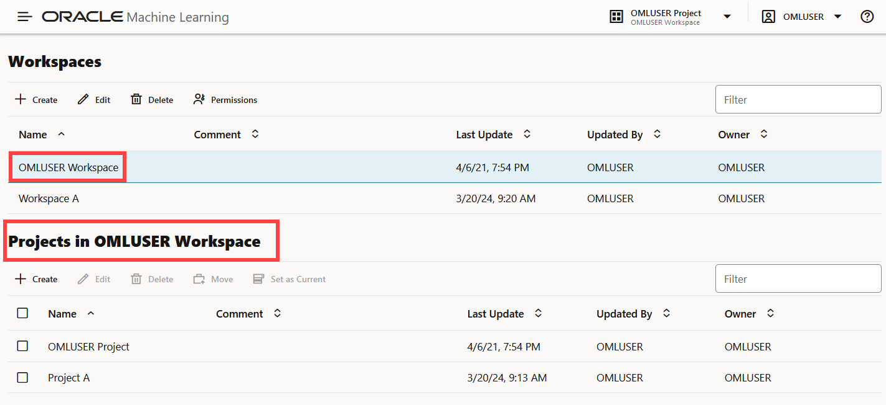
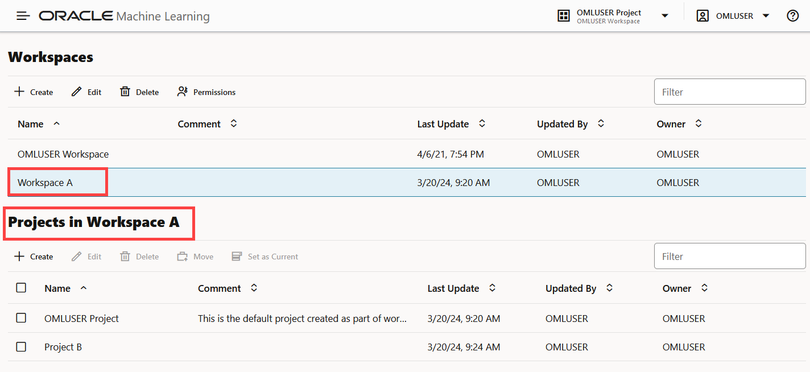

# Create Projects and Workspaces in Oracle Machine Learning Notebooks
## Introduction

This lab walks you through the steps to create a project and a workspace in Oracle Machine Learning Notebooks.

>**Note:** The initial workspaces and the default project are created by the Oracle Machine Learning service automatically when you log in to Oracle Machine Learning Notebooks for the first time. The term default applies to the last project that you work on, and it is stored in the browser cache. If you clear the cache, then there would be no default project selected. Then you must select a project to work with notebooks.

A project is a container for storing your notebooks and other objects such as dashboards and so on. A workspace is a virtual space where your projects reside, and multiple users with the appropriate permission type can work on different projects. While you may own many projects, other workspaces and projects may be shared with you.

This lab explains the steps to

* Create an Oracle Machine Learning user
* Sign into Oracle Machine Learning user interface
* Create your own project, and optionally your workspace.

### Estimated Time:
This lab takes approximately 10 minutes to complete.

### Prerequisites

Access to your Oracle Machine Learning Notebooks account

## Task 1: Create an Oracle Machine Learning user

## Task 2: Sign into Oracle Machine Learning User Interface

## Task 3: Create Project in Oracle Machine Learning Notebooks

A project is a container for your notebooks, and a workspace is a container for your projects. While you may own many projects, other workspaces and projects may be shared with you.
The initial workspace and the default project is created by the Oracle Machine Learning service automatically when you log in to Oracle Machine Learning for the first time. 

In this task, you will create a project by the name _Project A_ in _OMLUSER Workspace_.  

To create a new project:

1. On the top right corner of Oracle Machine Learning home page, click the project drop-down list. The project name and the workspace, in which the project resides, are displayed here. In this screenshot, the project name is _OMLUSER Project_, and the workspace name is _OMLUSER Workspace_. If a default project exists, then the name of the default project is displayed here. To choose a different project, click **Select Project**.

	>**Note:** The last project that you have worked on is stored in the browser cache and is the default project. If you clear the cache, then no default exists and you must select a project.

  You can create projects in two ways:
	* Use the **New Project** option: Click the down arrow next to the **Project** field and then click **New Project**. The Create Project dialog opens. 
		

	* Use the **Create** option on the Workspaces page: Click the down arrow next to the Project field and click **Manage Workspace.**

		

		On the Manage Workspace page, under the **Projects in <user> Workspace** section, click **Create.** The Create Project dialog opens.
		

2. In the Create Project dialog, enter the following:

	* **Name:** Enter a name for your project.
	* **Comments:** Enter comments, if any.
	* **Workspace:** The default workspace is selected. This is a non-editable field. To select a different workspace or to create a new workspace, go to Manage Workspace.

	

3. Click **OK**. This completes the task of creating a project and assigning it to a workspace. In this example, the newly created project is _Project A_ and the assigned workspace is _OMLUSER Workspace_.

## Task 4: Create Workspace in Oracle Machine Learning Notebooks

You can create and manage new projects and workspaces, provide access to your workspace, manage permissions for users, and edit and delete workspace.
The Workspaces page comprises two sections, one for workspaces and the other for projects.

In this task, you will create:
* A workspace by the name _Workspace A_
* A project by the name _Project B_ in _Workspace A_

To create a workspace:

1. On the top right corner of your home page, click the down arrow next to the Project field, and click **Manage Workspaces.** The Workspaces page opens. On the Workspaces page, you can create and manage workspaces and projects.

  

2. On the upper section for workspace, click **Create.** The Create Workspace dialog opens.

  

3. In the Create Workspace dialog box, enter `Workspace A` in the **Name** field and click **OK.**

  

	>**Note:** In the Default project details, the project _OMLUSER Project_ is present. This is the project that is created by default for OMLUSER workspace. Note that you are signed in as OMLUSER.  

4. Now, let's create a project in Workspace A. On the Workspace page, click **Workspace A** and then in the lower pane for projects, click **Create.** This will create the project in Workspace A. The Create Project dialog opens.

  

5. In the Create Project dialog, enter `Project B` in the **Name** field, and click **OK.**

	>**Note:** In the Workspace field, Workspace A is selected.

	

6. This completes the task of creating Project B in Workspace A, and brings you back to the Manage Workspaces page.

7. On the Manage Workspaces page, you can now view the projects that are created for the two workspaces - OMLUSER Workspace and Workspace A, as shown in the screenshot here:

	* In the Workspaces section, click USER1 Workspace. In the lower pane _Projects in USER1 Workspace_, you can view Project A and the default USER1 Project.
	
	* In the Workspaces section, click Workspace A. In the lower pane _Projects in Workspace A_, you can see that Project B and the default `OMLUSER` Project are listed.
	

	>**Note:** `OMLUSER Project` is the default project that is created as part of `OMLUSER Workspace` creation. Because you are signed in as `OMLUSER`, the default workspace is `OMLUSER Workspace` and the default project is `OMLUSER Project`.  

   

9. To delete a workspace, select the workspace you want to delete on the Manage Workspace page and click **Delete.** This deletes the selected workspace along with all the projects in it.

You may now **proceed to the next lab.**

## Acknowledgements

* **Author** : Mark Hornick, Sr. Director, Data Science / Machine Learning PM; Moitreyee Hazarika, Principal User Assistance Developer, Database User Assistance Development

* **Last Updated By/Date**: Moitreyee Hazarika, May 2024
