# Oracle® Cloud Create Projects and Workspaces in Oracle Machine Learning Notebooks
## Before You Begin

This lab walks you through the steps to create a project and a workspace in Oracle Machine Learning Notebooks.

>**Note:** The initial workspaces and the default project are created by the Oracle Machine Learning service automatically when you log in to Oracle Machine Learning Notebooks for the first time. The term default applies to the last project that you work on, and it is stored in the browser cache. If you clear the cache, then there would be no default project selected. Then you must select a project to work with notebooks.

This lab explains the steps to

* Create an Oracle Machine Learning user
* Sign into Oracle Machine Learning user interface
* Create your own project, and optionally your workspace.

This lab takes approximately 10 minutes to complete.

### Background
A project is a container for storing your notebooks and other objects such as dashboards and so on. A workspace is a virtual space where your projects reside, and multiple users with the appropriate permission type can work on different projects. While you may own many projects, other workspaces and projects may be shared with you.

### What Do You Need?

Access to your Oracle Machine Learning Notebooks account

## Create an Oracle Machine Learning user

An administrator creates a new user account and user credentials for Oracle Machine Learning in the User Management interface.

>**Note:** You must have the administrator role to access the Oracle Machine Learning User Management interface.

To create a user account:

1. Sign into your OCI account, click the hamburger on the left to open the left navigation pane, and click **Oracle Database**. On the right pane under Autonomous Database, click **Autonomous Data Warehouse**.

	

2. The Autonomous Database dashboard lists all the databases that are provisioned in the tenancy. Click the Oracle Autonomous Database that you have provisioned.

	

3. On the Autonomous Database details page, click **Database Actions**.

	

4. The Oracle Database Actions Launchpad page opens in a separate tab.

	>**Note:** The credential to sign into Database Actions, is the Administration username and password for the Autonomous Database instance.

	Scroll down to the Administration section and click **DATABASE USERS**.
	

5. Click **Create User**. The Create User dialog opens.

	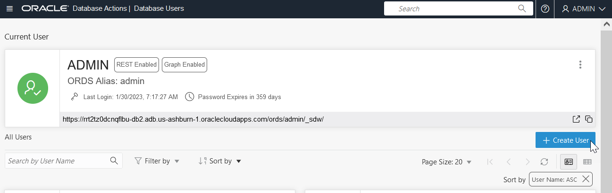

6. On the Create User dialog, enter the following details and click **Create User**:

	

	* **User Name:** Enter the user name OMLUSER.
	* **Password:** Enter a password for this user.
	* **Confirm Password:** Re-enter the password that you entered in the Password field.
	* **Graph:** Select this option to enable graph for this user.
	* **Web Access:** Select this option to allow web access to this user.
	* **OML:** Select this option to allow this user to access Oracle Machine Learning.
	* **Quota of tablespace data:** Click on the drop-down list and select an option. For this lab, 1G is selected.
	* **Password Expired:** Select this option if you want the user to reset the password.
	* **Account is locked:** Select this option to lock the account.

7. After the user is created successfully, the message _User OMLUSER created successfully_ is displayed.

	

	Scroll down the page to view the user. The OMLUSER is listed along with all details. Click  to edit, delete, or disable any of the privileges granted to the user.
	

This completes the task of creating an Oracle Machine Learning user.

## Sign into Oracle Machine Learning Notebooks

A notebook is a web-based interface for data analysis, data discovery, data visualization, and collaboration. You create and run notebooks in Oracle Machine Learning Notebooks. You can access Oracle Machine Learning Notebooks from Autonomous Database.

1. From the tab on your browser with your ADW instance, click **Database Actions**, then select **Development** on the left.

	

2. Click **Oracle Machine Learning Notebooks.**

	 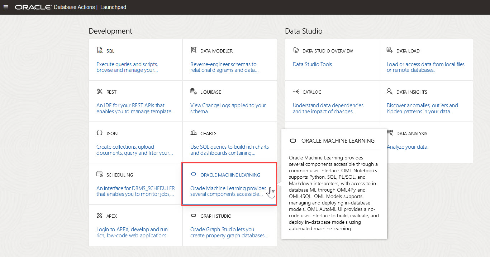

3. Enter your user credentials and click **Sign in**.

	>**Note:** The credential is what you have defined while creating the Oracle Machine Learning user.

	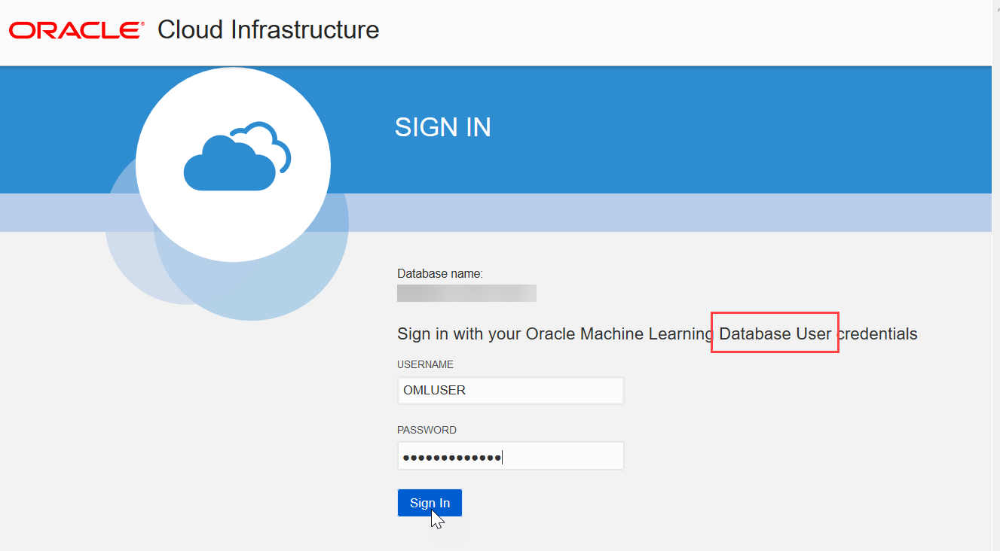

4. Click **Notebooks** in the Quick Actions section.

	

This completes the task of signing into Oracle Machine Learning user interface.

## Create Project in Oracle Machine Learning Notebooks

A project is a container for your notebooks, and a workspace is a container for your projects. While you may own many projects, other workspaces and projects may be shared with you.
The initial workspace and the default project is created by the Oracle Machine Learning service automatically when you log in to Oracle Machine Learning for the first time. To create a new project:

1. On the top right corner of Oracle Machine Learning home page, click the project drop-down list. The project name and the workspace, in which the project resides, are displayed here. In this screenshot, the project name is `USER1 Project`, and the workspace name is `USER1 Workspace`. If a default project exists, then the name of the default project is displayed here. To choose a different project, click **Select Project**.

	>**Note:** The last project that you have worked on is stored in the browser cache and is the default project. If you clear the cache, then no default exists and you must select a project.

  You can create projects in two ways:
	* Use the **New Project** option: Click the down arrow next to the **Project** field and then click **New Project**. The Create Project
	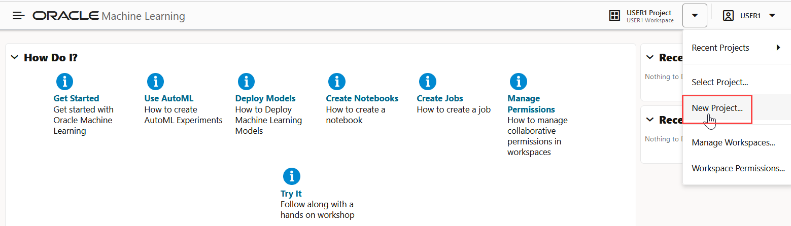

	* Use the **Create** option on the Workspaces page: Click the down arrow next to the Project field and click **Manage Workspace.**

		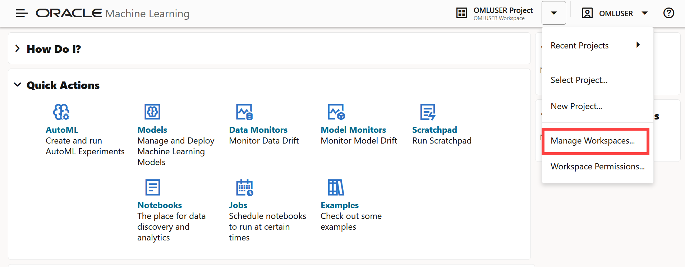

		On the Manage Workspace page, under the **Projects in <user> Workspace** section, click **Create.** The Create Project dialog opens.
		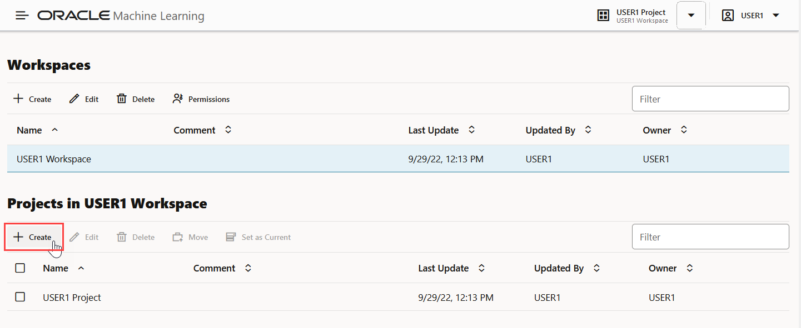

2. In the Create Project dialog, enter the following:

	* **Name:** Enter a name for your project
	* **Comments:** Enter comments, if any.
	* **Workspace:** The default workspace is selected. This is a non-editable field. To select a different workspace or to create a new workspace, go to Manage Workspace.

	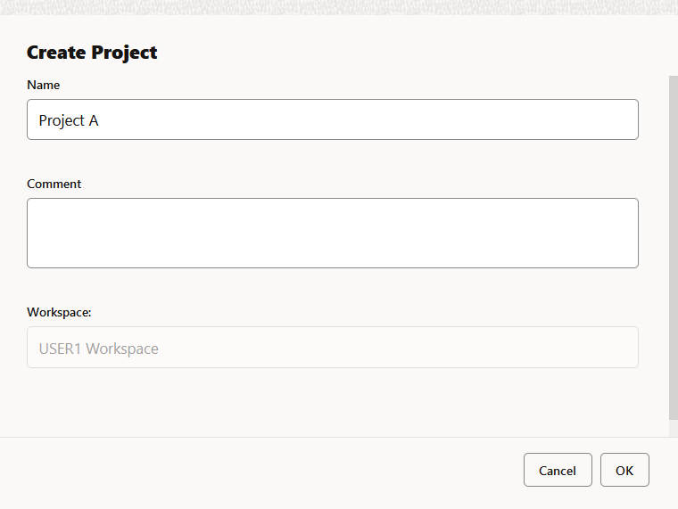

3. Click **OK**. This completes the task of creating a project and assigning it to a workspace. In this example, the assigned workspace is `USER1 Workspace`.

## Create Workspace in Oracle Machine Learning Notebooks

You can create and manage new projects and workspaces, provide access to your workspace, manage permissions for users, and edit and delete workspace.
The Workspaces page comprises two sections, one for workspaces and the other for projects.

In this lab, you will create:
* A workspace by the name _Workspace A_
* A project by the name _Project B_ in _Workspace A_
* A project by the name _Project A_ in _USER1_ Workspace

To create a workspace:

1. On the top right corner of your home page, click the down arrow next to the Project field, and click **Manage Workspaces.** The Workspaces page opens. On the Workspaces page, you can create and manage workspaces and projects.

  

2. On the upper section for workspace, click **Create.** The Create Workspace dialog opens.

  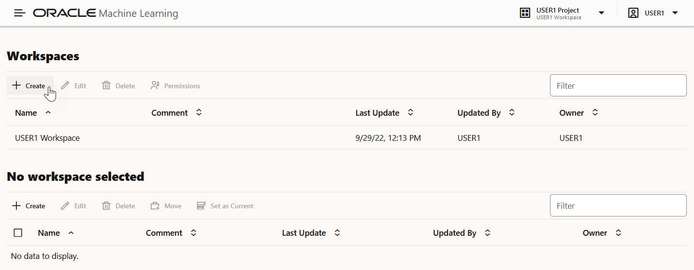

3. In the Create Workspace dialog box, enter `Workspace A` in the **Name** field and click **OK.**

  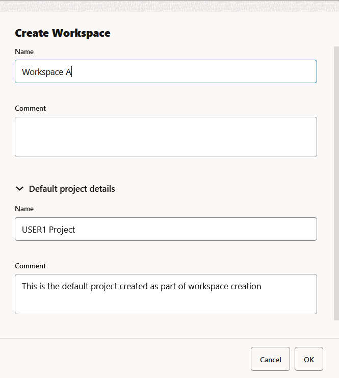

	>**Note:** In the Default project details, the project _USER1 Project_ is present. This is the project that is created by default for USER1 workspace. Note that you are signed in as USER1.  

4. Now, let's create a project in Workspace A. On the Workspace page, click **Workspace A** and then in the lower pane for projects, click **Create.** This will create the project in Workspace A. The Create Project dialog opens.

  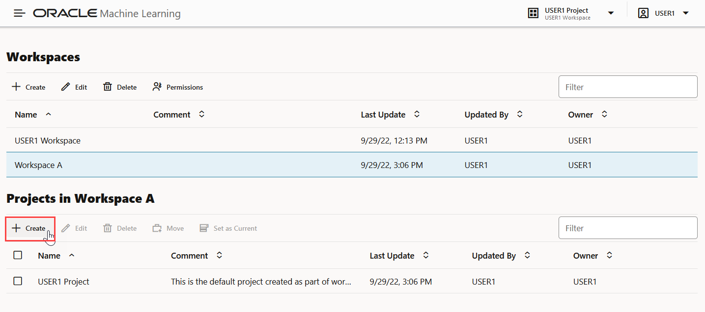

5. In the Create Project dialog, enter `Project B` in the **Name** field, and click **OK.**

	>**Note:** In the Workspace field, Workspace A is selected.

	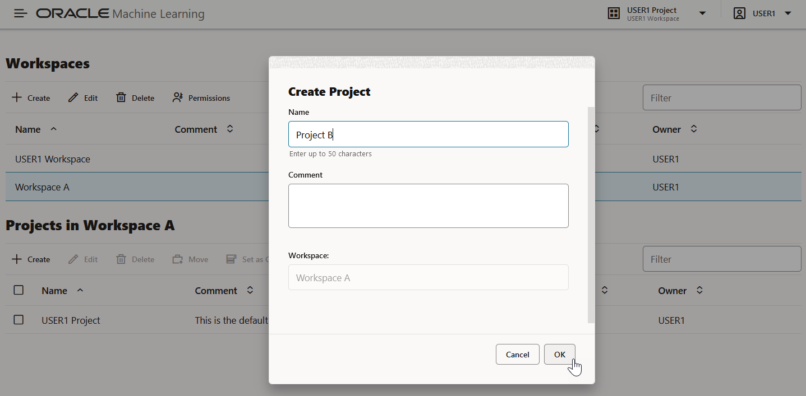

6. This completes the task of creating Project B in Workspace A, and brings you back to the Manage Workspaces page.

7. On the Manage Workspaces page, you can now view the projects that are created for the two workspaces - USER1 Workspace and Workspace A, as shown in the screenshot here:

	* In the Workspaces section, click USER1 Workspace. In the lower pane _Projects in USER1 Workspace_, you can view Project A and the default USER1 Project.
	* In the Workspaces section, click Workspace A. In the lower pane _Projects in Workspace A_, you can see that Project B and the default USER1 Project are listed.

	>**Note:** USER1 Project is the default project that is created as part of USER1 workspace creation. Because you are signed in as USER1, the default workspace is USER1 Workspace and the default project  USER1 Project is listed.  

   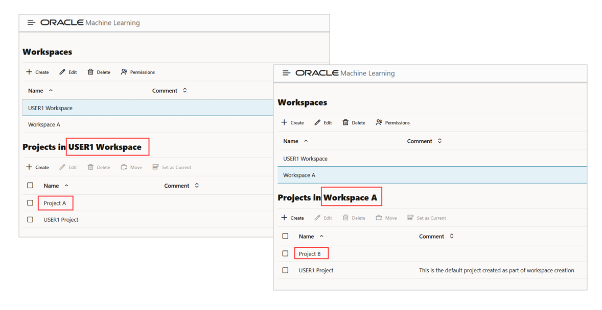

9. To delete a workspace, select the workspace you want to delete on the Manage Workspace page and click **Delete.** This deletes the selected workspace along with all the projects in it.

## Acknowledgements

* **Author** : Mark Hornick, Sr. Director, Data Science / Machine Learning PM; Moitreyee Hazarika, Principal User Assistance Developer, Database User Assistance Development

* **Last Updated By/Date**: Moitreyee Hazarika, September 2022

See an issue?  Please open up a request [here](https://github.com/oracle/learning-library/issues).   Please include the workshop name and lab in your request.
