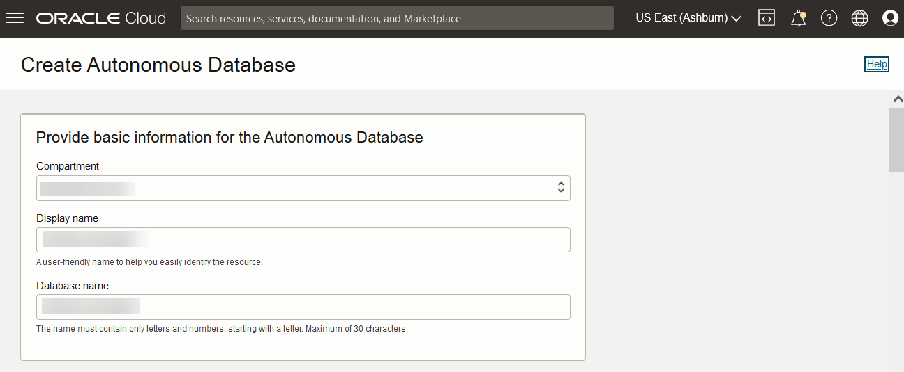
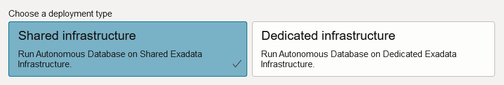
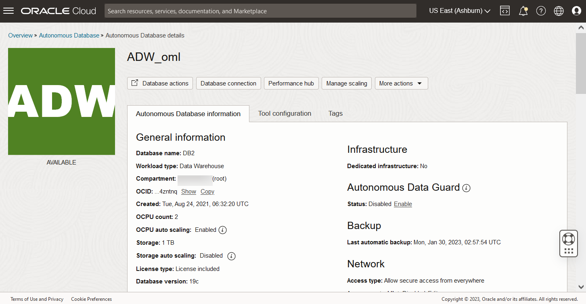

# Get started with Free Tier Setup

## Introduction
This lab walks you through the steps to set up your free tier environment that includes provisioning an Oracle Autonomous Database, and signing into Oracle Machine Learning user interface.

Estimated Lab Time: 15 minutes

### Objectives

In this lab, you will learn how to:

* Provision an Oracle Autonomous Database

	>**Note:** You will use this table in the lab on AutoML UI and OML Services.

### Prerequisites
* Sign up for a free tier Oracle Cloud account.

> **Note:** You may see differences in account details (eg: Compartment Name is different in different places) as you work through the labs. This is because the workshop was developed using different accounts over time.

## Task 1: Provision an Oracle Autonomous Database

To provision an Oracle Autonomous Database:

1. Sign into your OCI account, and under the Launch Resources section, click **Create an ADW database**.

	

	 Alternatively, you may click the left navigation pane on the upper left corner, and click **Autonomous Data Warehouse** under **Oracle Database**.

	

2. From the Oracle Cloud Infrastructure console, on the Oracle Autonomous Database page choose your region and select a compartment. Click **Create Autonomous Database**. This opens the Create Autonomous Database page.

   

3. On the Create Autonomous Database page, provide the basic information about the database. By default, a database name and a display name for the database are provided. You can modify these names to enter a user-friendly display name for the ADB instance to easily identify the resource. The display name does not have to be unique.    

   

4. For Workload Type, click **Data Warehouse**.

	 

5. For Deployment, select **Shared Infrastructure**.

	 

6. For Database Configuration, select Always Free. For the Always Free option, the database configuration options - OCPU count, Storage, and Auto scaling are not available. You must upgrade to a paid account to avail of it.

	 > **Note:** You can create Always Free resources both in Free Tier and Paid accounts

  

7. Create your Autonomous Database administrator credentials by providing a password. You will need these credentials to sign into this Autonomous Database instance.   

	> **Note:** The default administrator username is ADMIN.

	

8. For network access, select **Allow secure access from everywhere.**

    

9. For License, select **License Included**.

    

10. Provide your email ID for any notifications and announcements, and click **Add Contact**. Then click **Create Autonomous Database**.

	 

	 The Oracle Autonomous Data Warehouse instance starts provisioning. Once your Autonomous Database is created, the database details are listed with the status Available.

	  

This completes the task of provisioning an Oracle Autonomous Database.

## Learn More

* [Oracle Machine Learning Notebooks](https://docs.oracle.com/en/database/oracle/machine-learning/oml-notebooks/)

## Acknowledgements
* **Author** - Moitreyee Hazarika, Principal User Assistance Developer, Database User Assistance Development
* **Contributors** -  Mark Hornick, Senior Director, Data Science and Machine Learning; Marcos Arancibia Coddou, Product Manager, Oracle Data Science; Sherry LaMonica, Principal Member of Tech Staff, Advanced Analytics, Machine Learning
* **Last Updated By/Date** - Moitreyee Hazarika, February 2023
