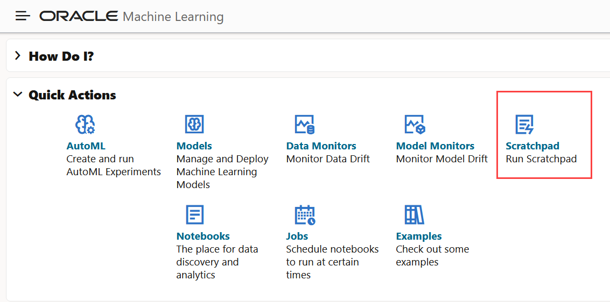
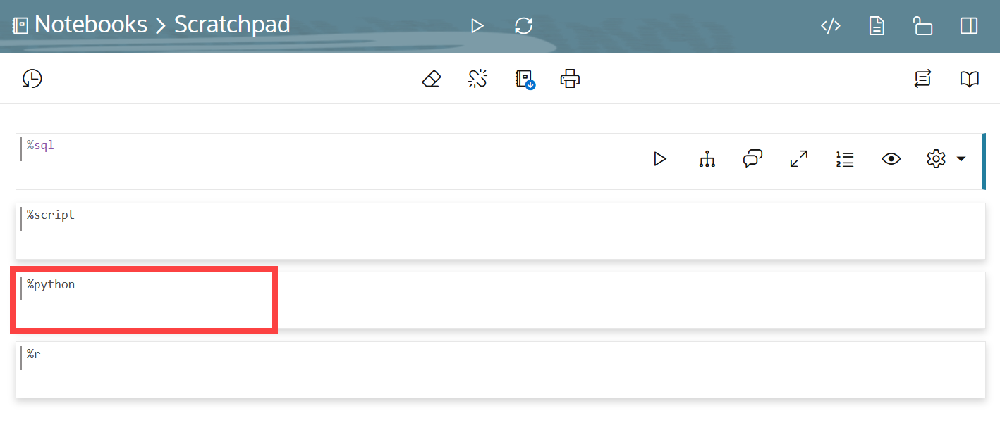
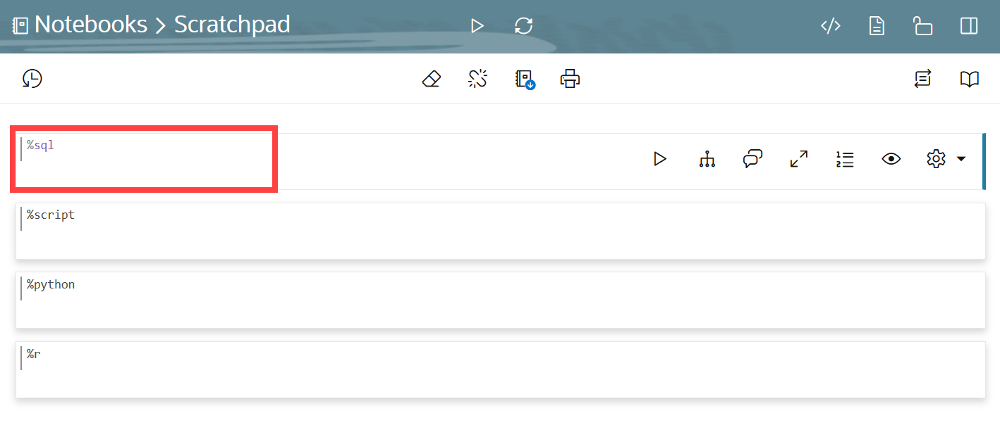
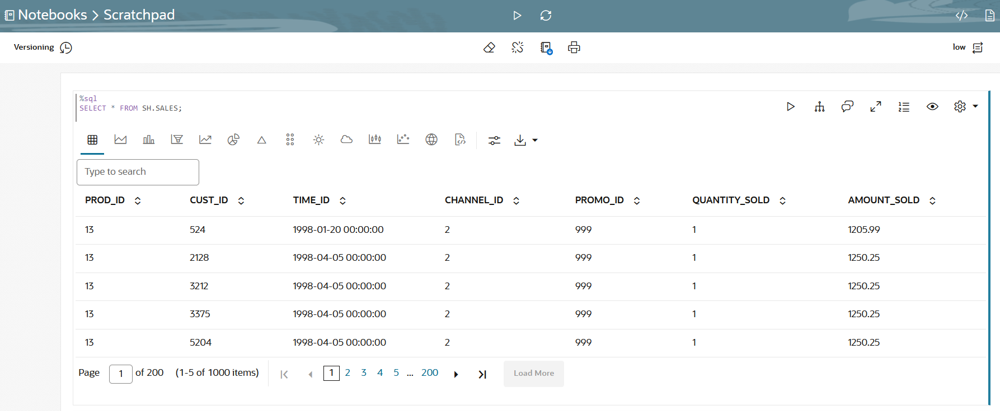
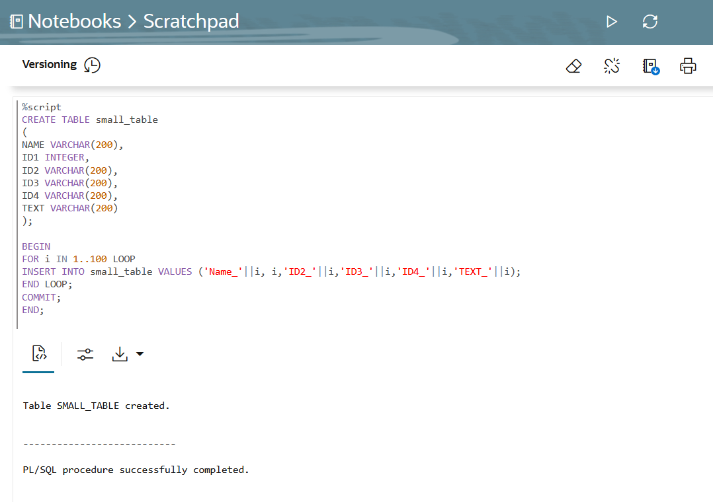

# Use the Scratchpad in Oracle Machine Learning Notebooks
## Introduction

This lab shows you how to use the Scratchpad in Oracle Machine Learning Notebooks.

The Scratchpad provides you convenient one-click access to a notebook for running SQL statements, PL/SQL scripts, Python and r scripts that can be renamed. The Scratchpad is available on the Oracle Machine Learning Notebooks home page. The Scratchpad is a regular notebook that is prepopulated with four paragraphs - `%sql`, `%script`, `%python` and `r`.

After you run your scripts, the Scratchpad is automatically saved as a notebook by the default name Scratchpad in the Notebooks page. You can access it later in the Notebooks page.
You can run all the paragraphs together or one paragraph at a time. 

### Estimated Time
This lab takes approximately 10 minutes to complete. 

### Prerequisites

* Access to your Oracle Machine Learning Notebooks account
* A project created in your Oracle Machine Learning Notebooks account, where the notebook will reside


## Task 1: Use the Scratchpad to Run Python Scripts

To open and use the scratchpad, click <b>Scratchpad</b> on the Oracle Machine Learning Notebooks home page under Quick Actions.

  

  The Scratchpad opens. The Scratchpad has three paragraphs each with the following directives:

  * `%sql`- Allows you to run SQL statements.
  * `%script` - Allows you to run PL/SQL scripts.
  * `%python` - Allows you to run Python scripts.
  * `%r` - Allows you to run R scripts.

To run python script:

1. Go to the paragraph with the <code>%python</code> directive.

   

2. To use OML4Py, you must first import the `oml` module.
   `oml` is the OML4Py module that allows you to manipulate Oracle Database objects such as tables and views, call user-defined Python functions using embedded execution, and use the database machine learning algorithms. To import the `oml` module, type the following command and click the Run icon. Alternatively, you can press **Shift+Enter** keys to run the paragraph.


    ```
    <copy>
    import oml
    </copy>
    ```

3. To check if the <code>oml</code> module is connected to Oracle Database,
   type the following command and click the <b>Run</b>icon. Alternatively, you can press **Shift+Enter** keys to run the paragraph.

    ```
    <copy>
    oml.isconnected()
    </copy>
    ```

4. You are now ready to run your Python script. Type the following Python code and click the run
   icon. Alternatively, you can press **Shift+Enter** keys to run the paragraph.

    ```
    <copy>
    import matplotlib.pyplot as plt
    import numpy as np

    list1 = np.random.rand(10)*2.1
    list2 = np.random.rand(10)*3.0

    plt.subplot(1,2,1) # 1 line, 2 rows, index nr 1 (first position in subplot)
    plt.hist(list1)
    plt.subplot(1, 2, 2) # 1 line, 2 rows, index nr 2 (second position in subplot)
    plt.hist(list2)
    plt.show()
    </copy>
    ```

    

    In this example, the commands import two python packages to compute and render the data in two histograms for `list1` and `list2`. The Python packages are:

      * Matplotlib - Python package to render graphs.
      * Numpy - Python package for computations.

5. After you have created and run your scripts in the Scratchpad, the Scratchpad is automatically saved as a notebook by the name default name `Scratchpad` in the Notebooks page. You can edit the name and save it with a new name by selecting the notebook and clicking **Edit**.

## Task 2: Use the Scratchpad to Run R Scripts
To run R functions in an Oracle Machine Learning notebook, you must first connect to the R interpreter. This example shows how to:

* Connect to the R interpreter to run R commands in a notebook.
* Verify the connection to Oracle Autonomous Database, and
* Load the ORE libraries

1. To connect to the R interpreter, type the following directive at the beginning of the notebook paragraph, and press Enter:

  ```
  <copy>
  %r
  </copy>
  ```

2. To verify the database connection, type the following command and press Enter:

  ```
  <copy>
  ore.isconnected()
  </copy>
  ```

  

  Once your notebook is connected, the command returns TRUE, as shown in the screenshot here. The notebook is now connected to the R interpreter, and you are ready to run R commands in your notebook.
3. To import R Libraries, run the following commands:

  ```
  <copy>
  library(ORE)
  library(OREdplyr)
  </copy>
  ```

  

  Once the packages are loaded successfully, the list of ORE packages are displayed as shown in the screenshot here. Scroll down to view the entire list.

## Task 3: Use the Scratchpad to Run SQL Statements

To run SQL statements:

1. Go to the paragraph with the `%sql` directive.

   

2. Type the following command and click the Run icon. Alternatively, you can pres **Shift+Enter** keys to run the paragraph.


    ```
    <copy>
    SELECT * FROM SH.SALES;
    </copy>
    ```
       

    In this example, the SQL statement fetches all of the data about product sales from the table SALES. Here, `SH` is the schema name, and `SALES` is the table name. Oracle Machine Learning fetches the relevant data from the database and displays it in a tabular format.

## Task 4: Use the Scratchpad to Run PL/SQL Scripts  

To run PL/SQL scripts:

1. Go to the paragraph with the `%script` directive.

   

2. Enter the following PL/SQL script and click the **Run** icon. Alternatively, you can press **Shift+Enter** keys to run the paragraph.

    ```
    <copy>
    CREATE TABLE small_table
    (
    NAME VARCHAR(200),
    ID1 INTEGER,
    ID2 VARCHAR(200),
    ID3 VARCHAR(200),
    ID4 VARCHAR(200),
    TEXT VARCHAR(200)
    );

    BEGIN
    FOR i IN 1..100 LOOP
    INSERT INTO small_table VALUES ('Name_'||i, i,'ID2_'||i,'ID3_'||i,'ID4_'||i,'TEXT_'||i);
    END LOOP;
    COMMIT;
    END;
    </copy>
    ```
    The PL/SQL script successfully creates the table SMALL_TABLE. The PL/SQL script in this example contains two parts:

    * The first part of the script contains the SQL statement `CREATE TABLE` to create a table named **small_table**. It defines the table name, table column, data types, and size. In this example, the column names are `NAME, ID1, ID2, ID3, ID4`, and `TEXT`.
    * The second part of the script begins with the keyword `BEGIN`. It inserts 100 rows in to the table small_table.


         

## Acknowledgements
* **Author** : Mark Hornick, Sr. Director, Data Science / Machine Learning PM; Moitreyee Hazarika, Principal User Assistance Developer, Database User Assistance Development

* **Last Updated By/Date**: Moitreyee Hazarika, November 2024
