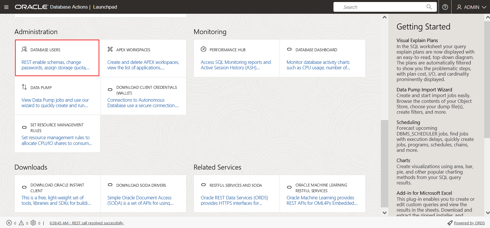
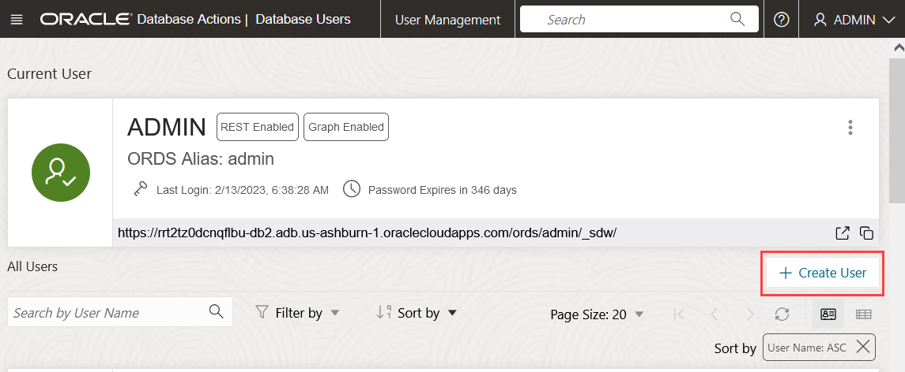
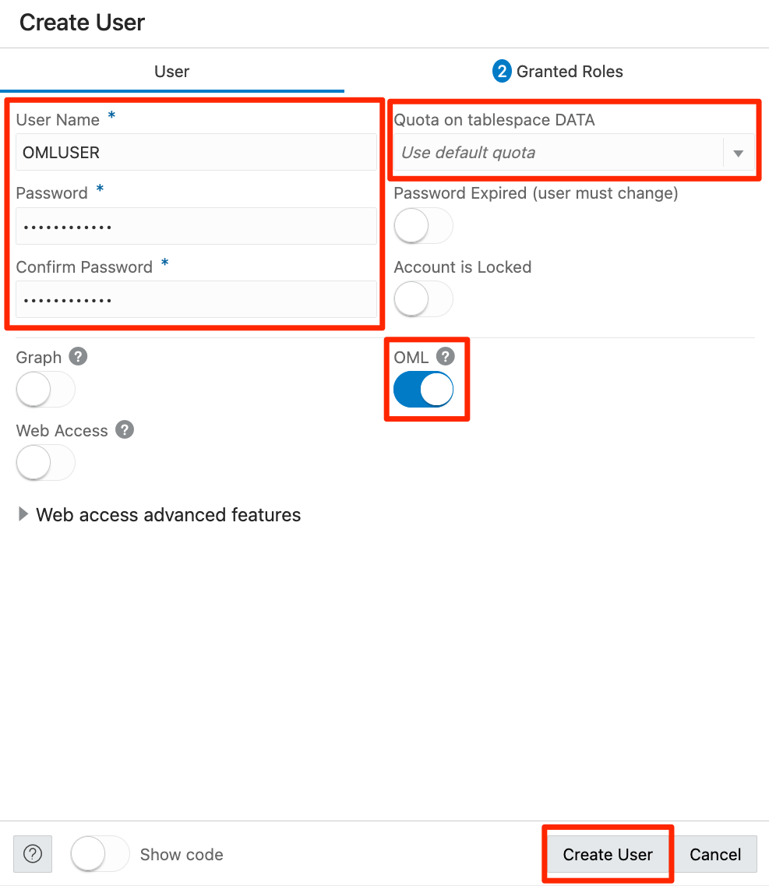
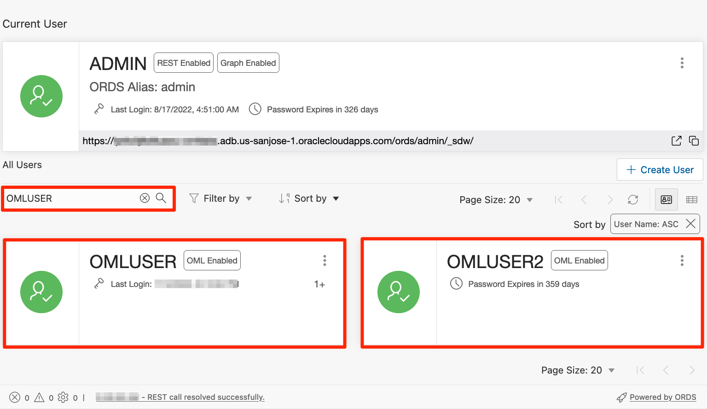
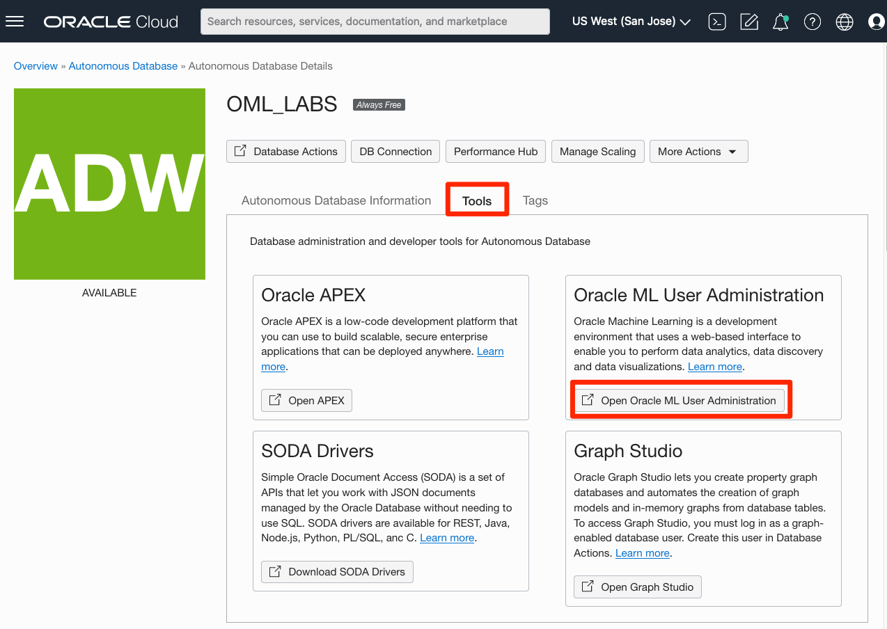

# Appendix: OML user administration

## Introduction
This lab walks you through the steps to create and manage an Oracle Machine Learning user.

Estimated Time: 5 minutes

### Objectives

In this lab, you will learn how to create an Oracle Machine Learning user using two different interfaces
* Use the Database Users interface inside Database Actions administration section
* Use the Oracle Machine Learning Notebooks administration interface
* Get familiar with OML user settings

## Task 1: Use the Database Users interface inside Database Actions administration section

 1. An administrator can create a new user account and user credentials for Oracle Machine Learning in the Database Users administration interface.

  > **Note:** You must have the administrator role to access the Database Users interface inside the administration section of the Database Actions interface.

  To access the Autonomous Database Actions as the ADMIN user, in your Autonomous Database details page, click the Database Actions button.

  

 2. To access the Database Users option in Database Actions, scroll down to the **Administration** section and click the Database Users tile.

  

 3. You should see the list of all current users registered with this Autonomous Database instance.  Click on the **Create User** button to begin the creation of a new user.

  

 4. In the **Create User** menu, enter the following information:
  - **Username:** Enter `omluser` for username. Using this username, the user will log in to an Oracle Machine Learning instance.
  - **Password:** Enter a password for the user, twice.
  Please **do not select** the **Password Expired** option, otherwise the user will receive a `Password Expired` notice when trying to login into OML Notebooks but will be unable to change it from that interface without first logging in.
  - **Confirm Password:** Enter a password to confirm the value that you entered in the Password field.
  By doing so, you create the password for the user. The user can change the password when first logging in.
  -  Select the UNLIMITED option in the **Quota on tablesoace DATA** section
  -  Make sure to check the **OML** toggle to ON.
  Click on **Create User**.

    

  `5.` You can repeat `step 4` when you need to create additional users.  For example, if you create an additional user named `omluser2`, you will see the result below if you filter the list of users by `omluser`.

    

## Task 2: Use the Oracle Machine Learning Notebooks administration interface

An administrator creates a new user account and user credentials for Oracle Machine Learning in the User Management interface.

> **Note:** You must have the administrator role to access the Oracle Machine Learning User Management interface. To create a user account:

1. On the Autonomous Database Details page, click **Tools**, and then click on the **Open Oracle ML User Administration** button inside the **Oracle ML User Administration** tile.

    

2. You will be asked for your ADMIN credentials to login.

   

3. To create a new user, click **Create** on the Oracle Machine Learning User Administration page.
    

4. On the Create User page, enter the following details to create a user called `OMLUSER`:
  
  - **Username:** Enter `omluser` for username. Using this username, the user will log in to an Oracle Machine Learning instance.
  - **First Name:** Enter the first name of the user.
  - **Last Name:**  Enter the first name of the user.
  - **Email Address:** Enter the email ID of the user.
  - Select the **Generate password and email account details to user. User will be required to reset the password on first sign in**  check box to auto generate a temporary password and send an email with the account credentials to the user.
  If you select this option, you don't need to enter values in the **Password** and **Confirm Password** fields; the fields are grayed out.
  - **Password:** Enter a password for the user, if you choose to create a password for the user.
  This option is disabled if you select the **Generate password...** option to auto generate a temporary password for the user.
  - **Confirm Password:** Enter a password to confirm the value that you entered in the Password field.
  By doing so, you create the password for the user. The user can change the password when first logging in.
    
  Click **Create.**

`5.` You can repeat `step 4` and if you need to create additional users.  For example, if you create an additional user named `omluser2`, you will see the result below.
  
 
## Learn More

* [Administer Oracle Machine Learning](https://docs.oracle.com/en/database/oracle/machine-learning/oml-notebooks/omlug/administer-oracle-machine-learning.html#GUID-E74F0E2E-EEE5-4421-A0BB-96A58811C04A)
* [Oracle Machine Learning Notebooks](https://docs.oracle.com/en/database/oracle/machine-learning/oml-notebooks/)

## Acknowledgements
* **Authors** - Marcos Arancibia, Product Manager, Machine Learning; Moitreyee Hazarika, Principal User Assistance Developer
* **Contributors** -  Mark Hornick, Senior Director, Data Science and Machine Learning; Sherry LaMonica, Principal Member of Tech Staff, Machine Learning; Jie Liu, Data Scientist
* **Last Updated By/Date** - Marcos Arancibia, August 2022
