# Introduction to Oracle Machine Learning AutoML UI

## Introduction

This lab walks you through the steps to create an AutoML experiment, edit and adjust experiment settings, view and deploy OML models.

Estimated Time: 20 minutes

### About Oracle Machine Learning AutoML UI

**Oracle Machine Learning AutoML UI (OML AutoML UI)** is a no-code user interface supporting automated machine learning for both data scientist productivity and non-expert user access to powerful in-database algorithms. Like the OML4Py AutoML API, it accelerates machine learning projects by giving quick feedback on data set suitability for producing useful models – alleviating much of the drudgery of the machine learning process.

**OML AutoML UI** automates model building with minimal user input – you just have to specify the data and the target in what’s called an experiment and the tool does the rest. However, you can adjust some settings, such as the number of top models to select, the model selection metric, and even specific algorithms.

With a few clicks, you can generate editable _starter_ notebooks. These notebooks contain data selection, building the selected model – including the settings used to produce that model – and scoring and evaluation code – all in Python using OML4Py.  You can build on this _generated notebook_ to apply your own domain expertise to augment the solution. 

Similarly, you can deploy models from OML AutoML UI as REST endpoints to Oracle Machine Learning (OML) Services in just a few clicks.

### Objectives

In this lab, you will learn how to:
* Access Oracle Machine Learning AutoML UI
* Create an experiment
* Edit and adjust experiment settings
* View the leaderboard and other settings
* Deploy models to Oracle Machine Learning Services
* View Oracle Machine Learning Models menu with deployed metadata and endpoint JSON
* Create a notebook for the top model
* View generated notebook and individual paragraphs

### Prerequisites

This lab assumes you have:
* An Oracle Machine Learning account
* Access to the OML UI
<if type="freetier">
* Successfully run the **Lab 1, Task 5 "Load sample data..."** for loading the necessary data for this Lab</if>
<if type="freetier-ocw23">
* Successfully run the **Lab 1, Task 5 "Load sample data..."** for loading the necessary data for this Lab</if>
<if type="livelabs-ocw23">
* A new Table that is required to run the experiment.  We will use the **ScrathPad** feature of OML UI to run a simple script to create a table.
     - Login to OML UI.  Go to the **Home Menu** of OML UI, and then click on the **ScratchPad** icon.

	 

     - Copy the code below and paste it into the second paragraph, indicated with the **`%script`**.
      
	  ```
	  <copy>
	  CREATE TABLE CUSTOMERS360 AS
          (SELECT a.CUST_ID, a.CUST_GENDER, a.CUST_MARITAL_STATUS,
             a.CUST_YEAR_OF_BIRTH, a.CUST_INCOME_LEVEL, a.CUST_CREDIT_LIMIT,
             b.EDUCATION, b.AFFINITY_CARD,
             b.HOUSEHOLD_SIZE, b.OCCUPATION, b.YRS_RESIDENCE, b.Y_BOX_GAMES
       FROM SH.CUSTOMERS a, SH.SUPPLEMENTARY_DEMOGRAPHICS b
       WHERE a.CUST_ID = b.CUST_ID);
	  ```
  
     - Your **Scratchpad** should look like the below. Click the **Run play button** as indicated below on the script paragraph to run the code and create the table.  

	 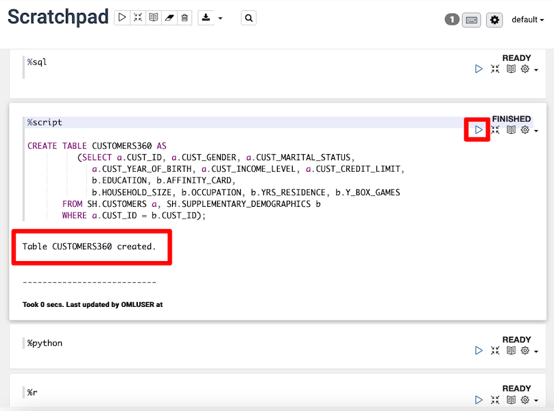

     - You should see a message **Table CUSTOMERS360 created**, indicating that the code was run successfully.  You are now ready to proceed with the Lab.
   
 </if>
<if type="livelabs">
* A new Table that is required to run the experiment.  We will use the **ScrathPad** feature of OML UI to run a simple script to create a table.
     - Login to OML UI.  Go to the **Home Menu** of OML UI, and then click on the **ScratchPad** icon.

	 

     - Copy the code below and paste it into the second paragraph, indicated with the **`%script`**.
      
	  ```
	  <copy>
	  CREATE TABLE CUSTOMERS360 AS
          (SELECT a.CUST_ID, a.CUST_GENDER, a.CUST_MARITAL_STATUS,
             a.CUST_YEAR_OF_BIRTH, a.CUST_INCOME_LEVEL, a.CUST_CREDIT_LIMIT,
             b.EDUCATION, b.AFFINITY_CARD,
             b.HOUSEHOLD_SIZE, b.OCCUPATION, b.YRS_RESIDENCE, b.Y_BOX_GAMES
       FROM SH.CUSTOMERS a, SH.SUPPLEMENTARY_DEMOGRAPHICS b
       WHERE a.CUST_ID = b.CUST_ID);
	  ```
  
     - Your **Scratchpad** should look like the below. Click the **Run play button** as indicated below on the script paragraph to run the code and create the table.  

	 

     - You should see a message **Table CUSTOMERS360 created**, indicating that the code was run successfully.  You are now ready to proceed with the Lab.
   
 </if>


## Task 1: Access Oracle Machine Learning AutoML UI

To access AutoML UI, you must sign into the Oracle Machine Learning User Interface, which also includes Oracle Machine Learning notebooks, on Autonomous Database:

1. Sign into Oracle Machine Learning user interface (following Lab1, Task 1 instructions).

2. On the Oracle Machine Learning home page, either click on the **AutoML** icon in the Quick Actions section or click the "hamburger" menu (the three lines) on the upper left of the screen, and then select **AutoML Experiments**.

	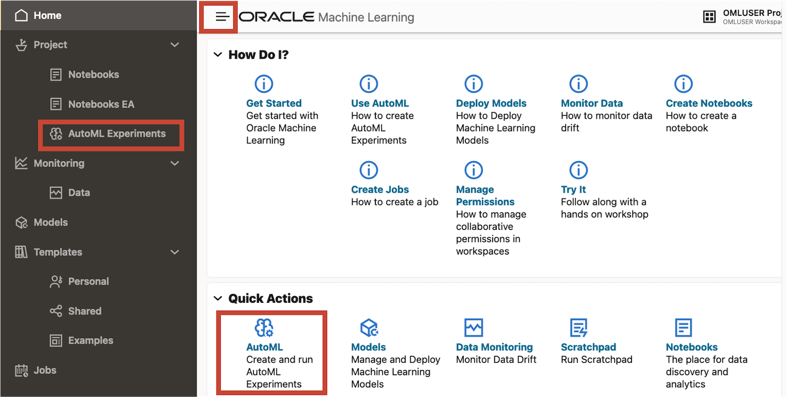

## Task 2: Create an Experiment

An Experiment is as a work unit that contains the definition of data source, prediction target, and prediction type along with optional settings. After an Experiment runs successfully, it presents you a list of machine learning models in the leader board. You can select any model for deployment, or use it to create a notebook based on the selected model.
When creating an Experiment, you must define the data source and the target of the experiment.

When creating an experiment, you must specify the data source and the target of the experiment. An AutoML experiment can process columns with data type ``VARCHAR2`` greater than 4K , ``CHAR``, ``CLOB``, ``BLOB``, and ``BFILE`` as text. Note that columns with data type ``VARCHAR2`` less than 4K are considered as categorical. 

To create an Experiment:

1. In the AutoML Experiments page, click **Create**. 

    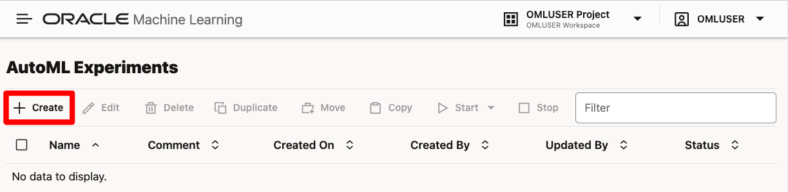
   
2. The Create Experiments page opens.

    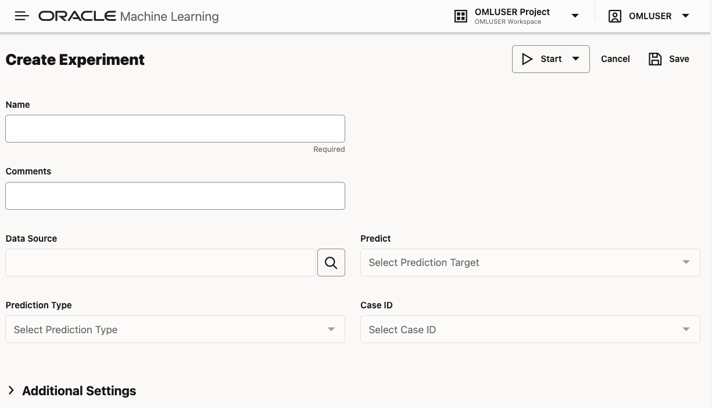

3. In the **Name** field, enter **Customers 360**.

4. Optionally enter something in the **Comments** field, like **Predicting Affinity Card upgrades**.

5. In the **Data Source** field, click the search icon to open the Select Table dialog. 
   
    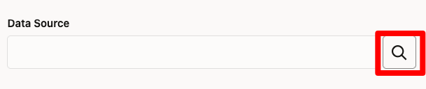

6. On the Select Table dialog, the OMLUSER schema is selected by default. On the right pane, start typing **CUST** in the top Search field, and select the table (you might have to scroll down) named **CUSTOMERS360** from the list of tables, as indicated below. Then click **OK** to confirm the selection.

	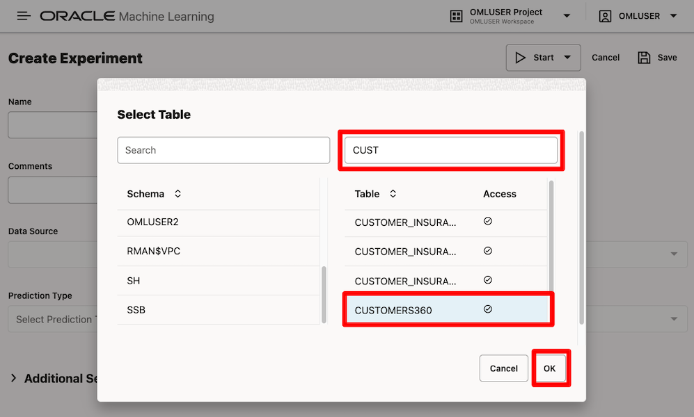

7. In the **Predict** drop-down list, select the column **AFFINITY_CARD** from the ``CUSTOMERS360`` table. You can also start typing the column name and the column names are filtered for easier selection. 
   
   The target for our prediction is a binary target (0 or 1) that indicates whether a customer has accepted an offer to upgrade to our **Affinity Card** subscription.  We want to build a model so that we can predict the likelihood of non-Afinity Card members to upgrade, so that we can create targeted campaigns.

	

8.  In the **Prediction Type** field, the prediction type is automatically selected based on target field data type and cardinality. In this lab, **Classification** is automatically selected.	
    
   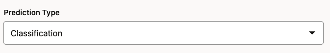

    The supported prediction types are:

	**Classification:** For non-numeric data type, Classification is selected by default. Classification may be selected for small cardinality numeric data as well, in particular for binary targets.

	**Regression:** For numeric data type, Regression is selected by default.

9.  In the **Case ID** field, select **CUST_ID**. For easier selection, you can also type the column name and the column names are filtered. The Case ID helps in data sampling and dataset split to make the results reproducible between experiments. It also aids in reducing randomness in the results. This is an optional field.

    The top section of your current Experiment layout should look like this:

	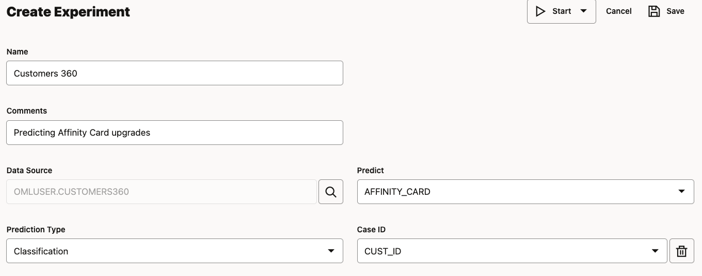

10. To adjust additional settings of this experiment, expand the **Additional Settings** section on the Experiments page, and change the **Maximum Top Models** to 3:

	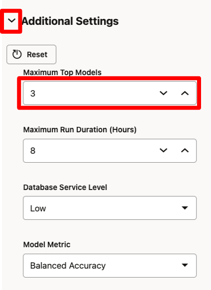

   **Maximum Top Models:** Click the down arrow and set it to 3. This is the maximum number of top models to create. The default is 5 models. Fewer models built results is less time and the experiment will complete sooner.

   **Maximum Run Duration:** This is the maximum time for which the experiment will be allowed to run. Keep the default entry. If you do not specify a time, then the experiment will be allowed to run up to the default, which is 8 hours as extreme upper bound.

   **Database Service Level:** This is the database connection service group level. The default is **Low**.

	 *  **High** level gives the greatest parallelism but significantly limits the number of concurrent jobs.
	 *  **Medium** level enables some parallelism but allows greater concurrency for job processing.

   **Algorithms** These are the algorithms that are going to be tried for the experiment.  If there are any specific algorithms that are not allowed in your industry or company, or you want to test a subset of them first, you might uncheck them in this section.  We will leave them all **ON** in our experiment.

   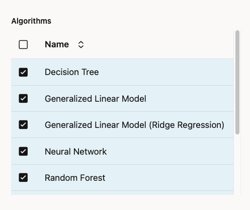

 > **Note:** Changing the database service level setting on the Always Free Tier will have no effect since there is no parallelism on the compute.  However, in a **Paid Autonomous Database**, if you increase the compute allocated for OML, you can increase the Database Service Level to Medium or High to get parallelism.

This completes the task of creating an experiment.

## Task 3: Run an Experiment

1.  Now that you have created the experiment, scroll to the top of the Experiment page, and at the right of the screen click the **Start** button and then **Faster Results** to trigger the AutoML UI experiment to run.

	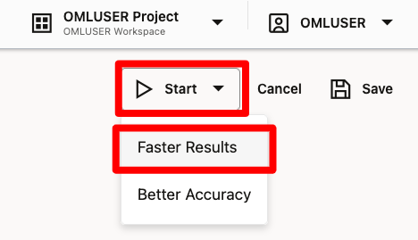

	Note the following about the two options:

	* **Faster Results:** Select this option if you want to get candidate models sooner, possibly at the expense of accuracy. This option works with a smaller set of pipeline combinations and hence yields faster results.
	* **Better Accuracy:** Select this option if you want more pipeline combinations to be tried for possibly more accurate models. A pipeline is defined as an algorithm, selected data feature set, and set of algorithm hyperparameters.

    > **Note:** This option works with the broader set of hyperparameter options recommended by the internal meta-learning model. Selecting Better Accuracy will take longer to run your experiment, but may provide models with more accuracy.

    When an experiment starts running, the status is displayed in a progress bar.  When an experiment runs, it starts to show the results in the Leader Board. Click **Details** under the **Running** progress bar while an experiment is running to access the details (which open by default, but you can close that window), as shown in the screen below.

    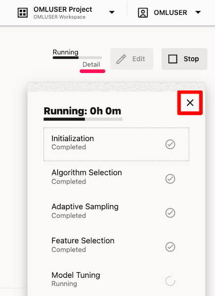

    The Leader Board displays the top performing models relative to the model metric selected along with the algorithms, and the order on the board might change while the Model Tuning is still happening.

    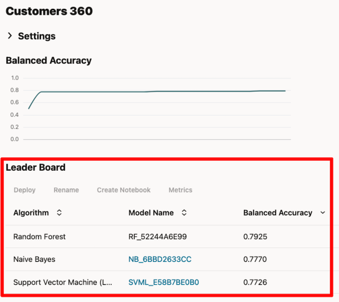


2. Once the experiment has finished running, scroll down to view the Leader Board section. The top three algorithms for this experiment are Random Forest, Naive Bayes and Support Vector Machine (Linear).

	>**Note:** Only when the experiment is completed can you perform any of these actions listed here, including metrics selection, deployment, renaming and notebook creation.

	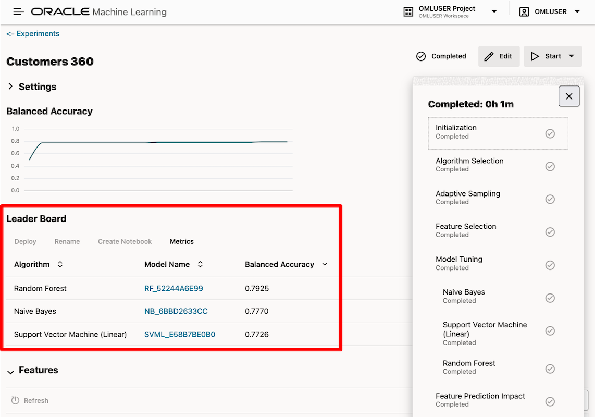

3. Click anywhere around the **top** model row shown in the list (but not in the model name in the blue letters). This highlights the top model row in light blue. 

	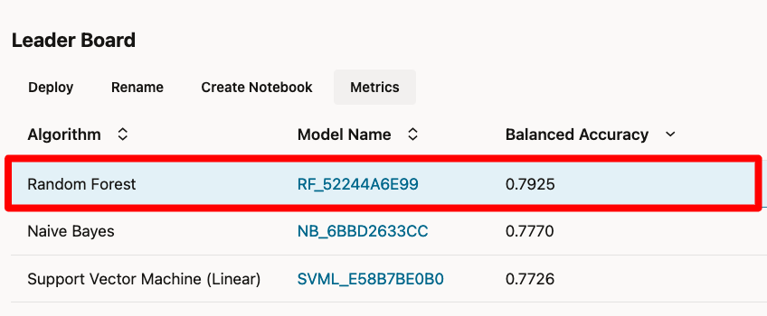

4. Click **Metrics**.  On the new dialog that opens, select additional metrics like **Accuracy**, **ROC AUC**, **Recall Binary** and **Precision Binary**, and then click the close icon to close the dialog.

	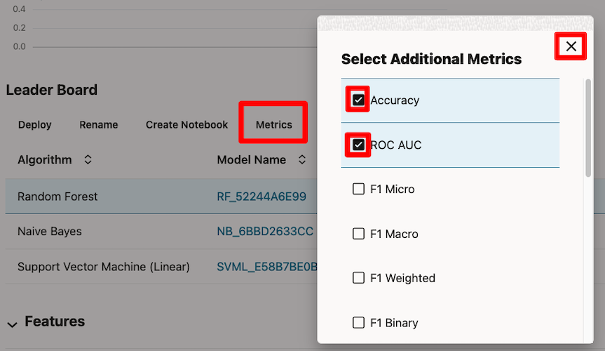

	The Leader Board now displays the selected metrics, as shown below. You can sort the rows by clicking the triangle to the right of each column name.

	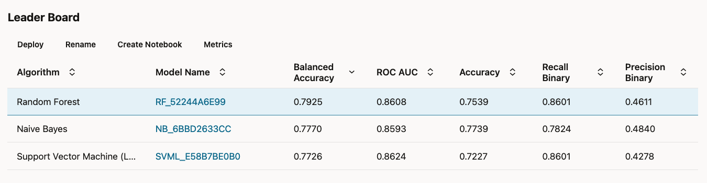

5. Click again on your top model's row in the Leader Board to enable the options, and then click **Rename**. In the Rename Model dialog, enter a relatable name, like `PRED_AFFINITY` to rename the auto generated model name. Click **OK**.  	

	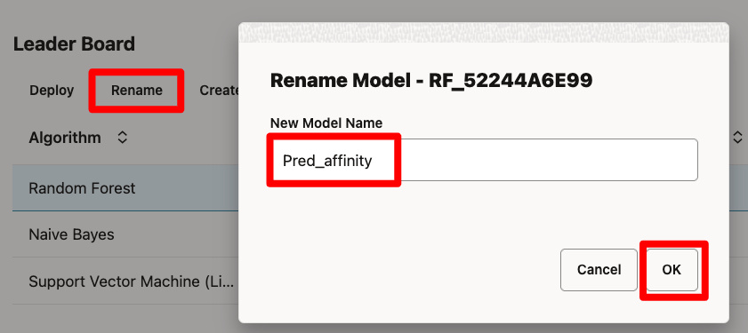

6. Click **OK**. The leader board refreshes to display the renamed model.

	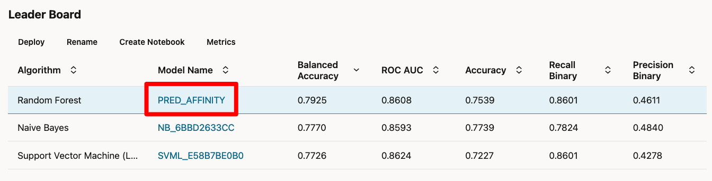

7.  You can click on any model name to view the model details in the Model Detail dialog. In our example we click on the **PRED_AFFINITY** model name itself (the blue letters), and we see a new dialog with a model assetssment.  Expand the window so you can see the full list of the **Prediction Impacts**.
   
   * **Prediction Impact:** Displays the importance of the attributes in terms of the target prediction of the models. In this lab, for this particular model the attributes OCCUPATION and HOUSEHOLD_SIZE have the highest impact on target prediction. Move your cursor over the prediction impact chart for each attribute to view the values.

   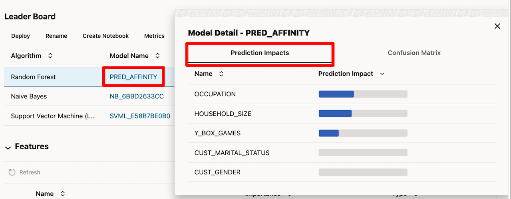
    
   Now click on the **Confusion Matrix** tab in the dialog to view the respective details, as shown in the screen below:

   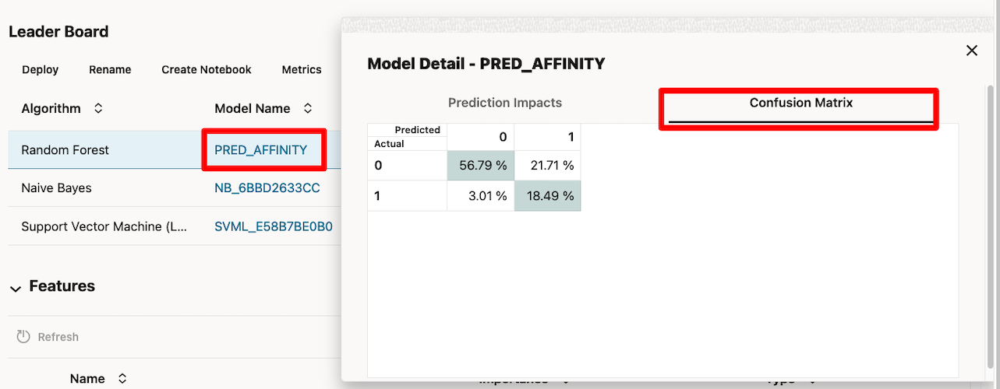

   * **Confusion Matrix:** Characterizes the accuracy of a model, including the types of errors made. It is computed by OML AutoML UI on a random subset of the original data (based on the cross-validation process) to help assess the model quality. Because our target is binary, the results are classified into true positive (actual = predicted = 1), true negative (actual = predicted = 0), false positive (actual = 0, predicted = 1) and false negative (actual = 1, predicted = 0).  There is a complete article on Confusion Matrix on Wikipedia [accessible here](https://en.wikipedia.org/wiki/Confusion_matrix)

	> Note: The values shown here represent percentages of the test data that correspond to each of the confusion matrix entries.


## Task 4: Deploy Top Model to Oracle Machine Learning Services

When you deploy a model using the Oracle Machine Learning AutoML UI, you create an Oracle Machine Learning Services endpoint for scoring. Oracle Machine Learning Services extends Oracle Machine Learning functionality to support model deployment and model lifecycle management for in-database OML models through REST APIs.

> **Note:** Through Oracle Machine Learning AutoML UI, you can deploy in-database models only, not ONNX-format (third-party) models.

1. To deploy a model, if you are not already in an AutoML Experiments page, go to one by clicking the hamburger icon on the top left corner of the OML page and click **AutoML Experiments** on the left navigation menu.  

	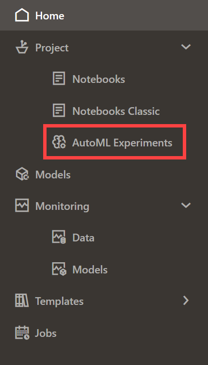

2. On the AutoML Experiments page, click on the **Customer 360** experiment to open it.

	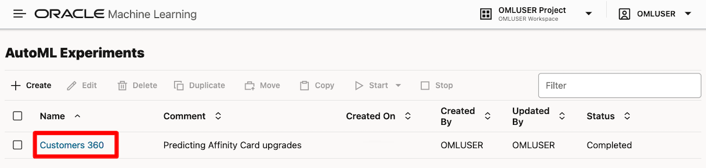

3. On the Leader Board of the experiment, click anywhere around the **PRED_AFFINITY** model row (not the model name itself).  Clicking on a model row enables all the Leader Board options - Deploy, Rename, Create Notebook, and Metrics.  Click **Deploy**. 

	> **Note:** You can also deploy a model from the Models page. You can access the Models page from the home page and the left navigation menu.  

    In the Deploy Models dialog, enter the following details:
	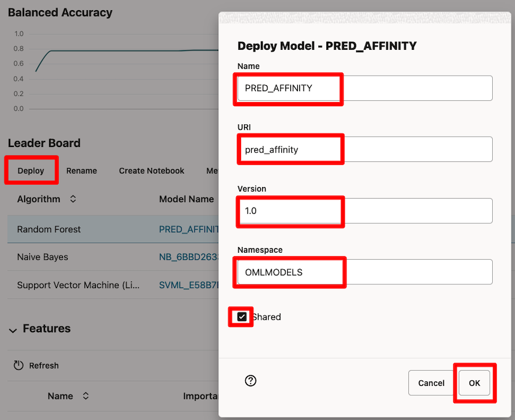

    **Name** The model name is displayed here by default. In this example, the name `PRED_AFFINITY` is displayed. This is the name that you renamed in the previous step.

    **URI** For this enter **pred_affinity**. The URI must be alphanumeric, the length must be max 200 characters, and it needs to be unique for this Database.

    **Version** You can enter **1.0**. The version must be in the format ``xx.xx`` where x is a number.

    **Namespace** Enter **OMLMODELS** in here. This is the name for the model namespace. You can specify any name here to create different namespaces.

	  > **Note:** Namespace is case sensitive.

    **Shared** Make sure to check this box to allow other users from this same database schema to view and score with the model.
  
    Click **OK**. After a model is successfully deployed, a small confirmation message is displayed at the bottom of the screen. The deployed model is ready to be used for scoring.

This completes the task of deploying the top model to Oracle Machine Learning Services.

## Task 5: View Oracle Machine Learning Models with Deployed Metadata and REST Endpoint

The deployed models are listed under **Deployments** on the Models page.  To view the metadata of the deployed model **pred_affinity**, follow the steps below.

1. To go to Deployments, click the three-line (hamburger) icon 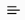 to open the left navigation menu. Click  **Models**. Alternatively, you can click **Models** on the Oracle Machine Learning home page.

  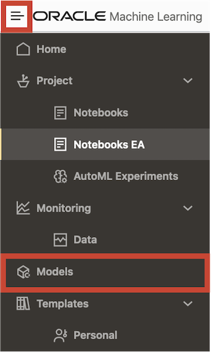

2. On the Models page, you will see a listing of current models available for the OMLUSER.  Your listing might vary depending on which Labs you have run today, and whether you have run any of the "Try it Yourself" exercises.
   
   Click on the **Deployments** tab.

	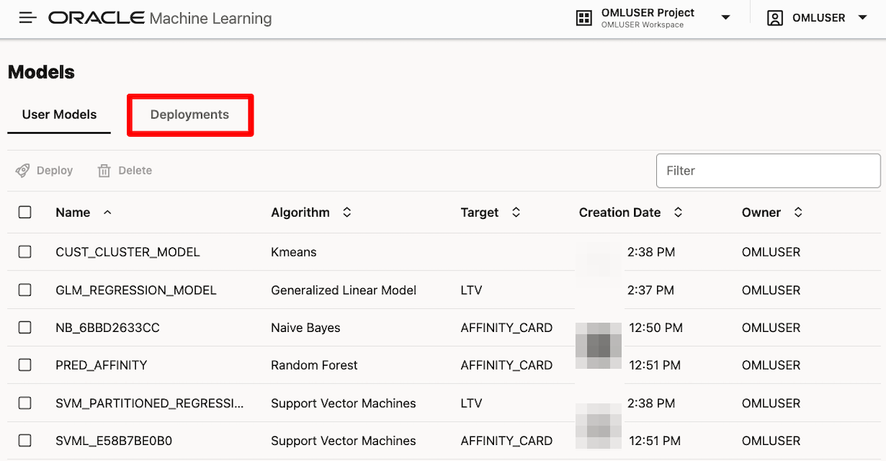

3. The deployed model **PRED_AFFINITY** is listed along with the metadata - Shared, version, namespace, owner, deployed date and URI under **Deployments** on the Models page.

	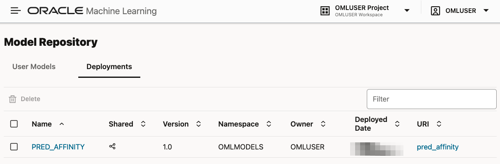

4. To view the metadata of the deployed model, click the name of the deployed model `PRED_AFFINITY`.  The model metadata is listed in the **Model metadata for PRED_AFFINITY** dialog.  Scroll down to see details that are important for models, including the input data types expected by the model, and the output.

	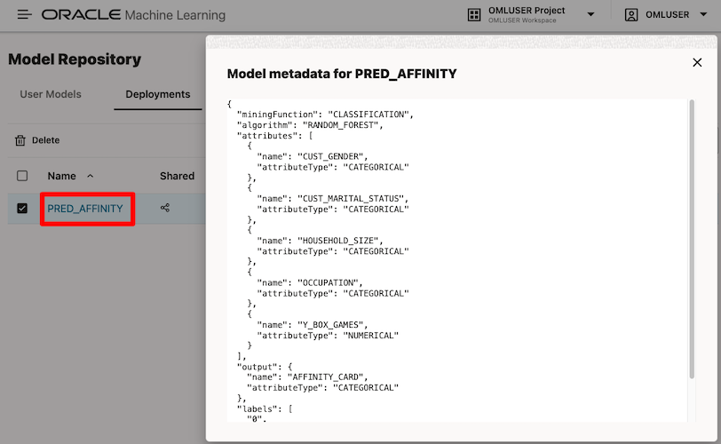

5. To view the entire JSON of the REST endpoint, click the URI `pred_affinity`. All details of the deployed model are listed in the **OPEN API Specification for PRED_AFFINITY** dialog, as shown in the screenshot below. Scroll down to view all details of the endpoint.

	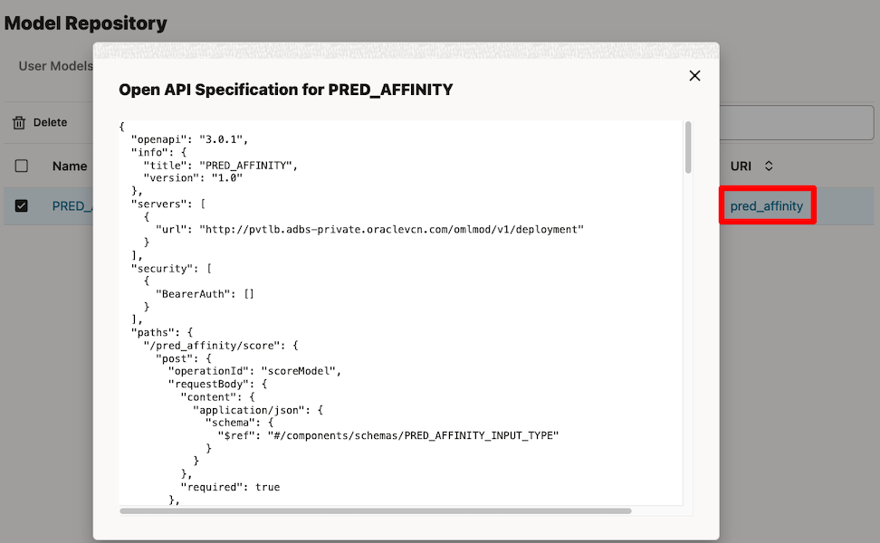

This completes the task of viewing the metadata of the deployed model, and its endpoint.

## Task 6: Create a Notebook for the Top Model

You can create notebooks based on the top models produced in the experiment. This provides the code to build a model with the same settings for the selected model. This option is helpful if you want to use the code to re-create a similar machine learning model. To create a notebook:

1. Click the hamburger icon  on the top left corner of your page to open the left navigation menu, and click **AutoML Experiments**.

	

2. On the AutoML Experiments page, click the **Customers 360** experiment.  

	

2. Scroll down to the Leader Board, click around the PRED_AFFINITY model row (not in the model name itself).  Clicking on a model row enables all the Leader Board options - Deploy, Rename, Create Notebooks, and Metrics. Click **Create Notebook**. The Create Notebook dialog opens.

 	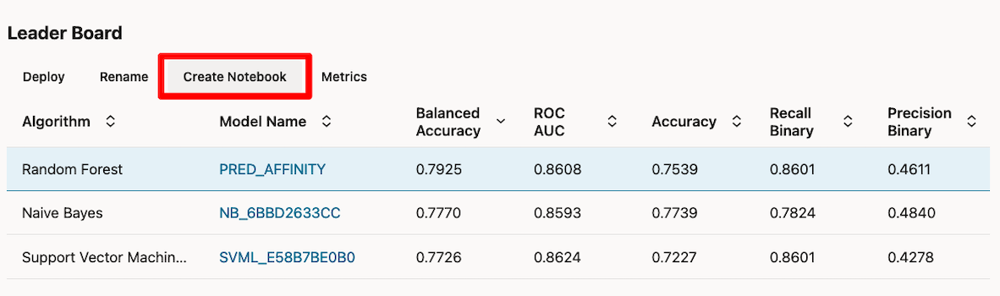

3. In the Create Notebook dialog, the experiment name is displayed in the **Notebook Name** field with the suffix (1). You can keep this default name and click **OK**.

	

4. Click **OK**. The message _Notebook Customers 360 RF (1) successfully created_ is displayed once the notebook is created successfully at the bottom of the page.  Click the button that is available in there to **Open Notebook**.

	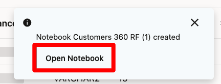

	The notebook is created, and is listed on the Notebooks page.

This completes the task of creating the notebook **Customer 360 RF (1)** based on the Random Forest model that is created by the AutoML UI experiment **Customers 360**.

## Task 7: View Generated Notebook and Individual Paragraphs

To view the generated notebook Customer 360:

1. Click the hamburger icon  on the top left corner of the page to open the left navigation menu. Click **Notebooks** (please note, this is not the Notebooks EA).

	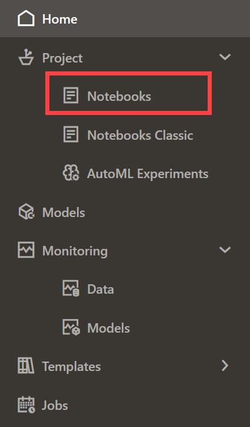

	> **Note:** The Automatic creation of a Notebook from AutoML UI is built into the Notebooks version, and not the Notebooks EA version at this time.

2. The Notebooks page opens with any existing notebooks listed in it. Click the **Customer 360 RF (1)** notebook to open it.

    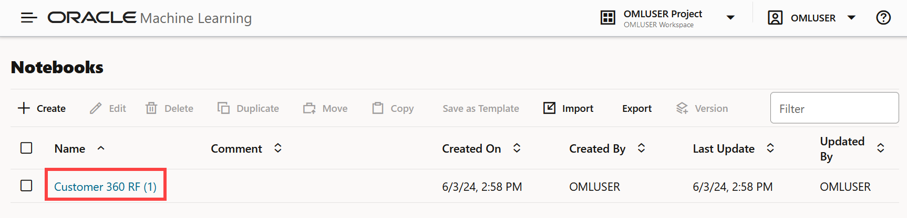

3. The generated notebook _Customer 360 RF (1)_  opens in the notebook editor. At the top of the notebooks toolbar, and click the **Run All** icon to run all the paragraphs in the notebook.

	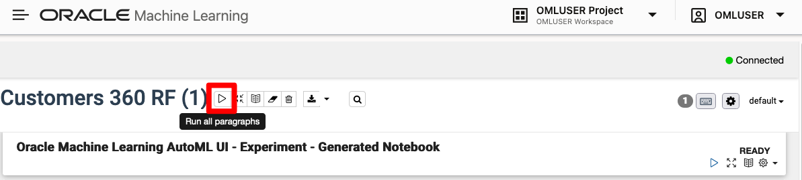

    In the Run All confirmation dialog, click **OK**.  

7. Scroll down to view all the paragraphs in the notebook:

* The paragraph titled _Oracle Machine Learning AutoML UI - Experiment - Generated Notebook_ contains the experiment metadata.

	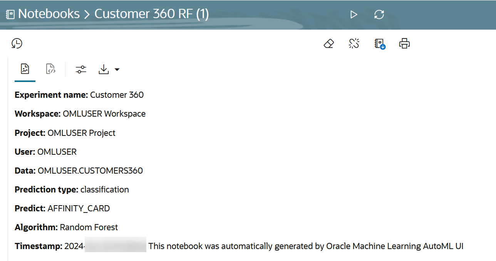

* The paragraph titled _Get proxy object for selected data_ contains the code to get the proxy object for the data used in the experiment, which is the Customers360 table here. The paragraph titled _Prepare Training Data_ contains the code to prepare the training data.

	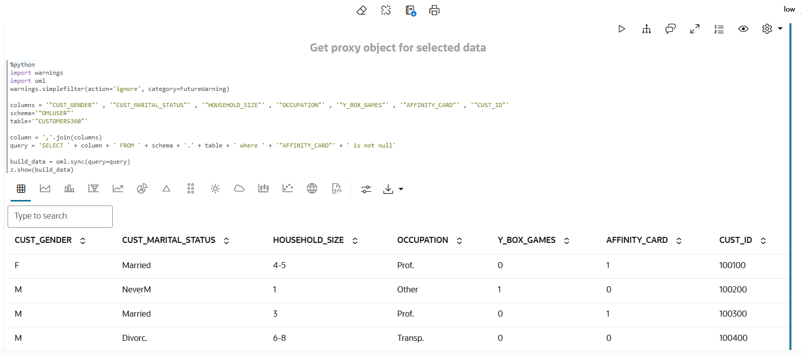

* The paragraph titled _Build Model_ contains the code to build the model. In this lab, it is a Random Forest model. The settings (hyperparameters) optimized by AutoML to create the model are shown here, so that you are able to reproduce the model using OML4Py as shown in the ``rf_settings`` variable. The paragraph titled _Show Model Details_ contains the code to view the model details.

	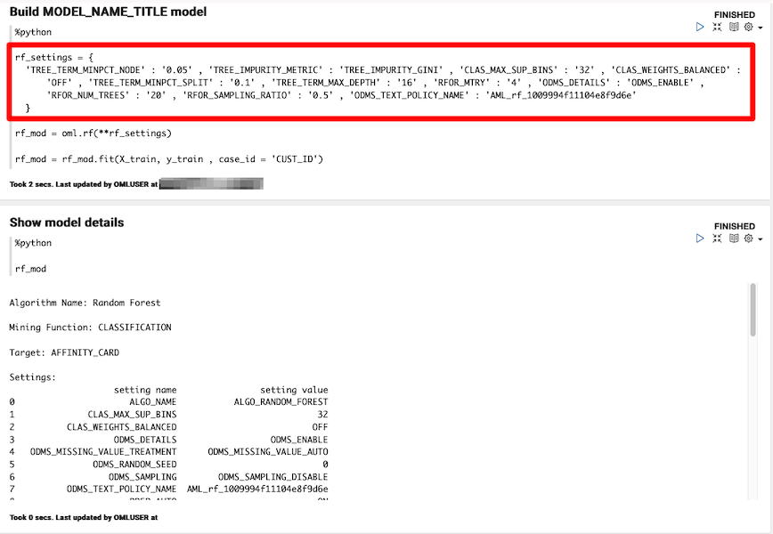

* The paragraph titled _Data for Scoring_ contains the code to score the data, and the paragraph _Show model quality metric_ contains the code to view the model quality metric.

	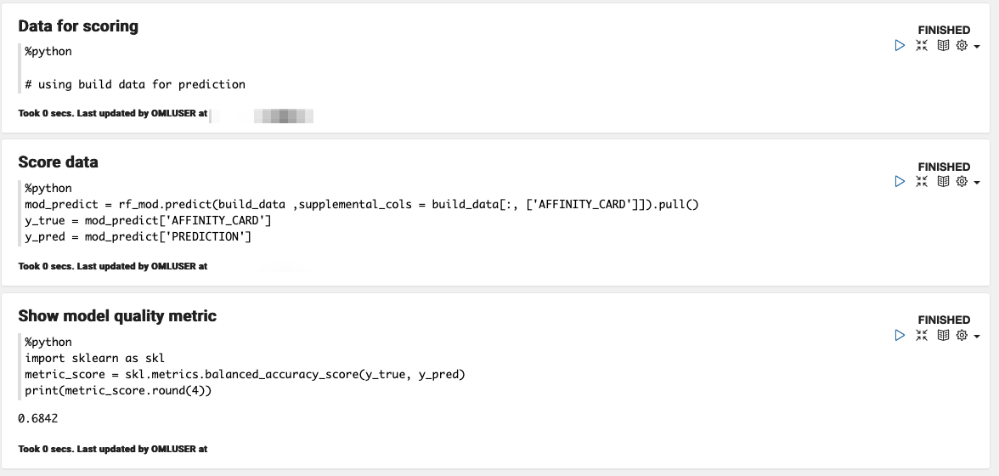

This completes the task of creating a notebook based on a model and viewing the paragraphs contained in it.

<if type="freetier">Congratulations, you have finished this workshop.  Discover additional workshops using Oracle Machine Learning in the [main Live Labs Catalog](https://bit.ly/omllivelabs) </if>
   <if type="livelabs">Congratulations, you have finished this workshop.  Discover additional workshops using Oracle Machine Learning in the [main Live Labs Catalog](https://bit.ly/omllivelabs)</if>
   <if type="freetier-ocw23">Congratulations, you have finished the regular Labs of this workshop.  You can now proceed to any Bonus Lab available in the instructions, or discover additional workshops using Oracle Machine Learning in the [main Live Labs Catalog](https://bit.ly/omllivelabs) </if>
   <if type="livelabs-ocw23">Congratulations, you have finished the regular Labs of this workshop.  You can now proceed to any Bonus Lab available in the instructions, or discover additional workshops using Oracle Machine Learning in the [main Live Labs Catalog](https://bit.ly/omllivelabs)</if>

## Learn More

* [About Oracle Machine Learning AutoML UI](https://docs.oracle.com/en/database/oracle/machine-learning/oml-automl-ui/index.html)
* [Blog: Oracle Machine Learning AutoML UI](https://blogs.oracle.com/machinelearning/post/introducing-oml-automl-user-interface)
* [Get Started with Oracle Machine Learning Notebooks](https://docs.oracle.com/en/database/oracle/machine-learning/oml-notebooks/)
* [Oracle Machine Learning Notebooks - Early Adopter](https://docs.oracle.com/en/database/oracle/machine-learning/oml-notebooks/omlug/get-started-notebooks-ea-data-analysis-and-data-visualization.html#GUID-B309C607-2232-43E2-B4A1-655DB295B90B)

## Acknowledgements

* **Author** - Marcos Arancibia, Senior Principal Product Manager, Machine Learning; Moitreyee Hazarika, Principal User Assistance Developer, Database User Assistance Development
* **Contributors** -  Mark Hornick, Senior Director, Data Science and Machine Learning; Sherry LaMonica, Consulting Member of Tech Staff, Machine Learning
* **Last Updated By/Date** - Marcos Arancibia, August 2023
