# Use AutoML

## Introduction

This lab walks you through the steps to use the AutoML functionality.

Estimated Time: 20 minutes

### About AutoML
AutoML (Automated Machine Learning) provides built-in data science expertise about data analytics and modeling that you can employ to build machine learning models.

### Objectives

In this lab, you will learn how to:
* Create a Pandas DataFrame (OML DataFrame) proxy object for the `CUSTOMER_INSURANCE_LTV` database table to predict who would buy insurance based on the current customer behavior
* Use `automl.AlgorithmSelection` to rank the in-database algorithms by predicted score metric for classification of the BUY_INSURANCE target
* Use `automl.FeatureSelection` to identify the most relevant feature subset for the training data and the selected algorithm
* Use `automl.ModelTuning` to tune selected algorithm hyperparameters
* Use `automl.ModelSelection` to select the top in-database algorithm and return the tuned model in a single function

### Prerequisites

1. We need to access and run the OML notebook for this lab.

 > **NOTE:** If you have problems with downloading and extracting the ZIP file in Lab 1 Task 2, please 
 <if type="freetier">[**CLICK HERE** to download the "Lab 8 - Use AutoML" notebook DSNB file](<./../notebooks/Lab 8 - Use AutoML.dsnb?download=1>)</if><if type="livelabs">[**CLICK HERE** to download the "Lab 8 - Use AutoML" notebook DSNB file](<./../notebooks/Lab 8 - Use AutoML.dsnb?download=1>)</if><if type="freetier-ocw23">[**CLICK HERE** to download the "Lab Bonus 4 - Use AutoML" notebook DSNB file](<./../notebooks/Lab Bonus 4 - Use AutoML.dsnb?download=1>)</if><if type="livelabs-ocw23">[**CLICK HERE** to download the "Lab Bonus 4 - Use AutoML" notebook DSNB file](<./../notebooks/Lab Bonus 4 - Use AutoML.dsnb?download=1>)</if>. This notebook contains the scripts for this Lab. Save it to your local machine and import it like illustrated in **Lab 1, Task 2, Step 1**.

   Go back to the main Notebooks listing by clicking on the "hamburger" menu (the three lines) on the upper left of the screen, and then select **Notebooks EA**. 
   
   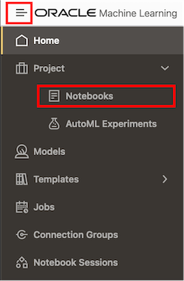
   
   <if type="freetier">
   Click the **Lab 8** notebook to view it.

   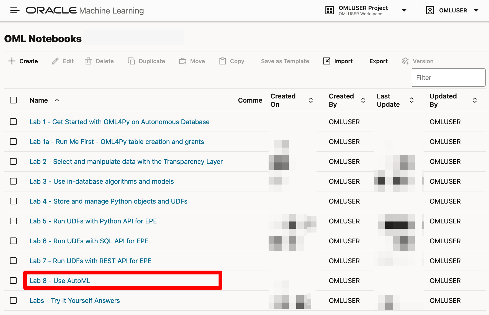 </if>
   
   <if type="livelabs">
   Click the **Lab 5** notebook to view it.

   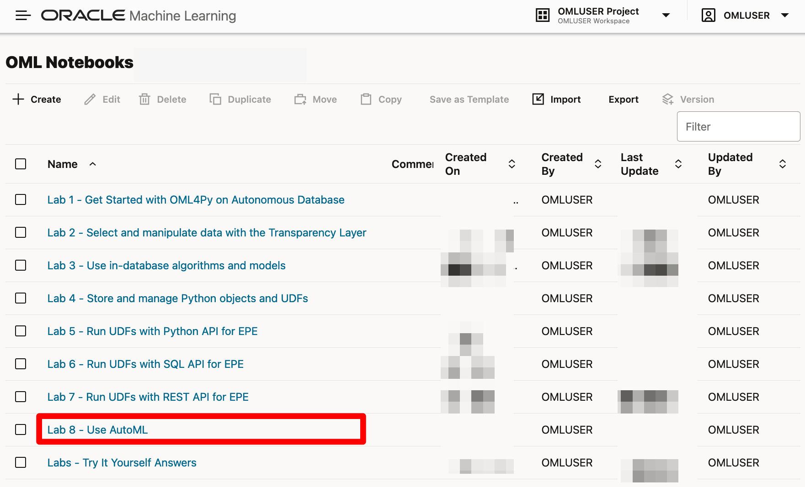 </if>
   
   <if type="freetier-ocw23">
   Click the **Lab Bonus 4** notebook to view it.

   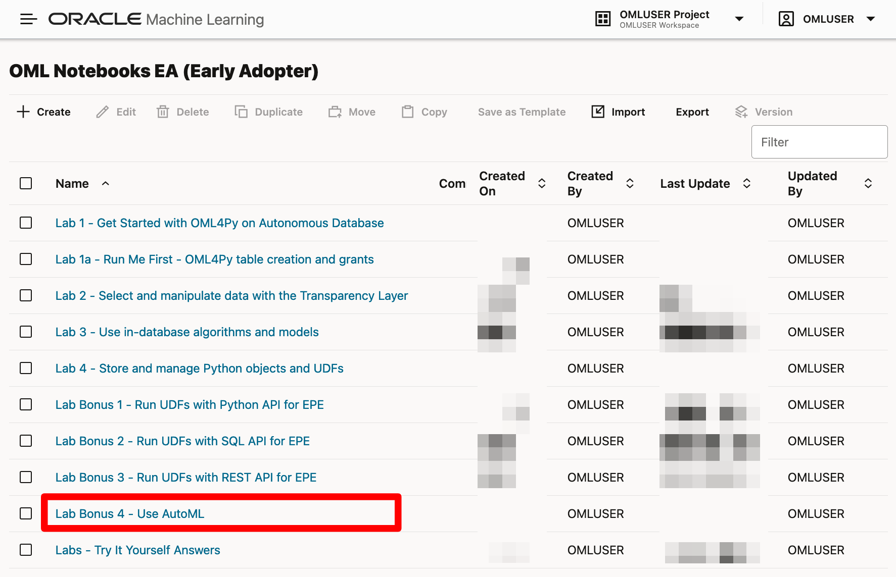 </if>
   
   <if type="livelabs-ocw23">
   Click the **Lab Bonus 4** notebook to view it.
   
   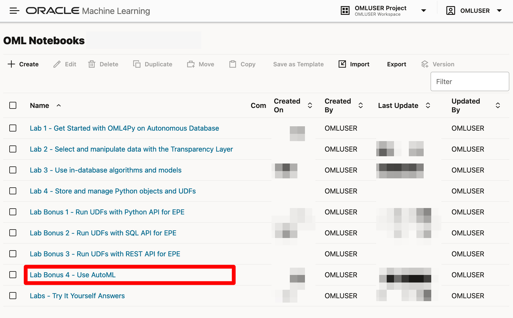 </if>

   OML Notebooks will create a session and make the notebook available for editing.

   You can optionally click the **Run all paragraphs** () icon, and then click **Confirm** to refresh the content with your data, or just scroll down and read the pre-recorded results.  

   <if type="freetier">
   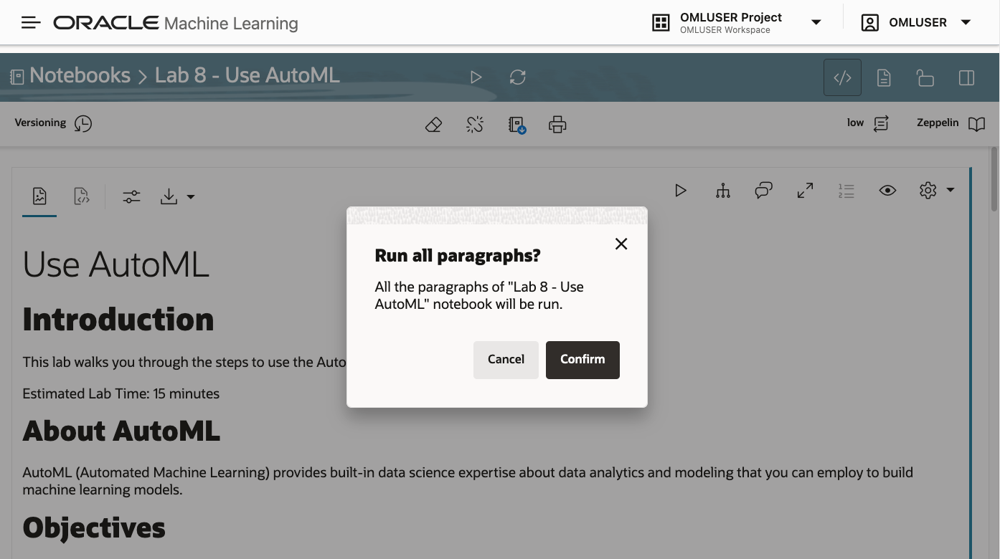
   </if>
   <if type="livelabs">
   
   </if>
   <if type="freetier-ocw23">
   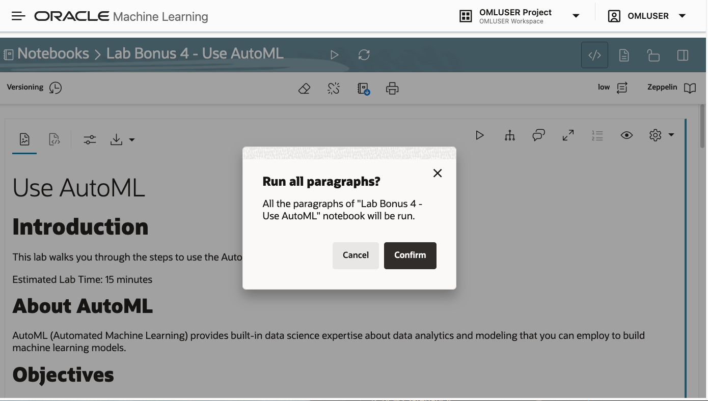
   </if>
   <if type="livelabs-ocw23">
   
   </if>

> **NOTE:** Due to the nature of Automated Machine Learning, it is expected that some of the paragraphs might take several minutes to complete.

## Task 1: Import libraries supporting OML4Py and AutoML

1. Follow the flow of the notebook by scrolling to view and run each paragraph of this lab.

Scroll down to the beginning of Task 1.

  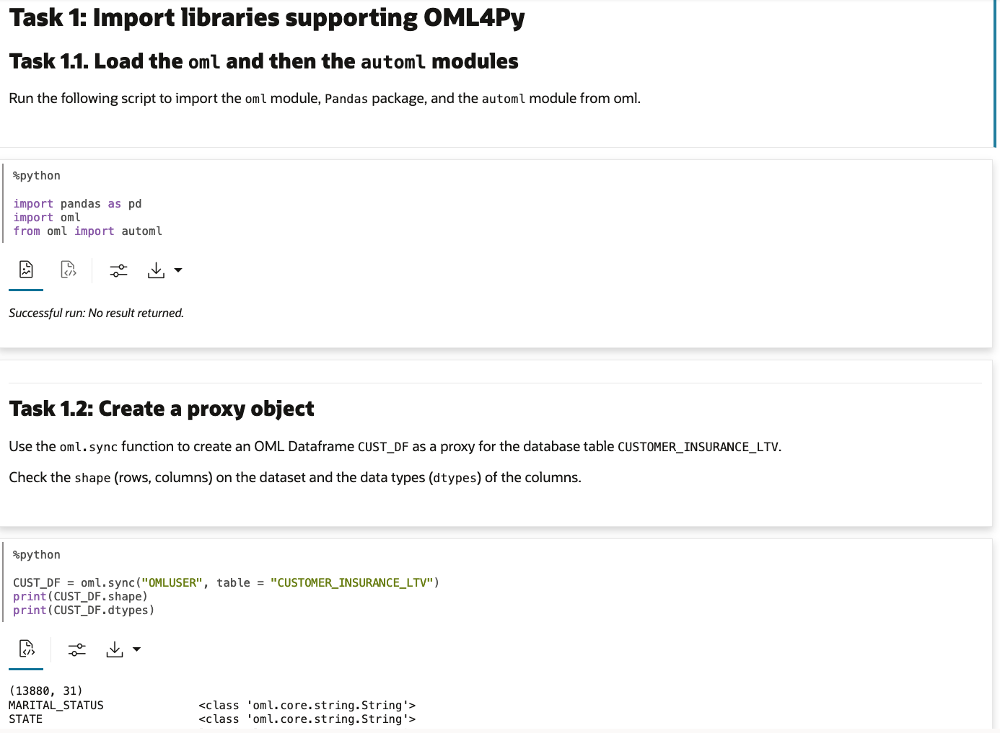

## Task 2: Automated algorithm selection
1. Follow the flow of the notebook by scrolling to view and run each paragraph of this lab.

Scroll down to the beginning of Task 2.

  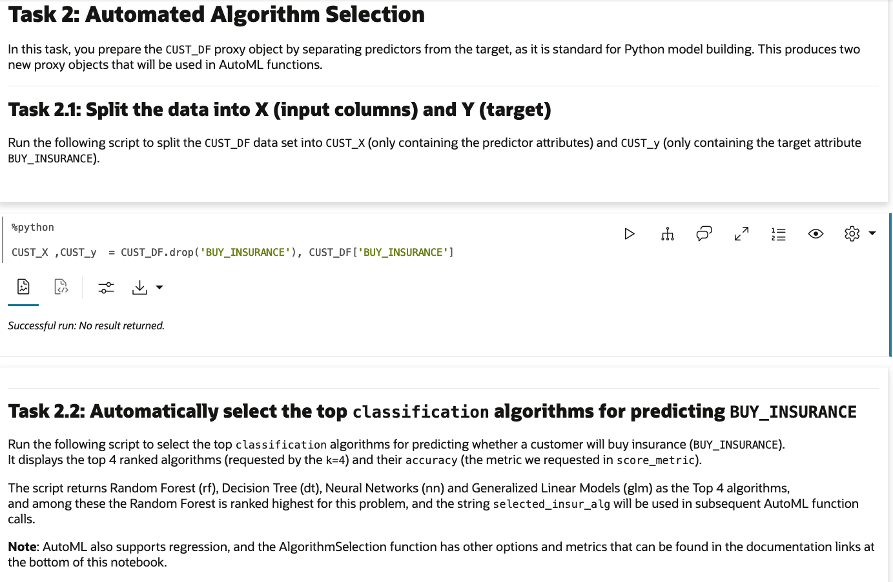

## Task 3: Automated feature selection
1. Follow the flow of the notebook by scrolling to view and run each paragraph of this lab.

Scroll down to the beginning of Task 3.

  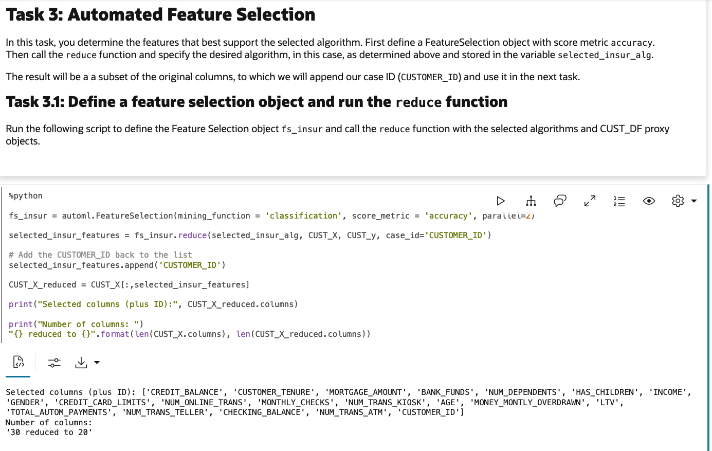

## Task 4: Automated model tuning
1. Follow the flow of the notebook by scrolling to view and run each paragraph of this lab.

Scroll down to the beginning of Task 4.

  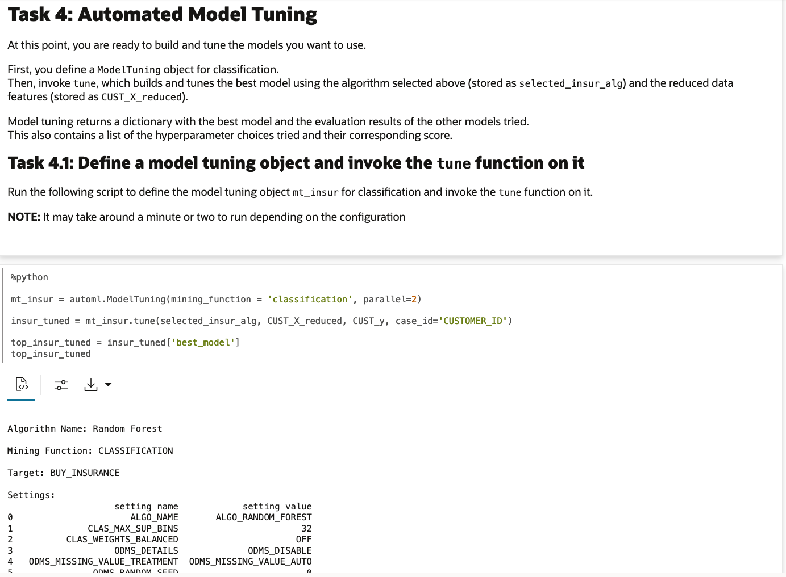

## Task 5: Automated model selection
1. Follow the flow of the notebook by scrolling to view and run each paragraph of this lab.

Scroll down to the beginning of Task 5.

  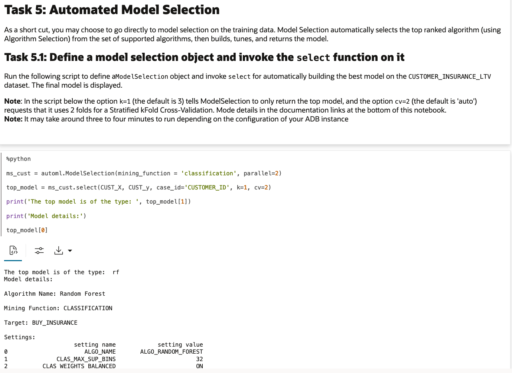

### Congratulations !!!

You reached the end of this lab.  

You can explore additional workshops related to Oracle Machine Learning from the link in the **Learn More** section.  

## Learn more

* [Automated Machine Learning](https://docs.oracle.com/en/database/oracle/machine-learning/oml4py/1/mlpug/automatic-machine-learning.html#GUID-4B240E7A-1A8B-43B6-99A5-7FF86330805A)
* [Get Started with Oracle Machine Learning Notebooks](https://docs.oracle.com/en/database/oracle/machine-learning/oml-notebooks/)
* [Oracle Machine Learning Notebooks - Early Adopter](https://docs.oracle.com/en/database/oracle/machine-learning/oml-notebooks/omlug/get-started-notebooks-ea-data-analysis-and-data-visualization.html#GUID-B309C607-2232-43E2-B4A1-655DB295B90B)
* [Additional Workshops for Oracle Machine Learning](https://apexapps.oracle.com/pls/apex/dbpm/r/livelabs/livelabs-workshop-cards?c=y&p100_product=70)

## Acknowledgements
* **Authors** - Marcos Arancibia, Product Manager, Machine Learning; Jie Liu, Data Scientist; Moitreyee Hazarika, Principal User Assistance Developer
* **Contributors** -  Mark Hornick, Senior Director, Data Science and Machine Learning; Sherry LaMonica, Principal Member of Tech Staff, Machine Learning
* **Last Updated By/Date** - Marcos Arancibia, August 2023
