# Select and manipulate data with transparency layer

## Introduction

This lab shows how to use the transparency layer classes to work with data and to perform exploratory analysis of the data.

Estimated Time: 30 minutes

### About data selection and manipulation
The transparency layer classes allow you to convert select Python objects to Oracle Autonomous Database objects. It allows users to call a range of familiar Python functions that are overloaded to invoke the corresponding SQL on tables in the
database.
The Oracle Machine Learning for Python (OML4Py) transparency layer supports functions that interact with database data and enables you to:
* Load Python `pandas.DataFrame` objects to Oracle Database to create database tables
* Access and manipulate database tables and views through the use of proxy objects
* Overload Python functions, translating their functionality into SQL
* Leverage proxy objects for database data
* Use familiar Python syntax to manipulate database data

### Objectives

In this lab, you will learn how to:
  * Use the `oml.push` function to create a temporary table
  * Work with table rows and columns using proxy objects
  * Work with `pandas.DataFrame` objects
  * Use the `append`, `concat` and `merge` functions to manipulate data
  * Use the `split` and `KFold` functions to partition the data
  * Use the `crosstab` and `pivot_table` functions on an OML DataFrame proxy
  * Use the `oml.boxplot` and `oml.hist` functions to create plots
  * Manage and explore data using OML4Py Transparency Layer functions
  * Use `cx_Oracle` functions to submit SQL queries from Python

### Prerequisites

1. We need to access and run the OML notebook for this lab.

 > **NOTE:** If you have problems with downloading and extracting the ZIP file in Lab 1 Task 2, please [**CLICK HERE** to download the "Lab 2 - Select and manipulate data with the Transparency Layer" notebook DSNB file](<./../notebooks/Lab 2 - Select and manipulate data with the Transparency Layer.dsnb?download=1>). This notebook contains the scripts for **Lab 2**. Save it to your local machine and import it like illustrated in **Lab 1, Task 2, Step 1**.

   Go back to the main Notebooks listing by clicking on the "hamburger" menu (the three lines) on the upper left of the screen, and then select **Notebooks EA**. 
   
   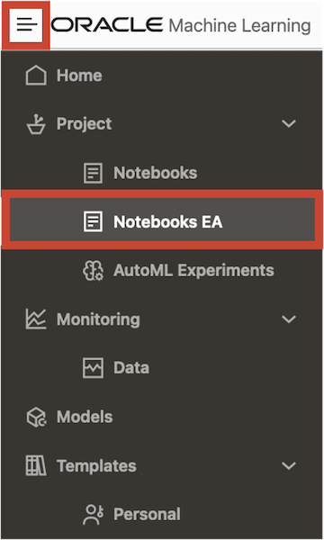
   
   Click the **Lab 2** notebook to view it.
   
   <if type="freetier">
   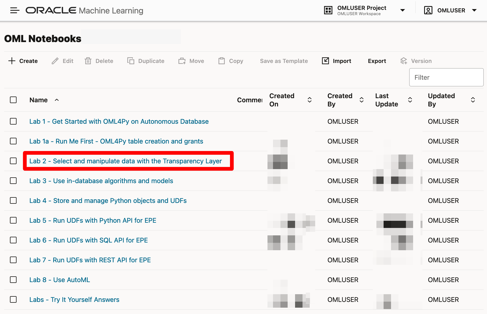 </if>
   <if type="livelabs">
    </if>
   <if type="freetier-ocw23">
   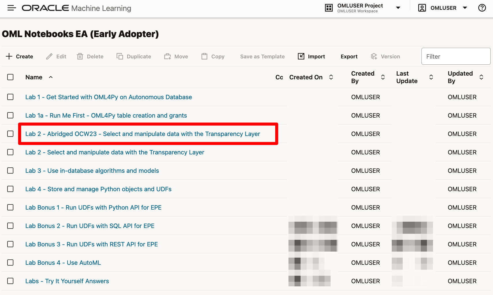 </if>
   <if type="livelabs-ocw23">
    </if>

   OML Notebooks will create a session and make the notebook available for editing.

   You can optionally click the **Run all paragraphs** () icon, and then click **Confirm** to refresh the content with your data, or just scroll down and read the pre-recorded results.  

  

## Task 1: Import libraries and create Oracle Machine Learning DataFrame proxy object
1. Follow the flow of the notebook by scrolling to view and run each paragraph of this lab.

  Scroll down to the beginning of Task 1.

  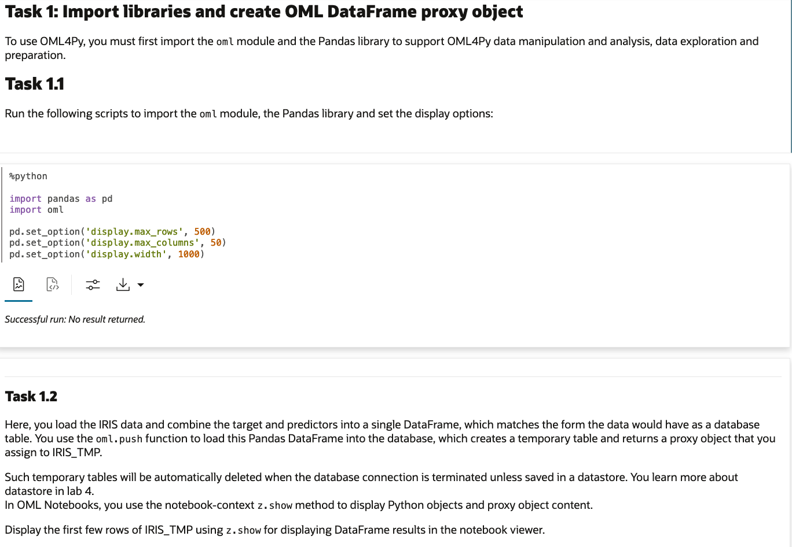

## Task 2: Select table columns using proxy object CUST_DF
1. Follow the flow of the notebook by scrolling to view and run each paragraph of this lab.

  Scroll down to the beginning of Task 2.

  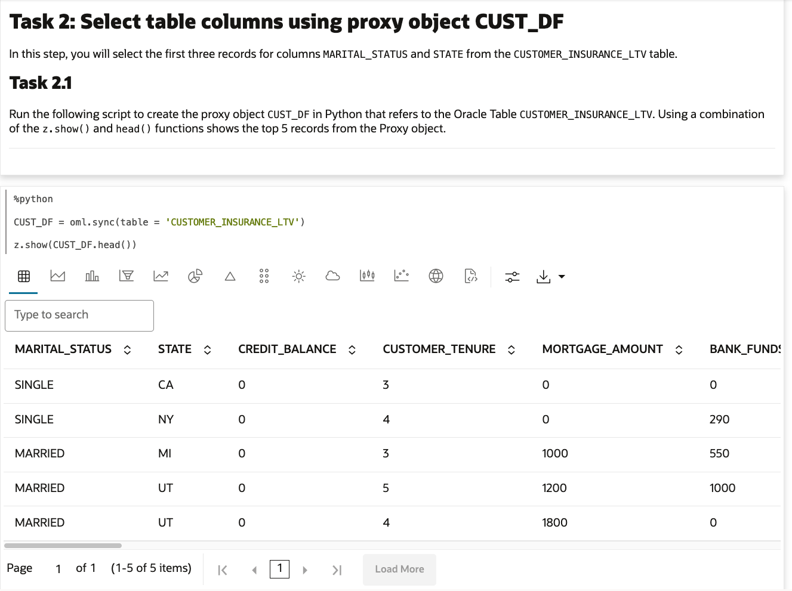

## Task 3: Select table rows using proxy object CUST_DF
1. Follow the flow of the notebook by scrolling to view and run each paragraph of this lab.

  Scroll down to the beginning of Task 3.

  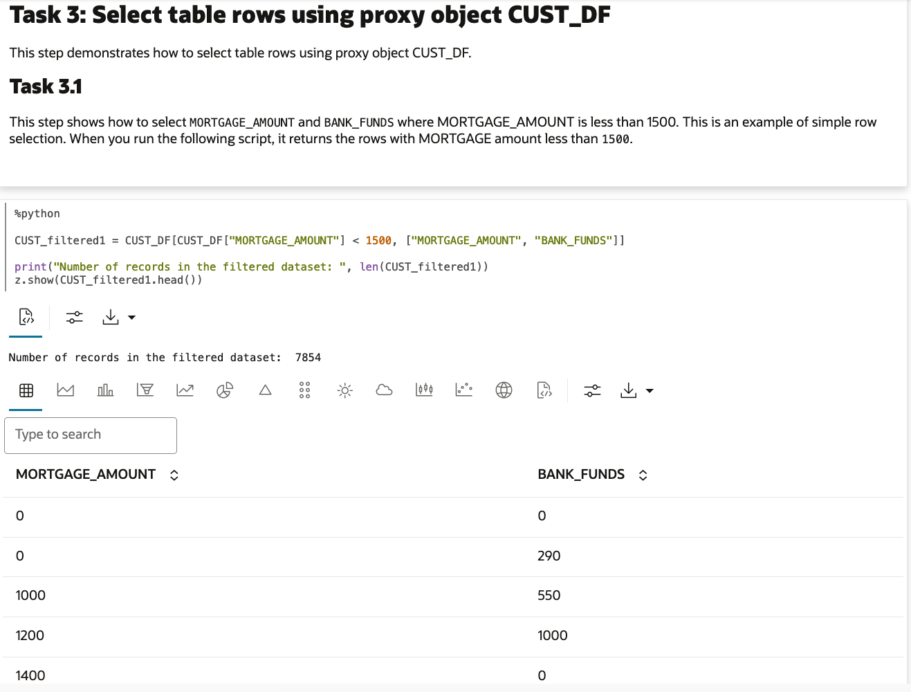

## Task 4: Use OML DataFrame proxy objects
1. Follow the flow of the notebook by scrolling to view and run each paragraph of this lab.

  Scroll down to the beginning of Task 4.

  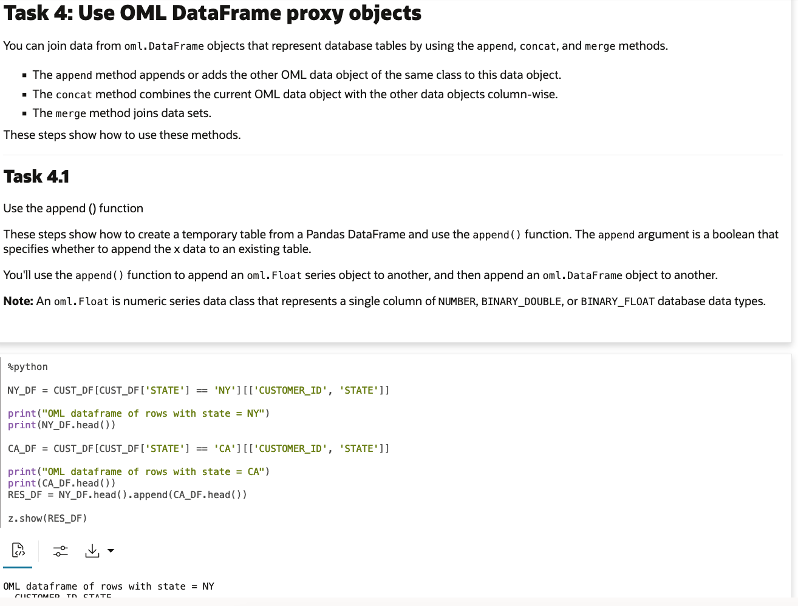

## Task 5: Use the split and kfold functions
1. Follow the flow of the notebook by scrolling to view and run each paragraph of this lab.

  Scroll down to the beginning of Task 5.

  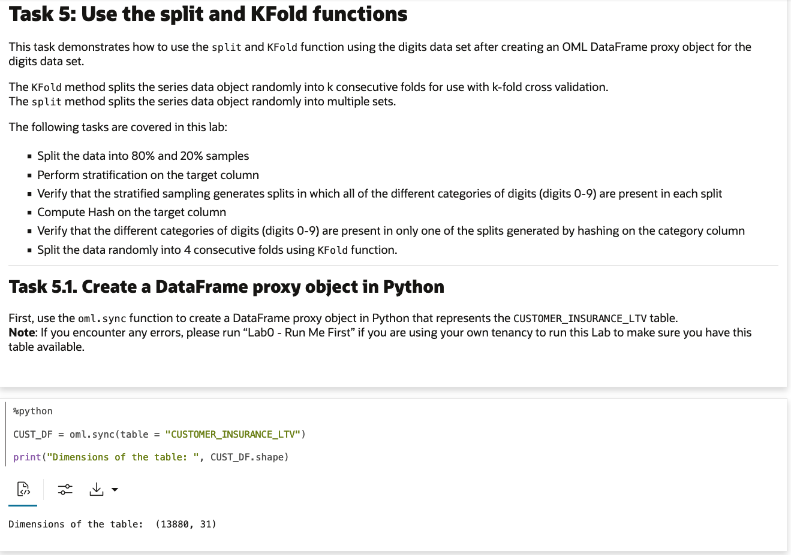

## Task 6: Use the crosstab and pivot_table functions on a DataFrame proxy object
1. Follow the flow of the notebook by scrolling to view and run each paragraph of this lab.

  Scroll down to the beginning of Task 6.

  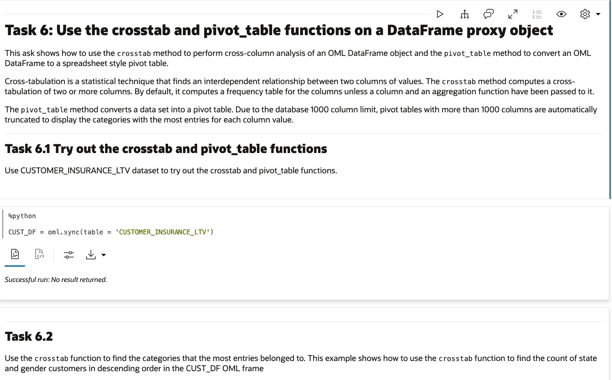

## Task 7: Use the oml.boxplot and oml.hist functions
1. Follow the flow of the notebook by scrolling to view and run each paragraph of this lab.

  Scroll down to the beginning of Task 7.

  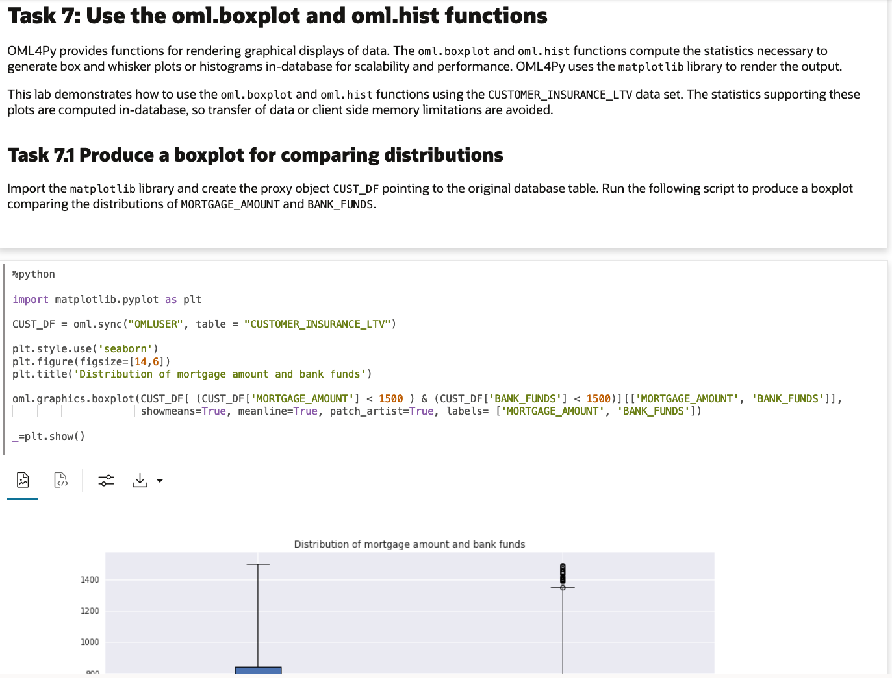

## Task 8: Manage and explore data using transparency layer functions
1. Follow the flow of the notebook by scrolling to view and run each paragraph of this lab.

  Scroll down to the beginning of Task 8.

  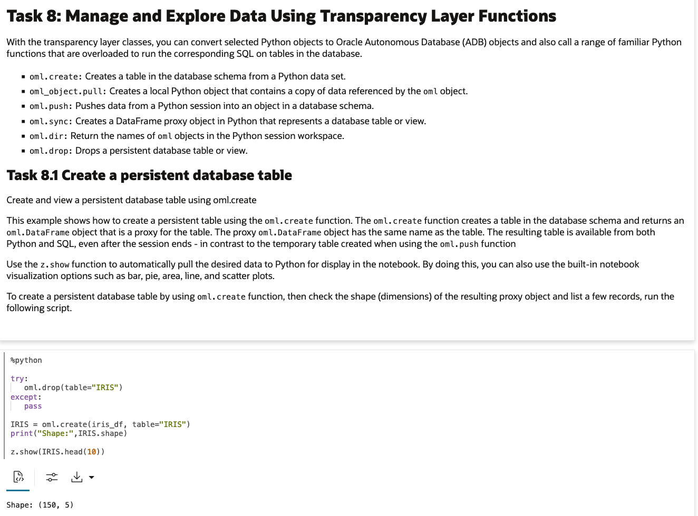

## Task 9: Use cx_Oracle functions
1. Follow the flow of the notebook by scrolling to view and run each paragraph of this lab.

  Scroll down to the beginning of Task 9.

  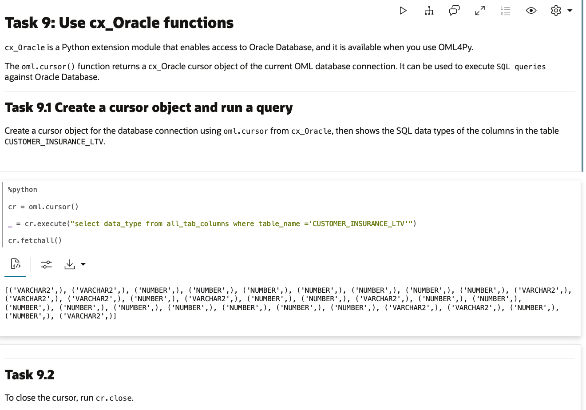  

You can now *proceed to the next lab*.

## Learn More

* [Transparency Layer Functions](https://docs.oracle.com/en/database/oracle/machine-learning/oml4py/2/mlpug/oracle-machine-learning-python.html#GUID-2AD97DE9-B43F-4B0B-8269-C6DFB47576A9)
* [Prepare Data with OML4Py](https://docs.oracle.com/en/database/oracle/machine-learning/oml4py/2/mlpug/prepare-and-explore-data1.html#GUID-D560D71C-5FF4-460D-BC1C-FF6EFB509BEC)
* [Explore Data with OML4Py](https://docs.oracle.com/en/database/oracle/machine-learning/oml4py/2/mlpug/prepare-and-explore-data1.html#GUID-60B565D7-19E0-426F-BE7B-0E86DAB31925)
* [Oracle Machine Learning Notebooks](https://docs.oracle.com/en/database/oracle/machine-learning/oml-notebooks/)
* [Oracle Machine Learning Notebooks - Early Adopter](https://docs.oracle.com/en/database/oracle/machine-learning/oml-notebooks/omlug/get-started-notebooks-ea-data-analysis-and-data-visualization.html#GUID-B309C607-2232-43E2-B4A1-655DB295B90B)

## Acknowledgements
* **Authors** - Marcos Arancibia, Product Manager, Machine Learning; Jie Liu, Data Scientist; Moitreyee Hazarika, Principal User Assistance Developer
* **Contributors** -  Mark Hornick, Senior Director, Data Science and Machine Learning; Sherry LaMonica, Principal Member of Tech Staff, Machine Learning
* **Last Updated By/Date** - Marcos Arancibia, August 2023