# Run user-defined functions using the REST API for Embedded Python Execution

## Introduction

This lab walks you through the steps to use the REST API to call OML4Py Embedded Python Execution functions to run custom Python code.

Estimated Time: 20 minutes

Watch the video below for a quick walk-through of the lab.

[Run user-defined functions using Embedded Python Execution](videohub:1_2skqmxjt)

### About Embedded Python Execution
Embedded Python execution enables you to run user-defined Python functions in Python engines spawned by the Autonomous Database environment. The REST API for embedded Python execution with Autonomous Database provides REST endpoints for setting authorization tokens, executing Python scripts, and synchronously and asynchronously running jobs.

To run a script from the REST API, it must reside in the Python script repository. An Oracle Machine Learning username and password must be provided for authentication.

* `do-eval`&mdash;Runs the provided user-defined Python function in a Python engine spawned by the Autonomous Database environment.
* `table-apply`&mdash;Runs the provided user-defined Python function data referenced by an OML DataFrame proxy object in a single Python engine.
* `group-apply`&mdash;Partitions a database table by the values in one or more columns and runs the provided user-defined Python function on each partition, optionally in parallel using multiple Python engines.
* `row-apply`&mdash;Partitions a database table into sets of rows and runs the provided user-defined Python function on the data in each set, optionally in parallel using multiple Python engines.
* `index-apply`&mdash;Runs a Python function multiple times, passing in a unique index of the invocation to the user-defined function, optionally in parallel using multiple Python engines.

To view the full list of endpoints available, refer to the Oracle Machine Learning for Python REST API for Embedded Python Execution

> **Note:** Embedded Python Execution functions are also available through the [Oracle Machine Learning for Python SQL API for Embedded Python Execution](https://docs.oracle.com/en/database/oracle/machine-learning/oml4py/1/mlpug/sql-api-embedded-python-execution-oracle-autonomous-database.html#GUID-BFC5E8C9-6ACC-4993-B0E8-41138B2E479E).

### Objectives

In this lab, we provide a workflow for using the OML4Py REST API for embedded Python execution with Oracle Autonomous Database:

* Obtain an authorization token to access the REST API for embedded Python execution
* Create a user defined function (UDF) and store it in the OML4Py script repository
* Run the UDF using embedded Python execution from the OML4Py Python and REST APIs

### Prerequisites

We need to view the markdown in the OML notebook for this lab, and access the OCI Cloud Shell to run the associated cURL commands.

**Access the Lab Notebooks**

1. Go back to the main notebooks listing by clicking on the "hamburger" menu (the three lines) on the upper left of the screen, and then select **Notebooks**.

 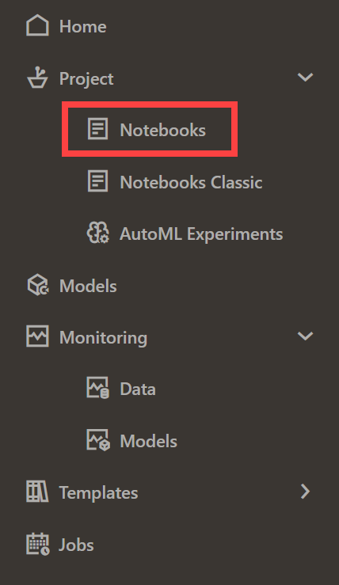

2. Click the **Lab 7 notebook name** to view it.
   <if type="freetier">
    </if>
   <if type="livelabs">
    </if>

  OML Notebooks will create a session and make the notebook available for editing.

  You can optionally click the **Run all paragraphs** () icon, and then click **OK** to confirm to refresh the content with your data, or just scroll down and read the pre-recorded results.  

  

> **NOTE:** If you had problems downloading and extracting the ZIP file for the labs, please [**CLICK HERE** to download the lab7\_embed\_python\_rest.json notebook file](./../notebooks/lab7_embed_python_rest.json?download=1). Download the notebook file for this lab to your local machine and then import it like illustrated in **Lab 1, Task 2**.

**Access the OCI Cloud Shell to run cURL commands:**

To access the OCI Cloud Shell to run the associated cURL commands:

1. To run cURL commands, click the Developer Tools icon on your OCI console and then click Cloud Shell.  

  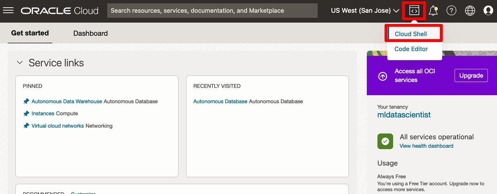

2. The Oracle Cloud Shell interface opens at the bottom of your OCI console page. Here, you can run your cURL commands.

  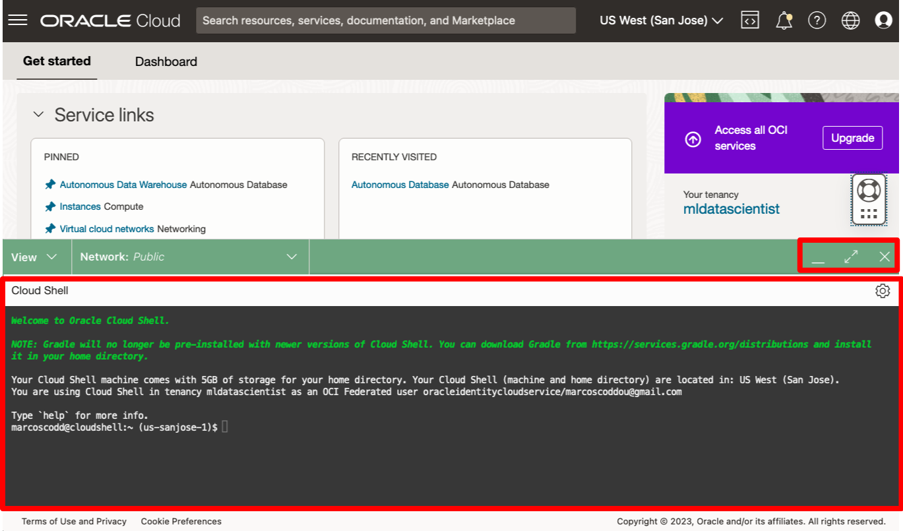

## Task 1: Obtain an Access Token

1. Follow the flow of the notebook by scrolling to view and run each paragraph of this lab.

  Scroll down to the beginning of Task 1.

  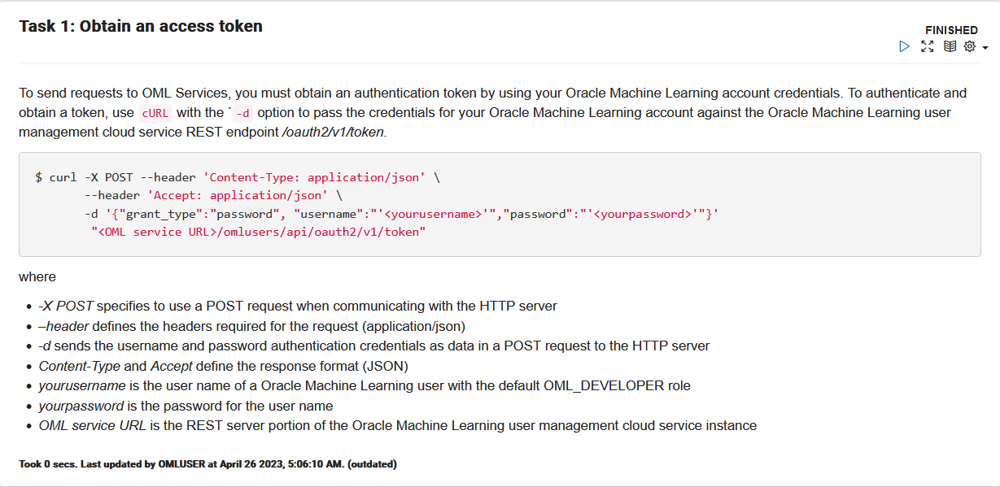

2. Follow the flow of the notebook by scrolling to view and run each paragraph of this lab.

  Scroll down to the beginning of Task 1.1.
  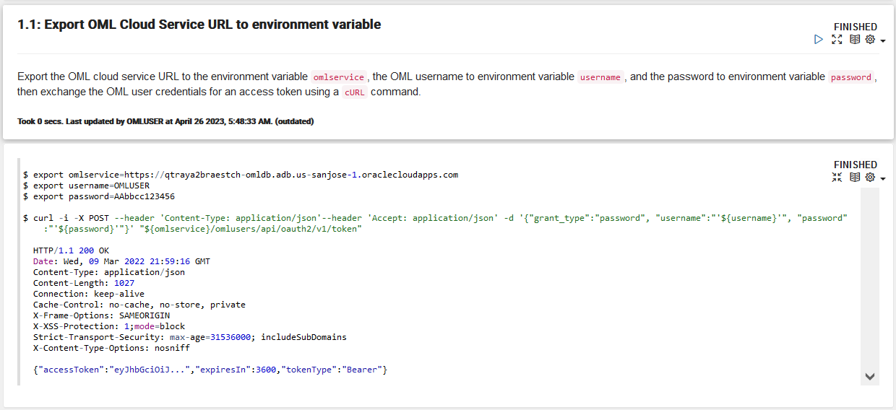

3. Follow the flow of the notebook by scrolling to view and run each paragraph of this lab.

  Scroll down to the beginning of Task 1.2.
  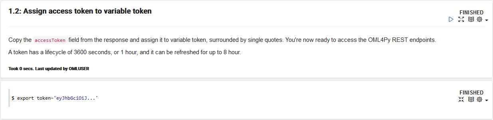

## Task 2:  Obtain a proxy object to the IRIS table
1. Follow the flow of the notebook by scrolling to view and run each paragraph of this lab.

  Scroll down to the beginning of Task 2.

  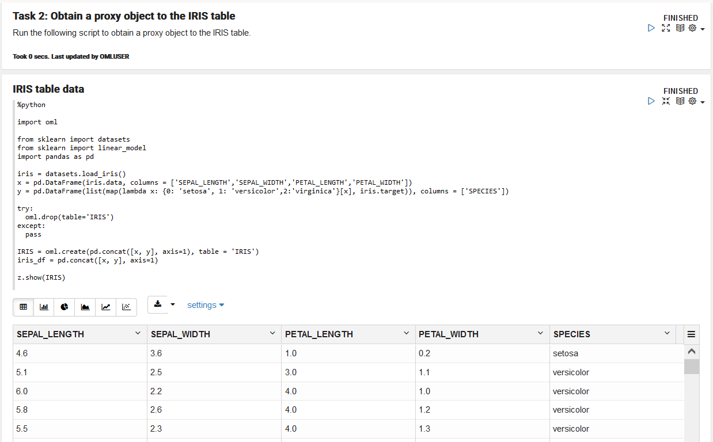

## Task 3: Build a Scikit-Learn Python model using embedded Python execution
1. Follow the flow of the notebook by scrolling to view and run each paragraph of this lab.

  Scroll down to the beginning of Task 3.

  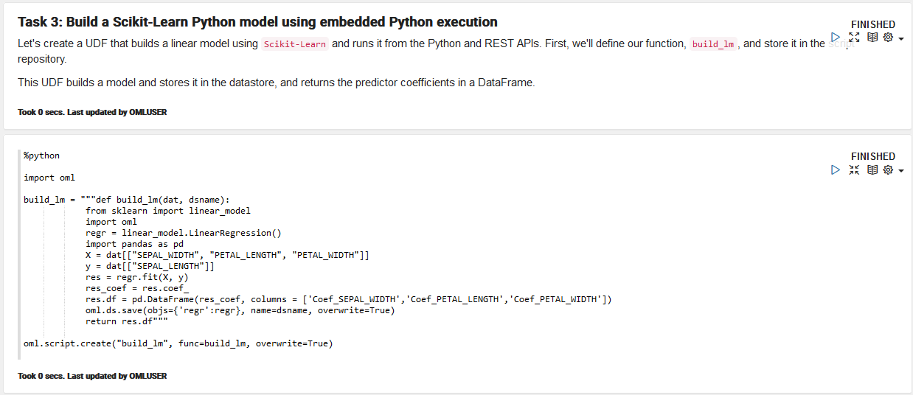

2. Follow the flow of the notebook by scrolling to view and run each paragraph of this lab.

  Scroll down to the beginning of Task 3.1.

  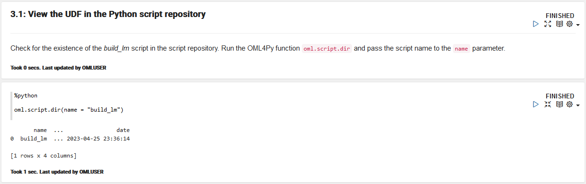

## Task 4: Use the table-apply function to invoke the script from the Python API for embedded Python execution
1. Follow the flow of the notebook by scrolling to view and run each paragraph of this lab.

  Scroll down to the beginning of Task 4.

  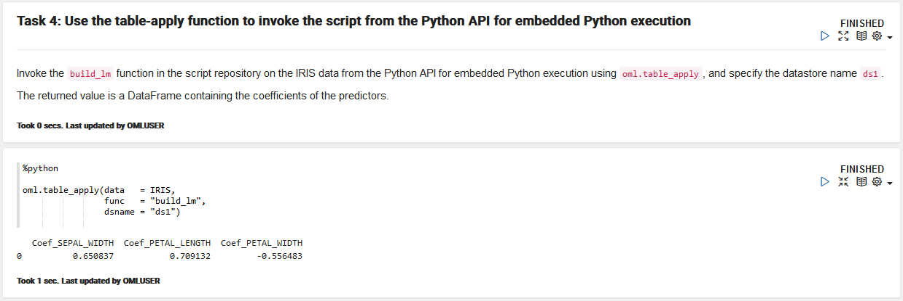

2. Follow the flow of the notebook by scrolling to view and run each paragraph of this lab.

 Scroll down to the beginning of Task 4.1.

  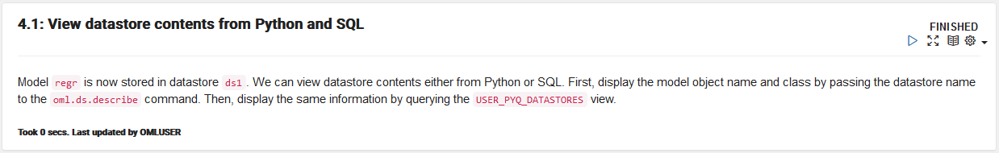

3. Follow the flow of the notebook by scrolling to view and run each paragraph of this lab.

 Scroll down to the beginning of Task 4.2

  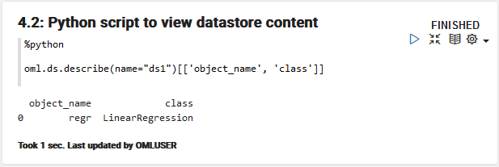

4. Follow the flow of the notebook by scrolling to view and run each paragraph of this lab.

 Scroll down to the beginning of Task 4.3.

  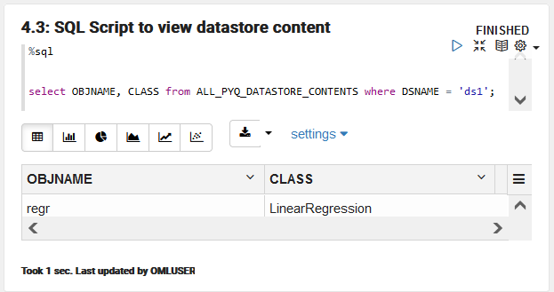

## Task 5: Run the same function using the REST API table function table-apply
1. Follow the flow of the notebook by scrolling to view and run each paragraph of this lab.

   Scroll down to the beginning of Task 5.

  

  >> Note: To run cURL commands, see **Access the OCI Cloud Shell to run cURL commands** in the **Prerequisites** section.

2. Follow the flow of the notebook by scrolling to view and run each paragraph of this lab.

   Scroll down to the beginning of Task 5.1.

  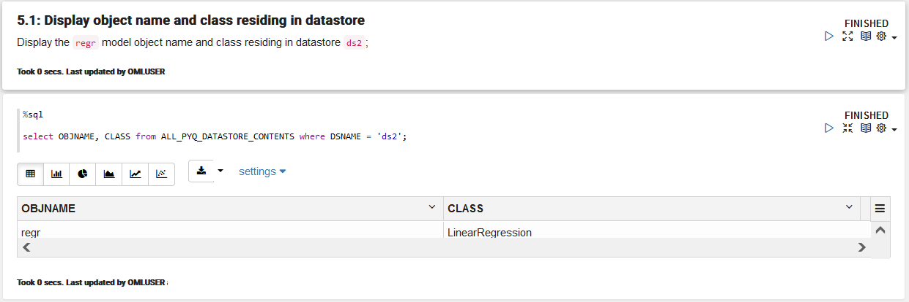

## Task 6: Create a UDF to score using system-supported data-parallelism

1. Follow the flow of the notebook by scrolling to view and run each paragraph of this lab.

   Scroll down to the beginning of Task 6.
   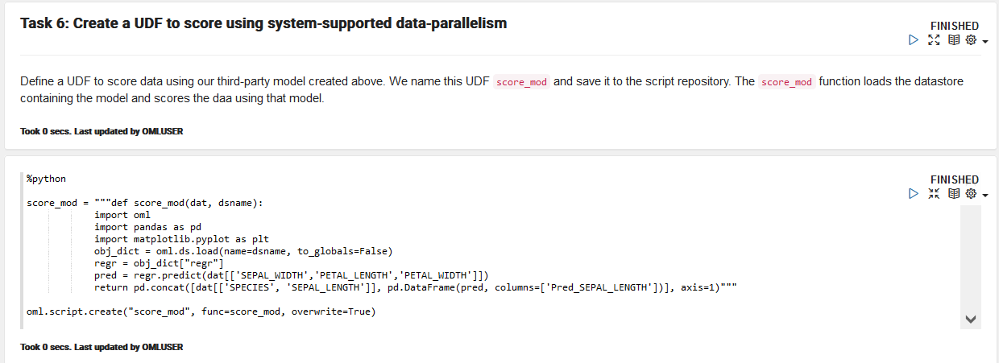

2. Follow the flow of the notebook by scrolling to view and run each paragraph of this lab.

   Scroll down to the beginning of Task 6.1.
   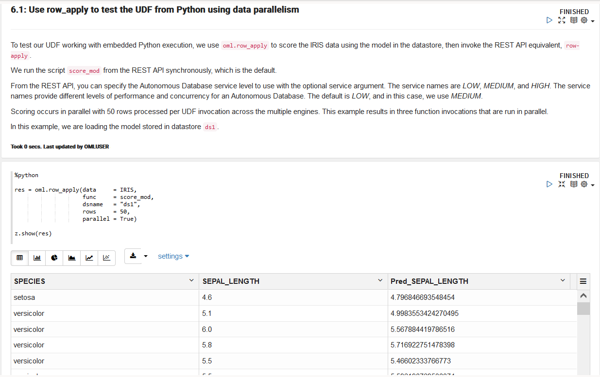

3. Follow the flow of the notebook by scrolling to view and run each paragraph of this lab.

   Scroll down to the beginning of Task 6.2.
   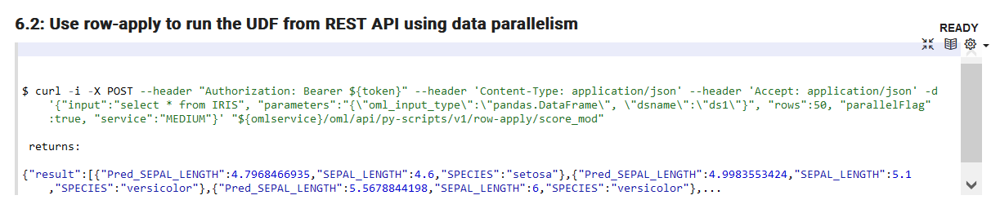

   >> Note: To run cURL commands, see **Access the OCI Cloud Shell to run cURL commands** in the **Prerequisites** section.

## Task 7: Work with Asynchronous Jobs

1. Follow the flow of the notebook by scrolling to view and run each paragraph of this lab.

   Scroll down to the beginning of Task 7.
   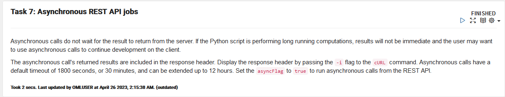

2. Follow the flow of the notebook by scrolling to view and run each paragraph of this lab.

   Scroll down to the beginning of Task 7.1.
   

  >> Note: To run cURL commands, see **Access the OCI Cloud Shell to run cURL commands** in the Prerequisites section.

3. Follow the flow of the notebook by scrolling to view and run each paragraph of this lab.

   Scroll down to the beginning of Task 7.2.
   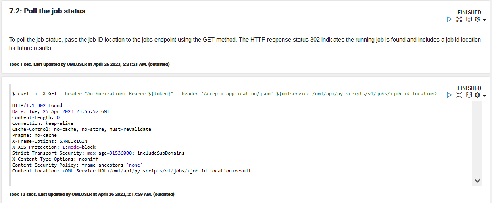

4. Follow the flow of the notebook by scrolling to view and run each paragraph of this lab.

   Scroll down to the beginning of Task 7.3.
   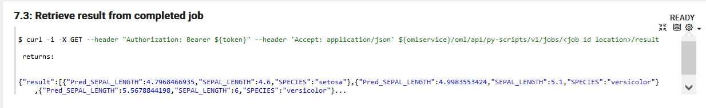

### Congratulations !!!

You reached the end of the lab.  

You can explore additional workshops related to Oracle Machine Learning from the link in the **Learn More** section.  

## Learn more

* [Automated Machine Learning](https://docs.oracle.com/en/database/oracle/machine-learning/oml4py/1/mlpug/automatic-machine-learning.html#GUID-4B240E7A-1A8B-43B6-99A5-7FF86330805A)
* [Oracle Machine Learning Notebooks](https://docs.oracle.com/en/database/oracle/machine-learning/oml-notebooks/)
* [Additional Workshops for Oracle Machine Learning](https://apexapps.oracle.com/pls/apex/dbpm/r/livelabs/livelabs-workshop-cards?c=y&p100_product=70)

## Acknowledgements
* **Authors** - Marcos Arancibia, Product Manager, Machine Learning; Jie Liu, Data Scientist; Moitreyee Hazarika, Principal User Assistance Developer
* **Contributors** -  Mark Hornick, Senior Director, Data Science and Machine Learning; Sherry LaMonica, Principal Member of Tech Staff, Machine Learning
* **Last Updated By/Date** - Marcos Arancibia, Sherry LaMonica, Moitreyee Hazarika May 2023
