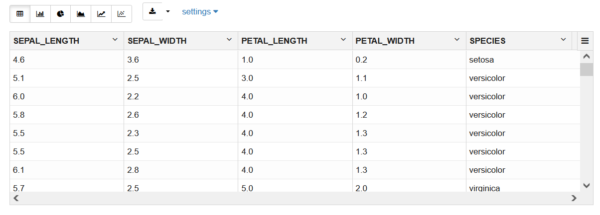

# Run user-defined functions using the SQL API for Embedded Python Execution

## Introduction

This lab walks you through the steps to use the SQL API to call OML4Py Embedded Python Execution functions to run custom Python code.

Estimated Time: 20 minutes

Watch the video below for a quick walk-through of the lab.

[Run user-defined functions using Embedded Python Execution](videohub:1_2skqmxjt)

### About Embedded Python Execution
Embedded Python execution enables you to run user-defined Python functions in Python engines spawned by the Autonomous Database environment. The SQL API for embedded Python execution with Autonomous Database provides SQL interfaces for setting authorization tokens, managing access control list (ACL) privileges, executing Python scripts, and synchronously and asynchronously running jobs.

The OML4Py embedded Python execution SQL API functions are:

* `pyqEval`&mdash;Runs the provided user-defined Python function in a Python engine spawned by the Autonomous Database environment.
* `pyqTableEval`&mdash;Runs the provided user-defined Python function data referenced by an OML DataFrame proxy object in a single Python engine.
* `pyqGroupEval`&mdash;Partitions a database table by the values in one or more columns and runs the provided user-defined Python function on each partition, optionally in parallel using multiple Python engines.
* `pyqRowEval`&mdash;Partitions a database table into sets of rows and runs the provided user-defined Python function on the data in each set, optionally in parallel using multiple Python engines.
* `pyqIndexEval`&mdash;Runs a Python function multiple times, passing in a unique index of the invocation to the user-defined function, optionally in parallel using multiple Python engines.

> **Note:** Embedded Python Execution functions are also available through the [Oracle Machine Learning for Python](https://docs.oracle.com/en/database/oracle/machine-learning/oml4py/1/mlpug/about-embedded-python-execution.html#GUID-A15F3A62-736A-4276-83F2-7C54BE026639) and the [REST APIs for Embedded Python Execution](https://docs.oracle.com/en/database/oracle/machine-learning/oml4py/1/mlepe/rest-endpoints.html)

### Objectives
In this lab, we provide a workflow for using the OML4Py SQL API for embedded Python execution with Oracle Autonomous Database:

As the ADMIN user:
* Add the OML user to cloud host Access Control List (ACL)

As the OML user:
* Obtain an authorization token to access the SQL API for embedded Python execution
* Create a UDF and store it in the OML4Py script repository
* Run the UDF using embedded Python execution from the OML4Py Python and SQL APIs

### Prerequisites

* Add the user to the host ACL
* Access and run the OML notebook for this lab.

1. Go back to the main notebooks listing by clicking on the "hamburger" menu (the three lines) on the upper left of the screen, and then select **Notebooks**.

 

2. Click the **Lab 6 notebook name** to view it.
   <if type="freetier">
    </if>
   <if type="livelabs">
    </if>

  OML Notebooks will create a session and make the notebook available for editing.

  You can optionally click the **Run all paragraphs** () icon, and then click **OK** to confirm to refresh the content with your data, or just scroll down and read the pre-recorded results.  

  

> **NOTE:** If you had problems downloading and extracting the ZIP file for the labs, please [**CLICK HERE** to download the lab6\_embed\_python\_sql.json notebook file](./../notebooks/lab6_embed_python_sql.json?download=1). Download the notebook file for this lab to your local machine and then import it like illustrated in **Lab 1, Task 2**.

## Task 1: Add the OML user to the cloud host ACL

1. Follow the flow of the notebook by scrolling to view and run each paragraph of this lab.

  Scroll down to Task 1.
    >> Note: You must be an ADMIN user to perform this task.

      

  >> Note: In this example, `Ashburn` is the region. Your region will be different from Ashburn. Hence, you must replace Ashburn with your region.

2. Follow the flow of the notebook by scrolling to view and run each paragraph of this lab.
  Scroll down to end of Task 1.1.

  

## Task 2: Obtain an authorization token to access the SQL API for embedded Python execution

1. Follow the flow of the notebook by scrolling to view and run each paragraph of this lab.

  Scroll down to Task 2.

  

2. Follow the flow of the notebook by scrolling to view and run each paragraph of this lab.

  Scroll down to Task 2.1.
  

3. Follow the flow of the notebook by scrolling to view and run each paragraph of this lab.

  Scroll down to Task 2.2.
  

4. Follow the flow of the notebook by scrolling to view and run each paragraph of this lab.

  Scroll down to task 2.3
  

## Task 3: Obtain a proxy object to the IRIS table

Here, you run the following script to obtain a proxy object for the IRIS table.
1. Follow the flow of the notebook by scrolling to view and run each paragraph of this lab.
  Scroll down to Task 3.

  

  This is the output.
  

## Task 4: Build a Scikit-Learn Python model using embedded Python execution

1. Follow the flow of the notebook by scrolling to view and run each paragraph of this lab.

    Scroll down to Task 4.

  

2.  Follow the flow of the notebook by scrolling to view and run each paragraph of this lab.

    Scroll down to Task 4.1. The function confirms the existence of the function build_lm in the script repository.

    

## Task 5: Use the table-apply function to call the script from the Python API for embedded Python execution

>> Note: Here, we are only running the function in the Python API for embedded Python execution as a test step before running it from the SQL API for embedded Python execution.

1. Follow the flow of the notebook by scrolling to view and run each paragraph of this lab.

  Scroll down to Task 5.
  

  The returned value is a DataFrame containing the coefficients of the predictors.

## Task 6: View Datastore content using Python and SQL
The model `regr` is now stored in datastore `ds1`. You can view the datastore content, either from Python or SQL. First, display  Then, display the same information by querying the `USER_PYQ_DATASTORES` view.
1. Follow the flow of the notebook by scrolling to view and run each paragraph of this lab.

  Scroll down to Task 6.
  
2. Follow the flow of the notebook by scrolling to view and run each paragraph of this lab.
  Scroll down to Task 6.1.

 

3. Follow the flow of the notebook by scrolling to view and run each paragraph of this lab.
  Scroll down to Task 6.2.

 

## Task 7: Run the same function `build_lm` using the SQL API table function pyqTableEval

1. Follow the flow of the notebook by scrolling to view and run each paragraph of this lab.

  Scroll down to Task 7.
  

2. Follow the flow of the notebook by scrolling to view and run each paragraph of this lab.
  Scroll down to Task 7.1.   
 

3. Follow the flow of the notebook by scrolling to view and run each paragraph of this lab.
  Scroll down to Task 7.2.

  
4. Follow the flow of the notebook by scrolling to view and run each paragraph of this lab.
  Scroll down to Task 7.3.
  
5. Follow the flow of the notebook by scrolling to view and run each paragraph of this lab.
    Scroll down to Task 7.4.
  

## Task 8: Create a UDF to score using system-supported data-parallelism

1. Follow the flow of the notebook by scrolling to view and run each paragraph of this lab.
  Scroll down to Task 8.

  

2. Follow the flow of the notebook by scrolling to view and run each paragraph of this lab.
  Scroll down to Task 8.1.

  

  Test the UDF working with embedded Python execution, use the `oml.row_apply` function to score the IRIS data using the model in the datastore.

    

3. Follow the flow of the notebook by scrolling to view and run each paragraph of this lab.
  Scroll down to Task 8.2.

  

## Task 9: Return PNG Output

1. Follow the flow of the notebook by scrolling to view and run each paragraph of this lab.
  Scroll down to Task 9.

 
2. Follow the flow of the notebook by scrolling to view and run each paragraph of this lab.
  Scroll down to Task 9.1.
  
3. Follow the flow of the notebook by scrolling to view and run each paragraph of this lab.
  Scroll down to Task 9.2.

  

4. Follow the flow of the notebook by scrolling to view and run each paragraph of this lab.
  Scroll down to Task 9.3.
  

## Task 10: Work with Asynchronous SQL API jobs

1. Follow the flow of the notebook by scrolling to view and run each paragraph of this lab.

   Scroll down to Task 10.

   

2. Follow the flow of the notebook by scrolling to view and run each paragraph of this lab.

  Scroll down to Task 10.1.
  

3. Follow the flow of the notebook by scrolling to view and run each paragraph of this lab.
  Scroll down to Task 10.2.
  

4. Follow the flow of the notebook by scrolling to view and run each paragraph of this lab.
  Scroll down to Task 10.3.
  
5. Follow the flow of the notebook by scrolling to view and run each paragraph of this lab.

  Scroll down to Task 10.4.
  
6. Follow the flow of the notebook by scrolling to view and run each paragraph of this lab.   
   Scroll down to Task 10.5.
  

### Congratulations !!!

You reached the end of the lab.  

You can explore additional workshops related to Oracle Machine Learning from the link in the **Learn More** section.  

## Learn more

* [Automated Machine Learning](https://docs.oracle.com/en/database/oracle/machine-learning/oml4py/2/mlpug/automated-machine-learning1.html#GUID-4B240E7A-1A8B-43B6-99A5-7FF86330805A)
* [Oracle Machine Learning Notebooks](https://docs.oracle.com/en/database/oracle/machine-learning/oml-notebooks/)
* [Additional Workshops for Oracle Machine Learning](https://apexapps.oracle.com/pls/apex/dbpm/r/livelabs/livelabs-workshop-cards?c=y&p100_product=70)

## Acknowledgements
* **Authors** - Marcos Arancibia, Product Manager, Machine Learning; Jie Liu, Data Scientist; Moitreyee Hazarika, Principal User Assistance Developer
* **Contributors** -  Mark Hornick, Senior Director, Data Science and Machine Learning; Sherry LaMonica, Principal Member of Tech Staff, Machine Learning
* **Last Updated By/Date** - Marcos Arancibia, Sherry LaMonica, Moitreyee Hazarika, May 2023
