# Get started with OML4Py on Oracle Autonomous Database

## Introduction
This lab walks you through the steps of accessing Oracle Machine Learning UI, loading notebooks and running OML4Py scripts.

Estimated Time: 15 minutes

### Objectives

In this lab, you will learn how to:
* Access Notebooks under Oracle Machine Learning UI
* Get familiar with the Oracle Machine Learning Notebooks toolbar
* Get familiar with the Oracle Machine Learning Notebooks interpreters
* Verify the connection to the Oracle Autonomous Database
* Load the datasets necessary to run the workshop

* View help files

## Task 1: Access Oracle Machine Learning UI

You create notebooks in Oracle Machine Learning UI. You can access Oracle Machine Learning UI from Autonomous Database.

<if type="livelabs">
1. Go to the site [**My Reservations**](https://apexapps.oracle.com/pls/apex/r/dbpm/livelabs/my-reservations) and make sure you can see that your reservation is ready.  When it is, it will show you a button called **`Launch Workshop`**.  Click on it.
    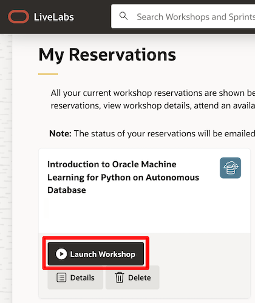

2. In the window with instructions that opens, click on the **View Login Info** at the **top left** of the page, and then click on the **Launch OCI** button.  Make sure to click on the **Copy Password** button since you will need it to login.
    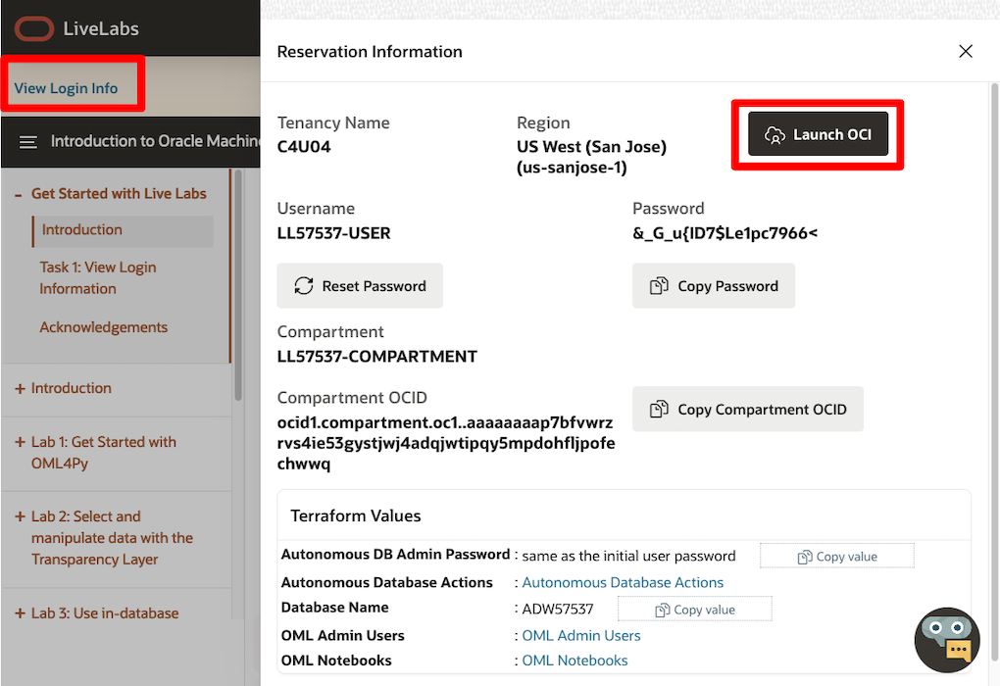

3. Login into OCI with the user provided (it should be filled automatically) and the password you copied.  
    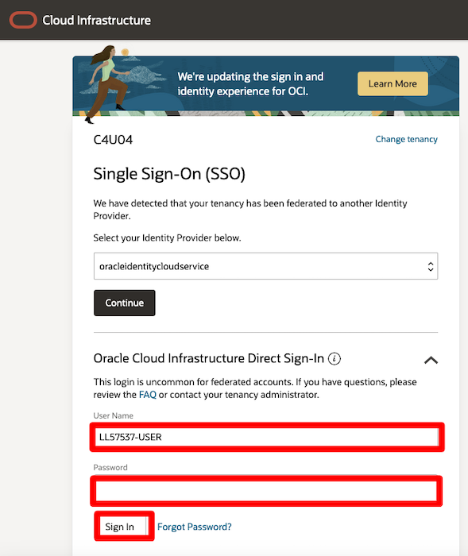

    > **Note:** The first time you login to OCI, you will be asked to reset your password.

4. When you are in OCI, click the left navigation pane on the upper left corner, and click **Autonomous Data Warehouse** under **Oracle Database**.  
    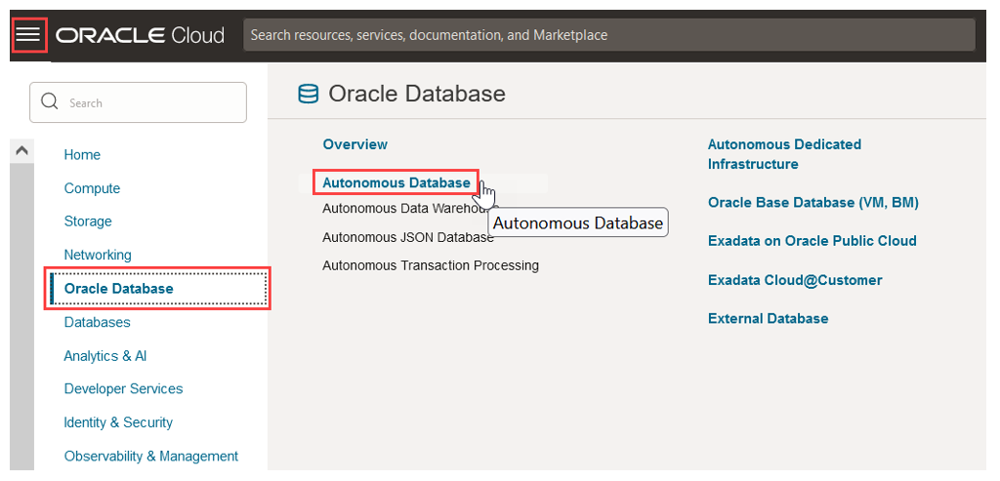

</if>

<if type="livelabs-ocw23">
1. Go to the site [**My Reservations**](https://apexapps.oracle.com/pls/apex/r/dbpm/livelabs/my-reservations) and make sure you can see that your reservation is ready.  When it is, it will show you a button called **`Launch Workshop`**.  Click on it.
    

2. In the window with instructions that opens, click on the **View Login Info** at the **top left** of the page, and then click on the **Launch OCI** button.  Make sure to click on the **Copy Password** button since you will need it to login.
    

3. Login into OCI with the user provided (it should be filled automatically) and the password you copied.  
    

    > **Note:** The first time you login to OCI, you will be asked to reset your password.

4. When you are in OCI, click the left navigation pane on the upper left corner, and click **Autonomous Data Warehouse** under **Oracle Database**.  
    

</if>

<if type="freetier">

1. Sign into your OCI account, click the left navigation pane on the upper left corner, and click **Autonomous Data Warehouse** under **Oracle Database**.  

     > **Note:** It is possible to select a different type of Autonomous Database if you previously provisioned a different one and have created OML Users for it, since OML is available in AJD and ATP as well.

    

</if>

<if type="freetier-ocw23">

1. Sign into your OCI account, click the left navigation pane on the upper left corner, and click **Autonomous Data Warehouse** under **Oracle Database**.  

     > **Note:** It is possible to select a different type of Autonomous Database if you previously provisioned a different one and have created OML Users for it, since OML is available in AJD and ATP as well.

    

</if>

2. The Autonomous Database dashboard lists all the databases that are provisioned in the tenancy. Select the compartment corresponding to the <if type="livelabs">provisioned **Live Labs** instance (the Compartment name is shown in the Login info for your reservation, as shown in Task 2).  Click on the Autonomous Database with your unique **Display Name ADWXXXXX** shown in Task 2</if><if type="livelabs-ocw23">provisioned **Live Labs** instance (the Compartment name is shown in the Login info for your reservation, as shown in Task 2).  Click on the Autonomous Database with your unique **Display Name ADWXXXXX** shown in Task 2</if><if type="freetier">previously provisioned instance, and click the Oracle Autonomous Database name (in the example below, **OML_LABS**)</if><if type="freetier-ocw23">previously provisioned instance, and click the Oracle Autonomous Database name (in the example below, **OML_LABS**)</if>.

<if type="freetier">
     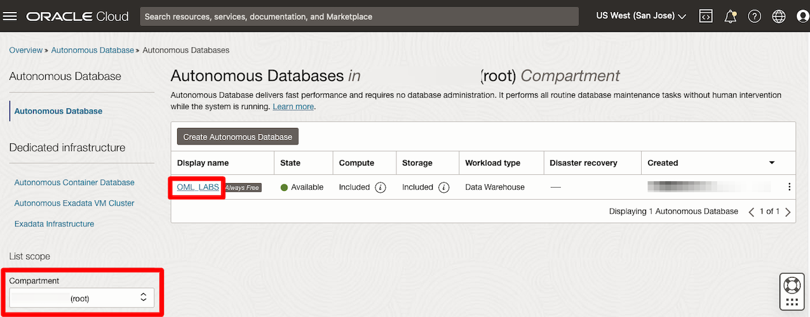</if>
<if type="freetier-ocw23">
     </if>
<if type="livelabs">
     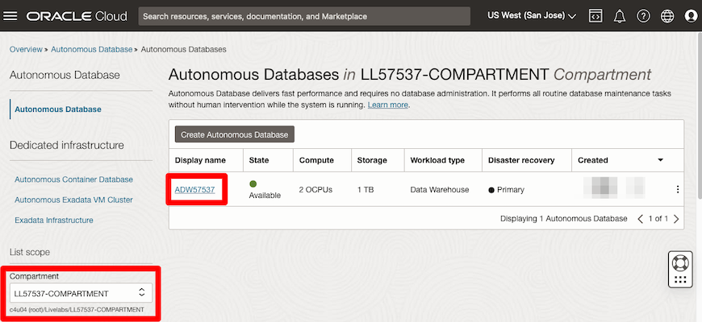</if>
<if type="livelabs-ocw23">
     </if>

3. On the Autonomous Database details page, click **Database Actions** and then select **View all Database Actions**.

	  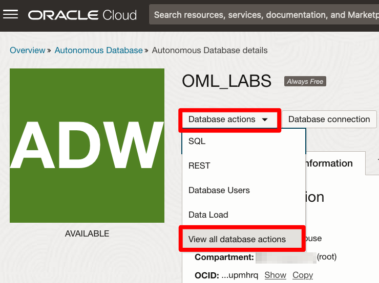

     Before you get to the Oracle Database Actions Launchpad page, you might be asked to login, depending on the browser you are using.  If this is the case make sure to enter **ADMIN** for the user, and the <if type="freetier">password you have given the ADMIN user</if><if type="freetier-ocw23">password you have given the ADMIN user</if><if type="livelabs">password shown in the **View Login Info** in Task 1, Step 2 (you can click on the **Copy Password** button)</if><if type="livelabs-ocw23">password shown in the **View Login Info** in Task 1, Step 2 (you can click on the **Copy Password** button)</if>.
   
    

4. On the Database Actions page, go to the **Development** section and click **Oracle Machine Learning**. This opens the Oracle Machine Learning Sign In page.
    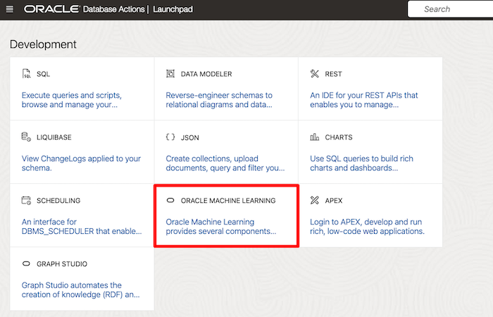

     > **Note:** There is also a way to access directly the URL for the Oracle Machine Learning login page. It is under the ADB Console **Tool configuration** Tab, as illustrated below.  
	 
	 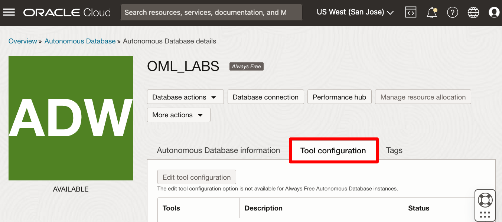
	 
	 In there you can scroll down to find and copy the direct URL to login into the OML UI.

	 

	  > **Note:** If you are are using a **Paid Account** and deployed a **Paid Autonomous Database** you would also see an additional column that show any customizations made to the compute power available specifically to OML jobs, along with the  `Max idle time` defined to release those resources.
	   

5. You should be in the Sign In page for OML. <if type="livelabs">Sign in with the **`OMLUSER`** using the password **`AAbbcc123456`**. </if><if type="livelabs-ocw23">Sign in with the **`OMLUSER`** using the password **`AAbbcc123456`**. </if><if type="freetier">Enter the **`OMLUSER`** credentials using the password that you used earlier when creating the users. Then click the blue **Sign in** button.</if><if type="freetier-ocw23">Enter the **`OMLUSER`** credentials using the password that you used earlier when creating the users. Then click the blue **Sign in** button.</if>

    

6. Once in the OML UI, click on the three-dashes menu button at the top left.  The main menu will slide open from the left.  Select the **Notebooks EA** in the Quick Actions menu.

    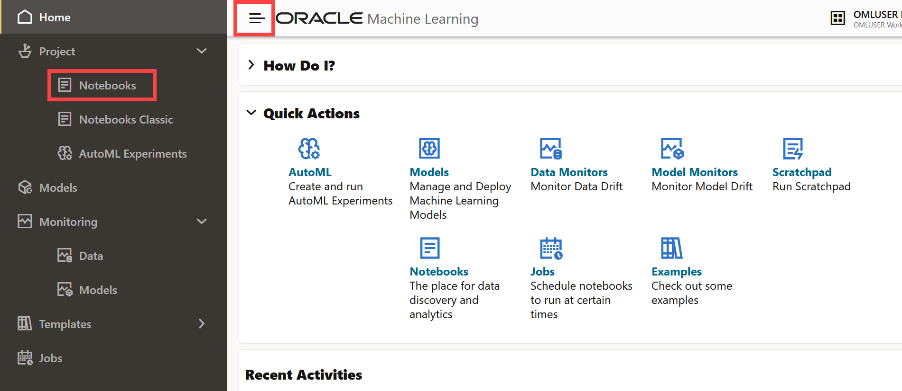

<if type="livelabs">
    > **Note:** There is another option to get straight into OML UI from the Live Labs reservation.  When you click on **View Login Info**, you can click on the **OML Notebooks** button to go to the OML UI.
    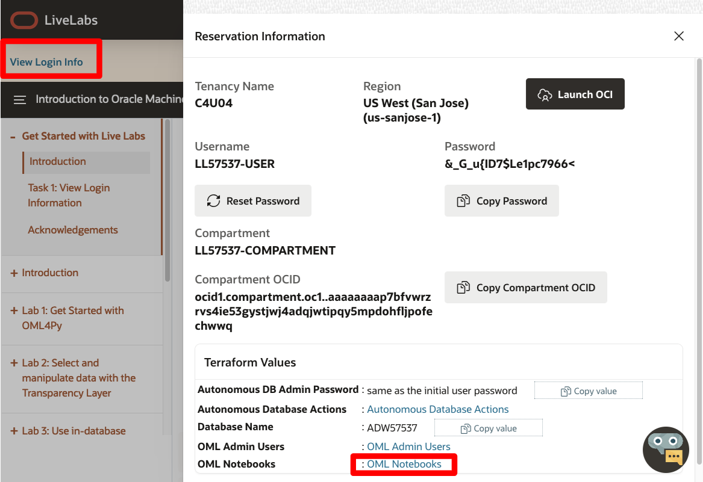

</if>
<if type="livelabs-ocw23">
    > **Note:** There is another option to get straight into OML UI from the Live Labs reservation.  When you click on **View Login Info**, you can click on the **OML Notebooks** button to go to the OML UI.
    

</if>
## Task 2: Get familiar with OML Notebooks

We will now download a set of Notebooks that will be used throughout the workshop. It is important that you download and uncompress the collection of Notebooks to a memorable place so that you can find them when it's time to import the files.

> **NOTE:** There is no Notebook for Lab 5, even though you see Lab 5 in the main index of the workshop, because we will be using an interactive UI during that Lab.

<if type="freetier">
1. [**CLICK HERE** to download a ZIP file with all the notebooks we will use for these Labs (in a special DSNB format)](https://objectstorage.us-ashburn-1.oraclecloud.com/p/-i6x7RilAL74Y-CNNwX-sWS7yn14fD86s7ixs18e-YFBigdgYcGcRwAvYsRjjmn1/n/adwc4pm/b/oml4py_labs/o/oml4py_labs_freetier_ds.zip?download=1) which contain the notebooks for the Labs.  Save it to your local machine and __extract them__ to a memorable place.
</if>
<if type="freetier-ocw23">
1. [**CLICK HERE** to download a ZIP file with all the notebooks we will use for these Labs (in a special DSNB format)](https://objectstorage.us-ashburn-1.oraclecloud.com/p/qnTYQrUWcb7PvOtnakVtxTOFUwqdtYvgql_ogG8UFkvGEeQei29lI4mUvD5dQc8t/n/adwc4pm/b/oml4py_labs/o/oml4py_labs_freetier_ds_ocw23.zip?download=1) which contain the notebooks for the Labs.  Save it to your local machine and __extract them__ to a memorable place.
</if>
<if type="livelabs">
1. [**CLICK HERE** to download a ZIP file with all the notebooks we will use for these Labs (in special DSNB format)](https://objectstorage.us-ashburn-1.oraclecloud.com/p/hdPFgP_bHl8WxY21dlBqnUtCCzAzsqFXzdmmoAx2TbL_vyADVCM9rMMRXCTj_Xcm/n/adwc4pm/b/oml4py_labs/o/oml4py_labs_sandbox_ds.zip?download=1) which contain the notebooks for the Labs.  Save it to your local machine and __extract them__ to a memorable place.
</if>
<if type="livelabs-ocw23">
1. [**CLICK HERE** to download a ZIP file with all the notebooks we will use for these Labs (in special DSNB format)](https://objectstorage.us-ashburn-1.oraclecloud.com/p/EsN3wpucP7-gzMGjoV55UrXnFMrpt5ySbsT7TE1CiT99Q-gqXPSGy0P2oCYGyRn1/n/adwc4pm/b/oml4py_labs/o/oml4py_labs_sandbox_ds_ocw23.zip?download=1) which contain the notebooks for the Labs.  Save it to your local machine and __extract them__ to a memorable place.
</if>

> **NOTE:** If you have problems with downloading and extracting the ZIP file, please [**CLICK HERE** to download the "Lab 1 - Get Started with OML4Py on Autonomous Database" notebook in DSNB format](<./../notebooks/Lab 1 - Get Started with OML4Py on Autonomous Database.dsnb?download=1>) which contains the notebook version of Lab1, save it to your local machine and import it as illustrated below.

  To import the downloaded notebook files into **OML Notebooks EA**:
  - Go to the **Notebooks EA** page, and click **Import**.  

  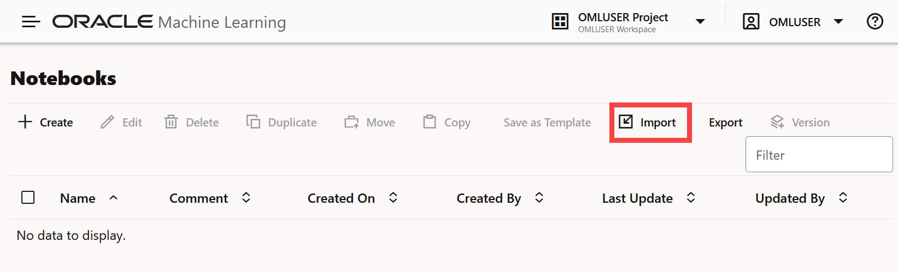

 - Select all the extracted notebooks at once from your local folder and click on **Open**.
 <if type="freetier">Select the 10 DSNB files on your machine and click Open.
      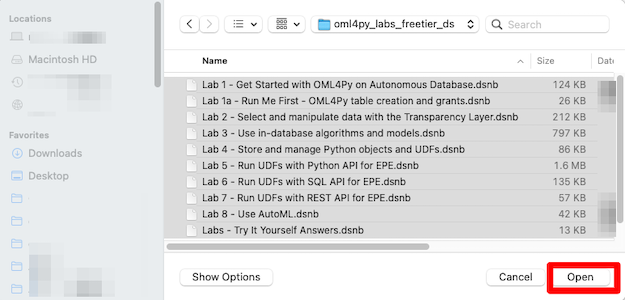</if>
 <if type="freetier-ocw23">Select the 11 DSNB files on your machine and click Open.
      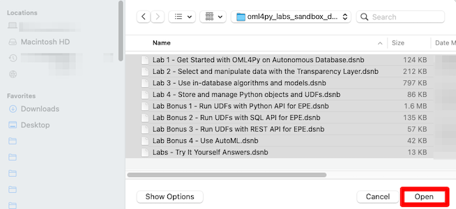</if>
 <if type="livelabs">Select the 10 DSNB files on your machine and click Open
      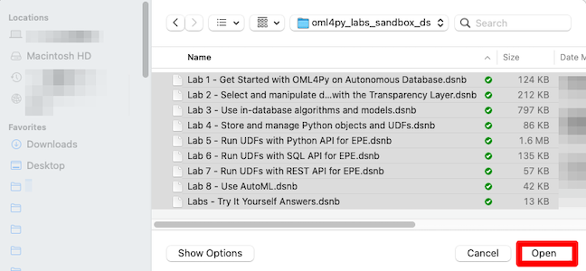 </if>
<if type="livelabs-ocw23">Select the 11 DSNB files on your machine and click Open.
       </if>

 - After the notebooks are successfully imported, click the Lab 1 notebook to view it.
 <if type="freetier">   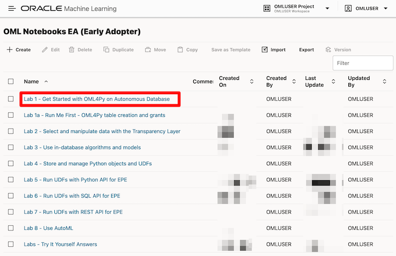 </if>
 <if type="freetier-ocw23">   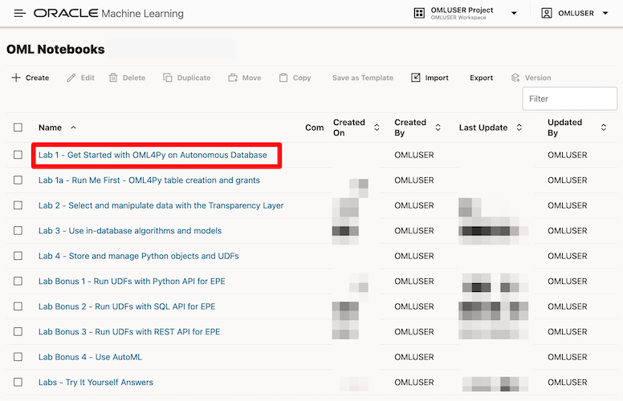 </if>
 <if type="livelabs">    </if>
 <if type="livelabs-ocw23">    </if>

 OML will start a session and make the notebook available for visualization and editing.

  ### About Oracle Machine Learning Notebooks

    A notebook is a web-based interface for data analysis, data discovery, data visualization and collaboration.

    The Oracle Machine Learning Notebooks EA toolbar contains buttons to run code in paragraphs, for configuration settings, and display options.

    For example, it displays the type of Database connection group that the notebook is currently ready to use (low/medium/high), and also the current style of notebook layout (Jupyter vs Zeppelin). It also contains menu items to show or hide the paragraph code, result, titles and settings. Additional settings are shown in the illustration below.

    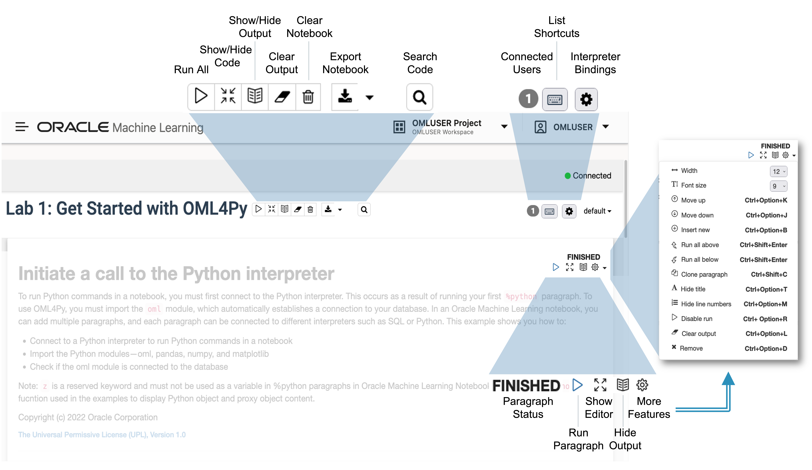

## Task 3: Getting started with OML Notebooks and interpreter types

1. OML Notebooks contain a default list of interpreter bindings that operate under the different Autonomous Database processing groups.  These interpreter bindings are used to run scripts in the different languages, and it will be processed by the Autonomous Database that it is linked to.  
   
  For this lab, we will **set the processing group type to `low`**, by making sure it is the selected option in the top right of the Notebook when it's open.

  Click the processing group type button in the upper right-corner of the notebook to view the list of available processing group types.
    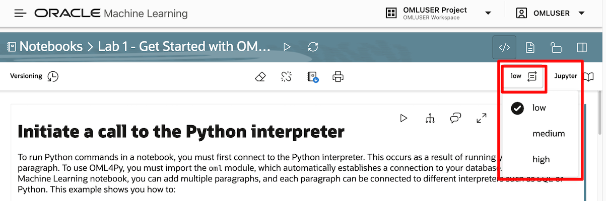

  The default type is `low`, and you can select among the ones available to your Autonomous Database depending on type of service (Autonomous Datawarehouse or Autonomous Transaction Processing).

  An interpreter is a plug-in that allows you to use a specific data processing language in your Oracle Machine Learning notebook. You can add multiple paragraphs, and each paragraph can be connected to different interpreters such as SQL (%sql), PL/SQL (%script), Python (%python), R (%r) and Conda (%conda).

  You create paragraphs with different interpreters based on the code you want to run, and the interpreter is set at the top of each paragraph.

  The available interpreters are:

  - `%md`&mdash;To call the Markdown interpreter and generate static html from Markdown plain text
  - `%sql`&mdash;To call the SQL interpreter and run SQL statements
  - `%script`&mdash;To call and run PL/SQL scripts
  - `%python`&mdash;To call the Python interpreter and run Python scripts
  - `%r`&mdash;To call the R interpreter and run R scripts.
  - `%conda`&mdash;To connect to the Conda interpreter and install third-party Python and R libraries inside a notebook session.

## Task 4: Use the Python interpreter

1. Let's start by running the entire notebook, so that we can see the result of each paragraph.

   Click on the **Run all paragraphs** () icon in front of the name of the notebook, and then click **Confirm** to run the notebook and refresh the content with your data, as indicated below.

   Another option is to just scroll down and read the pre-recorded results contained in the notebooks themselves.

   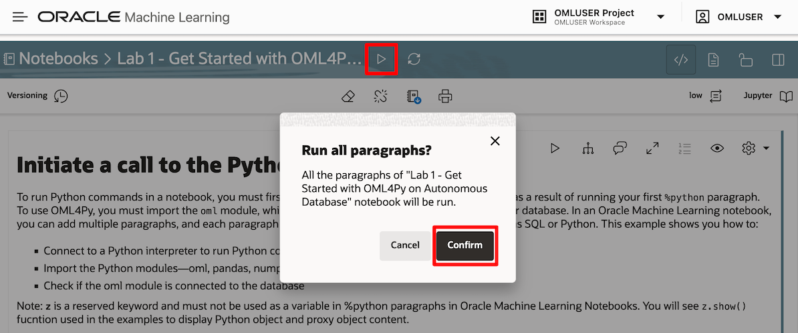

   Scroll down on the "Lab 1" Notebook to follow along the steps below.

   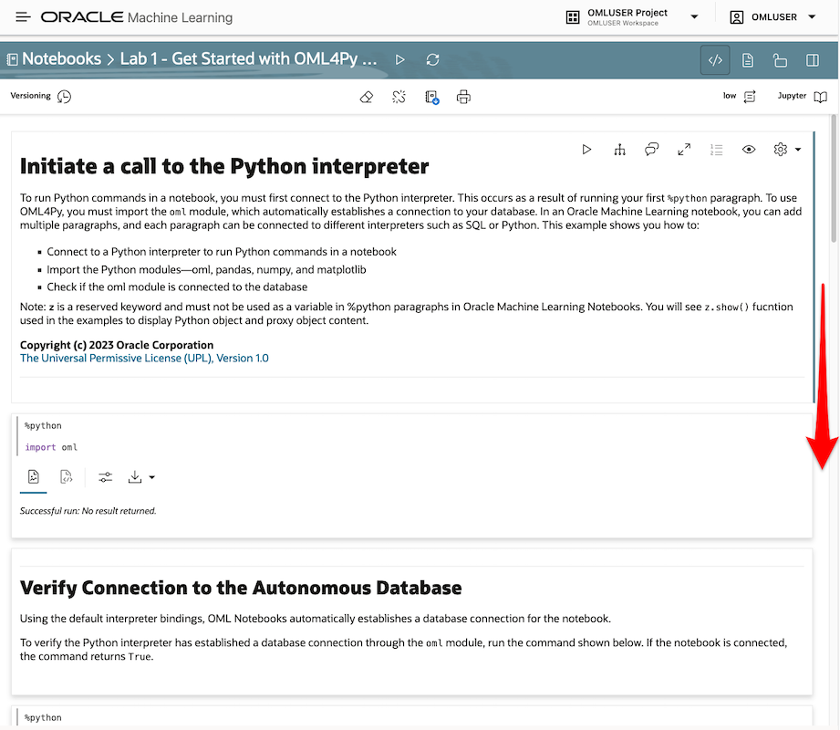

2. To run Python commands in a notebook, you must make use of the Python interpreter. This occurs as a result of running your first  `%python`  paragraph.  To use OML4Py, you must import the `oml` module, which automatically establishes a connection to your database.

   In an Oracle Machine Learning notebook, you can add multiple paragraphs, and each paragraph can be connected to different interpreters such as SQL, Python or R. This lab shows you how to:

   * Connect to a Python interpreter to run Python commands in a notebook
   * Import the Python modules&mdash;oml, pandas, numpy, and matplotlib
   * Check if the `oml` module is connected to the database

   > **Note:** **`"z"`** is a reserved keyword and must not be used as a variable in `%python` paragraphs in Oracle Machine Learning Notebooks. You will see `z.show()` used in the examples to display Python object and proxy object content.

3. To use OML4Py, you must import the oml module. Type the following Python command to import the `oml` module, and click the **run** icon. Alternatively, you can press Shift+Enter keys to run the current paragraph where the cursor is.   

   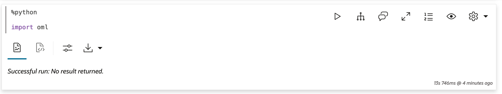

4. Using the default interpreter bindings, OML Notebooks automatically establishes a database connection for the notebook.  
   To verify the Python interpreter has established a database connection through the `oml` module, run the command:

   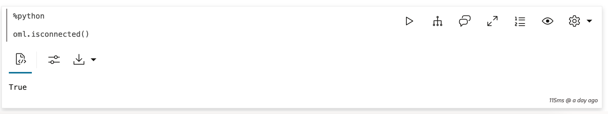

   Once your notebook is connected, the command returns `True`.         

5. The Python `help` function

   The Python `help` function is used to display the documentation of packages, modules, functions, classes, and keywords.

   Scroll down in the notebook to see examples of the use of the `help` function.

## Task 5: Load sample data into tables and views, and grant access to all users

1. All labs starting from number 2 and above of this workshop use tables and views that need to be created upfront.  To create these tables and views, we will open the Notebook "Lab 1a - Run Me First - OML4Py table creation and grants".

> **NOTE:** If you have problems with downloading and extracting the ZIP file, please [**CLICK HERE** to download the "Lab 1a - Run Me First - OML4Py table creation and grants" notebook DSNB file](<./../notebooks/Lab 1a - Run Me First - OML4Py table creation and grants.dsnb?download=1>). This notebook contains the scripts for creating tables and views, and granting the required access. Save it to your local machine and import it like illustrated in **Task 2, Step 1**.

2. Go back to the main Notebooks listing by clicking on the "hamburger" menu (the three lines) on the upper left of the screen, and then select **Notebooks EA**. Click the **Lab 1a** notebook to view it.
<if type="freetier"> 
 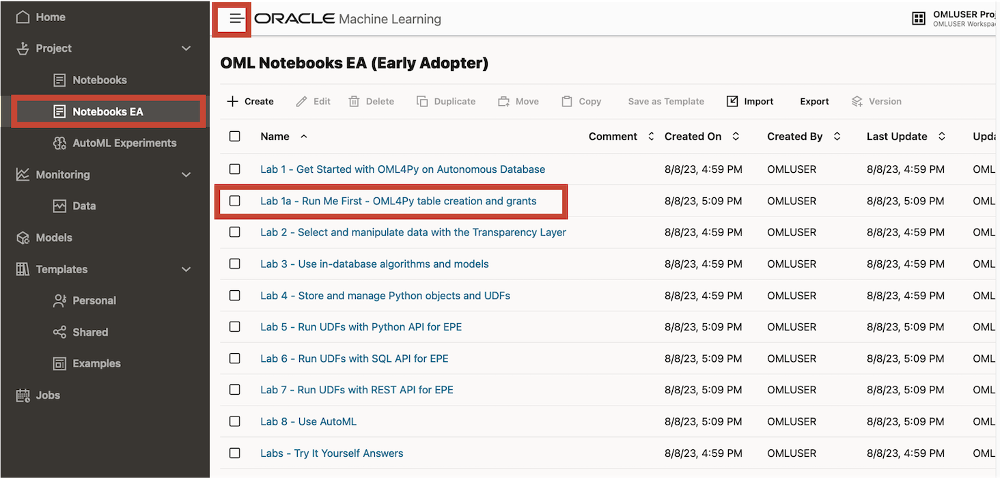
 </if>
 <if type="livelabs"> 
 
 </if>
 <if type="freetier-ocw23"> 
 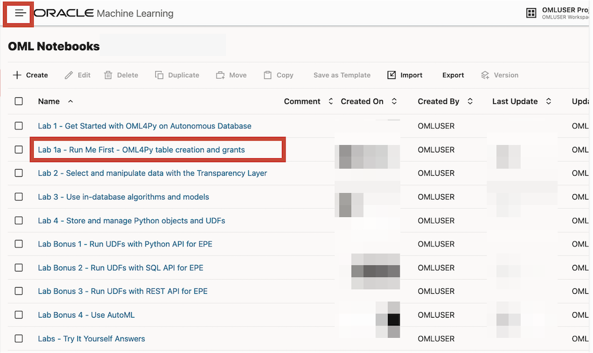
 </if>
 <if type="livelabs-ocw23"> 
 
 </if>

 OML Notebooks will load a session and make the notebook available for editing.

3. Click the **Run all paragraphs** () icon, and then click **Confirm** to run the notebook.
  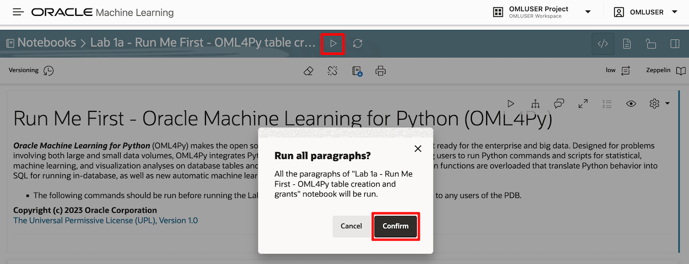

   Scroll down, and wait until all the paragraphs have finished running.  You should see a message at the bottom of the last paragraph that contains SQL code (the `%script` one) that reads `"PL/SQL procedure successfully completed"`.

   And at the bottom right, you will see the time it took to run and how long ago it was done.  In the example below it mentions `243ms @ a few seconds ago`, indicating the recent run.

  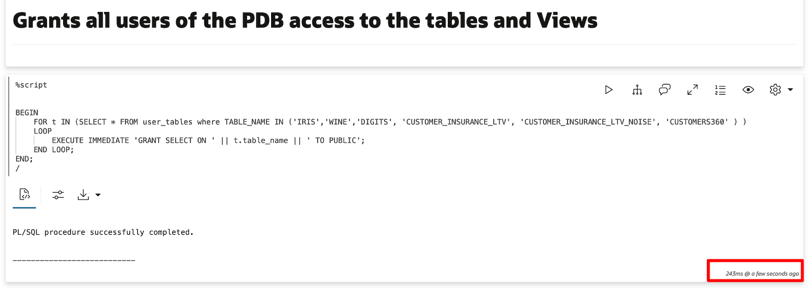

The prerequisite scripts have run successfully.

You can now *proceed to the next lab*.

## Learn more

* [Get Started with Oracle Machine Learning for Python](https://docs.oracle.com/en/database/oracle/machine-learning/oml4py/2/)
* [Get Started with Oracle Machine Learning Notebooks](https://docs.oracle.com/en/database/oracle/machine-learning/oml-notebooks/)
* [Oracle Machine Learning Notebooks - Early Adopter](https://docs.oracle.com/en/database/oracle/machine-learning/oml-notebooks/omlug/get-started-notebooks-ea-data-analysis-and-data-visualization.html#GUID-B309C607-2232-43E2-B4A1-655DB295B90B)

## Acknowledgements
* **Authors** - Marcos Arancibia, Product Manager, Machine Learning; Moitreyee Hazarika, Principal User Assistance Developer
* **Contributors** -  Mark Hornick, Senior Director, Data Science and Machine Learning; Sherry LaMonica, Principal Member of Tech Staff, Machine Learning; Jie Liu, Data Scientist
* **Last Updated By/Date** - Marcos Arancibia, August 2023
