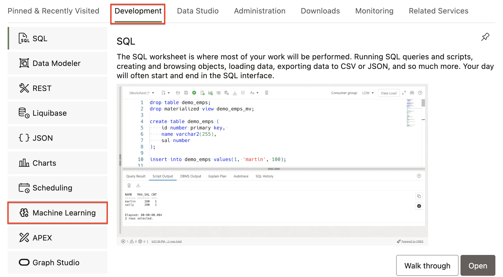
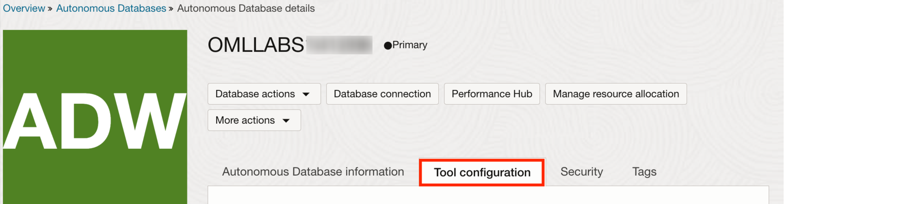
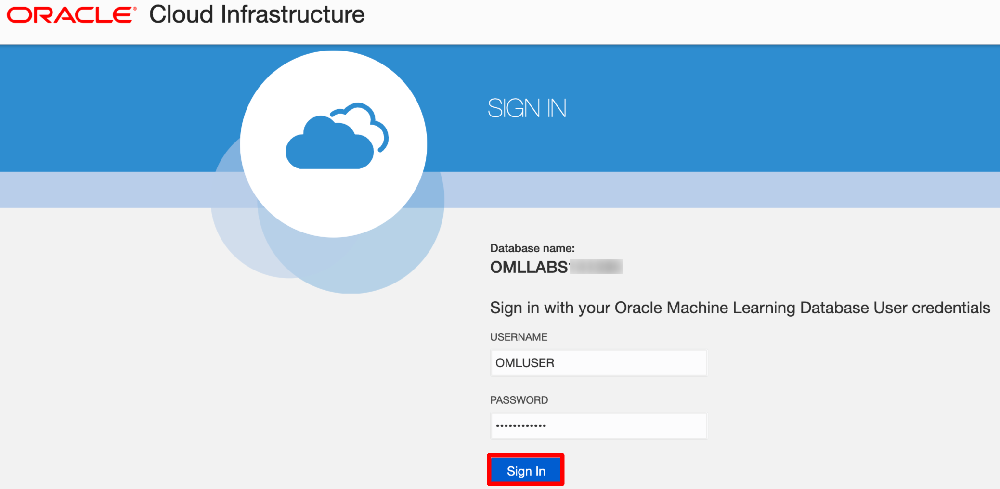
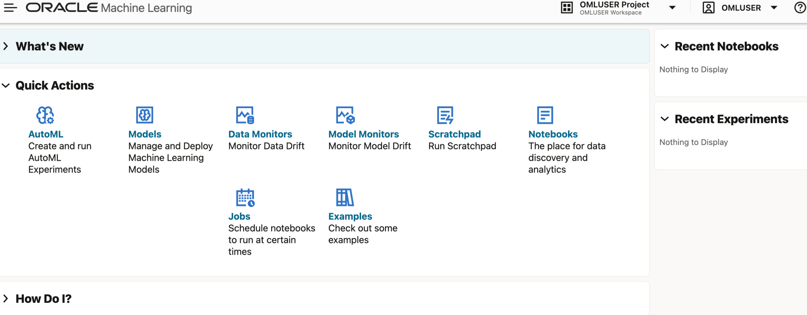

# Provision an Autonomous Database in Oracle Cloud

## Introduction

This lab walks you through the steps to provision an Autonomous Database in your Oracle Cloud account, whether it is a Free Tier one or a Paid one.  You will also create an OML-enabled user and sign into Oracle Machine Learning user interface.

Estimated Time: 20 minutes

### Objectives

In this lab, you will learn how to:

* Provision an Oracle Autonomous Database
* Create an Oracle Machine Learning user
* Sign into Oracle Machine Learning user interface

### Prerequisites

* Sign up for a Free Tier Oracle Cloud account (check the **Get Started** Lab in this workshop for instructions) or use your own paid Oracle Cloud account.
  
* If you are using your own **Paid OCI Tenancy**, make sure you have the appropriate Quotas available to provision **Autonomous Data Warehouse** services.  You can read more about "Quotas and Limits" in the [OCI Documentation for Service Limits](https://docs.oracle.com/en-us/iaas/Content/General/Concepts/servicelimits.htm " "). 

 > **Note:** You may see differences in account details in the screenshots (eg: Database Name is different than yours) as you work through the labs. This is because of the flexibility of choice you will have when creating your own.

## Task 1: Provision an Oracle Autonomous Database

To provision an Oracle Autonomous Database:

1. Sign into your OCI account, and under the Launch Resources section, click **Create an ADW database**.

	

	 Alternatively, you may click the left navigation pane on the upper left corner, and click **Autonomous Data Warehouse** under **Oracle Database**.

	

2. From the Oracle Cloud Infrastructure console, on the Oracle Autonomous Database page choose your region and optionally select a compartment (by default it will show the root compartment). Click **Create Autonomous Database**. This opens the Create Autonomous Database page.

   

    > **Note:** You will need to make sure to select your **OCI Home Region** if you intent on creating an Always-Free Autonomous Database.

     

3. On the Create Autonomous Database page, provide the basic information about the database. By default, a database name and a display name for the database are provided. You can modify these names to enter a user-friendly display name for the ADB instance to easily identify the resource. The display name does not have to be unique.    

   > **Note:** We will choose the Display Name *OML_LABS* and the Database Name *OMLLABS* for our example.  You can use the same or create your own, but neither supports blank spaces in the name

   

4. For Workload Type, select **Data Warehouse**.

   

5. For Deployment, select **Serverless Infrastructure**.

   

6. For Database Configuration, select Always Free. For the Always Free option, the only database configuration option available is the release.  Please **select 19c**.  You can create `Always Free` resources both in Free Tier and Paid accounts, with the requirement of it being created in your **OCI Home Region** as mentioned above on Task 2.

   
   
    > **Note:** If you are using a **Paid Account** and decide to provision a **paid database** instead of an `Always-Free`, you will see more options available that include compute and storage sizing and auto scaling.  For this workshop the **minimum compute unit of 2 ECPUs with auto scaling** is sufficient.

    > 

	> You will also be offered a **customizable Backup Plan** billed separately, not available in the Always-Free Autonomous Database, that you can adjust as ou see necessary.  We will not be using backups in this workshop, so you can easily put it to a minimum of 1 day without issues.

    > 

7. Create your Autonomous Database administrator credentials by providing a password. You will need these credentials to sign into this Autonomous Database instance.   

	> **Note:** The default administrator username is ADMIN. The ADMIN password must be 12 to 30 characters and contain at least one uppercase letter, one lowercase letter, and one number. The password cannot contain the double quote (") character or the username "admin".

	

8. For network access, select **Allow secure access from everywhere.**

    

9. For License type, by default the **Always Free** databases are provisioned with **License Included** and you cannot change this option.  If you provision a **Paid Account** you can switch it to BYOL if this is your case.

    

10. Provide your email ID for any notifications and announcements, and click **Add Contact**. Then click **Create Autonomous Database**.

	 

	 The Oracle Autonomous Data Warehouse instance starts provisioning. It will show the status **Provisioning** and will start a **Guided Tour** that you can skip for now.
	 
	 

	 
	 Once your Autonomous Database is created (it should take a few minutes), the database details are listed with the status Available.

	  

This completes the task of provisioning an Oracle Autonomous Database.

## Task 2: Create an Oracle Machine Learning user

An administrator creates a new user account and user credentials for Oracle Machine Learning in the Database Users user management interface.

> **Note:** You must have the administrator role to access the Database Actions Database Users interface.

To create a user account:

1. If you are not already signed in, Sign into your OCI account, click the hamburger on the left to open the left navigation pane, and click **Oracle Database**. On the right, click **Autonomous Data Warehouse**.

	

2. The Autonomous Database dashboard lists all the databases that are provisioned in the tenancy. Click the Oracle Autonomous Database that you have provisioned for this workshop.  

	

3. On the Autonomous Database details page, click **Database Actions**, and then select the **Database Users** option.

	

4. Before you get to the Oracle Database Actions Launchpad page, you might be asked to login, depending on the browser you are using.  If this is the case make sure to enter **ADMIN** and the password you gave the administrator user in Task 1, Step 7.
   
    

5. Click **Create User**. The Create User dialog opens.

	

6. On the Create User dialog, enter the following details and click **Create User**:	  

	

	* **User Name:** Enter the user name OMLUSER.
	* **Password:** Enter a password for this user. The password must be 12 to 30 characters and contain at least one uppercase letter, one lowercase letter, and one number. The password cannot contain the double quote (") character or the username itself.
	* **Confirm Password:** Re-enter the password that you entered in the Password field.
	* **Graph:** Optionally select this option to enable graph for this user.
	* **Web Access:** Optionally select this option to allow Web and DB Actions access to this user via its own url.
	* **OML:** Required: Select this option to allow this user to access Oracle Machine Learning.
	* **Quota of tablespace data:** Click on the drop-down list and select an option. For this lab and a typical Always Free ADB, Unlimited is selected.
	* **Password Expired:** This option is used if you want the user to reset their own password.
	* **Account is locked:** This option is used to lock the account.

7. After the user is created successfully, the message _User OMLUSER created successfully_ is displayed.

	

	Scroll down the page to view the user. The OMLUSER is listed along with all details. Click the three-dots menu  to edit, delete, or disable any of the privileges granted to the user.
	

8. Repeat the same process and create a second user named _OMLUSER2_ . You can repeat the same exact steps and password as well, since we will only use this user to demonstrate the privilege grants for acessing Python scripts and objects in the Repository.

	Once this is done, you should have the following users available.
	

	This completes the task of creating OML-enabled users.

## Task 3: Sign into Oracle Machine Learning

A notebook is a web-based interface for data analysis, data discovery, data visualization, and collaboration. You create and run notebooks in Oracle Machine Learning user interface. You can access Oracle Machine Learning user interface from Autonomous Database.

1. On your Oracle ADW instance, click **Database Actions**, and select **View all database actions** from the options that appear.

	

	> **Note:** If you had it already open in the Database Users section, you can go to Database Actions home page clicking in the **Database Actions** on the top left corner of the page, as shown in the screenshot below.

	

2. On the Database Actions page, go to the **Development** tab and click **Oracle Machine Learning**. This opens the Oracle Machine Learning sign in page.

	 

	 > **Note:** There is also a way to access directly the URL for the Oracle Machine Learning login page. It is under the ADB Console **Tool configuration** Tab, as illustrated below.  
	 
	 
	 
	 In there you can scroll down to find and copy the direct URL to login into the OML UI.

	 

	 If you are are using a **Paid Account** you would also see additional options to customize the compute power available specifically to OML jobs, including the timeout defined.

	 

3. Enter your user credentials and click **Sign in**.

	 > **Note:** The credential is what you have defined while creating the Oracle Machine Learning user _OMLUSER_ .

	 

     This opens the Oracle Machine Learning user interface home page.

     

This completes the task of signing into Oracle Machine Learning user interface.

## Learn More

* [Get Started with Oracle Machine Learning for Python](https://docs.oracle.com/en/database/oracle/machine-learning/oml4py/2/)
* [Get Started with Oracle Machine Learning Notebooks](https://docs.oracle.com/en/database/oracle/machine-learning/oml-notebooks/)
* [Oracle Machine Learning Notebooks - Early Adopter](https://docs.oracle.com/en/database/oracle/machine-learning/oml-notebooks/omlug/get-started-notebooks-ea-data-analysis-and-data-visualization.html#GUID-B309C607-2232-43E2-B4A1-655DB295B90B)

## Acknowledgements

* **Author** - Marcos Arancibia, Product Manager, Oracle Autonomous Database; Moitreyee Hazarika, Principal User Assistance Developer, Database User Assistance Development
* **Contributors** -  Mark Hornick, Senior Director, Data Science and Machine Learning; Sherry LaMonica, Principal Member of Tech Staff, Advanced Analytics, Machine Learning
* **Last Updated By/Date** - Moitreyee Hazarika, May 2024
